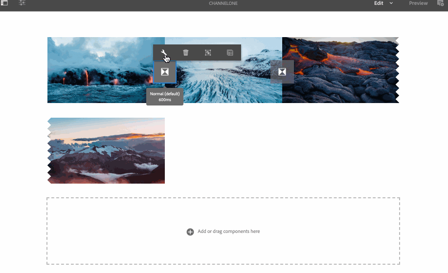

# Aggiunta di componenti a un canale{#adding-components-to-a-channel}

I componenti sono gli elementi fondamentali dell’esperienza dell’AEM (Adobe Experience Manager). Puoi utilizzare diversi componenti e aggiungerli al tuo canale in un progetto AEM Screens.

## Componenti in AEM Screens {#components-in-aem-screens}

AEM Screens fornisce diversi componenti AEM che possono essere utilizzati in un progetto Screens.

### Visualizzazione dei componenti di AEM Screens {#viewing-aem-screens-components}

Ogni volta che crei un progetto AEM Screens, viene visualizzato un elenco di componenti predefiniti che possono essere aggiunti al progetto.

Per visualizzare i componenti predefiniti del progetto Schermi, effettua le seguenti operazioni:

1. Fai clic sul canale. Ad esempio: **`We.Retail In Store`** > **Canali** > **Canale inattivo**.

1. Clic **Modifica** dalla barra delle azioni.
1. Nell’editor AEM, fai clic su **+** dalla barra laterale.
1. Vengono visualizzati tutti i componenti inclusi per impostazione predefinita in un progetto AEM Screens, come illustrato nella figura seguente.

### Aggiunta di un nuovo componente {#adding-a-new-component}

L’AEM fornisce diverse altre componenti. Puoi sempre aggiungere al progetto altri componenti (non inclusi per impostazione predefinita), purché siano compatibili con AEM Screens.

L’esempio seguente mostra l’aggiunta di un componente Livefyre a un progetto AEM Screens:

1. Fai clic sul canale in cui desideri aggiungere un componente. Ad esempio: **`We.Retail In Store`** > **Canali** > **Canale inattivo**.

1. Clic **Modifica** dalla barra delle azioni.
1. Clic **Progettazione** modalità.
1. Fare clic sull&#39;intero editor di progettazione a destra e fare clic sul simbolo delle impostazioni per aprire **Progettazione parsys** .
1. Puoi fare clic sui componenti da importare nel progetto AEM Screens. L’esempio seguente mostra l’aggiunta di **Livefyre** componente di un progetto AEM Screens.

>[!NOTE]
>
>Allo stesso modo, puoi aggiungere al progetto un numero qualsiasi di altri nuovi componenti compatibili con AEM Screens.

## Informazioni sui componenti dello schermo dell’AEM {#understanding-aem-screen-components}

Nella sezione seguente sono illustrati i componenti di AEM Screens che è possibile utilizzare nel progetto.

>[!NOTE]
>
>Per visualizzare le proprietà di qualsiasi componente, fai clic sul componente e sull’icona a forma di martello per aprire/visualizzare le proprietà.

### Applicazione {#application}

Il **Applicazione** consente di aggiungere un’applicazione al canale.

Il componente dell&#39;applicazione ha le seguenti proprietà:

| **Proprietà** | **Descrizione** |
|---|---|
| ***Percorso applicazione*** | Fare clic sul percorso assoluto dell&#39;applicazione. |
| ***Durata (millisecondi)*** | Fare clic sulla durata dell&#39;applicazione. Per impostazione predefinita, la durata è impostata su -1, il che significa che l’elemento viene eseguito per sempre (applicazione a pagina singola). Impostando il valore di durata >0, mostra l’elemento per la durata specificata e quindi passa a quello successivo. |

L’esempio seguente mostra come incorporare un componente dell’applicazione insieme all’anteprima delle relative proprietà:

>[!NOTE]
>
>Vedi l’esempio precedente per visualizzare le proprietà di ciascuno dei componenti riportati di seguito.

### Canale {#channel}

Il **Canale** consente di aggiungere al progetto un intero canale.

Il componente Canale ha le seguenti proprietà:

<table>
 <tbody>
  <tr>
   <td><strong>Proprietà</strong></td>
   <td><strong>Descrizione</strong></td>
  </tr>
  <tr>
   <td><strong><em>Percorso del canale</em></strong></td>
   <td>Selezionare il percorso assoluto in cui si trova l'applicazione.  </td>
  </tr>
  <tr>
   <td><strong><em>Durata (millisecondi)</em></strong></td>
   <td>Seleziona l’intera durata del canale. Se si imposta la durata su -1, il canale incorporato viene eseguito per l'intera durata in un canale specifico.</td>
  </tr>
 </tbody>
</table>

### Pagina incorporata {#embedded-page}

Un **Pagina incorporata** consente di aggiungere una pagina incorporata al progetto. Ad esempio, può essere un’applicazione web o un catalogo di prodotti.

La pagina Incorporata presenta le seguenti proprietà:

<table>
 <tbody>
  <tr>
   <td><strong>Proprietà</strong></td>
   <td><strong>Descrizione</strong></td>
  </tr>
  <tr>
   <td><strong><em>Percorso pagina  </em></strong></td>
   <td>Seleziona questo percorso assoluto in cui esiste il canale.  </td>
  </tr>
  <tr>
   <td><strong><em>Durata (millisecondi)</em></strong></td>
   <td>Seleziona l’intera durata del canale. Se si imposta la durata su -1, il canale incorporato viene eseguito per l'intera durata in un canale specifico.</td>
  </tr>
 </tbody>
</table>

### Sequenza incorporata {#embedded-sequence}

>[!NOTE]
>
>Per informazioni dettagliate sulle sequenze incorporate, consulta [Sequenze incorporate](embedded-sequences.md) nella sezione Authoring Screens (Creazione di schermi).

Una sequenza incorporata consente di aggiungere un canale di sequenza incorporato nel canale esistente (con altre risorse).

La sequenza incorporata presenta le seguenti proprietà di pagina:

<table>
 <tbody>
  <tr>
   <td><strong>Proprietà</strong></td>
   <td><strong>Descrizione</strong></td>
  </tr>
  <tr>
   <td>Percorso del canale</td>
   <td>Selezionate il percorso assoluto della sequenza da includere nel canale.  </td>
  </tr>
  <tr>
   <td><strong><em>Durata (millisecondi)</em></strong></td>
   <td>Seleziona l’intera durata del canale. Se si imposta la durata su -1, il canale incorporato viene eseguito per l'intera durata in un canale specifico.</td>
  </tr>
  <tr>
   <td><strong><em>Strategia</em></strong></td>
   <td>Imposta su <strong>originale</strong> o <strong>singolo</strong>. Impostazione del valore su <strong>originale</strong> significa che la sottosequenza viene eseguita completamente in ogni ciclo della sequenza principale. L’altro valore possibile è <strong>singolo</strong>. Tale valore mostra solo un elemento della sottosequenza a ogni esecuzione. Ad esempio, il primo elemento del primo ciclo e il secondo elemento del secondo ciclo.</td>
  </tr>
 </tbody>
</table>

### Sequenza incorporata dinamica {#dynamic-embedded-sequence}

Una sequenza incorporata dinamica consente di aggiungere una sequenza simile a quella sopra indicata, ad eccezione del ruolo canale.

Per informazioni sulle sequenze incorporate, consulta [Sequenze incorporate](embedded-sequences.md) nella sezione Authoring Screens (Creazione di schermi).

La sequenza incorporata dinamica ha le seguenti proprietà:

<table>
 <tbody>
  <tr>
   <td><strong>Proprietà</strong></td>
   <td><strong>Descrizione</strong></td>
  </tr>
  <tr>
   <td><strong><em>Ruolo assegnazione canale</em></strong>  </td>
   <td>Inserisci il ruolo del canale.  </td>
  </tr>
  <tr>
   <td><strong><em>Durata (millisecondi)</em></strong></td>
   <td>Seleziona l’intera durata del canale. Se si imposta la durata su -1, il canale incorporato viene eseguito per l'intera durata in un canale specifico.</td>
  </tr>
  <tr>
   <td><strong><em>Strategia</em></strong></td>
   <td>Imposta su <strong>originale</strong> o <strong>singolo</strong>. Impostazione del valore su <strong>originale</strong> significa che la sottosequenza viene eseguita completamente in ogni ciclo della sequenza principale. L’altro valore possibile è <strong>singolo</strong>. Tale valore mostrerebbe solo un elemento della sottosequenza a ogni esecuzione. Ad esempio, il primo elemento del primo ciclo e il secondo elemento del secondo ciclo.</td>
  </tr>
 </tbody>
</table>

### Frammento di esperienza {#experience-fragment}

Un frammento di esperienza ti consente di aggiungere al canale AEM Screens un frammento di esperienza (gruppo di uno o più componenti, tra cui contenuto e layout, a cui è possibile fare riferimento all’interno delle pagine). Trascina e rilascia il componente all’editor AEM e fai clic sul frammento di esperienza.

Per ulteriori informazioni su come creare un frammento di esperienza e applicarlo a un progetto AEM Screens, consulta [Utilizzo di Frammenti esperienza](experience-fragments-in-screens.md).

| **Proprietà** | **Descrizione** |
|---|---|
| **Frammento esperienza** |
| ***Frammento esperienza*** | Seleziona il frammento di esperienza. |
| ***Durata*** | Seleziona l’intera durata del frammento di esperienza che viene riprodotto nel canale. |
| **Configurazione offline** |
| ***Librerie lato client*** | File JavaScript e CSS. |
| ***File statici*** | File statici che è possibile aggiungere come configurazioni offline al frammento di esperienza. |

>[!NOTE]
>
>Il **Librerie lato client** e **File statici** che aggiungi da questo componente si aggiungono a già configurati **Librerie lato client** e i file statici aggiunti dal file del frammento di esperienza **Proprietà**.

### Immagine {#image}

Un’immagine consente di aggiungere un’immagine al canale.

La risorsa immagine presenta tre schede: **Immagine**, **Accessibilità**, e **Sequenza**:

| **Proprietà** | **Descrizione** |
|---|---|
| **Immagine** |
| ***Risorsa immagine*** | Fai clic sulla risorsa immagine. |
| ***Titolo*** | Titolo dell&#39;immagine. |
| ***Collega a*** | Aggiungi un collegamento all’immagine. |
| ***Descrizione*** | Breve descrizione dell&#39;immagine. |
| ***Dimensione*** | Dimensione dell&#39;immagine. |
| **Accessibilità** |
| ***Testo alternativo*** | Testo alternativo all’immagine. |
| **Sequenza** |
| ***Durata*** | Per impostazione predefinita, la durata è impostata su *8000 millisecondi*. Per modificare la durata di riproduzione dell&#39;immagine, aggiornare **Durata** campo. |

### Transizione {#transition}

Il componente Transizione consente di aggiungere una transizione al progetto Schermi.

L’immagine seguente mostra il componente di transizione (aggiunto mediante trascinamento) all’editor.

Fai clic sull’icona della transizione, quindi fai clic su **Configura** (icona chiave inglese) per aprire **Transizione** . Questa finestra di dialogo include tre schede:

* **Transizione**
* **Sequenza**
* **Attivazione**

>[!NOTE]
>
>Per impostazione predefinita, la sequenza è impostata su 600 millisecondi. È possibile aggiornare la sequenza di transizione ad altri valori utilizzando **Sequenza** scheda.

Il componente Transizione ha le seguenti proprietà:

<table>
 <tbody>
  <tr>
   <td><strong>Proprietà</strong></td>
   <td><strong>Descrizione</strong></td>
  </tr>
  <tr>
   <td><strong>Transizione</strong></td>
   <td></td>
  </tr>
  <tr>
   <td><strong><em>Tipo</em></strong></td>
   <td>
Il tipo di transizione tra l’elemento prima e quello dopo. La transizione <strong>Tipo</strong> include le seguenti opzioni:

    <ul>
     <li><strong>Normale</strong></li>
     <li><strong>Dissolvenza</strong></li>
     <li><strong>Scorri da destra</strong></li>
     <li><strong>Scorri da sinistra</strong></li>
     <li><strong>Scorri dall'alto</strong></li>
     <li><strong>Scorri dal basso</strong></li>
    </ul> </td>
  </tr>
  <tr>
   <td><strong>Sequenza</strong></td>
   <td></td>
  </tr>
  <tr>
   <td><strong><em>Durata</em></strong></td>
   <td>Seleziona l’intera durata della transizione. Per impostazione predefinita, è impostato su 600 millisecondi.</td>
  </tr>
  <tr>
   <td><strong>Attivazione</strong></td>
   <td></td>
  </tr>
  <tr>
   <td><strong><em>Attivo da</em></strong></td>
   <td>Timestamp che descrive da quando può essere attiva la transizione.  </td>
  </tr>
  <tr>
   <td><strong><em>Attivo fino a</em></strong></td>
   <td>Marca temporale che descrive fino a quando la transizione può essere attiva.</td>
  </tr>
  <tr>
   <td><strong><em>Pianificazione</em></strong></td>
   <td>Aggiungi una pianificazione predefinita.</td>
  </tr>
 </tbody>
</table>

### Video {#video}

Il componente Video consente di aggiungere un video al progetto Schermi.

Il componente video ha le seguenti proprietà:

<table>
 <tbody>
  <tr>
   <td><strong>Proprietà</strong></td>
   <td><strong>Descrizione</strong></td>
  </tr>
  <tr>
   <td><em><strong>Risorsa video</strong></em></td>
   <td>Fai clic sul collegamento al video.</td>
  </tr>
  <tr>
   <td><em><strong>Durata</strong></em></td>
   <td>Seleziona la durata del video. Per impostazione predefinita, la durata è impostata su -1, il che significa che l’elemento viene eseguito per sempre. Impostando il valore di durata &gt;0, mostra l’elemento per la durata specificata e quindi passa a quello successivo.  </td>
  </tr>
  <tr>
   <td><em><strong>Rendering</strong></em></td>
   <td>
Se le proporzioni video non si adattano allo schermo, è possibile regolare il rendering in base a <strong>contain</strong> o <strong>copertina</strong>.
 
<em>Contengono</em> indica che il video completo viene visualizzato e le aree mancanti vengono riempite con un bordo nero.
 
<em>Copertina</em> significa che il video copre l’intero riquadro di visualizzazione, ma che alcune parti che fuoriescono sui lati sono nascoste.
 </td>
  </tr>
  <tr>
   <td><em><strong>Dimensione</strong></em></td>
   <td>Dimensione del video.</td>
  </tr>
 </tbody>
</table>
