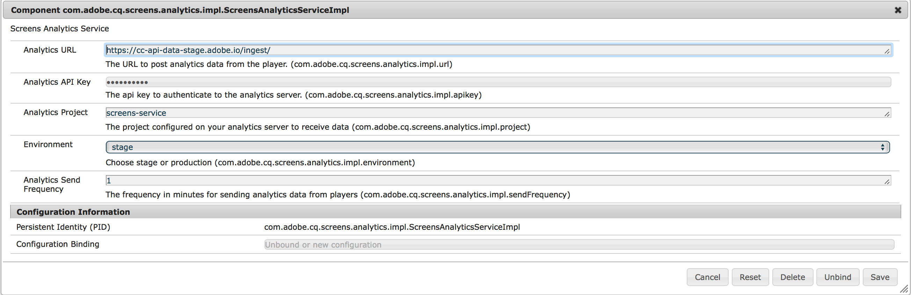

# Integrazione di Adobe Analytics con AEM Screens {#adobe-analytics-integration-with-aem-screens}

>[!CAUTION]
>
>Questa funzionalità di AEM Screens è disponibile solo se è stata installata una versione minima di AEM 6.4.2 Feature Pack 2 o AEM 6.3.3 Feature Pack 4.

>[!NOTE]
>
>Per accedere a uno di questi Feature Pack, è necessario contattare il supporto Adobe e richiedere l’accesso. Scarica l&#39;ultimo pacchetto di funzioni per AEM Screens dal [portale di distribuzione software](https://experience.adobe.com/#/downloads/content/software-distribution/en/aem.html) utilizzando il tuo Adobe ID.

Questa sezione tratta i seguenti argomenti:

* **Panoramica**
* **Dettagli architettonici**
* **Configurazione delle proprietà**

## Panoramica {#overview}

***AEM*** Screenssfrutta Adobe Analytics e consente di ottenere risultati unici sul mercato: analisi cross-channel che consentono di correlare i contenuti visualizzati nella posizione con altre origini dati.

AEM Screens fornisce un’integrazione standard con Adobe Analytics e una bozza di riproduzione.

Questa sezione descrive le seguenti funzionalità relative alla connessione di un progetto AEM Screens con Adobe Analytics:

* Permette la creazione di rapporti di prova della riproduzione per dispositivo
* Consente la generazione di rapporti di prova della riproduzione per risorsa
* Assicura che tutti gli eventi del lettore vengano catturati e contrassegnati con marca temporale
* Assicura che tutti gli eventi del lettore siano memorizzati localmente se la riproduzione non è connessa a una rete
* Consente di creare cicli di feedback per tenere traccia degli eventi di riproduzione nel tempo
* Consente al sistema di modificare contenuti e layout in base ai criteri di successo definiti dall’autore del contenuto

L&#39;integrazione di Adobe Analytics con AEM Screens applica quindi i seguenti *obiettivi*:

* Abilita il ROI dalle implementazioni di digital signage
* Integrare Analytics come base per la futura abilitazione della raccolta e dell’analisi delle informazioni sull’utilizzo

## Dettagli architettonici {#architectural-details}

I clienti di AEM Screens desiderano comprendere a che punto e per quanto tempo (aggregato) sono stati visualizzati i contenuti. Questa è la funzionalità comune della soluzione di segnaletica. Invece di creare le nostre analisi, AEM Screens sfrutterà Adobe Analytics e con questo potremo ottenere qualcosa di unico sul mercato: analisi cross-channel che aiutano a correlare i contenuti visualizzati sul posto con altre sorgenti di dati.

Il diagramma seguente spiega l’integrazione di Adobe Analytics con AEM Screens:

## Abilitazione di Adobe Analytics in AEM Screens {#enabling-adobe-analytics-in-aem-screens}

Le impostazioni di Adobe Analytics possono essere configurate dalla console OSGi.

Passa a **Configurazione della console Web Adobe Experience Manager** per configurare Adobe Analytics per AEM Screens, come illustrato nella figura seguente:

## Analisi Screens: Flusso di abilitazione {#screens-analytics-enablement-flow}

>[!CAUTION]
>
>Prima di configurare le proprietà, contatta il tuo Adobe Relationship Manager per creare un ticket per ottenere una **chiave API Analytics** e **progetto Analytics** da utilizzare con AEM Screens.

### Configurazione delle proprietà {#configuring-the-properties}

>[!CAUTION]
>
>Prima di configurare le proprietà, contatta il tuo Adobe Relationship Manager per creare un ticket per ottenere una **chiave API Analytics** e **progetto Analytics** da utilizzare con AEM Screens.

La tabella seguente evidenzia le proprietà con la relativa descrizione per configurare Adobe Analytics per AEM Screens:

<table>
 <tbody>
  <tr>
   <td><strong>Proprietà</strong></td>
   <td><strong>Descrizione</strong></td>
  </tr>
  <tr>
   <td><strong>URL di Analytics</strong></td>
   <td>URL per pubblicare i dati di analisi dal lettore.  
   Per sviluppo/stage</em>  - https://cc-api-data-stage.adobe.io/ingest/  <em>Per produzione</em>  - https://cc-api-data.adobe.io/ingest/</em>   </td>
  </tr>
  <tr>
   <td><strong>Chiave API di Analytics</strong></td>
   <td>Chiave API per l'autenticazione al server Adobe Analytics (fornita da Gestione account).</td>
  </tr>
  <tr>
   <td><strong>Progetto Analytics</strong></td>
   <td>Progetto AEM Screens configurato nella tua analisi per ricevere i dati (fornito da Gestione account).</td>
  </tr>
  <tr>
   <td><strong>di authoring</strong></td>
   <td>
Ambiente stage o produzione (scegliere Stage o Produzione).
</td>
  </tr>
  <tr>
   <td><strong>Frequenza di invio di Analytics</strong></td>
   <td>Frequenza in minuti per l’invio di dati analitici dai lettori. Per impostazione predefinita, è impostato su 15 minuti.</td>
  </tr>
 </tbody>
</table>

>[!NOTE]
>
>Per impostazione predefinita, la **Frequenza di invio Analytics** è di 15 minuti.

#### Utilizzo del servizio Adobe Analytics in AEM Screens {#using-adobe-analytics-service-in-aem-screens}

Questo scenario richiama l’API di Analytics tramite le chiamate REST da un servizio di analisi nel firmware e nei componenti core dello strumento screens per creare e inviare in modo esplicito eventi specifici per un particolare caso d’uso, consentendo al contempo l’estensibilità in cui qualsiasi messaggio personalizzato può essere inviato ad Analytics da un canale sviluppato personalizzato.

Gli eventi di Analytics vengono memorizzati offline in indexedDB e successivamente bloccati e inviati al cloud.

>[!NOTE]
>
>Per ulteriori informazioni sul ***Sequencing*** e ***Modello dati standard per gli eventi***, consulta **[Configurazione di Adobe Analytics per AEM Screens](configuring-adobe-analytics-aem-screens.md)**.

