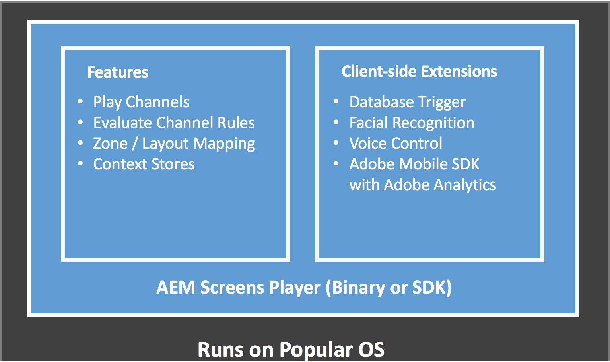
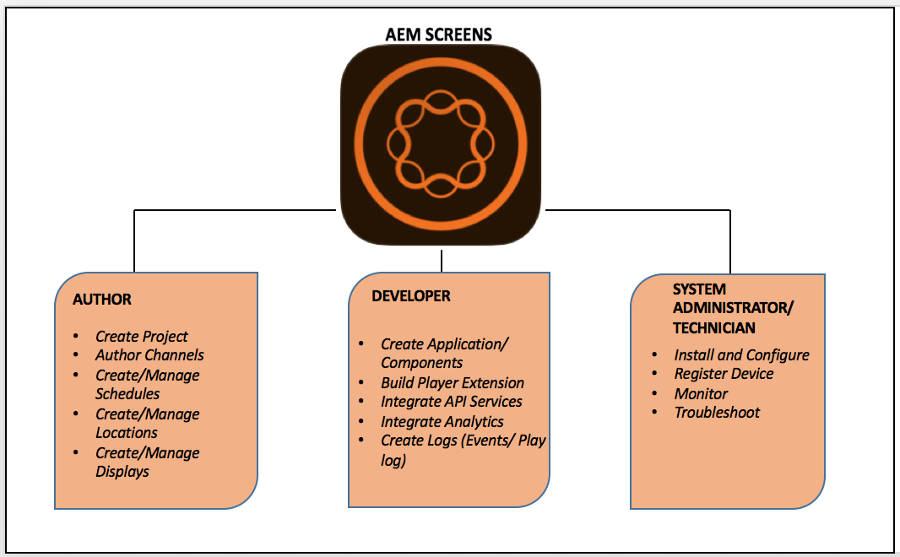

# Cos’è Adobe Experience Manager Screens?{#what-is-aem-screens}

**Experience Manager Screens**: una soluzione di digital signage che consente di pubblicare esperienze e interazioni digitali dinamiche e interattive che coinvolgono diversi tipi di schermi, il tutto su una piattaforma di marketing digitale completa.

Inizia subito a usare una semplice esperienza di segnaletica digitale utilizzando [Kick-Start per AEM Screens](kickstart-for-aem-screens.md).

Per informazioni su come configurare e creare il progetto Experience Manager Screens in Experience Manager as a Cloud Service, consulta [qui](https://experienceleague.adobe.com/it/docs/experience-manager-screens/using/about-guide).

## Panoramica {#overview}

**Experience Manager Screens** è basato sulle solide basi di ***Experience Manager Sites***. Consente agli addetti al marketing e al personale IT di creare e gestire esperienze su più schermi digitali, con effetti sugli obiettivi in-store/in-place per creare il marchio e stimolare la domanda. L’integrazione di Experience Manager Screens con Sites consente di riutilizzare i contenuti esistenti e di offrire in modo efficace una soluzione coerente per il cliente. Questo flusso di lavoro è semplificato per creare esperienze digitali dedicate, altamente convenienti e utilizzabili. Aiuta inoltre ad influenzare la percezione del marchio e le decisioni di impatto, migliorando gli acquisti e il coinvolgimento.

Experience Manager Screens è una potente soluzione basata sul web che consente di creare menù digitali dedicati, consigli di prodotto, immagini lifestyle di sfondo per espandere l’interazione del cliente. Consente di offrire esperienze unificate e utili per il marchio in luoghi fisici, come negozi, hotel, banche, istituti sanitari ed educativi e molto altro ancora, utilizzando la stessa piattaforma Experience Manager. Screens fornisce molte applicazioni uniche. Ad esempio, display interattivi, ricerche di metodi, branding e aggiunta di atmosfera all’ambiente per clienti e dipendenti in base al dominio in cui vengono distribuiti.

La creazione e la gestione di un&#39;applicazione tramite Experience Manager Screens è semplice e intuitiva. Una *applicazione* ospita pagine Web create per Experience Manager Screens dai clienti o dai partner di implementazione. *Le posizioni* gestiscono gerarchie predefinite e contengono *visualizzazioni*. Ogni display ha un dashboard che mostra i diversi dispositivi e schermi collegati. Il contenuto per Experience Manager Screens è gestito in *canali*. Experience Manager Screens Player esegue il rendering del contenuto presente nei canali sui display.

Per informazioni sulla terminologia chiave associata a Experience Manager Screens, vedere il [glossario](screens-glossary.md).

### Architettura di Screens Player

Il diagramma seguente mostra l’architettura generale di un lettore Experience Manager Screens:

### Creare in 5 minuti un’esperienza di digital signage {#create-a-digital-signage-experience-in-minutes}

Per creare un progetto Screens demo e pubblicare il contenuto nel lettore Screens, vedi [Kick-Start per Experience Manager Screens](kickstart-for-aem-screens.md).

## Avvio di un nuovo progetto Experience Manager Screens {#starting-a-new-aem-screens-project}

L&#39;avvio di una nuova esperienza di digital signage richiede una serie di ruoli diversi prima che sia pronta per l&#39;uso. I seguenti ruoli forniscono un punto di partenza per la creazione di un progetto Screens:

* **Authoring**
* **Sviluppatore**
* **Amministratore di sistema/Tecnico**

La figura seguente definisce gli utenti tipo e i loro ruoli per Experience Manager Screens.

## Altre risorse {#additional-resources}

* **Nozioni di base sull&#39;implementazione guidata**

  Segui il percorso di apprendimento guidato **[Nozioni di base sull&#39;implementazione di Experience Manager Screens](https://experienceleague.adobe.com/it?launch=AEM-7a)** che riguarda le funzionalità fondamentali e avanzate supportate in Experience Manager Screens.

* **Guida alle best practice per i progetti Experience Manager Screens**

  Segui la **[Guida alle best practice per i progetti Experience Manager Screens](/help/using/about-guide.md)** progettata per identificare le insidie comuni durante l&#39;implementazione di un progetto Experience Manager Screens. Il materiale si concentra principalmente su Ruoli e responsabilità del progetto. È incentrato sul grafico RACI per diversi ruoli, configurazioni della piattaforma Experience Manager e supporto e monitoraggio.

<!-- 
DEAD LINK * **New Adobe Customer Support Experience**

   Follow **[Customer One for Enterprise Help](https://docs.adobe.com/content/help/en/customer-one/using/home.htmlhome.html#)** to learn more about Admin Console Support tickets. 
-->
