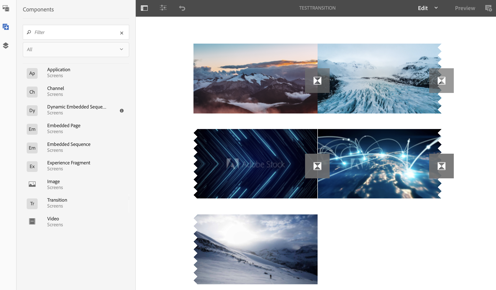
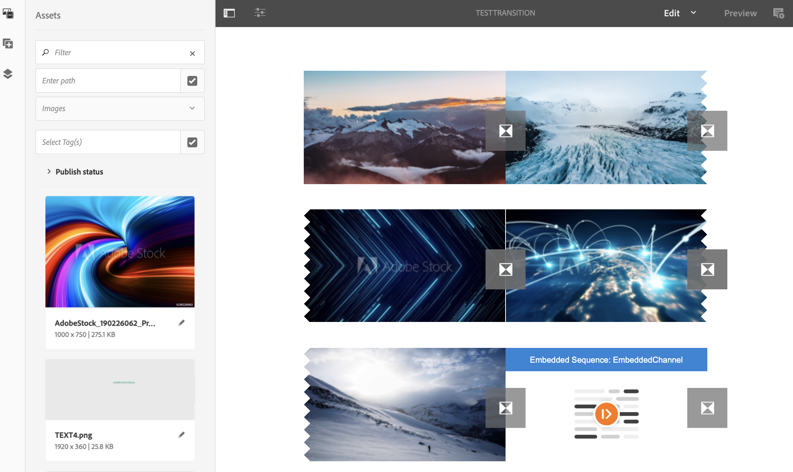

# Applicazione delle transizioni {#applying-transitions}

>[!IMPORTANT]
>Questo contenuto è valido per AEM on-premise/AMS (AEM 6.5LTS e AEM 6.5). Per i contenuti di AEM as a Cloud Service Screens, consulta la [guida di AEM as a Cloud Service](https://experienceleague.adobe.com/en/docs/experience-manager-cloud-service/content/screens-as-cloud-service/overview/introduction).

Questa sezione descrive come applicare il componente **Transizione** tra risorse diverse (immagini e video) e sequenze incorporate in un canale.

>[!CAUTION]
>
>Per informazioni dettagliate sulle proprietà del componente **Transizione**, vedere [Transizioni](adding-components-to-a-channel.md#transition).

## Aggiunta di un componente di transizione ad Assets in un canale {#adding-transition}

Per aggiungere un componente di transizione al progetto AEM Screens, segui i passaggi seguenti:

>[!NOTE]
>
>**Prerequisiti**
>
>Crea un progetto AEM Screens **TestProject** con un canale **TestTransition**. Inoltre, imposta una posizione e una visualizzazione per visualizzare l’output.

1. Passa al canale **TestTransition** e fai clic su **Modifica** nella barra delle azioni.

   

   >[!NOTE]
   >
   >Il canale **TestTransition** contiene già alcune risorse (immagini e video). Ad esempio, il canale **TestTransition** include tre immagini e due video, come illustrato di seguito:

   

1. Trascina e rilascia il componente **Transizione** nell&#39;editor.

   >[!CAUTION]
   >
   >Prima di aggiungere la transizione alle risorse nel canale, accertati di non aggiungere la transizione prima della prima risorsa nel canale sequenziale. Il primo elemento nel canale deve essere una risorsa e non una transizione.

   

   >[!NOTE]
   >
   >Per impostazione predefinita, le proprietà del componente di transizione come **Tipo** sono impostate su **Dissolvenza** e la **Durata** su *1600 millisecondi*. Inoltre, non è consigliabile impostare una durata di transizione più lunga della risorsa a cui viene applicata.

1. Inoltre, se aggiungi un componente **Sequenza incorporata** (che include un canale di sequenza) a questo editor canali, puoi aggiungere un componente di transizione alla fine. In questo modo il contenuto viene riprodotto nell’ordine corretto, come illustrato nell’immagine seguente:

   

