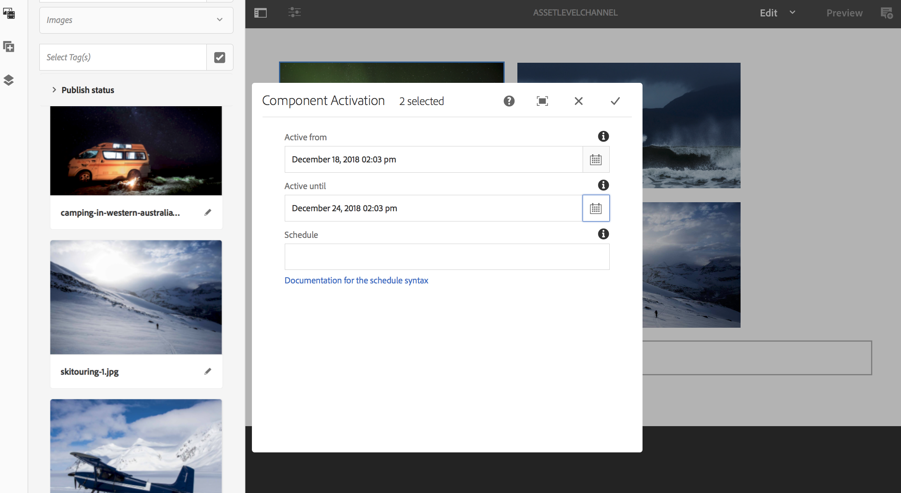

# Attivazione a livello di risorsa {#asset-level-scheduling}

Questa pagina descrive l’attivazione a livello di risorsa per le risorse utilizzate nei canali.

In questa sezione vengono trattati i seguenti argomenti:

* Panoramica
* Finestra di attivazione
* Riproduzione di un singolo evento
* Gestione della ricorrenza nelle risorse
   * DayParting
   * WeekParting
   * MonthParting
   * Combinazione di partizioni
* Attivazione di più risorse
* Sostituzione Globale Per Ora Di Inizio Universale

>[!CAUTION]
>
>Questa funzionalità di AEM Screens è disponibile solo se è stato installato AEM 6.3 Feature Pack 3 o AEM 6.4 Screens Feature Pack 1.
>
>Per accedere a questo Feature Pack, contatta il supporto Adobe e richiedi l’accesso. Una volta ricevute le autorizzazioni, puoi scaricarle da Condivisione pacchetti.

## Panoramica {#overview}

***Attivazione a livello di risorsa***, consente di attivare una risorsa specifica in un canale per un intervallo di tempo pianificato nel fuso orario locale del lettore. Questa funzione è disponibile per immagini, video, transizioni, pagine e canali incorporati (dinamici o statici).

*Ad esempio*, si desidera che una promozione speciale venga visualizzata solo durante l&#39;happy hour (dalle 14 alle 17) di lunedì e mercoledì.

Con questa funzione, non solo puoi specificare la data e l’ora di inizio e di fine, ma anche un criterio di ricorrenza.

## Finestra di attivazione {#single-event-playback}

L’attivazione a livello di risorsa viene eseguita configurando **Attivazione** durante l’accesso alle proprietà di una risorsa.

Per eseguire la programmazione a livello di risorsa, attenersi alla procedura descritta di seguito.

1. Seleziona un canale e fai clic su **Modifica** dalla barra delle azioni per aggiungere o modificare il contenuto nel canale.

   

   >[!NOTE]
   >
   >Per informazioni dettagliate su come
   >
   >* Crea un progetto, consulta [Creazione di un nuovo progetto](creating-a-screens-project.md).
   >* Creare e aggiungere contenuti a un canale, consulta [Gestione dei canali](managing-channels.md).

1. Clic **Modifica** per aprire l’editor canali e selezionare una risorsa a cui applicare la pianificazione.

   

1. Seleziona la risorsa e fai clic su in alto a sinistra **Configura** (icona a forma di chiave inglese) per aprire le proprietà dell’immagine.

   Fai clic su **Attivazione** scheda.

   

1. Puoi specificare la data dalla selezione della data utilizzando **Attivo da** e **Attivo fino a** campi.

   Se si seleziona la **Attivo da** e **Attivo fino a** data e ora, la risorsa verrà visualizzata e ripeterà il ciclo solo tra tale data/ora di inizio e data/ora di fine, rispettivamente.

   

## Gestione della ricorrenza nelle risorse {#handling-recurrence-in-assets}

Puoi pianificare la ricorrenza delle risorse a determinati intervalli su base giornaliera, settimanale o mensile, in base alle tue esigenze.

Si supponga di voler visualizzare un&#39;immagine solo il venerdì dalle 13:00 alle 22:00. È possibile utilizzare **Attivazione** per impostare l’intervallo ricorrente desiderato per la risorsa.

### Ripartizione giornaliera {#day-parting}

1. Seleziona la risorsa e fai clic su **Configura** (icona a forma di chiave inglese) per aprire la finestra di dialogo proprietà.

1. Dopo aver inserito la data/ora di inizio e l’ora di fine/data, puoi utilizzare un’espressione o una versione di testo naturale per specificare la pianificazione della ricorrenza.

   >[!NOTE]
   >Puoi saltare o includere **Attivo da** e **Attivo fino a** e aggiungi l’espressione al campo Schedules, in base alle tue esigenze.

1. Immetti l’espressione nel file **Pianificazione** e la risorsa verrà visualizzata per il particolare intervallo di giorno e ora.

#### Espressioni di esempio per la suddivisione dei giorni {#example-one}

Nella tabella seguente sono riepilogate alcune espressioni di esempio che è possibile aggiungere alla pianificazione durante l’assegnazione di un canale a una visualizzazione.

| **Espressione** | **Interpretazione** |
|---|---|
| prima delle 08:00 | la risorsa nel canale viene riprodotta ogni giorno prima delle 8:00 |
| dopo le 2:00 | la risorsa nel canale viene riprodotta dopo le 14:00 di ogni giorno |
| dopo le 12:15 e prima delle 12:45 | la risorsa nel canale viene riprodotta dopo le 12:15 ogni giorno per 30 minuti |
| prima delle 12:15 anche dopo le 12:45 | la risorsa nel canale viene riprodotta ogni giorno prima delle 12:15 e poi anche dopo le 12:45 |

>[!NOTE]
>
>Puoi anche utilizzare _ora militare_ notazione (ovvero 14:00) invece di *am/pm* notazione (ovvero, 14:00).

### WeekParting {#week-parting}

1. Seleziona la risorsa e fai clic su **Configura** (icona a forma di chiave inglese) per aprire la finestra di dialogo proprietà.

1. Dopo aver inserito la data/ora di inizio e l’ora di fine/data, puoi utilizzare un’espressione o una versione di testo naturale per specificare la pianificazione della ricorrenza.

   >[!NOTE]
   >Puoi saltare o includere **Attivo da** e **Attivo fino a** e aggiungi l’espressione al campo Schedules, in base alle tue esigenze.

1. Immetti l’espressione nel file **Pianificazione** e la risorsa verrà visualizzata per il particolare intervallo di giorno e ora.

#### Espressioni di esempio per WeekParting {#example-two}

Nella tabella seguente sono riepilogate alcune espressioni di esempio che è possibile aggiungere alla pianificazione durante l’assegnazione di un canale a una visualizzazione.

| **Espressione** | **Interpretazione** |
|---|---|
| Lun,Mer,Ven | la risorsa viene riprodotta nel canale dal lunedì, mercoledì e venerdì |
| Lun-gio | la risorsa viene riprodotta nel canale dal lunedì al giovedì |

>[!NOTE]
>
>Puoi anche utilizzare _completo_ notazione (ovvero, lunedì, mercoledì, venerdì) invece di _mano corta_ notazione (Lun,Mer,Ven).

### MonthParting {#month-parting}

1. Seleziona la risorsa e fai clic su **Configura** (icona a forma di chiave inglese) per aprire la finestra di dialogo proprietà.

1. Dopo aver inserito la data/ora di inizio e l’ora di fine/data, puoi utilizzare un’espressione o una versione di testo naturale per specificare la pianificazione della ricorrenza.

   >[!NOTE]
   >Puoi saltare o includere **Attivo da** e **Attivo fino a** e aggiungi l’espressione al campo Schedules, in base alle tue esigenze.

1. Immetti l’espressione nel file **Pianificazione** e la risorsa verrà visualizzata per il particolare intervallo di giorno e ora.

#### Espressioni di esempio per MonthParting {#example-three}

Nella tabella seguente sono riepilogate alcune espressioni di esempio che è possibile aggiungere alla pianificazione durante l’assegnazione di un canale a una visualizzazione.

| **Espressione** | **Interpretazione** |
|---|---|
| di febbraio,maggio,agosto,novembre | la risorsa viene riprodotta nel canale in febbraio, maggio, agosto e novembre |
| di febbraio-luglio | la risorsa viene riprodotta nel canale da febbraio fino alla fine di luglio |

>[!NOTE]
>Quando definisci i giorni della settimana e i mesi, puoi utilizzare sia le notazioni a mano breve che quelle con il nome completo, come lunedì/lunedì e gennaio/gennaio.

### Combinazione di partizioni {#combined-parting}

1. Seleziona la risorsa e fai clic su **Configura** (icona a forma di chiave inglese) per aprire la finestra di dialogo proprietà.

1. Dopo aver inserito la data/ora di inizio e l’ora di fine/data, puoi utilizzare un’espressione o una versione di testo naturale per specificare la pianificazione della ricorrenza.

   >[!NOTE]
   >Puoi saltare o includere **Attivo da** e **Attivo fino a** e aggiungi l’espressione al campo Schedules, in base alle tue esigenze.

1. Immetti l’espressione nel file **Pianificazione** e la risorsa verrà visualizzata per il particolare intervallo di giorno e ora.

#### Espressioni di esempio per la combinazione di partizioni {#example-four}

Nella tabella seguente sono riepilogate alcune espressioni di esempio che è possibile aggiungere alla pianificazione durante l’assegnazione di un canale a una visualizzazione.

| **Espressione** | **Interpretazione** |
|---|---|
| dopo le 6:00 e prima delle 18:00 di lunedì,mer di gen-mar | la risorsa viene riprodotta nel canale tra le 6 e le 18 il lunedì e il mercoledì da gennaio a fine marzo |
| il 1° gennaio dopo le 14:00 anche il 2 gennaio anche il 3 gennaio prima delle 03:00 | la risorsa nel canale inizia a essere riprodotta dopo le 14:00 del 1° gennaio e continua a essere riprodotta per l’intera giornata del 2 gennaio fino alle 03:00 del 3 gennaio |
| l&#39;1-2 giorno di gennaio dopo le 14:00 anche il 2-3 giorno di gennaio prima delle 3:00 | la risorsa nel canale avvia il lettore dopo le 14:00 del 1° gennaio, continua a essere riprodotta fino alle 03:00 del 2 gennaio, quindi inizia di nuovo il 2 gennaio alle 14:00 e continua a essere riprodotta fino alle 03:00 del 3 gennaio |

>[!NOTE]
>Quando definisci i giorni della settimana e i mesi, puoi utilizzare sia le notazioni a mano breve che quelle con il nome completo, come lunedì/lunedì e gennaio/gennaio.  Inoltre, puoi anche utilizzare _ora militare_ notazione (ovvero 14:00) invece di *am/pm* notazione (ovvero, 14:00).

## Attivazione di più risorse {#multi-asset-scheduling}

>[!CAUTION]
>
>Il **Attivazione di più risorse** Questa funzione è disponibile solo se è stato installato il Feature Pack 5 di AEM 6.3 o il Feature Pack 3 di AEM 6.4.

***Attivazione di più risorse*** consente all’utente di selezionare più risorse e di applicare una pianificazione di riproduzione a tutte le risorse selezionate.

### Prerequisiti {#prerequisites}

Per utilizzare l’attivazione a livello di più risorse, crea un progetto AEM Screens con un canale di sequenza. Ad esempio, il seguente caso d’uso illustra l’implementazione della funzione:

* Creare un progetto AEM Screens con titolo **Demo risorse multiple**
* Crea un canale con titolo **MultiAssetChannel** e aggiungi contenuto al canale, come illustrato nella figura seguente

Per selezionare più risorse e pianificarne la visualizzazione in un progetto AEM Screens, effettua le seguenti operazioni:

1. Seleziona **MultiAssetChannel** e fai clic su **Modifica** dalla barra delle azioni per aprire l’editor.

   

1. Seleziona più risorse dall’editor e fai clic su **Modifica attivazione** (icona in alto a sinistra).

   

1. Seleziona data e ora in **Attivo da** e **Attivo fino a** dal **Attivazione componente** . Dopo aver selezionato le pianificazioni, fai clic sull’icona del segno di spunta.

   

1. Fai clic su Aggiorna per controllare le risorse a cui viene applicata la pianificazione per più risorse.

   >[!NOTE]
   >
   >L’icona di pianificazione è visibile nell’angolo in alto a destra per le risorse con attivazione multipla.

   

## Sostituzione Globale Per Ora Di Inizio Universale {#global-override-scheduling}

***Sostituzione globale per l’ora di inizio universale***, è un’impostazione che consente all’autore di contenuto di definire la riproduzione di un’immagine o di una risorsa video in base a un orario specifico. Non viene usata l’impostazione di ora/fuso orario di un singolo lettore.

Normalmente, la riproduzione è determinata dall’ora locale di un dato lettore, ma con l’override globale è possibile utilizzare un’ora di inizio universale specifica per avviare la riproduzione della risorsa.

Questo consente all’autore di contenuto di indicare che la riproduzione di una specifica risorsa avviene in una data/ora specifica, indipendentemente dall’orologio locale su qualsiasi lettore a cui è assegnato il contenuto.

La sostituzione globale per l’ora di inizio universale viene eseguita configurando **Attivazione** durante l’accesso alle proprietà di una risorsa. Per eseguire una sostituzione globale per la programmazione delle risorse, attenersi alla procedura descritta di seguito.

1. Seleziona un canale e fai clic su **Modifica** dalla barra delle azioni per aggiungere o modificare il contenuto nel canale.

   

1. Clic **Modifica** per aprire l’editor canali e selezionare una risorsa a cui applicare la pianificazione.

   

1. Per una sostituzione globale, inserisci il tempo di attivazione in **Sovrascrittura fuso orario** per la risorsa. Se non immetti nulla in quest’area, il fuso orario applicato sarà quello del lettore.

