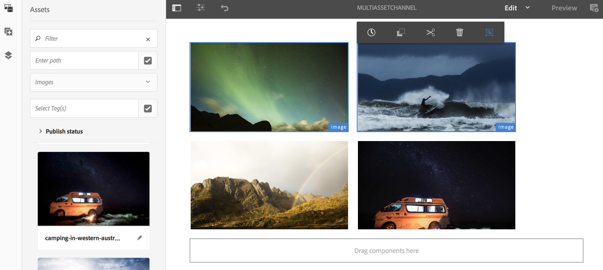

# Attivazione a livello di risorsa {#asset-level-scheduling}

Questa pagina descrive l’attivazione a livello di risorsa per le risorse utilizzate nei canali.

In questa sezione vengono trattati i seguenti argomenti:

* Panoramica
* Finestra di attivazione
* Riproduzione di un singolo evento
* Gestione della ricorrenza in Assets
   * DayParting
   * WeekParting
   * MonthParting
   * Combinazione di partizioni
* Attivazione di più risorse
* Sostituzione Globale Per Ora Di Inizio Universale

<!-- REFERS TO ARCHIVED VERSIONS THAT ADOBE NO LONGER SUPPORTS>
>[!CAUTION]
>
>This AEM Screens functionality is only available if you have installed AEM 6.3 Feature Pack 3 or AEM 6.4 Screens Feature Pack 1.
>
>To get access to this Feature Pack, contact Adobe Support and request access. When you have permission, you can download it from Package Share. -->

## Panoramica {#overview}

***Attivazione a livello di risorsa*** consente di attivare una risorsa specifica in un canale per un intervallo di tempo pianificato, il tutto all&#39;interno del fuso orario locale del lettore. Questa funzionalità è disponibile per immagini, video, transizioni, pagine e canali incorporati (dinamici o statici).

*Ad esempio*, vuoi che una promozione speciale venga visualizzata solo durante l&#39;happy hour (dalle 14.00 alle 17.00) di lunedì e mercoledì.

Con questa funzione, non solo puoi specificare una data e un’ora di inizio e di fine, ma anche un criterio di ricorrenza.

## Finestra di attivazione {#single-event-playback}

L&#39;attivazione a livello di risorsa viene eseguita configurando la scheda **Attivazione** durante l&#39;accesso alle proprietà di una risorsa.

Per eseguire la programmazione a livello di risorsa, attenersi alla procedura descritta di seguito.

1. Fai clic su un canale, quindi fai clic su **Modifica** nella barra delle azioni.

   

   >[!NOTE]
   >
   >Per informazioni dettagliate su come
   >
   >* Crea un progetto. Vedi [Creazione di un nuovo progetto](creating-a-screens-project.md).
   >* Crea e aggiungi contenuto a un canale. Vedi [Gestione dei canali](managing-channels.md).

1. Fai clic su **Modifica** per aprire l&#39;editor canali e fare clic su una risorsa a cui applicare la pianificazione.

   

1. Fai clic sulla risorsa, quindi fai clic su in alto a sinistra **Configura** (icona a forma di chiave inglese).

   Fare clic sulla scheda **Attivazione**.

   

1. È possibile specificare la data dal selettore data utilizzando i campi **Attiva da** e **Attiva fino a**.

   Se si fa clic su **Attivo da** e **Attivo fino a** data e ora, la risorsa viene visualizzata e ripetuta solo tra la data/ora di inizio e quella di fine, rispettivamente.

   

## Gestione della ricorrenza in Assets {#handling-recurrence-in-assets}

Puoi pianificare la ricorrenza delle risorse a determinati intervalli su base giornaliera, settimanale o mensile in base alle tue esigenze.

Si supponga di voler visualizzare un&#39;immagine solo il venerdì dalle 13.00 alle 22.00. È possibile utilizzare la scheda **Activation** per impostare l&#39;intervallo ricorrente desiderato per la risorsa.

### Ripartizione giornaliera {#day-parting}

1. Fai clic sulla risorsa e su **Configura** (icona a forma di chiave inglese) per aprire la finestra di dialogo delle proprietà.

1. Dopo aver inserito la data/ora di inizio e l’ora di fine/data, puoi utilizzare un’espressione o una versione di testo naturale per specificare la pianificazione della ricorrenza.

   >[!NOTE]
   >Puoi saltare o includere i campi **Attivo da** e **Attivo fino a** e aggiungere l&#39;espressione al campo Schedules, in base alle tue esigenze.

1. Immetti l&#39;espressione nella **Pianificazione** e la risorsa verrà visualizzata per il giorno e l&#39;ora specificati.

#### Espressioni di esempio per la suddivisione dei giorni {#example-one}

Nella tabella seguente sono riepilogate alcune espressioni di esempio che è possibile aggiungere alla pianificazione durante l’assegnazione di un canale a una visualizzazione.

| **Espressione** | **Interpretazione** |
|---|---|
| prima delle 08:00 | la risorsa nel canale viene riprodotta prima delle 8.00 di ogni giorno |
| dopo le 14:00 | la risorsa nel canale viene riprodotta dopo le 14:00 di ogni giorno |
| dopo le 12:15 e prima delle 12:45 | la risorsa nel canale viene riprodotta dopo le 12:15 di ogni giorno per 30 minuti |
| prima delle 12:15 anche dopo le 12:45 | la risorsa nel canale viene riprodotta ogni giorno prima delle 12:15 e poi anche dopo le 12:45. |

>[!NOTE]
>
>È inoltre possibile utilizzare la notazione _ora militare_ (14:00) invece di *A.M./P.M.* (14:00).

### WeekParting {#week-parting}

1. Fai clic sulla risorsa, quindi fai clic su **Configura** (icona chiave inglese).

1. Dopo aver inserito la data/ora di inizio e l’ora di fine/data, puoi utilizzare un’espressione o una versione di testo naturale per specificare la pianificazione della ricorrenza.

   >[!NOTE]
   >Puoi saltare o includere i campi **Attivo da** e **Attivo fino a** e aggiungere l&#39;espressione al campo Schedules, in base alle tue esigenze.

1. Immetti l&#39;espressione nella **Pianificazione** e la risorsa viene visualizzata per l&#39;intervallo di giorno e ora specificato.

#### Espressioni di esempio per WeekParting {#example-two}

Nella tabella seguente sono riepilogate alcune espressioni di esempio che è possibile aggiungere alla pianificazione durante l’assegnazione di un canale a una visualizzazione.

| **Espressione** | **Interpretazione** |
|---|---|
| `Mon,Wed,Fri` | la risorsa viene riprodotta nel canale da lunedì, mercoledì e venerdì |
| `Mon-Thu` | la risorsa viene riprodotta nel canale dal lunedì al giovedì |

>[!NOTE]
>
>È inoltre possibile utilizzare la notazione _full_ (`Monday,Wednesday,Friday`) invece di _short-hand_ (`Mon,Wed,Fri`).

### MonthParting {#month-parting}

1. Fai clic sulla risorsa, quindi fai clic su **Configura** (icona chiave inglese).

1. Dopo aver inserito la data/ora di inizio e l’ora di fine/data, puoi utilizzare un’espressione o una versione di testo naturale per specificare la pianificazione della ricorrenza.

   >[!NOTE]
   >Puoi saltare o includere i campi **Attivo da** e **Attivo fino a** e aggiungere l&#39;espressione al campo Schedules, in base alle tue esigenze.

1. Immetti l&#39;espressione nella **Pianificazione** e la risorsa viene visualizzata per l&#39;intervallo di giorno e ora specificato.

#### Espressioni di esempio per MonthParting {#example-three}

Nella tabella seguente sono riepilogate alcune espressioni di esempio che è possibile aggiungere alla pianificazione durante l’assegnazione di un canale a una visualizzazione.

| **Espressione** | **Interpretazione** |
|---|---|
| `on February,May,August,November` | la risorsa viene riprodotta nel canale in febbraio, maggio, agosto e novembre |
| `on February-July` | la risorsa viene riprodotta nel canale da febbraio a fine luglio |

>[!NOTE]
>Quando definisci i giorni della settimana e i mesi, puoi utilizzare sia le notazioni a breve termine che quelle con nome completo, come lunedì/lunedì e gennaio/gennaio.

### Combinazione di partizioni {#combined-parting}

1. Fai clic sulla risorsa, quindi fai clic su **Configura** (icona chiave inglese).

1. Dopo aver inserito la data/ora di inizio e l’ora di fine/data, puoi utilizzare un’espressione o una versione di testo naturale per specificare la pianificazione della ricorrenza.

   >[!NOTE]
   >Puoi saltare o includere i campi **Attivo da** e **Attivo fino a** e aggiungere l&#39;espressione al campo Schedules, in base alle tue esigenze.

1. Immetti l&#39;espressione nella **Pianificazione** e la risorsa viene visualizzata per l&#39;intervallo di giorno e ora specificato.

#### Espressioni di esempio per la combinazione di partizioni {#example-four}

Nella tabella seguente sono riepilogate alcune espressioni di esempio che è possibile aggiungere alla pianificazione durante l’assegnazione di un canale a una visualizzazione.

| **Espressione** | **Interpretazione** |
|---|---|
| `after 6:00 and before 18:00 on Mon,Wed of Jan-Mar` | la risorsa viene riprodotta nel canale tra le 6 e le 18 il lunedì e il mercoledì da gennaio alla fine di marzo |
| `on the 1st day of January after 2:00 P.M. also on the 2nd day of January also on the 3rd day of January before 3:00 A.M.` | la risorsa nel canale inizia a essere riprodotta dopo le 2:00 del 1° gennaio e continua a essere riprodotta per l’intera giornata del 2 gennaio fino alle 3:00 del 3 gennaio |
| `on the 1-2 days of January after 2:00 P.M. also on the 2-3 days of January before 3:00 A.M.` | la risorsa nel canale avvia il lettore dopo le 2:00 del 1° gennaio, continua a essere riprodotta fino alle 3:00 del 2 gennaio, quindi riparte il 2 gennaio alle 2:00 e continua a essere riprodotta fino alle 3:00 del 3 gennaio |

>[!NOTE]
>Quando definisci i giorni della settimana e i mesi, puoi utilizzare sia le notazioni a breve termine che quelle con nome completo, come lunedì/lunedì e gennaio/gennaio. È inoltre possibile utilizzare la notazione _ora militare_ (14:00) invece di *A.M./P.M.*(2:00).

## Attivazione di più risorse {#multi-asset-scheduling}

<!--
>[!CAUTION]
>
>The **Multi-asset Activation** feature is only available if you have installed AEM 6.3 Feature Pack 5 or AEM 6.4 Feature Pack 3. -->

***Attivazione risorse multiple*** consente all&#39;utente di fare clic su più risorse e applicare una pianificazione di riproduzione a tutte le risorse selezionate.

### Prerequisiti {#prerequisites}

Per utilizzare l’attivazione a livello di più risorse, crea un progetto AEM Screens con un canale di sequenza. Ad esempio, il seguente caso d’uso illustra l’implementazione della funzione:

* Crea un progetto AEM Screens denominato **MultiAssetDemo**.
* Crea un canale con titolo **MultiAssetChannel** e aggiungi contenuto al canale, come illustrato nella figura seguente.

Per fare clic su più risorse e pianificarne la visualizzazione in un progetto AEM Screens, effettua le seguenti operazioni:

1. Fai clic su **MultiAssetChannel**, quindi fai clic su **Modifica** nella barra delle azioni.

   

1. Fai clic su più risorse dall&#39;editor, quindi fai clic su **Modifica attivazione** (icona in alto a sinistra).

   

1. Fare clic sulla data e l&#39;ora in **Attivo da** e **Attivo fino a** nella finestra di dialogo **Attivazione componente**. Dopo aver selezionato le pianificazioni, fai clic sull’icona del segno di spunta.

   

1. Fai clic su Aggiorna per controllare le risorse a cui viene applicata la pianificazione per più risorse.

   >[!NOTE]
   >
   >L’icona di pianificazione è visibile nell’angolo in alto a destra per le risorse con attivazione multipla.

   

## Sostituzione Globale Per Ora Di Inizio Universale {#global-override-scheduling}

***Sostituzione globale per l&#39;ora di inizio universale*** è un&#39;impostazione che consente all&#39;autore di contenuto di definire la riproduzione di un&#39;immagine o di una risorsa video in base a un&#39;ora specifica. Non viene usata l’impostazione di ora/fuso orario di un singolo lettore.

Normalmente, l’ora locale di un determinato lettore determina la riproduzione. Tuttavia, con la sostituzione globale, è possibile utilizzare un’ora di inizio specifica e universale per avviare la riproduzione della risorsa.

Di conseguenza, l’autore del contenuto può designare la riproduzione di una risorsa specifica. Possono verificarsi in una data/ora specifica indipendentemente dall’orologio locale su qualsiasi lettore a cui è assegnato il contenuto.

***Sostituzione globale per l&#39;ora di inizio universale*** eseguita configurando la scheda **Attivazione** durante l&#39;accesso alle proprietà di una risorsa. Per eseguire una sostituzione globale per la programmazione delle risorse, attenersi alla procedura descritta di seguito.

1. Fai clic su un canale, quindi fai clic su **Modifica** nella barra delle azioni per aggiungere o modificare contenuti nel canale.

   

1. Fai clic su **Modifica**.
1. Nell’editor canali, fai clic su una risorsa di cui desideri applicare la pianificazione.

   

1. Per una sostituzione globale, immetti il tempo di attivazione nella sezione **Sostituzione fuso orario** per la risorsa. Se non immetti nulla in quest’area, il fuso orario applicato è quello del lettore.

