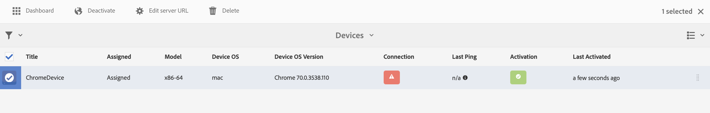

# Configurazione delle istanze Author e Publish in AEM Screens {#configuring-author-and-publish-in-aem-screens}

In questa pagina sono evidenziati i seguenti argomenti:

* **Configurazione delle istanze Author e Publish**
* **Configurazione della topologia di Publish**
* **Gestione della pubblicazione: distribuzione degli aggiornamenti dei contenuti dall&#39;istanza di authoring a Publish nel dispositivo**

## Prerequisiti {#prerequisites}

Prima di iniziare a utilizzare i server Author e Publish, è necessario conoscere in precedenza:

* **Topologia AEM**
* **Creazione e gestione del progetto AEM Screens**
* **Processo di registrazione dispositivo**

>[!NOTE]
>
>Questa funzionalità di AEM Screens è disponibile solo se è stato installato AEM 6.4 Screens Feature Pack 2. Per accedere a questo Feature Pack, contatta il supporto Adobe e richiedi l’accesso. Dopo aver ricevuto l&#39;autorizzazione, puoi scaricarla da Condivisione pacchetti.

>[!IMPORTANT]
>
>Se desideri utilizzare più di un’istanza di Publish con Dispatcher, aggiorna Dispatcher. Consulta [Abilitazione di sessioni permanenti](dispatcher-configurations-aem-screens.md#enable-sticky-session).

## Configurazione delle istanze di Author e Publish {#configuring-author-and-publish-instances}

>[!NOTE]
>
>Per ulteriori informazioni sull&#39;architettura di Author e Publish e su come il contenuto viene creato in un&#39;istanza di AEM Author e poi replicato in avanti in più istanze di Publish, vedere [Panoramica sull&#39;architettura di Author e Publish](author-publish-architecture-overview.md).

Nella sezione seguente viene illustrato come impostare gli agenti di replica sulla topologia Author e Publish.

Puoi impostare un semplice esempio, in cui ospiti un Autore e due istanze di Publish:

* Autore > localhost:4502
* Publish 1 (pub1) > localhost:4503
* Publish 2 (pub2) > localhost:4504

## Impostazione degli agenti di replica sull’autore {#setting-replication-agents}

Per creare agenti di replica, scopri come creare un agente di replica standard.

Per Screens sono necessari tre agenti di replica:

1. **Agente di replica predefinito ***(specificato come*** Agente di replica standard**)
1. **Agente di replica di Screens**
1. **Agente replica inversa**

### Passaggio 1: creazione di un agente di replica predefinito {#step-creating-a-default-replication-agent}

Per creare un agente di replica predefinito, effettua le seguenti operazioni:

1. Passa all&#39;istanza AEM > icona a forma di martello > **Operazioni** > **Configurazione**.

   

1. Fare clic su **Replica** nella struttura di spostamento a sinistra.

   

1. Fare clic su **Agenti sull&#39;autore** dalla cartella **Replica** e fare clic su **Nuovo** per creare un nuovo agente di replica standard.

   

1. Immetti **Titolo** e **Nome** in modo da poter creare l&#39;agente di replica, quindi fai clic su **Crea**.

   

1. Fare clic con il pulsante destro del mouse sull&#39;agente di replica e scegliere **Apri** per modificare le impostazioni.

   

1. Fai clic su **Modifica**.

1. Immettere i dettagli nella finestra di dialogo **Impostazioni agente**.

   >[!NOTE]
   >
   >L&#39;utente deve selezionare **Enabled** per abilitare l&#39;agente di replica. Selezionare questa opzione per Agenti di replica predefiniti, Screens e Inverti.

   

1. Passare alla scheda **Trasporto** e immettere **URI**, **Utente** e **Password**.

   

   >[!NOTE]
   >
   >È inoltre possibile copiare e rinominare un agente di replica predefinito esistente.

#### Creazione di agenti di replica standard {#creating-standard-replication-agents}

1. Crea un agente di replica standard per pub1 (è già necessario configurare un agente predefinito). Ad esempio *`https://<hostname>:4503/bin/receive?sling:authRequestLogin=1`*
1. Crea un agente di replica standard per pub2. È possibile copiare come agente di replica per pub1 e aggiornare il trasporto da utilizzare per pub2 modificando la porta nella configurazione di trasporto. Esempio: *`https://<hostname>:4504/bin/receive?sling:authRequestLogin=1`*.

#### Creazione di agenti di replica di Screens {#creating-screens-replication-agents}

1. Creazione di un agente di replica AEM Screens per pub1. Esiste già un agente di replica Screens che punta alla porta 4503. Abilitala.
1. Creazione di un agente di replica AEM Screens per pub2. Copiare l&#39;agente di replica Screens per pub1 e modificare la porta in modo che punti a 4504 per pub2.

   >[!NOTE]
   >Per informazioni su come configurare gli agenti di replica di Screens, vedere [Configurazione dell&#39;agente di replica di Screens](https://experienceleague.adobe.com/en/docs/experience-manager-screens/user-guide/administering/configure-screens-replication).

#### Creazione di agenti di replica inversa di Screens {#creating-screens-reverse-replication-agents}

1. Crea un agente di replica inversa per pub1.
1. Crea un agente di replica inversa per pub2. È possibile copiare l&#39;agente di replica inversa per pub1 e aggiornare il trasporto da utilizzare per pub2 modificando la porta nella configurazione di trasporto.

## Configurazione della topologia Publish {#setting-up-publish-topology}

### Passaggio 1: configurare l’individuazione basata su Oak di Apache Sling {#step-configure-apache-sling-oak-based-discovery}

Configurare l’individuazione basata su Oak di Apache Sling per tutte le istanze Publish nella topologia

Per ogni istanza di Publish:

1. Passa a `https://<host>:<port>/system/console/configMgr`
1. Fare clic su **Configurazione servizio di individuazione basato su Oak Apache Sling**.
1. Aggiorna URL connettore topologia: aggiungi URL di tutte le istanze Publish partecipanti che sono:
   * `https://publish:4503/libs/sling/topology/connector`
   * `https://publish:4504/libs/sling/topology/connector`
1. **Connettore topologia `Whitelist` Elenco**: Adattarsi a IP o subnet che coprono tutte le istanze di Publish. Assicurarsi di `whitelist` il nome IP/host di tutte le istanze di Publish senza il numero di porta.

1. Abilita **Interruzione automatica cicli locali**

La configurazione deve essere identica per ogni istanza di Publish e il loop locale con arresto automatico impedisce un loop infinito.

#### Passaggio 2: verificare la topologia di Publish {#step-verify-publish-topology}

Per qualsiasi istanza di Publish, passare a `https://:/system/console/topology`. Dovresti visualizzare ogni istanza di Publish rappresentata nella topologia in **Connettori di topologia in uscita**.

#### Passaggio 3: configurare il cluster ActiveMQ Artemis {#step-setup-activemq-artemis-cluster}

Questo passaggio consente di creare una password crittografata per il cluster ActiveMQ Artemis.
L&#39;utente e la password del cluster di tutte le istanze di Publish nella topologia devono essere identici. La password della configurazione di ActiveMQ Artemis deve essere crittografata. Poiché ogni istanza dispone di una propria chiave di crittografia, è necessario utilizzare il Supporto crittografia per creare una stringa di password crittografata. Quindi, la password crittografata può essere utilizzata nella configurazione OSGi per ActiveMQ.

Su ogni istanza di Publish:

1. Nella console OSGi, passa a **PRINCIPALE** > **Supporto crittografia** (`https://<host>:<port>/system/console/crypto`).
1. Digitare la password di testo normale desiderata (uguale per tutte le istanze) in **Testo normale**
1. Fare clic su **Protect**.
1. Copiare il valore **Testo protetto** in un blocco note o in un editor di testo. Questo valore può essere utilizzato nella configurazione OSGi per ActiveMQ.

Poiché ogni istanza di Publish, per impostazione predefinita, dispone di chiavi crittografiche univoche, esegui questo passaggio su ogni istanza del pub e salva la chiave univoca per la configurazione successiva.

>[!NOTE]
>
>La password deve iniziare e terminare con parentesi graffe. Ad esempio:
>`{1ec346330f1c26b5c48255084c3b7272a5e85260322edd59119828d1fa0a610e}`

#### Passaggio 4: attivare il cluster ActiveMQ Artemis {#step-activate-activemq-artemis-cluster}

Su ogni istanza di pubblicazione:

1. Passa a Gestione configurazione OSGi `https://<host>:<port>/system/console/configMgr`
1. Fai clic sulla configurazione del provider JMS Apache ActiveMQ Artemis ****
1. Aggiorna quanto segue:

   * ***Password cluster***: utilizza un valore crittografato del passaggio precedente per la rispettiva istanza
   * ***Argomenti***: `{name: 'commands', address: 'com.adobe.cq.screens.commands', maxConsumers: 50}`

#### Verifica cluster ActiveMQ Artemis {#verify-activemq-artemis-cluster}

Segui i passaggi seguenti per ogni istanza di Publish:

1. Passa a Console OSGi > Principale > ActiveMQ Artemis `https://localhost:4505/system/console/mq`.
1. Verificare e controllare per visualizzare le porte di altre istanze in Informazioni cluster > Topologia > nodi=2, membri=2.
1. Invia un messaggio di prova (nella parte superiore della schermata in Informazioni broker)
1. Immetti le seguenti modifiche nei campi:

   1. **Destinazione**: /com.adobe.cq.screens/devTestTopic
   1. **Testo**: Hello World
   1. Visualizzare il `error.log` di ogni istanza in modo da poter vedere che il messaggio è stato inviato e ricevuto nel cluster.

>[!NOTE]
>
>La navigazione alla console OSGi potrebbe richiedere alcuni secondi dopo il salvataggio della configurazione di cui al passaggio precedente. Puoi anche controllare il registro degli errori per ulteriori dettagli.

Ad esempio, l&#39;immagine seguente viene visualizzata in caso di configurazione corretta del server ActiveMQ Artemis.

Se la seguente configurazione non viene visualizzata da */system/console/mq*, passare a */system/console/mq* e fare clic su **Riavvia** per riavviare il broker.

#### Rimuovi requisito intestazione referente {#remove-referrer-header-requirement}

Segui i passaggi in ogni istanza di Publish:

1. Passa a **Console OSGi** > **Gestione configurazione**
1. Fai clic su **Filtro referrer Apache Sling**
1. Aggiorna configurazione e **seleziona Consenti vuoto**

### Configurazione dell’istanza di Author e Publish {#configuring-author-and-publish-instance}

Dopo aver impostato la topologia di pubblicazione, configura le istanze Author e Publish per visualizzare i risultati pratici dell’implementazione:

>[!NOTE]
>
>**Prerequisiti**
>
>Per iniziare a utilizzare questo esempio, crea un progetto AEM Screens, quindi crea una posizione, una visualizzazione e un canale nel progetto. Aggiungi contenuto al tuo canale e assegna il canale a una visualizzazione.

#### Passaggio 1: avvio di un lettore AEM Screens (dispositivo)

1. Avvia una finestra del browser separata.
1. Vai al lettore Screens utilizzando il *browser Web*, ovvero`https://localhost:4502/content/mobileapps/cq-screens-player/firmware.html` o avvia l&#39;app AEM Screens. Quando apri il dispositivo, noterai che lo stato del dispositivo non è registrato.

>[!NOTE]
>
>Puoi aprire un lettore AEM Screens utilizzando l’app AEM Screens che hai scaricato o il browser Web.

#### Passaggio 2: registrazione di un dispositivo durante l’authoring {#step-registering-a-device-on-author}

1. Vai a `https://localhost:4502/screens.html/content/screens/we-retail` o fai clic sul progetto e passa a Dispositivi > Gestione dispositivi.
1. Fare clic su **Registra dispositivo**.
1. Fare clic su **Registrazione dispositivo**.
1. Fare clic sul dispositivo da registrare, quindi fare clic su **Registra dispositivo**.
1. Verificare il codice di registrazione, quindi fare clic su **Convalida**.
1. Immetti un titolo per il dispositivo, quindi fai clic su **Registra**.

#### Passaggio 3: assegnazione del dispositivo alla visualizzazione {#step-assigning-the-device-to-display}

1. Fare clic su **Assegna visualizzazione** nella finestra di dialogo del passaggio precedente.
1. Fai clic sul percorso di visualizzazione del canale dalla cartella **Percorsi**.
1. Fai clic su **Assegna**.
1. Fare clic su **Fine** per completare il processo. Il dispositivo verrà assegnato.

Controlla il lettore e nota il contenuto aggiunto nel canale.

#### Passaggio 4: pubblicazione della configurazione del dispositivo nelle istanze di Publish {#step-publishing-device-configuration-to-publish-instances}

**Verifica del dispositivo**

Per replicare l’utente del dispositivo, segui la procedura riportata di seguito:

1. Passa alla pagina dell’amministratore utenti. Esempio: `https://localhost:4502/useradmin`.
1. Cerca il gruppo **`screens-devices-master`**.
1. Fare clic con il pulsante destro del mouse sul gruppo e scegliere **Attiva**.

>[!CAUTION]
>
>Non attivare il servizio author-publish-screens-service in quanto è un utente di sistema utilizzato dal processo di authoring.

È inoltre possibile attivare il dispositivo dalla console di gestione dei dispositivi. Effettua le seguenti operazioni:

1. Passa al progetto Screens > **Dispositivi**.
1. Fare clic su **Gestione periferiche** nella barra delle azioni.
1. Fare clic sul dispositivo e fare clic su **Attiva** nella barra delle azioni, come illustrato nella figura riportata di seguito.

>[!NOTE]
>
>In alternativa, dopo aver attivato il dispositivo, puoi anche modificare o aggiornare l’URL del server. Dalla barra delle azioni, fare clic su **Modifica URL server**, come illustrato nella figura seguente. Le modifiche vengono propagate ad AEM Screens Player.

### Pubblicazione elenco di controllo {#publishing-check-list}

I punti seguenti riepilogano l&#39;elenco di controllo per la pubblicazione:

* *Utente dispositivo Screens* - Queste informazioni sono memorizzate come utente AEM e possono essere attivate da **Strumenti** > **Sicurezza** > **Utenti**. All’utente viene aggiunto il prefisso &quot;screens&quot; con una lunga stringa serializzata.

* *Progetto* - Il progetto AEM Screens.
* *Posizione* - Posizione a cui è connesso il dispositivo.
* *Canali* - Uno o più canali visualizzati nel percorso.
* *Pianificazione* - Se utilizzi una pianificazione, assicurati che questa pianificazione sia pubblicata.
* *Posizione, Pianificazioni e Cartella canali* - Se le risorse corrispondenti si trovano in una cartella.

Per verificare il comportamento di authoring e pubblicazione, segui i passaggi seguenti:

1. Aggiorna alcuni contenuti del canale nell’istanza di authoring.
1. Esegui **Gestisci pubblicazione** per pubblicare le nuove modifiche in tutte le istanze di Publish.
1. Premere **Attiva** per attivare il dispositivo da **Gestione dispositivi**.
1. Selezionare **Modifica URL** dall&#39;URL dell&#39;istanza di authoring a uno degli URL delle istanze di pubblicazione.
1. Verifica che il contenuto del canale aggiornato venga visualizzato in AEM Screens Player.
1. Ripeti questi passaggi utilizzando un’istanza di Publish diversa.

#### Passaggio 5: puntamento del dispositivo all’istanza Publish nel pannello di amministrazione {#step-pointing-the-device-to-publish-instance-in-the-admin-panel}

1. Visualizza l’interfaccia utente di amministrazione dal lettore Screens, premi a lungo l’angolo in alto a sinistra in modo da poter aprire il menu Amministratore, sul lettore AEM Screens touch o utilizzando un mouse.
1. Fare clic sull&#39;opzione **Configurazione** nel pannello laterale.
1. Cambia l&#39;istanza Autore in istanza Publish in **Server**.

Visualizza le modifiche nel lettore AEM Screens.

In alternativa, puoi anche aggiornare/modificare l’URL del server dalla console di gestione del dispositivo seguendo la procedura riportata di seguito:

1. Passa al progetto AEM Screens e fai clic sulla cartella **Dispositivi**.
1. Fare clic su **Gestione periferiche** nella barra delle azioni.
1. Fare clic sul dispositivo, quindi sulla barra delle azioni fare clic su **Modifica URL server**, come illustrato nella figura seguente. Le modifiche vengono propagate ad AEM Screens Player.

La funzionalità **Gestisci pubblicazione** consente di inviare aggiornamenti del contenuto da Author a Publish al dispositivo. Puoi pubblicare/annullare la pubblicazione dei contenuti per l’intero progetto AEM Screens o solo per uno dei tuoi canali, posizione, dispositivo, applicazione o pianificazione. Per ulteriori informazioni su questa funzione, vedere [Aggiornamento dei contenuti on demand](on-demand-content.md).

## Suggerimenti per la risoluzione dei problemi {#troubleshoot-tips}

Leggi la sezione seguente per ottenere risposte alle domande frequenti relative alla configurazione di Author/Publish.

### Come si aggiunge un reindirizzamento da https a http dopo la registrazione e l’assegnazione iniziali? {#add-redirect}

**Soluzione**
Impostare Abilita `Proxy/Load Balancer Connection in the Jetty configuration` su `true`.

### Come aggiornare il contenuto offline e scaricare il lettore con risorse esterne a `/content/dam/projects/<project>`? {#update-offline-content}

**Soluzione**
Concedi le autorizzazioni di lettura per l’utente del servizio di aggiornamento-schermo-bulk offline e il gruppo `screens-devices-master` per tutte le `/content/dam` o le risorse specifiche che desideri utilizzare, se desideri essere più restrittivo.

### Come risolvere gli errori dell’agente di replica di Screens? {#replication-agent}

**Soluzione**
Assicurati di non aver selezionato l’opzione Usa per replica inversa nella configurazione dell’agente. L’agente di replica di Screens non può essere utilizzato come agente di replica inversa e l’obiettivo di questa funzione è quello di inoltrare i comandi del dispositivo da Author a Publish.