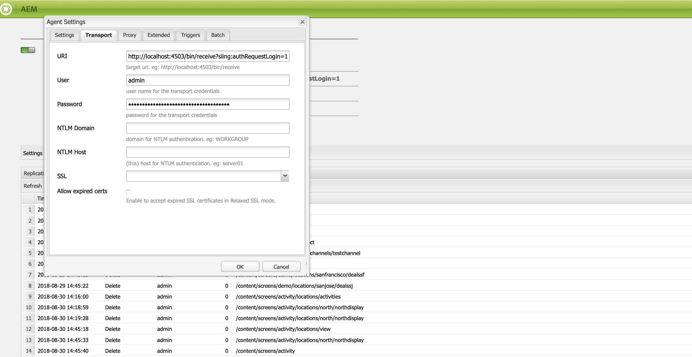

# Configurazione di Author e Publish in AEM Screens {#configuring-author-and-publish-in-aem-screens}

Questa pagina evidenzia i seguenti argomenti:

* **Configurazione delle istanze di authoring e pubblicazione**
* **Impostazione della topologia di pubblicazione**
* **Gestione della pubblicazione: Distribuzione di aggiornamenti di contenuto da Author a Publish to Device**

## Prerequisiti {#prerequisites}

Prima di iniziare a utilizzare i server di authoring e pubblicazione, è necessario disporre di conoscenze precedenti su:

* **Topologia AEM**
* **Creazione e gestione di un progetto AEM Screens**
* **Processo di registrazione dei dispositivi**

>[!NOTE]
>
>Questa funzionalità di AEM Screens è disponibile solo se hai installato AEM Feature Pack 2 di 6.4 Screens. Per accedere a questo Feature Pack, è necessario contattare Adobe Support e richiedere l&#39;accesso. Una volta ottenute le autorizzazioni, è possibile scaricare il Feature Pack da Condivisione pacchetti.

>[!IMPORTANT]
>
>Se desideri utilizzare più istanze di pubblicazione con il dispatcher, devi aggiornare il file dispatcher.any nel dispatcher. Vedi [Abilitazione di sessioni permanenti](dispatcher-configurations-aem-screens.md#enable-sticky-session) per ulteriori dettagli.

## Configurazione delle istanze Author e Publish {#configuring-author-and-publish-instances}

>[!NOTE]
>
>Per ulteriori informazioni sulla panoramica dell’architettura di authoring e pubblicazione e su come viene creato il contenuto in un’istanza di authoring AEM e quindi replicato in più istanze di pubblicazione, consulta [Panoramica dell’architettura di authoring e pubblicazione](author-publish-architecture-overview.md).

La sezione seguente spiega come impostare gli agenti di replica sulla topologia di authoring e pubblicazione.

Potete impostare un semplice esempio, in cui ospitate un autore e due istanze di pubblicazione:

* Autore —> localhost:4502
* Publish 1 (pub1) —> localhost:4503
* Publish 2 (pub2) —> localhost:4504

## Impostazione degli agenti di replica sull’autore {#setting-replication-agents}

Per creare agenti di replica, devi imparare a creare un agente di replica standard.

Sono necessari 3 agenti di replica per Screens:

1. **Agente di replica predefinito ***(specificato come*** Agente di replica standard**)
1. **Agente di replica Screens**
1. **Agente replica inversa**

### Passaggio 1: Creazione di un agente di replica predefinito {#step-creating-a-default-replication-agent}

Per creare un agente di replica predefinito, effettua le seguenti operazioni:

1. Passa alla tua istanza AEM —> icona a forma di martello —> **Operazioni** —> **Configurazione**.

   

1. Seleziona la **Replica** dalla struttura di navigazione a sinistra.

   

1. Seleziona la **Agenti sull&#39;autore** dal **Replica** e fai clic su **Nuovo** per creare un nuovo agente di replica standard.

   

1. Inserisci il **Titolo** e **Nome** per creare l&#39;agente di replica e fare clic su **Crea**.

   

1. Fai clic con il pulsante destro del mouse sull’agente di replica e fai clic su **Apri** per modificare le impostazioni.

   

1. Fai clic su **Modifica** per aprire **Impostazioni agente** per immettere i dettagli.

   >[!NOTE]
   >
   >L&#39;utente deve controllare **Abilitato** per abilitare l&#39;agente di replica. È necessario selezionare questa opzione su Default, Screens e Reverse Replication Agent.

   

1. Passa a **Trasporti** e immetti **URI**, **Utente** e **Password**.

   

   >[!NOTE]
   >
   >È inoltre possibile copiare e rinominare un agente di replica predefinito esistente.

#### Creazione di agenti di replica standard  {#creating-standard-replication-agents}

1. Crea un agente di replica standard per pub1 (l&#39;agente predefinito preconfigurato deve già essere configurato) (ad esempio, *https://&lt;hostname>:4503/bin/receive?sling:authRequestLogin=1*)
1. Crea un agente di replica standard per pub2. È possibile copiare l&#39;agente rep per pub1 e aggiornare il trasporto da utilizzare per pub2 modificando la porta nella configurazione di trasporto. (ad esempio, *https://&lt;hostname>:4504/bin/receive?sling:authRequestLogin=1*)

#### Creazione di agenti di replica Screens {#creating-screens-replication-agents}

1. Crea un agente di replica AEM Screens per pub1. Preconfigurato, un agente di replica Screens che punta alla porta 4503. È necessario attivarlo.
1. Crea un agente di replica AEM Screens per pub2. Copia l&#39;agente di replica Screens per pub1 e cambia la porta in punto a 4504 per pub2.

   >[!NOTE]
   >Per informazioni su come configurare gli agenti di replica Screens, consulta [Configurazione dell’agente di replica Screens](https://experienceleague.adobe.com/docs/experience-manager-screens/user-guide/administering/configure-screens-replication.html?lang=en).

#### Creazione di agenti di replica inversa Screens {#creating-screens-reverse-replication-agents}

1. Crea un agente di replica inversa standard per pub1.
1. Crea un agente di replica inversa standard per pub2. È possibile copiare l&#39;agente di rep inversa per pub1 e aggiornare il trasporto da utilizzare per pub2 modificando la porta nella configurazione di trasporto.

## Impostazione della topologia di pubblicazione {#setting-up-publish-topology}

### Passaggio 1: Configurare la scoperta basata su Oak Apache Sling {#step-configure-apache-sling-oak-based-discovery}

Configurare Apache Sling Oak-Based Discovery per tutte le istanze Publish nella topologia

Per ogni istanza di pubblicazione:

1. Accedi a `https://<host>:<port>/system/console/configMgr`
1. Seleziona **Servizio di individuazione basato su Oak Apache Sling** Configurazione.
1. Aggiorna gli URL del connettore topologia: aggiungi gli URL di tutte le istanze di pubblicazione partizionate che sono:
   * `https://localhost:4503/libs/sling/topology/connector`
   * `https://localhost:4504/libs/sling/topology/connector`
1. **Elenco whitelist del connettore topologia**: adattarsi agli IP o alle subnet che coprono le istanze di pubblicazione parziali
1. Abilita **Interrompi automaticamente loop locali**

La configurazione deve essere identica per ogni istanza di pubblicazione e il ciclo locale di arresto automatico impedisce un ciclo infinito.

#### Passaggio 2: Verifica topologia di pubblicazione {#step-verify-publish-topology}

Per una qualsiasi delle istanze di pubblicazione, passa a `https://:/system/console/topology`. Dovresti visualizzare ogni istanza di pubblicazione rappresentata nella topologia in **Connettori topologia in uscita**.

#### Passaggio 3: Configurazione cluster di array ActiveMQ {#step-setup-activemq-artemis-cluster}

Questo passaggio ti consente di creare una password crittografata per il cluster ActiveMQ Artemis.
L&#39;utente del cluster e la password di tutte le istanze di pubblicazione nella topologia devono essere identici. La password della configurazione di ActiveMQ Artemis deve essere crittografata. Poiché ogni istanza ha la propria chiave di crittografia, è necessario utilizzare Crypto Support per creare una stringa di password crittografata. Quindi la password crittografata verrà utilizzata nella configurazione OSGi per ActiveMQ.

In ogni istanza di pubblicazione:

1. Nella console OSGi passa a **PRINCIPALE** —> **Supporto di Crypto** (`https://&lt;host&gt;:&lt;port&gt;/system/console/crypto`).
1. Digita la password di testo normale desiderata (stessa per tutte le istanze) in **Testo normale**
1. Fai clic su **Protect**.
1. Copia il valore **Testo protetto** al blocco note o all’editor di testo. Questo valore verrà utilizzato nella configurazione OSGi per ActiveMQ.

Poiché ogni istanza di pubblicazione per impostazione predefinita dispone di chiavi di crittografia univoche, devi eseguire questo passaggio su ogni istanza di pub e salvare la chiave univoca per la configurazione successiva.

>[!NOTE]
>
>La password deve iniziare e terminare con parentesi graffe. Esempio:
>`{1ec346330f1c26b5c48255084c3b7272a5e85260322edd59119828d1fa0a610e}`

#### Passaggio 4: Attiva cluster di array ActiveMQ {#step-activate-activemq-artemis-cluster}

Su ogni istanza di pubblicazione:

1. Passa al gestore di configurazione OSGi `https://&lt;host&gt;:&lt;port&gt;/system/console/configMgr`
1. Seleziona **Provider JMS Apache ActiveMQ Artemis** Configurazione
1. Aggiorna quanto segue:

   * ***Password cluster***: utilizza il valore crittografato del passaggio precedente per ogni singola istanza
   * ***Argomenti***: `{name: 'commands', address: 'com.adobe.cq.screens.commands', maxConsumers: 50}`

#### Verifica cluster di array ActiveMQ {#verify-activemq-artemis-cluster}

Segui i passaggi seguenti su ogni istanza di Publish:

1. Passa alla console OSGi -> Principale > ActiveMQ Artemis `https://localhost:4505/system/console/mq`.
1. Verifica e controlla per visualizzare le porte di altre istanze in Informazioni cluster > Topologia > nodi=2, membri=2.
1. Invia un messaggio di test (nella parte superiore dello schermo in Informazioni broker)
1. Immetti le seguenti modifiche nei campi:

   1. **Destinazione**: /com.adobe.cq.screens/devTestTopic
   1. **Testo**: Hello World
   1. Visualizza il file error.log di ogni istanza per vedere che il messaggio è stato inviato e ricevuto nel cluster

>[!NOTE]
>
>Per passare alla console OSGi, potrebbero essere necessari alcuni secondi dopo il salvataggio della configurazione nel passaggio precedente. Puoi anche controllare error.log per ulteriori dettagli.

Ad esempio, l&#39;immagine seguente viene visualizzata in caso di configurazione corretta di ActiveMQ Artemis Server.

Se non vedi la seguente configurazione da */system/console/mq*, quindi passa a */system/console/mq* e fai clic su **Riavvia** per riavviare il broker.

#### Rimuovi requisito intestazione referrer {#remove-referrer-header-requirement}

Segui i passaggi per ogni istanza di Publish:

1. Passa a **Console OSGi** > **Gestione configurazione**
1. Seleziona **Filtro di riferimento Apache Sling**
1. Aggiorna la configurazione e **consenti vuoto**

### Configurazione dell’istanza di authoring e pubblicazione {#configuring-author-and-publish-instance}

Una volta impostata la topologia di pubblicazione, è necessario configurare le istanze di authoring e pubblicazione per visualizzare i risultati pratici dell’implementazione:

>[!NOTE]
>
>**Prerequisiti**
>
>Per iniziare a utilizzare questo esempio, crea un nuovo progetto AEM Screens seguito dalla creazione di una posizione, una visualizzazione e un canale nel progetto. Aggiungi il contenuto al tuo canale e assegna il canale a una visualizzazione.

#### Passaggio 1: Avvio di un lettore AEM Screens (dispositivo) {#step-starting-an-aem-screens-player-device}

1. Avvia una finestra separata del browser.
1. Passa a Screens Player utilizzando *browser web*, ossia`https://localhost:4502/content/mobileapps/cq-screens-player/firmware.html` oppure avvia l&#39;app AEM Screens. Una volta aperto il dispositivo, vedrai che lo stato del dispositivo è non registrato.

>[!NOTE]
>
>Puoi aprire un lettore AEM Screens utilizzando l’app AEM Screens che hai scaricato o il browser Web.

#### Passaggio 2: Registrazione di un dispositivo sull&#39;autore {#step-registering-a-device-on-author}

1. Vai a `https://localhost:4502/screens.html/content/screens/we-retail` oppure seleziona il progetto e passa a Dispositivi > Gestione dispositivi.
1. Seleziona **Registra dispositivo**.
1. Fai clic su **Registrazione dei dispositivi** per visualizzare il dispositivo.
1. Seleziona il dispositivo da registrare e fai clic su **Registra dispositivo**.
1. Verifica il codice di registrazione e fai clic su **Convalida**.
1. Inserisci un titolo per il dispositivo e fai clic su **Registro**.

#### Passaggio 3: Assegnazione del dispositivo alla visualizzazione {#step-assigning-the-device-to-display}

1. Fai clic su **Assegna visualizzazione** dalla finestra di dialogo del passaggio precedente.
1. Seleziona il percorso di visualizzazione del canale dalla **Posizioni** cartella.
1. Fai clic su **Assegna**.
1. Fai clic su **Fine** per completare il processo, e ora il dispositivo viene assegnato.

Controlla il tuo lettore e vedrai il contenuto aggiunto nel tuo canale.

#### Passaggio 4: Pubblicazione della configurazione del dispositivo per pubblicare le istanze {#step-publishing-device-configuration-to-publish-instances}

**Verifica del dispositivo**

Prima di eseguire i passaggi seguenti, assicurati di verificare l&#39;ID dispositivo. Per verificare, cerca l’ID dispositivo in CRXDE Lite, con il percorso come */home/users/screens/we-retail/devices*.

Segui i passaggi riportati di seguito per replicare l’utente del dispositivo:

1. Passa alla pagina di amministrazione dell’utente (ad esempio: `https://localhost:4502/useradmin`
1. Cerca il **screens-devices-master** gruppo
1. Fai clic con il pulsante destro del mouse sul gruppo e fai clic su **Attiva**

>[!CAUTION]
>
>Non attivare author-publish-screens-service in quanto è un utente di sistema, utilizzato dal processo di authoring.

Puoi anche attivare il dispositivo dalla console di gestione dei dispositivi. Effettua le seguenti operazioni:

1. Passa al progetto Screens —> **Dispositivi**.
1. Fai clic su **Gestione dispositivi** dalla barra delle azioni.
1. Seleziona il dispositivo e fai clic su **Attiva** dalla barra delle azioni, come illustrato nella figura riportata di seguito.

>[!NOTE]
>
>In alternativa, una volta attivato il dispositivo è anche possibile modificare o aggiornare l’URL del server facendo clic su **Modifica URL server** dalla barra delle azioni, come mostrato nella figura seguente, le modifiche verranno propagate al lettore AEM Screens.

### Elenco di controllo della pubblicazione {#publishing-check-list}

I punti seguenti riepilogano l’elenco Controllo pubblicazione:

* *Utente dispositivo Screens* - È memorizzato come utente AEM e può essere attivato da **Strumenti** > **Sicurezza** > **Utenti**. L’utente avrà il prefisso &quot;screens&quot; con una lunga stringa serializzata.

* *Progetto* - Il progetto AEM Screens.
* *Posizione* - Posizione a cui è collegato il dispositivo.
* *Canali* - uno o più canali visualizzati nella posizione
* *Pianificazione* - se utilizzi una pianificazione assicurati che questa sia pubblicata
* *Posizione, pianificazioni e cartella dei canali* - se le risorse corrispondenti si trovano all’interno di una cartella.

Per verificare il comportamento di authoring/pubblicazione, effettua le seguenti operazioni:

1. Aggiorna alcuni contenuti del canale sull&#39;istanza dell&#39;autore
1. Esegui **Gestisci pubblicazione** per pubblicare nuove modifiche in tutte le istanze di pubblicazione
1. Press **Attiva** per attivare il dispositivo da **Gestione dispositivi**
1. **Modifica URL** dall’URL dell’istanza di authoring a uno degli URL delle istanze di pubblicazione
1. Verifica che il contenuto del canale aggiornato sia visualizzato sul lettore AEM Screens
1. Ripeti questi passaggi utilizzando un’altra istanza di pubblicazione

#### Passaggio 5: Selezione del dispositivo per la pubblicazione dell’istanza nel pannello di amministrazione {#step-pointing-the-device-to-publish-instance-in-the-admin-panel}

1. Visualizza l&#39;interfaccia utente amministratore da Screens Player, premi a lungo nell&#39;angolo in alto a sinistra per aprire il menu Admin, sul tuo lettore AEM Screens abilitato al tocco o utilizzando un mouse.
1. Fai clic sul pulsante **Configurazione** dal pannello laterale.
1. Cambia l&#39;istanza dell&#39;autore per pubblicare l&#39;istanza in **Server**.

Visualizza le modifiche nel lettore AEM Screens.

In alternativa, puoi anche aggiornare/modificare l’URL del server dalla console di gestione dispositivi seguendo i seguenti passaggi:

1. Passa al progetto AEM Screens e seleziona la **Dispositivi** cartella.
1. Fai clic su **Gestione dispositivi** dalla barra delle azioni.
1. Seleziona il dispositivo e fai clic su **Modifica URL server** dalla barra delle azioni, come mostrato nella figura seguente, le modifiche verranno propagate al lettore AEM Screens.

La **Gestisci pubblicazione** consente di distribuire aggiornamenti dei contenuti dall’autore alla pubblicazione sul dispositivo. Puoi pubblicare/annullare la pubblicazione dei contenuti per l’intero progetto AEM Screens o solo per uno dei canali, la posizione, il dispositivo, l’applicazione o una pianificazione. Per ulteriori informazioni su questa funzione, consulta [Aggiornamento dei contenuti on-demand](on-demand-content.md).

## Suggerimenti per la risoluzione dei problemi {#troubleshoot-tips}

Segui la sezione seguente per ottenere le risposte alle domande più frequenti sulla configurazione di authoring/pubblicazione.

### Come aggiungere un reindirizzamento da https a http dopo la registrazione e l&#39;assegnazione iniziali? {#add-redirect}

**Soluzione**
Imposta Abilita `Proxy/Load Balancer Connection in the Jetty configuration` a `true`.

### Come aggiornare il contenuto offline e i problemi di download del lettore con le risorse esterne `/content/dam/projects/<project>`? {#update-offline-content}

**Soluzione**
Concedi le autorizzazioni di lettura per bulk-offline-update-screens-service user e screens-devices-master group per tutti `/content/dam` o le risorse specifiche che desideri utilizzare, se desideri essere più restrittivo.

### Come risolvere gli errori dell&#39;agente di replica Screens? {#replication-agent}

**Soluzione**
Assicurati di non aver selezionato l&#39;opzione Usa per replica inversa nella configurazione dell&#39;agente. L&#39;agente di replica Screens non può essere utilizzato come agente di replica inversa e l&#39;ambito di questa funzione è quello di inoltrare i comandi del dispositivo dall&#39;autore alla pubblicazione.