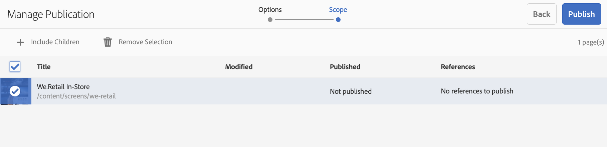

# Configurazione di Author e Publish in AEM Screens {#configuring-author-and-publish-in-aem-screens}

Questa pagina evidenzia i seguenti argomenti:

* **Configurazione delle istanze Author e Publish**
* **Impostazione della topologia di pubblicazione**
* **Gestione della pubblicazione: Distribuzione di aggiornamenti di contenuto da Autore a Pubblica sul dispositivo**

## Prerequisiti {#prerequisites}

Prima di iniziare a usare i server di creazione e pubblicazione, è necessario disporre di conoscenze precedenti su:

* **Topologia AEM**
* **Creazione e gestione di un progetto AEM Screens**
* **Processo di registrazione del dispositivo**

>[!NOTE]
>
>Questa funzionalità di AEM Screens è disponibile solo se è stato installato AEM 6.4 Screens Feature Pack 2. Per accedere a questo Feature Pack, è necessario contattare Adobe Support e richiedere l'accesso. Una volta ottenute le autorizzazioni, è possibile scaricare il Feature Pack da Condivisione pacchetti.

## Configurazione delle istanze Author e Publish {#configuring-author-and-publish-instances}

>[!NOTE]
>
>Per ulteriori informazioni sulla panoramica dell’architettura di creazione e pubblicazione e sulla modalità di creazione del contenuto in un’istanza di creazione AEM, e quindi replica in avanti in più istanze di pubblicazione, consultate [Creazione e pubblicazione di una panoramica](author-publish-architecture-overview.md)architettonica.

Nella sezione seguente viene illustrato come impostare gli agenti di replica sulla topologia di creazione e pubblicazione.

Potete impostare un semplice esempio in cui ospitare un autore e due istanze di pubblicazione:

* Autore —&gt; localhost:4502
* Publish 1 (pub1) —&gt; localhost:4503
* Publish (pub2) —&gt; localhost:4504

## Impostazione degli agenti di replica in Author {#setting-replication-agents}

Per creare agenti di replica, è necessario apprendere come creare un agente di replica standard.

Per gli schermi sono necessari 3 agenti di replica:

1. **Agente replica predefinito ***(specificato come ***agente** replica standard)
1. **Agente replica schermi**
1. **Agente replica inversa**

### Passaggio 1: Creazione di un agente di replica predefinito {#step-creating-a-default-replication-agent}

Per creare un agente di replica predefinito, effettuate le operazioni seguenti:

1. Passa all’istanza di AEM —&gt; icona a forma di martello —&gt; **Operazioni** —&gt; **Configurazione**.

   

1. Selezionare **Replica** dalla struttura di navigazione a sinistra.

   

1. Selezionate **Agenti sull'autore** dalla cartella **Replica** e fate clic su **Nuovo** per creare un nuovo agente di replica standard.

   

1. Immettete il **Titolo** e il **Nome** per creare l'agente di replica e fate clic su **Crea**.

   

1. Fare clic con il pulsante destro del mouse sull'agente di replica e scegliere **Apri** per modificare le impostazioni.

   

1. Fate clic su **Modifica** per aprire la finestra di dialogo Impostazioni **** agente e immettere i dettagli.

   

1. Passate alla scheda **Trasporto** e immettete **URI**, **Utente** e **Password**.

   

   >[!NOTE]
   >
   >È inoltre possibile copiare e rinominare un agente di replica predefinito esistente.

#### Creazione di agenti di replica standard {#creating-standard-replication-agents}

1. Creare un agente di replica standard per pub1 (l'agente predefinito fornito deve già essere configurato) (ad esempio, *https://&lt;nomehost&gt;:4503/bin/receive?sling:authRequestLogin=1*)
1. Creare un agente di replica standard per pub2. È possibile copiare l'agente rep per pub1 e aggiornare il trasporto da utilizzare per pub2 modificando la porta nella configurazione di trasporto. (ad esempio, *https://&lt;hostname&gt;:4504/bin/receive?sling:authRequestLogin=1*)

#### Creazione di agenti di replica dello schermo {#creating-screens-replication-agents}

1. Creare un agente di replica AEM Screens per pub1. È disponibile un agente di replica Schermi denominato "Out-of-the-box" che punta alla porta 4503. Deve essere attivato.
1. Creare un agente di replica AEM Screens per pub2. Copiate l'agente di replica Screens per pub1 e modificate la porta in 4504 per pub2.

#### Creazione di agenti di replica inversa schermo {#creating-screens-reverse-replication-agents}

1. Creare un agente di replica inversa standard per pub1.
1. Creare un agente di replica inversa standard per pub2. È possibile copiare agente rep inverso per pub1 e aggiornare il trasporto da utilizzare per pub2 modificando la porta nella configurazione di trasporto.

## Impostazione della topologia di pubblicazione {#setting-up-publish-topology}

### Passaggio 1: Configurare L'Individuazione Basata Su Apache Sling Oak {#step-configure-apache-sling-oak-based-discovery}

Impostazione dell'individuazione basata su Apache Sling Oak per tutte le istanze Publish nella topologia

Per ogni istanza di pubblicazione:

1. Accedi a `https://<host>:<port>/system/console/configMgr`
1. Selezionate **Apache Sling Oak-Based Discovery Service** Configuration.
1. Aggiorna URL connettore topologia: aggiungete URL di tutte le istanze di pubblicazione partizionate, `https://localhost:4502/libs/sling/topology/connector`
1. Connettore topologia Whitelist: adattare a IP o subnet che coprono le istanze di pubblicazione di parte
1. Abilita loop locali con **arresto automatico**

La configurazione deve essere identica per ogni istanza di pubblicazione e il ciclo locale di arresto automatico impedisce un ciclo infinito.

#### Passaggio 2: Verifica topologia di pubblicazione {#step-verify-publish-topology}

Per una qualsiasi delle istanze Pubblica, andate a `https://<host>:<port>/system/console/topology`. Dovreste visualizzare ogni istanza di pubblicazione rappresentata nella topologia.

#### Passaggio 3: Configurazione cluster ActiveMQ Artemis {#step-setup-activemq-artemis-cluster}

Questo passaggio consente di creare una password crittografata per il cluster ActiveMQ Artemis.
L’utente del cluster e la password di tutte le istanze pubblicate nella topologia devono essere identici. La password della configurazione di ActiveMQ Artemis deve essere crittografata. Poiché ogni istanza ha una propria chiave di crittografia, è necessario utilizzare Crypto Support per creare una stringa di password crittografata. La password crittografata verrà quindi utilizzata nella configurazione OSGi per ActiveMQ.

Per ogni istanza di pubblicazione:

1. Nella console OSGi andate a **MAIN** —&gt; **Supporto** Crypto (*https://&lt;host&gt;:&lt;porta&gt;/sistema/console/crittografia*).
1. Digitate la password di testo normale desiderata (uguale per tutte le istanze) in Testo **normale**
1. Fate clic su **Proteggi**.
1. Copiare il valore Testo **** protetto in un blocco note o un editor di testo. Questo valore verrà utilizzato nella configurazione OSGi per ActiveMQ.

Poiché per impostazione predefinita ogni istanza di pubblicazione dispone di chiavi di crittografia univoche, è necessario eseguire questo passaggio su ogni istanza di pub e salvare la chiave univoca per la configurazione successiva.

*Esempio*,

Pub1 - `{1ec346330f1c26b5c48255084c3b7272a5e85260322edd59119828d1fa0a610e}`Pub2 - `{8d3d113c834cc4f52c2daee0da3cb0a21122a31f0138bfe4b70c9ead79415f41}`

#### Passaggio 4: Attivare il cluster ActiveMQ Artemis {#step-activate-activemq-artemis-cluster}

Per ogni istanza di pubblicazione:

1. Andate al gestore di configurazione OSGi *https://&lt;host&gt;:&lt;porta&gt;/sistema/console/configMgr*
1. Seleziona configurazione provider **JMS** Apache ActiveMQ Artemis
1. Aggiornate quanto segue:

* ***Password*** cluster: (utilizzate il valore crittografato del passaggio precedente per ciascuna istanza)
* ***Argomenti***: {name: 'command', address: 'com.adobe.cq.screens.command', maxConsumers: 50}

#### Verifica cluster ActiveMQ Artemis {#verify-activemq-artemis-cluster}

Seguite i passaggi indicati di seguito per ogni istanza di pubblicazione:

1. Andate alla console OSGi -&gt; Principale &gt; ActiveMQ Artemis `[https://localhost:4505/system/console/mq`.
1. Verifica e verifica per visualizzare le porte di altre istanze in Informazioni cluster &gt; Topologia &gt; nodi=2, membri=2.
1. Invia un messaggio di prova (nella parte superiore della schermata in Informazioni sul broker)
1. Immettete le seguenti modifiche nei campi:

   1. **Destinazione**: /com.adobe.cq.screens/devTestTopic
   1. **Testo**: Hello World
   1. Visualizzare il file error.log di ogni istanza per verificare che il messaggio sia stato inviato e ricevuto nel cluster

>[!NOTE]
>
>Passando alla console OSGI, potrebbero essere necessari alcuni secondi dopo il salvataggio della configurazione nel passaggio precedente. Per ulteriori informazioni, è inoltre possibile controllare error.log.

Ad esempio, l'immagine seguente viene visualizzata sulla configurazione corretta di ActiveMQ Artemis Server.

Se non trovi la configurazione seguente da */system/console/mq*, vai a */system/console/mq* e fai clic su **Riavvia** per riavviare il broker.

#### Rimuovi requisito intestazione referrer {#remove-referrer-header-requirement}

Seguite i passaggi per ogni istanza di pubblicazione:

1. Andate alla console **** OSGi &gt; Gestione **configurazione**
1. Seleziona filtro **Apache Sling Referrer**
1. Aggiorna configurazione e **seleziona Consenti valori vuoti**

### Configurazione dell’istanza Author e Publish {#configuring-author-and-publish-instance}

Una volta impostata la piattaforma di pubblicazione, è necessario configurare le istanze di creazione e pubblicazione per visualizzare i risultati pratici dell’implementazione:

>[!NOTE]
>
>**Prerequisiti**
>
>Per iniziare con questo esempio, crea un nuovo progetto AEM Screens seguito da una posizione, una visualizzazione e un canale nel progetto. Aggiungete contenuti al canale e assegnate il canale a uno schermo.

#### Passaggio 1: Avvio di AEM Screens Player (dispositivo) {#step-starting-an-aem-screens-player-device}

1. Avvia una finestra separata del browser.
1. Go to Screens player using the *web browser*, that is,`https://localhost:4502/content/mobileapps/cq-screens-player/firmware.html` or launch the AEM Screens app. Una volta aperto il dispositivo, vedrai che lo stato del dispositivo è non registrato.

>[!NOTE]
>
>Potete aprire un lettore AEM Screens utilizzando l'app AEM Screens che avete scaricato o il browser Web.

#### Passaggio 2: Registrazione di un dispositivo sull'autore {#step-registering-a-device-on-author}

1. Accedete a `https://localhost:4502/screens.html/content/screens/we-retail` o selezionate il progetto e andate a Dispositivi &gt; Gestione dispositivi.
1. Selezionate **Registra dispositivo**.
1. Fate clic su Registrazione **** dispositivo per visualizzare il dispositivo.
1. Select the device you want to register and click **Register Device**.
1. Verificate il codice di registrazione e fate clic su **Convalida**.
1. Inserite un titolo per il dispositivo e fate clic su **Registra**.

#### Passaggio 3: Assegnazione del dispositivo da visualizzare {#step-assigning-the-device-to-display}

1. Fare clic su **Assegna visualizzazione** nella finestra di dialogo dal passaggio precedente.
1. Selezionate il percorso di visualizzazione del canale dalla cartella **Locations (Posizioni)** .
1. Click **Assign**.
1. Click **Finish** to complete the process, and now the device is assigned.

Controllare il lettore e visualizzare il contenuto aggiunto nel canale.

#### Passaggio 4: Pubblicazione della configurazione del dispositivo per pubblicare le istanze {#step-publishing-device-configuration-to-publish-instances}

**Verifica del dispositivo**

Prima di eseguire le operazioni seguenti, verificare l'ID dispositivo. Per verificare, cercate l'ID dispositivo in CRXDELite, con il percorso */home/users/screens/{project}/devices*.

Per replicare l’utente del dispositivo, effettuate le seguenti operazioni:

1. Passate alla pagina di amministrazione dell’utente (ad esempio: `https://localhost:4502/useradmin`
1. Cerca il gruppo **screen-devices-master**
1. Fare clic con il pulsante destro del mouse sul gruppo e scegliere **Attiva**

>[!CAUTION]
>
>Non attivate il servizio di creazione, pubblicazione, schermate, in quanto è un utente del sistema, utilizzato dal processo di authoring.

Puoi anche attivare il dispositivo dalla console di gestione dispositivo. Effettuate le seguenti operazioni:

1. Andate al progetto Screens —&gt; **Devices (Dispositivi)**.
1. Fare clic su **Device Manager **dalla barra di azione.
1. Selezionate il dispositivo e fate clic su **Attiva** dalla barra delle azioni, come illustrato nella figura seguente.

>[!NOTE]
>
>In alternativa, dopo aver attivato il dispositivo è anche possibile modificare o aggiornare l'URL del server facendo clic su **Edit server URL **dalla barra delle azioni, come illustrato nella figura seguente, e le modifiche verranno propagate al lettore AEM Screens.

### Elenco di controllo pubblicazione {#publishing-check-list}

Di seguito sono riepilogati gli elenchi Publishing Check:

* *Utente* del dispositivo Screens: viene memorizzato come utente AEM e può essere attivato da **Strumenti** &gt; **Protezione** &gt; **Utenti**. L'utente avrà il prefisso "screens" con una lunga stringa serializzata.

* *Progetto* - Progetto AEM Screens.
* *Posizione* - Posizione di connessione del dispositivo.
* *Canali* : uno o più canali visualizzati nella posizione
* *Pianificazione* : se si utilizza una pianificazione, assicurarsi che sia pubblicata
* *Posizione, programmi e cartella* canale, se le risorse corrispondenti si trovano all’interno di una cartella.

Dopo aver verificato l’elenco di controllo, è necessario verificare le seguenti modifiche/comportamenti nel canale:

* Dopo aver pubblicato la configurazione del dispositivo, aprite la configurazione del lettore Screens e indicatela nell’istanza Pubblica. È inoltre possibile attivare il dispositivo dalla console di gestione del dispositivo.
* Aggiornate il contenuto di alcuni canali su Author e pubblicatelo e verificate che il canale aggiornato venga ora visualizzato sul lettore AEM Screens.
* Collegare il lettore Screens a un’altra istanza di pubblicazione e verificare il comportamento descritto sopra.

#### Passaggio 5: Puntare il dispositivo per pubblicare l'istanza nel pannello di amministrazione {#step-pointing-the-device-to-publish-instance-in-the-admin-panel}

1. Visualizzare l'interfaccia utente di amministrazione dal lettore Screens, premere a lungo sull'angolo in alto a sinistra per aprire il menu Admin, sul lettore AEM Screens abilitato per il tocco o utilizzando un mouse.
1. Fate clic sull’opzione **Configurazione** dal pannello laterale.
1. Modificate l’istanza di creazione per pubblicare l’istanza in **Server**.

Visualizzare le modifiche nel lettore AEM Screens.

In alternativa, puoi anche aggiornare/modificare l’URL del server dalla console di gestione del dispositivo tramite i seguenti passaggi:

1. Andate al progetto AEM Screens e selezionate la cartella **Dispositivi** .
1. Click **Device Manager** from the action bar.
1. Selezionate il dispositivo e fate clic su **Edit server URL **dalla barra delle azioni, come illustrato nella figura riportata di seguito, per estendere le modifiche al lettore AEM Screens.

## Gestione della pubblicazione: Distribuzione di aggiornamenti di contenuto da Autore a Pubblica sul dispositivo {#managing-publication-delivering-content-updates-from-author-to-publish-to-device}

Potete pubblicare e annullare la pubblicazione del contenuto da AEM Screens. La funzione Gestisci pubblicazione consente di distribuire gli aggiornamenti di contenuto dall’autore alla pubblicazione sul dispositivo. Puoi pubblicare/annullare la pubblicazione del contenuto per l’intero progetto AEM Screens o solo per un canale, un percorso, un dispositivo, un’applicazione o una pianificazione.

### Gestione della pubblicazione per un progetto AEM Screens {#managing-publication-for-an-aem-screens-project}

Per distribuire gli aggiornamenti di contenuto dall’istanza di creazione al dispositivo per un progetto AEM Screens, effettuate le seguenti operazioni:

1. Passa al progetto AEM Screens.
1. Fate clic su **Gestisci pubblicazione** dalla barra delle azioni per pubblicare il progetto nell'istanza di pubblicazione.

   

1. The **Manage Publication** wizard opens. Potete selezionare l’ **azione** e pianificare l’ora di pubblicazione per adesso o in un secondo momento. Fai clic su **Avanti**.

   

1. Selezionate la casella per selezionare l'intero progetto dalla procedura guidata **Gestisci pubblicazione** .

   

1. Fate clic su **+ Includi elementi figlio** nella barra delle azioni e deselezionate tutte le opzioni per pubblicare tutti i moduli nel progetto, quindi fate clic su **Aggiungi** per pubblicare.

   >[!NOTE]
   >
   >Per impostazione predefinita, tutte le caselle sono selezionate e sarà necessario deselezionare manualmente le caselle per pubblicare tutti i moduli nel progetto.

   

   **Informazioni sulla finestra di dialogo Includi elementi figlio**

   Il passaggio sopra riportato mostra come pubblicare l’intero contenuto. Se si desidera utilizzare le altre tre alternative disponibili, sarà necessario verificare quella particolare opzione.
Ad esempio, la seguente immagine consente di gestire e aggiornare solo le pagine modificate del progetto:
   

   Seguite le spiegazioni riportate di seguito per comprendere le opzioni disponibili:

   1. **Include solo elementi figlio**immediati:
Questa opzione consente di gestire gli aggiornamenti solo per i nodi secondari della struttura del progetto.
   1. **Solo pagine**modificate:
Questa opzione consente di gestire gli aggiornamenti solo per le pagine modificate del progetto in cui si trovano le modifiche nella struttura del progetto.
   1. **Solo pagine**già pubblicate:
Questa opzione consente di gestire gli aggiornamenti solo per le pagine pubblicate in precedenza.

1. Fate clic su **Pubblica** dalla procedura guidata **Gestisci pubblicazione.**

   

   >[!NOTE]
   >
   >Attendete alcuni secondi/minuti in modo che il contenuto raggiunga l’istanza di pubblicazione.
   >
   >
   >La procedura **Gestisci pubblicazione** con aggiornamento del contenuto offline è in due fasi e i passaggi devono essere in ordine corretto.
   >
   >
   >
   >    1. Il flusso di lavoro non funzionerà se **Aggiorna contenuto** offline viene attivato prima della pubblicazione tramite **Gestisci pubblicazione**.
      >
      >    
   1. Il flusso di lavoro non funzionerà se il progetto non contiene modifiche e se non sono presenti modifiche per **Aggiorna contenuto** offline.
   >    1. Il flusso di lavoro non funziona se l’autore non completa il processo di replica (i contenuti vengono ancora caricati nell’istanza di pubblicazione) dopo aver fatto clic sul pulsante **Pubblica** nel flusso di lavoro di gestione della pubblicazione.

1. Una volta completato il flusso di lavoro di gestione della pubblicazione, è necessario attivare l'aggiornamento del contenuto offline in fase di creazione, che creerà l'aggiornamento offline nell'istanza di creazione.

   Andate al progetto e fate clic su **Aggiorna contenuto** offline nella barra delle azioni. Questa azione inoltra lo stesso comando per pubblicare l’istanza, in modo che le zip offline vengano create anche nell’istanza di pubblicazione.

   

   >[!CAUTION]
   >
   >È prima necessario pubblicare e quindi attivare l'aggiornamento del contenuto offline, come riepilogato nei passaggi precedenti.

### Gestione della pubblicazione per un canale {#managing-publication-for-a-channel}

Per distribuire gli aggiornamenti dei contenuti dall’istanza di creazione al dispositivo per un canale in un progetto AEM Screens, procedi come segue:

>[!NOTE]
>
>Seguite questa sezione solo se vi sono modifiche in un canale. Se un canale non contiene modifiche dopo il contenuto offline del precedente aggiornamento, il flusso di lavoro di gestione della pubblicazione per un singolo canale non funzionerà.

1. Andate al progetto Screens e selezionate il canale.
1. Fate clic su **Gestisci pubblicazione** dalla barra delle azioni per pubblicare l'istanza del canale da pubblicare.

   

1. The **Manage Publication** wizard opens. Potete selezionare l’ **azione** e pianificare l’ora di pubblicazione per adesso o in un secondo momento. Fai clic su **Avanti**.

   

1. Fate clic su **Pubblica** dalla procedura guidata **Gestisci pubblicazione.**

   

   >[!NOTE]
   >
   >Attendete alcuni secondi/minuti in modo che il contenuto raggiunga l’istanza di pubblicazione.

1. Una volta completato il flusso di lavoro di gestione della pubblicazione, è necessario attivare l'aggiornamento del contenuto offline in fase di creazione, che creerà l'aggiornamento offline nell'istanza di creazione.

   Andate al dashboard del canale e fate clic su **Aggiorna contenuto** offline. Questa azione inoltra lo stesso comando per pubblicare l’istanza, in modo che le zip offline vengano create anche nell’istanza di pubblicazione.

   

   >[!CAUTION]
   >
   >È prima necessario pubblicare e quindi attivare l'aggiornamento del contenuto offline, come riepilogato nei passaggi precedenti.

### Assegnazione canale e dispositivo: {#channel-and-device-re-assignment}

Se avete riassegnato un dispositivo, dovete pubblicare sia la visualizzazione iniziale che la nuova visualizzazione, una volta che il dispositivo è stato assegnato nuovamente al nuovo display.

Analogamente, se avete riassegnato un canale, dovete pubblicare sia il display iniziale che il nuovo display, una volta che il canale è stato riassegnato al nuovo display.
