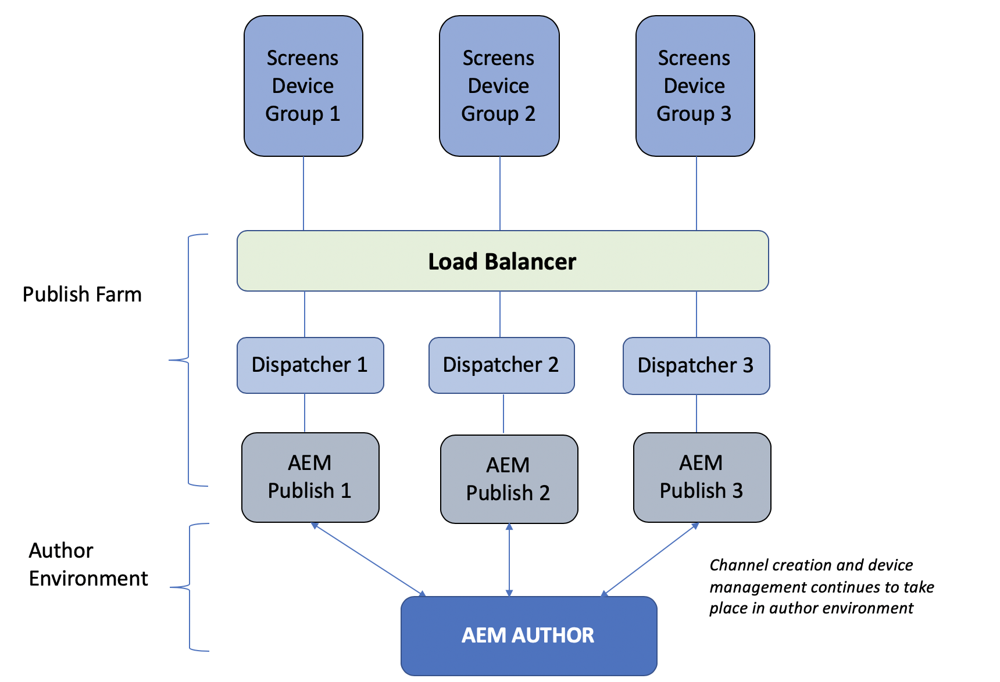
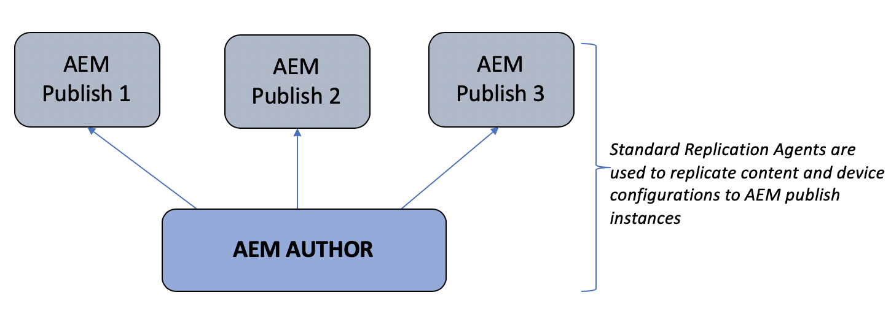
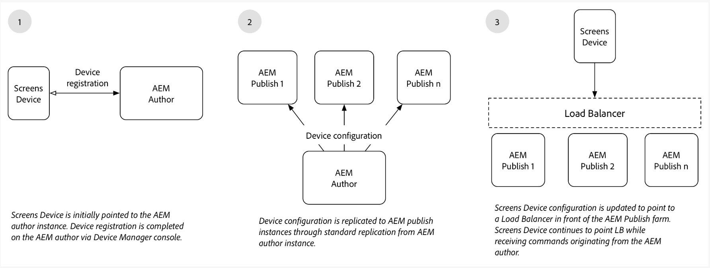

# Panoramica dell’architettura di authoring e pubblicazione {#author-and-publish-architectural-overview}

In questa pagina sono evidenziati i seguenti argomenti:

>[!IMPORTANT]
>Questo contenuto è valido per AEM on-premise/AMS (AEM 6.5LTS e AEM 6.5). Per i contenuti di AEM as a Cloud Service Screens, consulta la [guida di AEM as a Cloud Service](https://experienceleague.adobe.com/en/docs/experience-manager-cloud-service/content/screens-as-cloud-service/overview/introduction).

* **Introduzione ai server di pubblicazione**
* **Panoramica dell&#39;architettura**
* **Processo di registrazione**

## Prerequisiti {#prerequisites}

Prima di iniziare a utilizzare i server di authoring e di pubblicazione, è necessario conoscere in precedenza:

* **Topologia AEM**
* **Creazione e gestione del progetto AEM Screens**
* **Processo di registrazione dispositivo**

>[!NOTE]
>
>Questa funzionalità di AEM Screens è disponibile solo se è stato installato AEM 6.4 Screens Feature Pack 2. Per accedere a questo Feature Pack, contatta il supporto Adobe e richiedi l’accesso. Dopo aver ricevuto l&#39;autorizzazione, scaricala da Condivisione pacchetti.

## Introduzione {#introduction}

L’architettura di AEM Screens è simile all’architettura tradizionale di AEM Sites. Il contenuto viene creato su un’istanza Autore AEM e quindi replicato in avanti su più istanze Publish. I dispositivi su AEM Screens ora possono connettersi a una farm di pubblicazione di AEM tramite un load balancer. È possibile aggiungere più istanze di pubblicazione di AEM per continuare a scalare la farm di pubblicazione.

*Ad esempio*, un autore di contenuti AEM Screens invia un comando al sistema di authoring per un determinato dispositivo. Il dispositivo è configurato per interagire con una farm di pubblicazione. In alternativa, interagisci con un autore di contenuti di AEM Screens che ottiene informazioni sui dispositivi configurati per interagire con le farm di pubblicazione.

Il diagramma seguente illustra sia l’ambiente di authoring che quello di pubblicazione.

## Progettazione architettonica {#architectural-design}

Questa soluzione è facilitata da cinque componenti architettonici:

* ***Replica del contenuto*** dall&#39;ambiente di authoring a quello di pubblicazione per la visualizzazione per dispositivi

* ***Inverti*** la replica del contenuto binario dall&#39;ambiente di pubblicazione (ricevuto dai dispositivi) all&#39;ambiente di authoring.
* ***Invio*** di comandi dall&#39;autore per la pubblicazione tramite API REST specifiche.
* ***Messaggistica*** tra istanze di pubblicazione per sincronizzare aggiornamenti e comandi relativi alle informazioni sul dispositivo.
* ***Polling*** da parte dell&#39;autore delle istanze di pubblicazione per ottenere informazioni sul dispositivo tramite API REST specifiche.

### Replica (inoltro) di contenuti e configurazioni {#replication-forward-of-content-and-configurations}

Gli agenti di replica standard vengono utilizzati per replicare il contenuto del canale AEM Screens, le configurazioni di posizione e le configurazioni dei dispositivi. Questa funzionalità consente agli autori di aggiornare il contenuto di un canale e, facoltativamente, di eseguire una sorta di flusso di lavoro di approvazione prima di pubblicare gli aggiornamenti del canale. È necessario creare un agente di replica per ogni istanza di pubblicazione nella farm di pubblicazione.

Il diagramma seguente illustra il processo di replica:

>[!NOTE]
>
>È necessario creare un agente di replica per ogni istanza di pubblicazione nella farm di pubblicazione.

### Agenti di replica e comandi di Screens {#screens-replication-agents-and-commands}

Gli agenti di replica personalizzati specifici di Screens vengono creati per inviare comandi dall’istanza Autore al dispositivo AEM Screens. Le istanze AEM Publish fungono da intermediario per inoltrare questi comandi al dispositivo.

Questo flusso di lavoro consente agli autori di continuare a gestire il dispositivo, ad esempio inviare aggiornamenti del dispositivo e acquisire schermate dall’ambiente di authoring. Gli agenti di replica di AEM Screens dispongono di una configurazione di trasporto personalizzata, come gli agenti di replica standard.

### Messaggistica tra istanze di pubblicazione {#messaging-between-publish-instances}

Spesso un comando deve essere inviato a un dispositivo una sola volta. Tuttavia, in un’architettura di pubblicazione con carico bilanciato, l’istanza di pubblicazione a cui si connette il dispositivo è sconosciuta.

Pertanto, l’istanza di authoring invia il messaggio a tutte le istanze Publish. Tuttavia, solo un singolo messaggio deve quindi essere inoltrato al dispositivo. Per garantire la corretta messaggistica, la comunicazione deve aver luogo tra le istanze di pubblicazione. Questa comunicazione viene effettuata utilizzando *Apache ActiveMQ Artemis*. Ogni istanza di pubblicazione viene inserita in una topologia liberamente associata utilizzando il servizio di individuazione Sling basato su Oak. ActiveMQ è configurato in modo che ogni istanza di pubblicazione possa comunicare e creare una singola coda di messaggi. Il dispositivo AEM Screens esegue il polling della farm di pubblicazione di AEM tramite il load balancer e seleziona il comando dalla parte superiore della coda.

### Replica inversa {#reverse-replication}

Spesso, a seguito di un comando, è previsto un qualche tipo di risposta dal dispositivo Screens da inoltrare all’istanza di authoring. Per ottenere questo risultato, viene utilizzata la ***replica inversa*** di AEM.

* Crea un agente di replica inversa per ogni istanza di pubblicazione, simile agli agenti di replica standard e agli agenti di replica di AEM Screens.
* Una configurazione di avvio del flusso di lavoro ascolta i nodi modificati nell’istanza di pubblicazione di AEM e a sua volta attiva un flusso di lavoro per inserire la risposta del dispositivo nella casella in uscita dell’istanza di pubblicazione di AEM.
* In questo contesto, la replica inversa viene utilizzata solo per i dati binari (come file di registro e schermate) forniti dai dispositivi. Viene recuperato il polling di dati non binari.
* Il polling di replica inversa dall’istanza di authoring di AEM recupera la risposta e la salva nell’istanza di authoring.

### Polling delle istanze di pubblicazione {#polling-of-publish-instances}

Le istanze di authoring devono essere in grado di eseguire il polling dei dispositivi per ottenere un heartbeat e conoscere lo stato di integrità di un dispositivo connesso.

I dispositivi eseguono il ping del load balancer e vengono indirizzati a un’istanza Publish. Lo stato del dispositivo viene quindi esposto dall&#39;istanza di pubblicazione di AEM tramite un&#39;API di pubblicazione fornita alle **api/screens-dcc/devices/static** per tutti i dispositivi attivi e **api/screens-dcc/devices/&lt;device_id>/status.json** per un singolo dispositivo.

L’istanza di authoring esegue il polling di tutte le istanze di pubblicazione e unisce le risposte sullo stato del dispositivo in un singolo stato. Il processo pianificato che esegue il polling sull&#39;autore è `com.adobe.cq.screens.impl.jobs.DistributedDevicesStatiUpdateJob` e può essere configurato in base a un&#39;espressione cron.

## Registrazione {#registration}

La registrazione continua a provenire dall’istanza di authoring di AEM. Il dispositivo AEM Screens punta all’istanza di authoring e la registrazione è completa.

Dopo aver registrato un dispositivo nell’ambiente di authoring di AEM, la configurazione del dispositivo e le assegnazioni di canale/pianificazione vengono replicate nelle istanze di pubblicazione di AEM. La configurazione del dispositivo AEM Screens viene quindi aggiornata per puntare al load balancer davanti alla farm di pubblicazione di AEM. Questa disposizione è destinata a essere impostata una tantum. Una volta connesso correttamente all’ambiente di pubblicazione, il dispositivo Screens può continuare a ricevere comandi provenienti dall’ambiente di authoring. Non dovrebbe essere necessario collegare direttamente il dispositivo AEM Screens all’ambiente di authoring di AEM.

### Passaggi successivi {#the-next-steps}

Se conosci la progettazione architetturale della configurazione di authoring e pubblicazione in AEM Screens, consulta [Configurazione di Author e Publish per AEM Screens](author-and-publish.md) per ulteriori dettagli.
