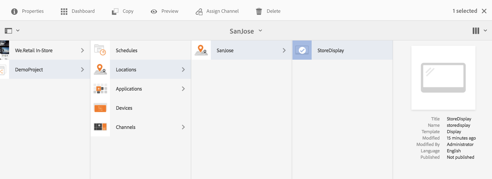

# Assegnazione dei canali {#channel-assignment}

>[!IMPORTANT]
>In questa sezione vengono evidenziati l&#39;assegnazione del canale e la programmazione dei canali per i Feature Pack precedenti alla versione AEM 6.5.5 Screens.

Una volta configurato uno schermo, è necessario assegnare un canale a uno schermo per visualizzare il contenuto.

Questa pagina mostra l’assegnazione di un canale al display.

>[!NOTE]
>Potete assegnare più canali a uno schermo.

## Assigning a Channel {#assign-a-channel}

Segui la procedura seguente per assegnare un canale a una visualizzazione:

1. Passare alla visualizzazione richiesta, ad esempio **DemoProject** —> **Locations** —> **SanJose** —> **StoreDisplay**.

   

1. Tap/click **Assign Channel** in the action bar

   Oppure,

   Tap/click **Dashboard** and click **+Assign Channel** from the **ASSIGNED CHANNNELS** panel to open the **Channel Assignment** dialog box.

   

   È possibile configurare le proprietà dalla finestra di dialogo Assegnazione **** canale dalla sezione seguente. Per ulteriori informazioni sulle proprietà del canale, consulta la sezione Proprietà  canale.

## Informazioni sulle proprietà del canale dall&#39;assegnazione del canale {#channel-properties}

### Riferimento a canale {#ref-channel}

il riferimento a canale consente di fornire un riferimento al canale desiderato, per nome o in base al percorso del canale.

* **In base al percorso**: fornisci un riferimento esplicito usando il percorso assoluto del canale.

* **per nome**: Immettere il nome del canale che verrà risolto in un canale effettivo per contesto. Questa funzione consente di creare la versione locale di un canale, per determinare dinamicamente i contenuti in base alla posizione. For example, a channel with name *deals of the day*, where the actual content would be different in two cities, but you still have the sane channel role on all the displays.

### Ruolo canale {#role-channel}

Il ruolo canale definisce il contesto della visualizzazione. Il ruolo è mirato da diverse azioni ed è indipendente dal canale effettivo che svolge il ruolo.

### Priorità {#priority-channel}

La priorità viene usata per ordinare le assegnazioni nel caso in cui più utenti corrispondano ai criteri di riproduzione. Quella con il valore più alto avrà sempre la precedenza su quella con i valori più bassi. Ad esempio, se ci sono due canali A e B, A ha una priorità di 1 e B ha una priorità di 2, viene quindi visualizzato il canale B, che ha una priorità maggiore di A.

>[!NOTE]
>La priorità per un canale è impostata come numero (1 corrisponde alla priorità minima) nella finestra di dialogo **Assegnazione canale**, come detto sopra. Inoltre, i canali assegnati vengono ordinati in base a una priorità decrescente.

### Eventi supportati {#supported-events-channel}

* **Caricamento iniziale**: carica il canale quando il lettore viene avviato. Può essere assegnato a più canali in combinazione con la pianificazione
* **Schermata di inattività**: il canale viene caricato quando la schermata è inattiva. Può essere assegnato a più canali in combinazione con la pianificazione
* **Timer:** deve essere impostato quando viene fornita una pianificazione
* **Interazione utente**: il lettore passa al canale specificato, se c&#39;è un&#39;interazione utente sullo schermo (un tocco) in un canale inattivo; il canale viene caricato quando lo schermo viene toccato.

### Metodo di interruzione {#interruption-method-channel}

>[!IMPORTANT]
>
> Questa opzione è disponibile solo con il Feature Pack 8 AEM 6.4 o con il Feature Pack 4 AEM 6.5.

In qualità di autore dei contenuti, dovreste essere in grado di specificare quando un canale viene interrotto, in modo da poter scegliere di interrompere i contenuti non critici, ma avere la possibilità di consentire la riproduzione completa dei contenuti importanti prima di interrompere la riproduzione a causa della programmazione.

Selezionate una delle seguenti opzioni disponibili per impostare il metodo di interruzione dalla finestra di dialogo Assegnazione **** canale:

* **Immediatamente**: ogni volta che la pianificazione viene attivata o viene ricevuto un aggiornamento, potete interrompere la riproduzione e aggiornare o riprodurre immediatamente il nuovo contenuto
* **Alla fine della voce** corrente: quando viene attivata una nuova pianificazione o viene ricevuto un aggiornamento, è possibile attendere il termine della riproduzione dell’elemento corrente nella sequenza e solo dopo aver aggiornato o riprodotto il nuovo contenuto
   >[!NOTE]
   >Per impostazione predefinita, questa opzione è selezionata.
* **Alla fine della sequenza**: quando viene attivata una nuova pianificazione o viene ricevuto un aggiornamento, potete aspettare che l&#39;intera sequenza raggiunga la fine, e subito prima della sequenza desiderata, tornate al primo elemento, aggiornate o riproducete il nuovo contenuto

   >[!NOTE]
   >Utilizzando la seconda o la terza opzione è possibile che i tempi di programmazione definiti per l&#39;assegnazione vengano leggermente posticipati, in quanto il lettore aspetterà la fine dell&#39;elemento o della sequenza (dopo il tempo specificato) prima di effettuare l&#39;aggiornamento. Il ritardo dipenderà dalla durata di riproduzione dell’elemento.

### Pianificazione {#schedule-channel}

la pianificazione consente di inserire una descrizione testuale circa quando il canale deve essere visualizzato. Inoltre, permette di definire una data iniziale (**attivo da**) e una data finale (**attivo fino al**) per il canale da visualizzare.

**Mostra descrizione luogo di interesse**:

Mostra descrizione luogo di interesse definisce se la descrizione del luogo di interesse (&quot;*Tocca un punto qualsiasi per iniziare*&quot;) deve essere visualizzato o meno mentre il canale è in esecuzione.

### Separazione giornaliera {#dayparting}

Schedules when combined with **Day-parting**, allows you to set a global schedule with multiple channels running at specific times of the day, and re-use that setup for all your displays at once.

DayParting si riferisce alla suddivisione di un giorno in fasce orarie e alla specificazione del contenuto riprodotto all&#39;ora desiderata.  AEM Screens consente di pianificare i canali in termini di suddivisione del giorno entro un giorno, una settimana o un mese, in base alle esigenze.

Gli esempi seguenti spiegano la suddivisione giornaliera nei canali in tre scenari diversi:

#### Riproduzione di contenuto su un singolo giorno suddiviso in più fasce orarie {#playing-content-on-a-single-day-divided-into-multiple-time-slots}

Questo esempio mostra come un Ristorante utilizza la sfilatura giornaliera per mostrare la sua colazione, pranzo e cena menu.

Qui, divideremo ogni giorno in tre fasce orarie diverse, in modo che il contenuto del canale venga riprodotto secondo l&#39;ora specificata del giorno:

| **Canale** | **Ruolo** | **Priorità** | **Pianificazione** |
|---|---|---|---|
| Menu_A | Colazione |  | dopo le 6:00 e prima delle 11:00 |
| Menu_B | Pranzo |  | dopo le 11:00 e prima delle 15:00 |
| Menu_C | Cena |  | dopo le 15:00 e prima delle 20:00 |

#### Riproduzione di contenuto in un particolare giorno della settimana {#playing-content-on-a-particular-day-of-the-week}

Questo esempio mostra il dayparting in un casinò in cui l&#39;evento live ha luogo ogni fine settimana dalle 20:00 alle 22:00 e le offerte speciali sono disponibili per il menù serale dalle 22:00 fino all&#39;1:00.

<table>
 <tbody>
  <tr>
   <td><strong>Canale</strong></td>
   <td><strong>Ruolo</strong></td>
   <td><strong>Priorità</strong></td>
   <td><strong>Pianificazione</strong></td>
  </tr>
  <tr>
   <td>LiveConcert</td>
   <td>Fine settimana</td>
   <td> </td>
   <td>21 ottobre 2017 - 22 ottobre 2017   dopo le 20:00 prima delle 22:00</td>
  </tr>
  <tr>
   <td>SpecialsDinner</td>
   <td>Fine settimana</td>
   <td> </td>
   <td>21 ottobre 2017 - 22 ottobre 2017   dopo le 22:00 prima dell'1:00</td>
  </tr>
 </tbody>
</table>

#### Riproduzione di contenuto per un mese/mesi particolare/i {#playing-content-for-a-particular-month-months}

Questo esempio mostra la suddivisione giornaliera per uno store che visualizza la raccolta estiva tra i mesi di giugno e agosto e la raccolta autunnale da settembre a fine ottobre.

Qui si crea la suddivisione del giorno in base ai mesi, in modo che il contenuto del canale venga riprodotto in base ai mesi specificati dell&#39;anno.

| **Canale** | **Ruolo** | **Priorità** | **Pianificazione** |
|---|---|---|---|
| SummerCollection | Estate |  | 01 giugno 2017 - 31 agosto 2017 |
| FallCollection | Autunno |  | 01 settembre 2017 - 30 ottobre 2017 |

>[!NOTE]
>
>Inoltre, puoi definire la ***Priorità*** per ciascuno dei canali. Ad esempio, se due canali sono impostati per lo stesso giorno e la stessa ora o per lo stesso mese, il canale con priorità più alta viene riprodotto per primo. Il valore minimo per la priorità può essere impostato su 0.

#### Riproduzione di contenuto per i canali con la stessa priorità {#playing-content-for-channels-with-same-priority}

Gli esempi seguenti mostrano la suddivisione giornaliera per un negozio che visualizza la raccolta invernale con la stessa pianificazione nel mese di dicembre. Ma poiché il canale B ha la priorità impostata su 2, durante quella settimana il canale B riproduce il suo contenuto piuttosto che il canale A.

| **Canale** | **Ruolo** | **Priorità** | **Pianificazione** |
|---|---|---|---|
| A | Inverno | 1 | 01 dicembre 2017 - 31 dicembre 2017 |
| B | Natale | 2 | 24 dicembre 2017 - 31 dicembre 2017 |

>[!NOTE]
>
> Per ulteriori informazioni sulla suddivisione del giorno, consultare le sezioni seguenti:
>
>* [Gestione della ricorrenza nelle risorse](https://docs.adobe.com/content/help/en/experience-manager-screens/user-guide/authoring/product-features/asset-level-scheduling.html#handling-recurrence-in-assets)
>* [Gestione della ricorrenza per le risorse in un canale](https://docs.adobe.com/content/help/en/experience-manager-screens/user-guide/authoring/product-features/channel-level-activation.html#handling-recurrence-in-assets)

