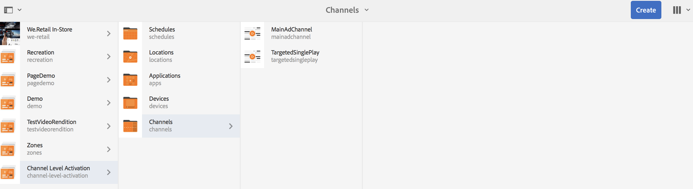
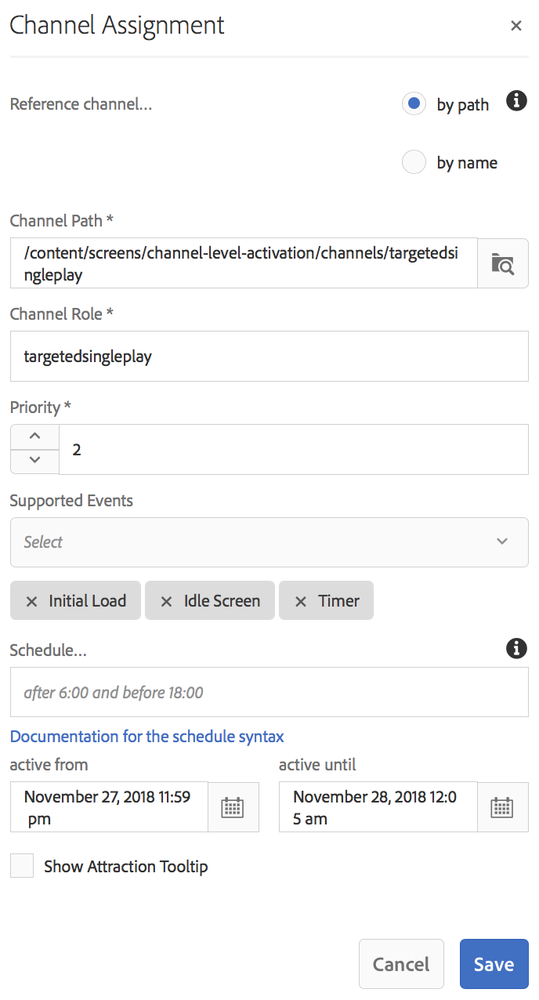

# Attivazione a livello di canale {#channel-level-activation-single-event-playback}

>[!IMPORTANT]
>Questo contenuto è valido per AEM on-premise/AMS (AEM 6.5LTS e AEM 6.5). Per i contenuti di AEM as a Cloud Service Screens, consulta la [guida di AEM as a Cloud Service](https://experienceleague.adobe.com/en/docs/experience-manager-cloud-service/content/screens-as-cloud-service/overview/introduction).

Questa pagina descrive l’attivazione a livello di canale per le risorse utilizzate nei canali.

In questa sezione vengono trattati i seguenti argomenti:

* Panoramica
* Finestra di attivazione
* Utilizzo dell’attivazione a livello di canale come riproduzione di un singolo evento
* Gestione della ricorrenza per Assets in un canale
   * DayParting
   * WeekParting
   * MonthParting
   * Combinazione di partizioni
* Utilizzo dell’attivazione a livello di canale come riproduzione di un singolo evento

## Panoramica {#overview}

***Attivazione a livello di canale*** consente ai canali di passare dopo una determinata pianificazione impostata. Il canale singolo dell’evento sostituisce il canale principale dopo un programma impostato e viene riprodotto per un momento particolare, fino a quando il canale principale non riproduce nuovamente il suo contenuto.

L’esempio seguente fornisce una soluzione concentrandosi sui seguenti termini chiave:

* un ***canale sequenza principale*** per la sequenza globale
* un ***canale evento singolo*** che viene eseguito una sola volta alla volta impostata
* ***imposta pianificazione e priorità*** per il singolo evento di riproduzione che si verifica nel canale della sequenza principale

## Finestra di attivazione {#using-channel-level-activation}

La sezione seguente spiega la creazione di una riproduzione di un singolo evento all’interno di un canale per un progetto AEM Screens.

### Prerequisiti {#prerequisites}

Prima di iniziare a implementare questa funzionalità, assicurati di disporre dei seguenti prerequisiti per iniziare a implementare l’attivazione a livello di canale:

* Crea un progetto AEM Screens, in questo esempio, **Attivazione livello canale**.

* Crea un canale come **MainAdChannel** nella cartella **Channels**.

* Crea un altro canale come **TargetedSinglePlay** nella cartella **Channels**.

* Aggiungi risorse rilevanti a entrambi i canali.

L&#39;immagine seguente mostra il progetto **Channel Level Activation** con **MainAdChannel** e **TargetedSinglePlay** canali nella cartella **Channels**.

>[!NOTE]
>
>Per ulteriori informazioni su come creare un progetto e un canale di sequenza, consulta le risorse seguenti:
>
>* [Creazione e gestione di progetti](creating-a-screens-project.md)
>
>* [Gestione di un canale](managing-channels.md)
>

### Implementazione {#implementation}

L’implementazione dell’attivazione a livello di canale in un progetto AEM Screens prevede tre attività principali:

1. **Impostazione della tassonomia del progetto, inclusi canali, posizioni e visualizzazioni**
1. **Assegnazione di canali alla visualizzazione**
1. **Impostazione di una pianificazione e priorità**

Per implementare la funzionalità, segui i passaggi seguenti:

1. **Crea un percorso**

   Passa alla cartella **Percorsi** nel progetto AEM Screens e crea un percorso come **Area**.

   

   >[!NOTE]
   >
   >Per informazioni su come creare un percorso, vedere **[Creazione e gestione di percorsi](managing-locations.md)**.

1. **Crea visualizzazione in posizione**

   1. Passa a **Attivazione a livello di canale** > **Posizioni** > **Area geografica**.
   1. Fare clic su **Area** e su **+ Crea** nella barra delle azioni.
   1. Fare clic su **Visualizzazione** dalla procedura guidata e creare una visualizzazione con titolo **Visualizzazione area.**

   

1. **Assegna canali alla visualizzazione**

   Per **MainAdChannel:**

   1. Passa a **Attivazione livello canale** > **Posizioni** > **Area** > **Visualizzazione area** e fai clic su **Assegna canale** dalla barra delle azioni.
   1. Nella finestra di dialogo **Assegnazione canale**, fare clic su **Canale di riferimento** per percorso.
   1. Fai clic su **Percorso canale**, quindi fai clic su **Attivazione livello canale** > ***Canali*** > ***MainAdChannel***.
   1. Il **ruolo canale** è popolato come **mainadchannel**.
   1. Fai clic su **Priorità** e imposta su **1**.
   1. Fai clic sui **eventi supportati**, ad esempio **Caricamento iniziale** e **Schermata di inattività**.
   1. Fai clic su **Salva**.

   

   >[!NOTE]
   >
   >Potete anche assegnare il canale dal quadro comandi di visualizzazione. Passa a **Attivazione a livello di canale** > **Posizioni** > **Area** > **Visualizzazione area**. Sulla barra delle azioni, selezionare **Dashboard**. Dal pannello **CANALI E PIANIFICAZIONI ASSEGNATI**, fai clic su **+ Assegna canale**.

   Allo stesso modo, assegna il canale **TargetedSinglePlay** per la visualizzazione**:

   1. Passa a **Attivazione livello canale** > **Posizioni** > **Area** > **Visualizzazione area** e fai clic su **Assegna canale** dalla barra delle azioni.
   1. Nella finestra di dialogo **Assegnazione canale**, fai clic su **Riferimento canale** per percorso.
   1. Fai clic su **Percorso canale**, quindi su **Attivazione livello canale** > ***Canali*** > ***TargetedSinglePlay***.
   1. Il **Ruolo canale** è popolato come **targetedsingleplay**.
   1. Imposta **Priorità** su **2**.
   1. Fai clic su **Eventi supportati** e imposta **Carico iniziale**, **Schermata di inattività** e **Timer**, come illustrato nella figura seguente.
   1. In **attivo da**, impostato come 27 novembre 2018, 23:00 e in **attivo fino a**, impostato come 28 novembre 2018, 00:00:00:00, 00:00:00 - 00:00:00:00:59:05
   1. Fai clic su **Salva**.

   >[!CAUTION]
   >
   >Impostare la priorità per il canale **TargetedSinglePlay** su un valore maggiore rispetto al canale **MainAdSegment**.

   

   >[!NOTE]
   >
   >Per scegliere lo stesso giorno, fai clic su quello successivo, quindi modifica manualmente la data impostandola sullo stesso giorno ma per un’ora successiva. In questo modo si impedisce all’utente di selezionare una data passata. Vedi l’esempio seguente:

   

## Visualizzazione dei risultati {#viewing-the-results}

Una volta completata la configurazione dei canali e della visualizzazione, avvia AEM Screens Player per visualizzare il contenuto.

Il lettore visualizza il contenuto di **MainAdChannel** ed esattamente alle 23:2} (come impostato nella pianificazione), il canale **TargetedSinglePlay** visualizza il contenuto fino alle 12:5} e quindi **MainAdChannel** riprende la riproduzione.:59:05

>[!NOTE]
>
>Per informazioni su AEM Screen Player, consulta le risorse seguenti:Download di AEM Screens PlayerUtilizzo di AEM Screens Player](working-with-screens-player.md)

## Gestione della ricorrenza per Assets in un canale {#handling-recurrence-in-assets}

Puoi pianificare le risorse in un canale in modo che ricorrano a determinati intervalli su base giornaliera, settimanale o mensile in base alle tue esigenze.

Supponiamo di voler visualizzare il contenuto di un canale solo il venerdì dalle 1:00 alle 22:1}. Puoi utilizzare la scheda **Activation** per impostare l&#39;intervallo ricorrente desiderato per la risorsa.:00

### Ripartizione giornaliera {#day-parting}

1. Fai clic sul canale, quindi fai clic su **Dashboard** nella barra delle azioni.

1. Dopo aver immesso la data/ora di inizio e la data/ora di fine nella finestra di dialogo **Assegnazione canale**, è possibile utilizzare un&#39;espressione o una versione di testo naturale per specificare la pianificazione della ricorrenza.

   >[!NOTE]
   >
   >Puoi saltare o includere i campi **Attivo da** e **Attivo fino a** e aggiungere l&#39;espressione al campo Schedules, in base alle tue esigenze.

1. Immetti l&#39;espressione nella **Pianificazione** e la risorsa viene visualizzata per l&#39;intervallo di giorno e ora specificato.

#### Espressioni di esempio per la suddivisione dei giorni {#example-one}

Nella tabella seguente sono riepilogate alcune espressioni di esempio che è possibile aggiungere alla pianificazione durante l’assegnazione di un canale a una visualizzazione.

| **Espressione** | **Interpretazione** |
|---|---|
| prima delle 08:00:00 | la risorsa nel canale viene riprodotta prima delle 08:00 del giorno:00 |
| dopo le 14:00:00 | la risorsa nel canale viene riprodotta dopo le 14:00 di ogni giorno:00 |
| dopo 12:15 e prima di 12:45 | la risorsa nel canale viene riprodotta dopo le 12:15 di pomeriggio ogni giorno per 30 minuti |
| prima del 12:15 anche dopo il 12:45 | la risorsa nel canale viene riprodotta ogni giorno prima delle 12:15 e poi anche dopo le 12:45. |
| Lun, Mar, Mer o Mon-Wed | la risorsa viene riprodotta nel canale da lunedì a mercoledì |
| il primo giorno di gennaio dopo le ore 2:00, anche il secondo giorno di gennaio e anche il terzo giorno di gennaio prima delle ore 3:00. | la risorsa nel canale inizia a essere riprodotta dopo le 2:00 di sera del 1° gennaio e continua a essere riprodotta per l’intera giornata del 2 gennaio fino alle 3:00 di mattina del 3 gennaio |
| nei 1-2 giorni di gennaio dopo le 2:00 P.M. anche nei 2-3 giorni di gennaio prima del 3:00 A.M. | la risorsa nel canale avvia il lettore dopo le 2:00 di pomeriggio del 1° gennaio, continua a essere riprodotta fino alle 3:00 di mattina del 2 gennaio, quindi riparte il 2 gennaio alle 2:00 di sera e continua a essere riprodotta fino alle 3:00 di mattina del 3 gennaio |

>[!NOTE]
>
>È inoltre possibile utilizzare la notazione _ora militare_ (14:00) invece di *A.M./P.M.* (2:00 P.M.).

### WeekParting {#week-parting}

1. Fai clic sul canale, quindi fai clic su **Dashboard** nella barra delle azioni.

1. Dopo aver immesso la data/ora di inizio e la data/ora di fine nella finestra di dialogo **Assegnazione canale**, è possibile utilizzare un&#39;espressione o una versione di testo naturale per specificare la pianificazione della ricorrenza.

   >[!NOTE]
   >
   >Puoi saltare o includere i campi **Attivo da** e **Attivo fino a** e aggiungere l&#39;espressione al campo Schedules, in base alle tue esigenze.

1. Immetti l&#39;espressione nella **Pianificazione** e la risorsa viene visualizzata per l&#39;intervallo di giorno e ora specificato.

#### Espressioni di esempio per WeekParting {#example-two}

Nella tabella seguente sono riepilogate alcune espressioni di esempio che è possibile aggiungere alla pianificazione durante l’assegnazione di un canale a una visualizzazione.

| **Espressione** | **Interpretazione** |
|---|---|
| Lun, Mar, Mer o Mon-Wed | la risorsa viene riprodotta nel canale da lunedì a mercoledì |
| prima delle 08:00:00 | la risorsa nel canale viene riprodotta prima delle 08:00 del giorno:00 |
| dopo le 14:00:00 | la risorsa nel canale viene riprodotta dopo le 14:00 di ogni giorno:00 |
| dopo 12:15 e prima di 12:45 | la risorsa nel canale viene riprodotta dopo le 12:15 di pomeriggio ogni giorno per 30 minuti |
| prima del 12:15 anche dopo il 12:45 | il canale viene riprodotto ogni giorno prima delle 12:15 e poi anche dopo le 12:45. |

>[!NOTE]
>
>È inoltre possibile utilizzare la notazione _ora militare_ (14:00) invece di *A.M./P.M.* (2:00 P.M.).

### MonthParting {#month-parting}

1. Fai clic sul canale, quindi fai clic su **Dashboard** nella barra delle azioni.

1. Dopo aver immesso la data/ora di inizio e la data/ora di fine nella finestra di dialogo **Assegnazione canale**, è possibile utilizzare un&#39;espressione o una versione di testo naturale per specificare la pianificazione della ricorrenza.

   >[!NOTE]
   >
   >Puoi saltare o includere i campi **Attivo da** e **Attivo fino a** e aggiungere l&#39;espressione al campo Schedules, in base alle tue esigenze.

1. Immetti l&#39;espressione nella **Pianificazione** e la risorsa viene visualizzata per l&#39;intervallo di giorno e ora specificato.

#### Espressioni di esempio per MonthParting {#example-three}

Nella tabella seguente sono riepilogate alcune espressioni di esempio che è possibile aggiungere alla pianificazione durante l’assegnazione di un canale a una visualizzazione.

| **Espressione** | **Interpretazione** |
|---|---|
| di `February,May,August,November` | la risorsa viene riprodotta nel canale in febbraio, maggio, agosto e novembre |

>[!NOTE]
>
>Quando definisci i giorni della settimana e i mesi, puoi utilizzare sia le notazioni a breve termine che quelle con nome completo, ad esempio lunedì/lunedì e gennaio/gennaio.

>[!NOTE]
>
>È inoltre possibile utilizzare la notazione _ora militare_ (14:00) invece di *A.M./P.M.* (2:00 P.M.).

### Combinazione di partizioni {#combined-parting}

1. Fai clic sul canale, quindi fai clic su **Dashboard** nella barra delle azioni.

1. Dopo aver immesso la data/ora di inizio e la data/ora di fine nella finestra di dialogo **Assegnazione canale**, è possibile utilizzare un&#39;espressione o una versione di testo naturale per specificare la pianificazione della ricorrenza.

   >[!NOTE]
   >
   >Puoi saltare o includere i campi **Attivo da** e **Attivo fino a** e aggiungere l&#39;espressione al campo Schedules, in base alle tue esigenze.

1. Immetti l&#39;espressione nella **Pianificazione** e la risorsa viene visualizzata per l&#39;intervallo di giorno e ora specificato.

#### Espressioni di esempio per la combinazione di partizioni {#example-four}

Nella tabella seguente sono riepilogate alcune espressioni di esempio che è possibile aggiungere alla pianificazione durante l’assegnazione di un canale a una visualizzazione.

| **Espressione** | **Interpretazione** |
|---|---|
| dopo 6:00 e prima del 18:00 di lunedì, mercoledì di gennaio-marzo | la risorsa viene riprodotta nel canale tra le 6 e le 18 il lunedì e il mercoledì da gennaio alla fine di marzo |
| il primo giorno di gennaio dopo le ore 2:00, anche il secondo giorno di gennaio e anche il terzo giorno di gennaio prima delle ore 3:00. | la risorsa nel canale inizia a essere riprodotta dopo le 2:00 di sera del 1° gennaio e continua a essere riprodotta per l’intera giornata del 2 gennaio fino alle 3:00 di mattina del 3 gennaio |
| nei 1-2 giorni di gennaio dopo le 2:00 P.M. anche nei 2-3 giorni di gennaio prima del 3:00 A.M. | la risorsa nel canale avvia il lettore dopo le 2:00 di pomeriggio del 1° gennaio, continua a essere riprodotta fino alle 3:00 di mattina del 2 gennaio, quindi riparte il 2 gennaio alle 2:00 di sera e continua a essere riprodotta fino alle 3:00 di mattina del 3 gennaio |

>[!NOTE]
>
>Quando definisci i giorni della settimana e i mesi, puoi utilizzare sia le notazioni a breve termine che quelle con nome completo, come lunedì/lunedì e gennaio/gennaio. È inoltre possibile utilizzare la notazione _ora militare_ (14:00) invece di *A.M./P.M.* (2:00 P.M.).

