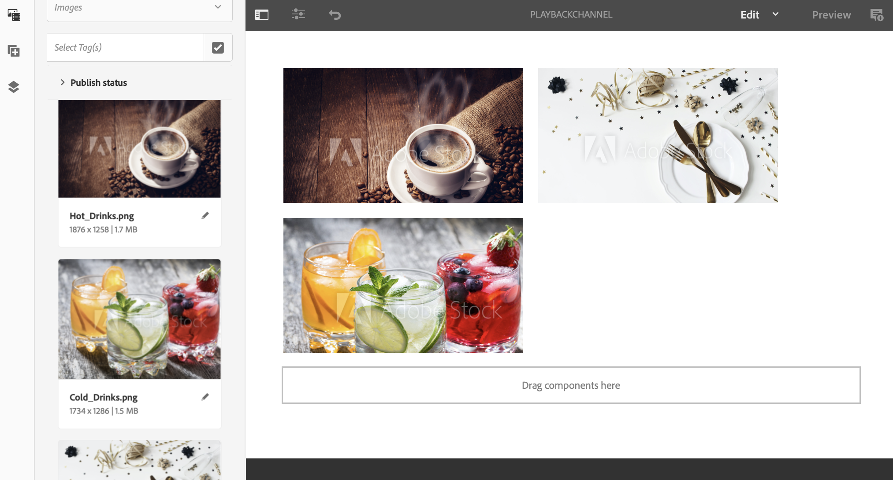
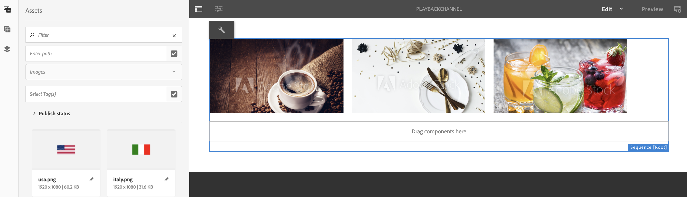

# Durata della riproduzione di immagini in serie a livello di canale {#channel-level-bulk-image-playback-duration}

## Panoramica {#overview}

Una volta creato un canale per sequenza e aggiunto le immagini, per impostazione predefinita, tutte le immagini presuppongono la durata di riproduzione definita nella configurazione a livello di canale. Ogni singola immagine può comunque ignorare il valore predefinito e avere una durata di riproduzione diversa, a questo scopo è necessario modificare la durata di riproduzione del componente immagine specifico.

### Prerequisiti {#prerequisites}

Prima di iniziare a implementare questa funzionalità, assicurati di aver impostato un progetto come prerequisito per iniziare a implementare questa funzionalità. Esempio,

1. Crea un esempio di progetto AEM Screens, **ChannelLevelPlayback**.

1. Crea un canale di sequenza come **PlaybackChannel** nella cartella **Canali**.

1. Aggiungi contenuto a **PlaybackChannel**.

## Modifica dell&#39;assegnazione della durata della riproduzione a livello di canale {#editing-channel-level-image-playback-duration-assignment}

La sezione seguente spiega come modificare la durata di riproduzione del contenuto in un canale AEM Screens.

### Aggiornamento della durata di riproduzione per le immagini in un canale {#updating-the-playback-duration-for-images-in-a-channel}

Segui i passaggi seguenti per scoprire come aggiornare l’assegnazione della durata della riproduzione a livello di canale:

1. Passa al canale della sequenza **PlaybackChannel**.

   

1. Fai clic su **Modifica** nella barra delle azioni per aprire l&#39;editor.

   

1. Aggiungi due o più immagini nell’editor canali, come illustrato nella figura riportata di seguito.

   

1. Seleziona tutte le immagini nel canale e fai clic sull&#39;icona chiave inglese in alto a sinistra (come mostrato nella figura seguente) per aprire la finestra di dialogo Configura a livello di canale.

   

1. **Viene visualizzata la finestra di dialogo** Pagefinestra di dialogo.

   >[!NOTE]
   >Per impostazione predefinita, le immagini di un canale sono impostate su una durata di riproduzione di 8 secondi.

   

   Modifica la **Durata** da 8000 (ms) a 3000 (ms), ovvero 3 secondi. Fai clic sul segno di spunta in alto a destra della finestra di dialogo **Pagina** per salvare le modifiche.

   

### Visualizzazione del risultato {#viewing-the-result}

Una volta aggiornata la durata di riproduzione del canale (in questo esempio, tutte e tre le immagini), noterai che le immagini verranno riprodotte per 3 secondi anziché 8 secondi (valore predefinito).

