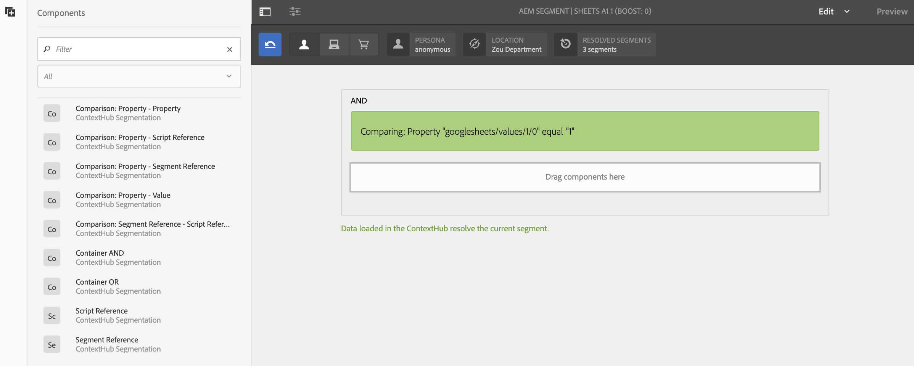

# Configurazione di ContextHub in AEM Screens {#configuring-contexthub-in-aem-screens}

In questa sezione viene illustrato come creare e gestire le modifiche delle risorse basate sui dati utilizzando un archivio dati.

## Termini chiave {#key-terms}

Prima di iniziare a creare e gestire canali basati sulle scorte nel progetto AEM Screens, devi conoscere alcuni dei termini chiave importanti e rilevanti per i diversi scenari.

**Marchio** Si riferisce alla descrizione del progetto di alto livello.

**Area** Fa riferimento al nome del progetto AEM Screens, ad esempio Digital Ad Signage

**Attività** Definisce la categoria della regola, ad esempio basata su magazzino, basata su meteo, basata sulla disponibilità del reparto e così via.

**Audience** Definisce la regola.

**Segmento** Si riferisce alla versione della risorsa da riprodurre per la regola data, ad esempio se la temperatura è inferiore a 50 gradi fahrenheit, lo schermo visualizza l&#39;immagine di un caffè caldo altrimenti una bevanda fredda.

Il diagramma seguente fornisce una rappresentazione visiva del modo in cui le configurazioni ContextHub coincidono con l&#39;attività, l&#39;audience e i canali.


## Premesse {#preconditions}

Prima di iniziare a configurare le configurazioni Context Hub per un progetto AEM Screens, è necessario configurare Google Sheets (a scopo dimostrativo).

>[!CAUTION]
>
>Google Sheets è utilizzato nell&#39;esempio seguente come un sistema di database di esempio da cui i valori vengono recuperati ed è esclusivamente a scopo educativo. Adobe non supporta l&#39;utilizzo di Google Sheets per ambienti di produzione.
>
>Per ulteriori informazioni, consulta [Ottenere la chiave](https://developers.google.com/maps/documentation/javascript/get-api-key) API nella documentazione di Google.

## Passaggio 1: Impostazione di un archivio dati {#step-setting-up-a-data-store}

È possibile impostare l&#39;archivio dati come evento I/O locale o come evento del database locale.

### Evento I/O locale {#local-io-event}

Attenetevi alla procedura seguente per configurare un archivio dati, ad esempio un evento ASCII che consente di utilizzare le configurazioni ContextHub e il percorso dei segmenti per il canale AEM Screens.

### Evento database locale {#local-db-event}

Segui i passaggi indicati di seguito per configurare un archivio dati, ad esempio un foglio Excel, che consente di utilizzare le configurazioni ContextHub e il percorso dei segmenti per il canale AEM Screens.

1. **Passaggio a ContextHub**

   Andate all’istanza di AEM e fate clic sull’icona degli strumenti dalla barra laterale sinistra. Fate clic su **Siti** > **ContextHub**, come illustrato nella figura riportata di seguito.

   

1. **Creazione di una nuova configurazione ContextHub Store**

   1. Passa a **globale** > **predefinito** > Configurazione **** ContextHub.

   1. Fate clic su **Crea** > Contenitore **di** configurazione e immettete il titolo come **ContextHubDemo**.

   1. **** Andate **a** ContextHubDemo **> Configurazione** ContentHub Store... per aprire la **procedura guidata** Configura.

   1. Inserite il **Titolo** come **Google Sheets**, **Store Name** as **googlesheets**, e **Store Type** **comecontexthub.Generic-jsonp**

   1. Fai clic su **Avanti**
   1. Immettete la configurazione json specifica. Ad esempio, potete utilizzare il seguente json a scopo dimostrativo.
   1. Fai clic su **Salva**.

   ```
   {
     "service": {
       "host": "sheets.googleapis.com",
       "port": 80,
       "path": "/v4/spreadsheets/<your sheet it>/values/Sheet1",
       "jsonp": false,
       "secure": true,
       "params": {
         "key": "<your API key>"
       }
     },
     "pollInterval": 3000
   }
   ```

   >[!NOTE]
   >
   >Nel codice di esempio sopra, **pollInterval** definisce la frequenza con cui i valori vengono aggiornati (in ms).
   >
   >
   >Sostituisci il codice con il tuo *&lt;ID foglio>* e *&lt;Chiave API>* che hai recuperato durante la configurazione dei fogli di Google.

   >[!CAUTION]
   Se create le configurazioni del vostro archivio Google Sheets al di fuori della cartella precedente (ad esempio nella cartella del progetto), il targeting non funzionerà.
   Se desiderate configurare le configurazioni dell&#39;archivio Google Sheets al di fuori della cartella legacy globale, dovete impostare **Store Name** come **segmentazione** e **Store Type** come **aem.segmentation**. Inoltre, devi saltare il processo di definizione del json come definito sopra.

1. **Creazione di un marchio nelle attività**

   1. Passa dall’istanza AEM a **Personalizzazione** > **Attività**

   1. Fai clic su **Crea** > **Crea marchio**

   1. Select **Brand** from the **Create Page** wizard and click **Next**

   1. Enter the **Title** as **ContextHubDemo** and click **Create**. Il marchio viene ora creato come illustrato di seguito.
   


   >[!CAUTION]
   Problema noto:
   Per aggiungere un&#39;area, rimuovete lo schema dall&#39;URL, ad esempio
   `https://localhost:4502/libs/cq/personalization/touch-ui/content/v2/activities.html/content/campaigns/contexthubdemo/master`

1. **Creazione di un’area nel marchio**

   Per creare un&#39;area del marchio, effettuate le seguenti operazioni:

   1. Fare clic su **Crea** e quindi su **Crea area**

   1. Select **Area** from the **Create Page** wizard and click Next

   1. Enter the **Title** as **GoogleSheets** and click **Create**.
L&#39;area verrà creata nell&#39;attività.

## Passaggio 2: Impostazione della segmentazione dell&#39;audience {#step-setting-up-audience-segmentation}

Dopo aver configurato un archivio dati e definito il marchio, segui i passaggi descritti di seguito per configurare i segmenti di pubblico.

1. **Creazione di segmenti nel pubblico**

   1. Passa dall’istanza AEM a **Personalizzazione** > **Audience** > **We.Retail**.

   1. Fate clic su **Crea** > **Crea segmento hub contesto.** Viene visualizzata la finestra di dialogo **Nuovo segmento** ContextHub.

   1. Enter the **Title** as **SheetA1 1** and click **Create**. Analogamente, create un altro segmento denominato **SheetA2 2**.

1. **Modifica dei segmenti**

   1. Selezionate i **fogli di segmento A1 1** (creati nel passaggio (5)), quindi fate clic su **Modifica** nella barra delle azioni.

   1. Trascinate e rilasciate il **confronto: Proprietà - Componente valore** per l’editor.
   1. Fare clic sull&#39;icona chiave inglese per aprire la finestra di dialogo **Confronto di una proprietà con un valore** .
   1. Selezionate **googlesheets/value/1/0** dall’elenco a discesa in Nome **** proprietà.

   1. Selezionate **Operatore** come **Uguale** dal menu a discesa.

   1. Immettere il **valore** come **1**.
   >[!NOTE]
   AEM convalida i dati provenienti da Google Sheet visualizzando il segmento come verde.

   

   Allo stesso modo, modificate i valori delle proprietà in **Fogli A1 2**.

   1. Trascinate e rilasciate il **confronto: Proprietà - Componente valore** per l’editor.
   1. Fare clic sull&#39;icona chiave inglese per aprire la finestra di dialogo **Confronto di una proprietà con un valore** .
   1. Selezionate **googlesheets/value/1/0** dall’elenco a discesa in Nome **** proprietà.

   1. Selezionate **Operatore** come **Uguale** dal menu a discesa.

   1. Immettere il **valore** come **2**.
   >[!NOTE]
   Le regole applicate nei passaggi precedenti sono solo un esempio di come impostare i segmenti per l&#39;implementazione dei seguenti casi di utilizzo.

## Passaggio 3: Abilitazione del targeting nei canali {#step-enabling-targeting-in-channels}

Attenetevi alla procedura seguente per abilitare il targeting nei canali.

1. Passa a uno dei canali AEM Screens. I passaggi seguenti dimostrano come abilitare il targeting utilizzando **DataDrivenRetail** creato in un canale AEM Screens.

1. Selezionate il canale **DataDrivenRetail** e fate clic su **Proprietà** dalla barra delle azioni.

   

1. Selezionate la scheda **Personalizzazione** per impostare le configurazioni ContextHub.

   1. Selezionate **ContextHub Path** come **libs** > **settings** > **cloud settings** > **default** **** ****>ContextHub Configurations, quindi fate clic suSelect.

   1. Selezionate Percorso **** Segmenti come **conf** > **We.Retail** > **impostazioni** > **wcm** **** ****> Segmentie fate clic su Seleziona.

   1. Fate clic su **Salva e chiudi**.
   >[!NOTE]
   Usa ContextHub e il percorso Segments, dove hai salvato inizialmente le configurazioni e i segmenti dell&#39;hub di contesto.

   

1. Naviga e seleziona **DataDrivenRetail** da **DataDrivenAssets** > **Canali** , quindi fai clic su **Modifica** nella barra delle azioni.

   >[!NOTE]
   Se avete impostato tutto correttamente, l&#39;opzione **Targeting** viene visualizzata nel menu a discesa dall&#39;editor, come illustrato nella figura riportata di seguito.

   

   >[!NOTE]
   Una volta configurate le configurazioni ContextHub per il canale, accertatevi di seguire i passaggi precedenti da 1 a 4, anche per gli altri tre canali di sequenza se desiderate seguire tutti i casi di utilizzo indicati di seguito.

## Ulteriori informazioni: Esempi di utilizzo {#learn-more-example-use-cases}

Dopo aver configurato ContextHub per il progetto AEM Screens, puoi seguire i diversi casi d’uso per comprendere in che modo le risorse attivate dai dati svolgono un ruolo fondamentale nei diversi settori:

1. **[Attivazione mirata inventario vendita al dettaglio](retail-inventory-activation.md)**
1. **[Attivazione temperatura centro viaggio](local-temperature-activation.md)**
1. **[Attivazione prenotazione ospitalità](hospitality-reservation-activation.md)**
