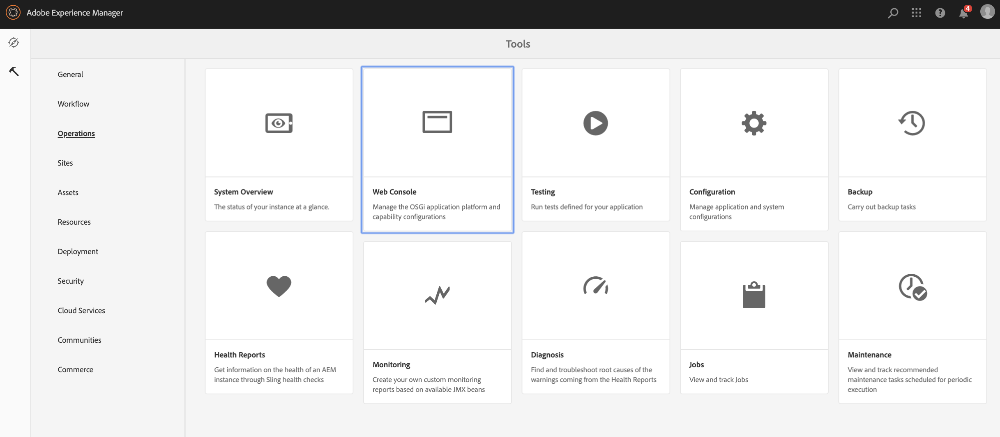
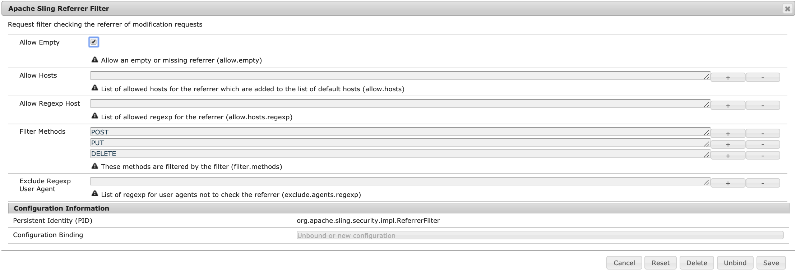

# Configuring and Deploying AEM Screens {#configuring-and-deploying-aem-screens}

Questa pagina mostra come installare e configurare i lettori Screens sui dispositivi.

## Installazione di AEM Screens Player {#installing-aem-screens-player}

Il lettore AEM Screens è disponibile per Android, Chrome OS, iOS e Windows.

Per scaricare **AEM Screens Player**, visita la pagina dei download [**di**](https://download.macromedia.com/screens/) AEM 6.5 Player.

>[!NOTE]
>
>Una volta scaricata la versione più recente di Player (*.exe*), segui i passaggi del lettore per completare l'installazione ad hoc:
>
>1. Tenete premuto sull’angolo in alto a sinistra per aprire il pannello di amministrazione.
>1. Andate a **Configurazione** dal menu delle azioni a sinistra e immettete l'indirizzo della posizione dell'istanza AEM in **Server** , quindi fate clic su **Salva**.
>1. Fate clic sul collegamento **Registrazione** dal menu delle azioni a sinistra e seguite i passaggi per completare il processo di registrazione del dispositivo.
>

### Additional Resources {#additional-resources}

Per ulteriori informazioni, consultate i seguenti argomenti:

* Per scaricare Android Player, visita **Google Play**. Per ulteriori informazioni sull'implementazione di Android Watchdog, vedere [Implementazione del lettore](implementing-android-player.md)Android.

* Per implementare Chrome OS Player, fare riferimento a [Chrome Management Console](implementing-chrome-os-player.md) per ulteriori informazioni.

* Per configurare il lettore Windows di AEM Screens, consultate [Implementazione di Windows Player](implementing-windows-player.md).

## Server Configuration {#server-configuration}

>[!NOTE]
>
>**Importante**:
>
>Il lettore AEM Screens non utilizza il token CSRF (Cross-Site Request Forgery). Per poter configurare e utilizzare AEM Server per AEM Screens, ignorate il filtro di riferimento consentendo riferimenti vuoti.

### Prerequisiti {#prerequisites}

I seguenti punti chiave aiutano a configurare e il server AEM da usare per AEM Screens:

#### Consenti richieste referente vuote {#allow-empty-referrer-requests}

1. Passa a **Configurazione della console Web di Adobe Experience Manager **tramite l'istanza di AEM —&gt; icona del martello —&gt; **Operazioni** —&gt; Console **** Web.

   

1. **Viene aperta la configurazione** della console Web di Adobe Experience Manager. Cerca referrer di fionda.

   Per cercare la proprietà sling referrer, premere **Comando+F** per **Mac** e **Ctrl+F** per **Windows**.

   

1. Selezionare l'opzione **Consenti valori nulli **come illustrato nella figura seguente.

   

1. Fate clic su **Salva** per attivare l'opzione Consenti valori nulli per il filtro Apache Sling Referrer.

#### Abilita interfaccia utente touch per AEM Screens {#enable-touch-ui-for-aem-screens}

AEM Screens richiede l’interfaccia utente TOUCH e non funziona con l’interfaccia classica di Adobe Experience Manager (AEM).

1. Passa a *&lt;istanzaAutore&gt;/system/console/configMgr/com.day.cq.wcm.core.impl.AuthoringUIModeServiceImpl*
1. Verificate che la modalità **interfaccia utente di authoring** predefinita sia impostata su **TOUCH**, come illustrato nella figura seguente

In alternativa, puoi eseguire la stessa impostazione anche utilizzando*&lt;yourAuthorInstance&gt; *-&gt;* strumenti (icona a forma di martello)* -&gt; **Operazioni** -&gt;** Console Web** e cercare **WCM Authoring UI Mode Service**.

>[!NOTE]
>
>Potete sempre attivare l’interfaccia classica per utenti specifici utilizzando le preferenze utente.

#### AEM in modalità di esecuzione NOSAMPLECONTENT {#aem-in-nosamplecontent-runmode}

L’esecuzione di AEM in produzione utilizza la modalità di esecuzione **NOSAMPLECONTENT** . *Rimuovete l’intestazione X-Frame-Options=SAMEORIGIN* (nella sezione dell’intestazione della risposta aggiuntiva)

`https://localhost:4502/system/console/configMgr/org.apache.sling.engine.impl.SlingMainServlet`.

Questo è richiesto per la riproduzione dei canali online da parte di AEM Screens Player.

#### Restrizioni per la password {#password-restrictions}

Con le ultime modifiche apportate a ***DeviceServiceImpl***, non è necessario rimuovere le restrizioni relative alla password.

Puoi configurare ***DeviceServiceImpl*** dal collegamento seguente per abilitare la limitazione della password durante la creazione della password per gli utenti del dispositivo dello schermo:

`https://localhost:4502/system/console/configMgr/com.adobe.cq.screens.device.impl.DeviceService`

Segui i passaggi indicati di seguito per configurare ***DeviceServiceImpl***:

1. Passa a **Configurazione della console Web di Adobe Experience Manager **tramite l'istanza di AEM —&gt; icona del martello —&gt; **Operazioni** —&gt; Console **** Web.

1. **Viene aperta la configurazione della console Web di Adobe Experience Manager **s. Cercare il servizio di assistenza. Per effettuare una ricerca nella proprietà, premere **Comando+F** per **Mac** e **Ctrl+F** per **Windows**.

#### Dispatcher Configuration {#dispatcher-configuration}

Per informazioni su come configurare il dispatcher per un progetto AEM Screens, consultate [Configurazione del dispatcher per un progetto](dispatcher-configurations-aem-screens.md)AEM Screens.

#### Codifica Java {#java-encoding}

Impostare la codifica ****** Java su Unicode. Ad esempio, *Dfile.encoding=Cp1252* non funzionerà.

>[!NOTE]
>
>**Consiglio:**
>
>Si consiglia di utilizzare HTTPS per AEM Screens Server in fase di produzione.

