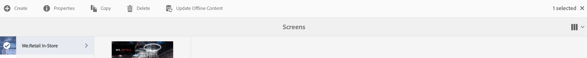

# Aggiornamento contenuti come servizio {#content-update-as-a-service}

Questa sezione tratta i seguenti argomenti sull’aggiornamento del contenuto come servizio:

* **Panoramica**
* **Utilizzo dell&#39;aggiornamento offline in blocco**

<!--
>[!CAUTION]
>
>This AEM Screens functionality is only available, if you have installed AEM 6.3 Feature Pack 3 or AEM 6.4 Screens Feature Pack 1.
>
>To get access to this Feature Pack, contact Adobe Support and request access. When you have permission you can download it from Package Share. -->

## Panoramica {#overview}

L’aggiornamento in blocco offline consente di aggiornare tutti i canali in blocco. Evita il problema di navigare su un canale particolare e di aggiornare il contenuto. Piuttosto, puoi aggiornare tutti i contenuti in canali per un progetto specifico in un istante.

Puoi anche pianificare questa attività per un periodo di traffico di rete ridotto.

>[!NOTE]
>
>La funzione Aggiornamento offline in blocco è ottimizzata per aggiornare solo i canali che sono stati modificati.

## Utilizzo dell’aggiornamento offline in blocco {#using-bulk-offline-update}

Puoi utilizzare manualmente l’aggiornamento in blocco offline dall’interfaccia utente o pianificare l’aggiornamento in blocco dai servizi OSGi.

### Utilizzo dell’interfaccia utente di AEM Screens {#using-aem-screens-user-interface}

Per utilizzare l’aggiornamento offline in blocco per un progetto AEM Screens, effettua le seguenti operazioni:

1. Passa al progetto AEM Screens.
1. Fare clic sul progetto e fare clic su **Aggiorna contenuto offline** nella barra delle azioni per aggiornare manualmente il contenuto del canale.

   

### Configurazione console Web Adobe Experience Manager {#adobe-experience-manager-web-console-configuration}

Per utilizzare l’aggiornamento offline in blocco per un progetto AEM Screens, effettua le seguenti operazioni:

1. Configurazione della console Web Adobe Experience Manager.
1. Cercare i servizi di aggiornamento offline in blocco.

   

1. Aggiungi le seguenti proprietà:

   **Percorso progetto** Specifica il percorso del progetto AEM Screens. Il percorso è in genere `/content/screens/<Name of your project>`.

   *Ad esempio*, `/content/screens/we-retail`. Per trovare questo percorso nell’URL, seleziona qualsiasi progetto in AEM Screens (non fare clic sull’icona ).

   >[!NOTE]
   >
   >Specifica il percorso del progetto relativo al canale.

   **Frequenza pianificazione** Specificare un&#39;ora, ad esempio le 17.00 o le 17.00, in cui il servizio deve aggiornare il contenuto offline.

1. Fai clic su **Salva** per salvare le impostazioni. Tutto il contenuto viene aggiornato all’ora specificata.
