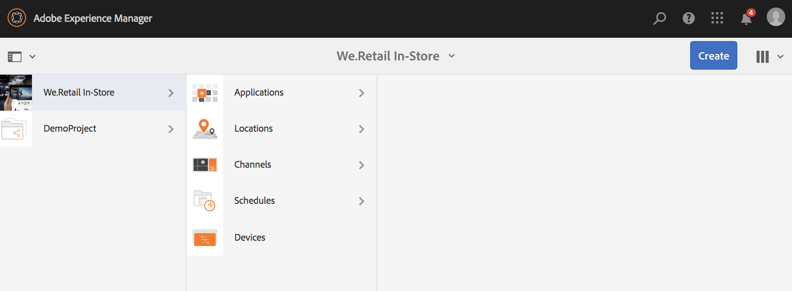
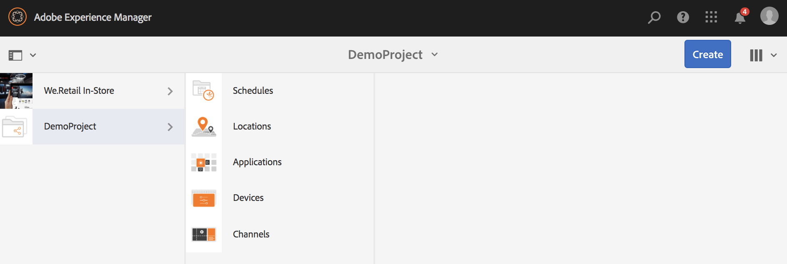

# Creating and Managing Projects {#creating-and-managing-projects}

AEM Screens è disponibile selezionando il collegamento ad Adobe Experience Manager (in alto a sinistra) e quindi Screens.

In alternativa, puoi accedere direttamente a: `http://localhost:4502/screens.html/content/screens`

Progetti diversi possono essere marchi, distribuzioni, clienti e così via.

>[!NOTE]
>
>**Suggerimento di navigazione:**
>
>Puoi anche utilizzare i tasti cursore per navigare attraverso le diverse cartelle in AEM. Inoltre, una volta selezionata una particolare entità, toccate la barra spaziatrice per modificare o visualizzare le proprietà di tale cartella.

## Creazione di un nuovo progetto Screens {#creating-a-new-screens-project}

Per creare un nuovo progetto Screens, procedi come segue:

1. Seleziona **Screens** dal dashboard AEM.
1. Click **Create** --> **Create Project** and **Create Screens Project** wizard will open.

1. Select the **Screens** template and click **Next**.

1. Enter the properties (**Title** and **Name**) as required and click **Create**.

>[!NOTE]
>
>By default, the initial structure will contain the **Schedules**, **Locations**, **Applications**, **Channels**, and **Devices** master pages, but this can be manually adjusted if needed. Puoi rimuovere le opzioni, se quelle disponibili non sono rilevanti per il progetto.

Il progetto viene creato e vieni riportato al pannello Progetto Screens. Ora puoi selezionare il progetto.

In un progetto, vi sono quattro tipi di cartelle, come illustrato nella figura seguente:

* **Pianificazioni**
* **Posizioni**
* **Applicazioni**
* **Canali**
* **Dispositivi**

### Visualizzazione delle proprietà {#viewing-properties}

Once you create the Screens project, click **Properties** on the action bar to edit properties of an exiting AEM Screens project.

The following options allow you to edit/change properties of your *DemoProject*.

### Creazione di una cartella personalizzata {#creating-a-custom-folder}

Potete anche creare una cartella personalizzata nelle pagine master **Pianificazioni**, **Posizioni**, **Applicazioni**, **Canali** e **Dispositivi** disponibili nel progetto.

Per creare una cartella personalizzata:

1. Select your project and click on **Create** next to plus icon in the action bar.
1. Si apre la procedura guidata **Crea** da cui puoi selezionare l&#39;opzione appropriata.
1. Fai clic su **Avanti**.
1. Immetti le proprietà e fai clic su **Crea**.

Nei passaggi seguenti viene illustrata la creazione di una cartella di applicazioni nella pagina master **Applicazioni** in *DemoProject*.

### Passaggi successivi {#the-next-steps}

Once you have created your own project, see [Channel Management](managing-channels.md) to create and manage content in your channel.

Inoltre, potete creare una pianificazione, un’applicazione, una posizione o un dispositivo personalizzati.
