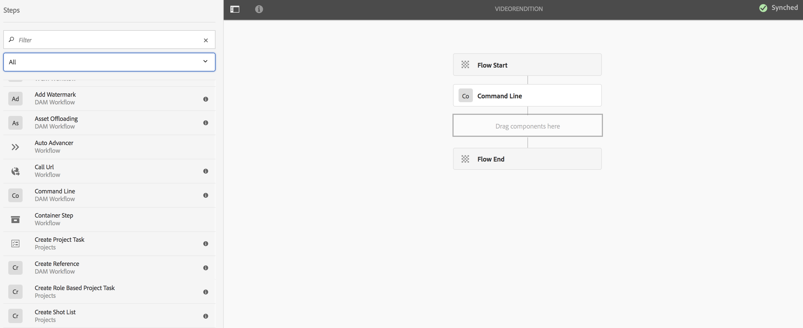
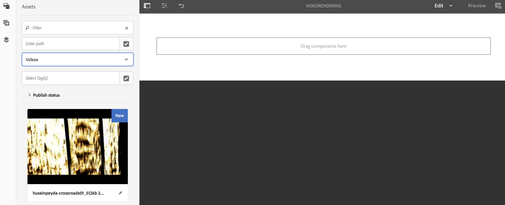

# Creazione di un flusso di lavoro di spaziatura video {#creating-a-video-padding-workflow}

Questa sezione tratta i seguenti argomenti:

* **Panoramica**
* **Prerequisiti**
* **Creazione di un flusso di lavoro di spaziatura video**
   * **Creazione di un flusso di lavoro**
   * **Utilizzo del flusso di lavoro in AEM Screens Project**

* **Convalida dell’output per il flusso di lavoro**

## Panoramica {#overview}

Il seguente caso d’uso prevede il posizionamento di un video (ad esempio: 1280 x 720) in un canale in cui il display è 1920 x 1080 e il posizionamento del video su 0x0 (in alto a sinistra). Il video non deve essere allungato o modificato in alcun modo e non utilizzare **Copertina** nel componente video.

Il video viene visualizzato come un oggetto da pixel 1 a pixel 1280 in orizzontale e da pixel 1 a pixel 720 in basso e il resto del canale è il colore predefinito.

## Prerequisiti {#prerequisites}

Prima di creare un flusso di lavoro per i video, completa i seguenti prerequisiti:

1. Caricare un video in **Risorse** cartella nell’istanza AEM
1. Creare un progetto AEM Screens (ad esempio, **TestVideoRendition**) e un canale denominato (**VideoRendering**), come illustrato nella figura seguente:

## Creazione di un flusso di lavoro di spaziatura video {#creating-a-video-padding-workflow-1}

Per creare un flusso di lavoro per la spaziatura video, crea un flusso di lavoro per il video e quindi utilizza lo stesso nel canale del progetto AEM Screens.

Per creare e utilizzare il flusso di lavoro, segui i passaggi seguenti:

1. Creazione di un flusso di lavoro
1. Utilizzo del flusso di lavoro in un progetto AEM Screens

### Creazione di un flusso di lavoro {#creating-a-workflow}

Per creare un flusso di lavoro per il video, effettua le seguenti operazioni:

1. Passa all’istanza AEM.
1. Selezionare gli strumenti dalla barra laterale.
1. Seleziona **Flusso di lavoro** > **Modelli** quindi potete creare un modello.

   

1. Seleziona **Modelli** > **Crea** > **Crea modello**. Inserisci il **Titolo** (come **VideoRendition**) e **Nome** nel **Aggiungi modello flusso di lavoro**. Seleziona **Fine** per aggiungere il modello di workflow.

   

1. Dopo aver creato il modello di flusso di lavoro, selezionare il modello (**VideoRendition**) e seleziona **Modifica** dalla barra delle azioni.

   

1. Trascina la **`Command Line`** al flusso di lavoro.

   

1. Seleziona la **`Command Line`** e aprire la finestra di dialogo proprietà.

   

1. Seleziona la **Argomenti** scheda.
1. In **Riga di comando - Proprietà passaggio** , immettere il formato nella finestra di dialogo **Tipi MIME** (come ***video/mp4***) e il comando come (***/usr/local/Cellar/ffmpeg -i ${filename} -vf &quot;pad=1920:height=1080:x=0:y=0:color=black&quot; cq5dam.video.fullhd-hp.mp4***). Questo comando avvia il flusso di lavoro in **Comandi** campo.

   Vedi i dettagli su **Tipi MIME** e **Comandi** nella nota seguente.

   

1. Seleziona il flusso di lavoro (**VideoRenditions**).
1. Seleziona **Avvia flusso di lavoro** dalla barra delle azioni.

   

1. In **Esegui flusso di lavoro** , seleziona il percorso della risorsa in **Payload** (come ***/content/dam/huseinpeyda-crossroads01_512kb 2.mp4***) e immettere il **Titolo** as ***EseguiVideo*** e seleziona **Esegui**.

   

### Utilizzo del flusso di lavoro in un progetto AEM Screens {#using-the-workflow-in-an-aem-screens-project}

Per utilizzare il flusso di lavoro nel progetto AEM Screens, segui i passaggi seguenti:

1. Passare a un progetto AEM Screens (**TestVideoRendition** > **Canali** >**VideoRendition**).

   

1. Seleziona **Modifica** dalla barra delle azioni. Trascina e rilascia il video caricato inizialmente in **Risorse**.

   

1. Dopo aver caricato il video, seleziona **Anteprima** per visualizzare l’output.

   

## Convalida dell’output per il flusso di lavoro {#validating-the-output-for-the-workflow}

Per convalidare l’output:

* Controlla anteprima del video nel canale
* Accedi a ***/content/dam/testvideo.mp4/jcr:content/renditions/cq5dam.video.fullhd-hp.mp4*** in CRXDE Liti, come illustrato nella figura seguente:

