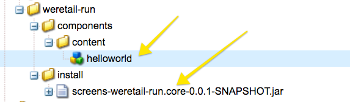
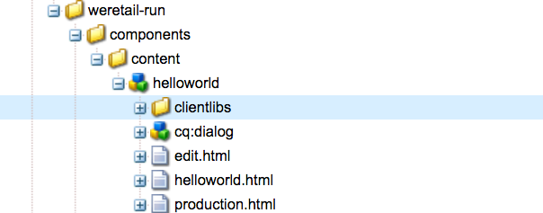
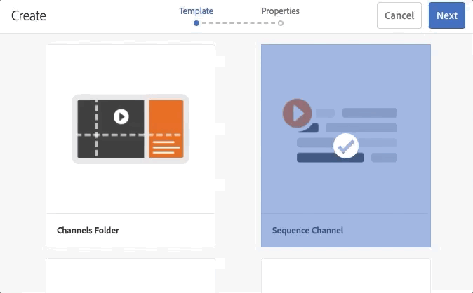

# Sviluppo di un componente personalizzato per AEM Screens {#developing-a-custom-component-for-aem-screens}

L’esercitazione seguente illustra i passaggi necessari per creare un componente personalizzato per AEM Screens. AEM Screens riutilizza molti modelli di progettazione e tecnologie esistenti di altri prodotti AEM. L&#39;esercitazione evidenzia differenze e considerazioni speciali nello sviluppo per AEM Screens.

## Panoramica {#overview}

Questa esercitazione è destinata agli sviluppatori che hanno familiarità con AEM Screens. In questa esercitazione viene creato un semplice componente &quot;Hello World&quot; per un canale Sequenza in AEM Screens. Una finestra di dialogo consente agli autori di aggiornare il testo visualizzato.


## Prerequisiti {#prerequisites}

Per completare questa esercitazione, è necessario effettuare le seguenti operazioni:

1. [AEM 6.5](https://helpx.adobe.com/it/experience-manager/6-4/release-notes.html) o [AEM 6.3](https://helpx.adobe.com/it/experience-manager/6-3/release-notes.html) + Feature Pack per schermi più recenti

1. [Lettore AEM Screens](https://helpx.adobe.com/experience-manager/6-4/sites/deploying/using/configuring-screens-introduction.html)
1. Ambiente di sviluppo locale

I passaggi dell&#39;esercitazione e le schermate vengono eseguiti utilizzando **CRXDE-Lite**. Gli IDE possono essere utilizzati anche per completare l&#39;esercitazione. Ulteriori informazioni sull’utilizzo di un IDE per lo sviluppo [con AEM sono disponibili qui.](https://helpx.adobe.com/experience-manager/kt/sites/using/getting-started-wknd-tutorial-develop/part1.html#eclipse-ide)


## Configurazione progetto {#project-setup}

Il codice sorgente di un progetto Screens viene generalmente gestito come progetto Maven multi-modulo. Per accelerare l’esercitazione, un progetto è stato pre-generato con l’archivio di progetto [AEM 13](https://github.com/Adobe-Marketing-Cloud/aem-project-archetype). Maggiori dettagli sulla [creazione di un progetto con Maven AEM Project Archetype sono disponibili qui](https://helpx.adobe.com/experience-manager/kt/sites/using/getting-started-wknd-tutorial-develop/part1.html#maven-multimodule).

1. Scaricate e installate i pacchetti seguenti utilizzando [CRX Package Manager](http://localhost:4502/crx/packmgr/index.jsp):

   [Ottieni file](assets/base-screens-weretail-runuiapps-001-snapshot.zip)

   [Ottieni file](assets/base-screens-weretail-runuicontent-001-snapshot.zip)
   **Facoltativamente** , se lavorate con Eclipse o con un altro IDE, scaricate il pacchetto sorgente riportato di seguito. Distribuisci il progetto in un’istanza AEM locale utilizzando il comando Paradiso:

   **`mvn -PautoInstallPackage clean install`**

   Start HelloWorld SRC Screens We.Retail Run Project

   [Ottieni file](assets/src-screens-weretail-run.zip)

1. In [CRX Package Manager](http://localhost:4502/crx/packmgr/index.jsp) verificate che siano installati i due pacchetti seguenti:

   1. **screens-weretail-run.ui.co-0.0.1-SNAPSHOT.zip**
   1. **screens-weretail-run.ui.apps-0.0.1-SNAPSHOT.zip**
   

   Schermi I.Retail Run I pacchetti Ui.Apps e Ui.Content installati tramite CRX Package Manager

1. Il pacchetto **screens-weretail-run.ui.apps** installa il codice sotto di `/apps/weretail-run`.

   Questo pacchetto contiene il codice responsabile per il rendering dei componenti personalizzati per il progetto. Questo pacchetto include il codice del componente ed eventuali codice JavaScript o CSS necessari. Questo pacchetto include anche **screens-weretail-run.core-0.0.1-SNAPSHOT.jar** , che contiene eventuale codice Java necessario al progetto.

   >[!NOTE]
   >
   >In questa esercitazione non viene scritto alcun codice Java. Se è necessaria una logica aziendale più complessa, è possibile creare e distribuire Java back-end utilizzando il pacchetto Java di base.

   

   Rappresentazione del codice ui.apps in CRXDE Lite

   Il componente **helloworld** è attualmente solo un segnaposto. Durante l’esercitazione, verranno aggiunte funzionalità che consentono all’autore di aggiornare il messaggio visualizzato dal componente.

1. Il pacchetto **screens-weretail-run.ui.content** installa il codice sotto:

   * `/conf/we-retail-run`
   * `/content/dam/we-retail-run`
   * `/content/screens/we-retail-run`
   Questo pacchetto contiene il contenuto iniziale e la struttura di configurazione necessarie per il progetto. **`/conf/we-retail-run`** contiene tutte le configurazioni per il progetto We.Retail Run. **`/content/dam/we-retail-run`** include l&#39;avvio di risorse digitali per il progetto. **`/content/screens/we-retail-run`** contiene la struttura del contenuto Screens. Il contenuto sotto tutti questi percorsi viene aggiornato principalmente in AEM. Per promuovere la coerenza tra gli ambienti (locale, Dev, Stage, Prod) spesso viene salvata una struttura di contenuto di base nel controllo del codice sorgente.

1. **Andate al progetto AEM Screens > We.Retail Run:**

   Dal menu Start di AEM > Fai clic sull’icona Schermate. Verificare che il progetto di esecuzione We.Retail sia visibile.

   

## Creare il componente Hello World {#hello-world-cmp}

Il componente Hello World è un componente semplice che consente a un utente di inserire un messaggio da visualizzare sullo schermo. Il componente si basa sul modello di componente [AEM Screens: https://github.com/Adobe-Marketing-Cloud/aem-screens-component-template](https://github.com/Adobe-Marketing-Cloud/aem-screens-component-template).

AEM Screens presenta alcuni vincoli interessanti che non sono necessariamente veri per i componenti WCM Sites tradizionali.

* La maggior parte dei componenti Screens deve essere eseguita a schermo intero sui dispositivi di digital signage di destinazione
* La maggior parte dei componenti Screens devono essere incorporati nei canali delle sequenze per generare presentazioni
* L’authoring dovrebbe consentire la modifica di singoli componenti in un canale di sequenza, per cui il rendering a schermo intero non è più una questione

1. In **CRXDE-Lite** `http://localhost:4502/crx/de/index.jsp` (o IDE di scelta) passare a `/apps/weretail-run/components/content/helloworld.`

   Aggiungete le seguenti proprietà al `helloworld` componente:

   ```
       jcr:title="Hello World"
       sling:resourceSuperType="foundation/components/parbase"
       componentGroup="We.Retail Run - Content"
   ```

   

   Proprietà per /apps/weretail-run/components/content/helloworld

   Il componente **helloworld** estende il componente **foundation/components/parbase** in modo che possa essere utilizzato correttamente all’interno di un canale di sequenza.

1. Creare un file sotto `/apps/weretail-run/components/content/helloworld` nome `helloworld.html.`

   Compilate il file con le seguenti opzioni:

   ```xml
   <!--/*
   
    /apps/weretail-run/components/content/helloworld/helloworld.html
   
   */-->
   
   <!--/* production: preview authoring mode + unspecified mode (i.e. on publish) */-->
   <sly data-sly-test.production="${wcmmode.preview || wcmmode.disabled}" data-sly-include="production.html" />
   
   <!--/* edit: any other authoring mode, i.e. edit, design, scaffolding, etc. */-->
   <sly data-sly-test="${!production}" data-sly-include="edit.html" />
   ```

   I componenti Screens richiedono due diversi rendering a seconda della modalità [di](https://helpx.adobe.com/experience-manager/6-4/sites/authoring/using/author-environment-tools.html#PageModes) authoring in uso:

   1. **Produzione**: Modalità Anteprima o Pubblicazione (wcmmode=disabled)
   1. **Modifica**: utilizzato per tutte le altre modalità di authoring, ad esempio modifica, progettazione, scaffolding, sviluppatore...
   `helloworld.html`funge da interruttore, verificando quale modalità di authoring è attualmente attiva e reindirizzando l’utente a un altro script HTL. Una convenzione comune utilizzata dai componenti schermate consiste nell&#39;avere uno `edit.html` script per la modalità Modifica e uno `production.html` script per la modalità Produzione.

1. Creare un file sotto `/apps/weretail-run/components/content/helloworld` nome `production.html.`

   Compilate il file con le seguenti opzioni:

   ```xml
   <!--/*
    /apps/weretail-run/components/content/helloworld/production.html
   
   */-->
   
   <div data-duration="${properties.duration}" class="cmp-hello-world">
    <h1 class="cmp-hello-world__message">${properties.message}</h1>
   </div>
   ```

   Qui di seguito è riportato il markup di produzione per il componente Hello World. Un `data-duration` attributo è incluso in quanto il componente viene utilizzato su un canale Sequenza. L&#39; `data-duration` attributo viene utilizzato dal canale della sequenza per sapere per quanto tempo deve essere visualizzato un elemento della sequenza.

   Il componente riproduce un `div` tag e un `h1` tag con testo. `${properties.message}` è una parte dello script HTL che genera il contenuto di una proprietà JCR denominata `message`. Successivamente viene creata una finestra di dialogo che consente all&#39;utente di immettere un valore per il testo della `message` proprietà.

   Inoltre, con il componente viene utilizzata la notazione BEM (Modificatore elemento blocco). BEM è una convenzione di codifica CSS che semplifica la creazione di componenti riutilizzabili. BEM è la notazione utilizzata dai componenti [core di](https://github.com/Adobe-Marketing-Cloud/aem-core-wcm-components/wiki/CSS-coding-conventions)AEM. Maggiori informazioni sono disponibili all&#39;indirizzo: [https://getbem.com/](https://getbem.com/)

1. Creare un file sotto `/apps/weretail-run/components/content/helloworld` nome `edit.html.`

   Compilate il file con le seguenti opzioni:

   ```xml
   <!--/*
   
    /apps/weretail-run/components/content/helloworld/edit.html
   
   */-->
   
   <!--/* if message populated */-->
   <div
    data-sly-test.message="${properties.message}"
    class="aem-Screens-editWrapper cmp-hello-world">
    <p class="cmp-hello-world__message">${message}</p>
   </div>
   
   <!--/* empty place holder */-->
   <div data-sly-test="${!message}"
        class="aem-Screens-editWrapper cq-placeholder cmp-hello-world"
        data-emptytext="${'Hello World' @ i18n, locale=request.locale}">
   </div>
   ```

   Sopra è riportata la marcatura di modifica per il componente Hello World. Il primo blocco visualizza una versione di modifica del componente se il messaggio della finestra di dialogo è stato popolato.

   Se non è stato immesso alcun messaggio di dialogo, viene eseguito il rendering del secondo blocco. L’etichetta `cq-placeholder` e `data-emptytext` renderizzate ***Hello World*** come segnaposto in quel caso. La stringa per l’etichetta può essere internazionalizzata utilizzando i18n per supportare l’authoring in più lingue.

1. **Copia schermata Finestra di dialogo immagine da utilizzare per il componente Hello World.**

   È più semplice iniziare da una finestra di dialogo esistente e apportare quindi modifiche.

   1. Copiate la finestra di dialogo da: `/libs/screens/core/components/content/image/cq:dialog`
   1. Incolla la finestra di dialogo sottostante `/apps/weretail-run/components/content/helloworld`
   

1. **Aggiorna Hello World, finestra di dialogo per includere una scheda per il messaggio.**

   Aggiornate la finestra di dialogo in modo che corrisponda a quanto segue. La struttura del nodo JCR della finestra di dialogo finale è presentata di seguito in XML:

   ```xml
   <?xml version="1.0" encoding="UTF-8"?>
   <jcr:root xmlns:sling="https://sling.apache.org/jcr/sling/1.0" xmlns:cq="https://www.day.com/jcr/cq/1.0" xmlns:jcr="https://www.jcp.org/jcr/1.0" xmlns:nt="https://www.jcp.org/jcr/nt/1.0"
       jcr:primaryType="nt:unstructured"
       jcr:title="Hello World"
       sling:resourceType="cq/gui/components/authoring/dialog">
       <content
           jcr:primaryType="nt:unstructured"
           sling:resourceType="granite/ui/components/coral/foundation/tabs"
           size="L">
           <items jcr:primaryType="nt:unstructured">
               <message
                   jcr:primaryType="nt:unstructured"
                   jcr:title="Message"
                   sling:resourceType="granite/ui/components/coral/foundation/fixedcolumns">
                   <items jcr:primaryType="nt:unstructured">
                       <column
                           jcr:primaryType="nt:unstructured"
                           sling:resourceType="granite/ui/components/coral/foundation/container">
                           <items jcr:primaryType="nt:unstructured">
                               <message
                                   jcr:primaryType="nt:unstructured"
                                   sling:resourceType="granite/ui/components/coral/foundation/form/textfield"
                                   fieldDescription="Message for component to display"
                                   fieldLabel="Message"
                                   name="./message"/>
                           </items>
                       </column>
                   </items>
               </message>
               <sequence
                   jcr:primaryType="nt:unstructured"
                   jcr:title="Sequence"
                   sling:resourceType="granite/ui/components/coral/foundation/fixedcolumns">
                   <items jcr:primaryType="nt:unstructured">
                       <column
                           jcr:primaryType="nt:unstructured"
                           sling:resourceType="granite/ui/components/coral/foundation/container">
                           <items jcr:primaryType="nt:unstructured">
                               <duration
                                   jcr:primaryType="nt:unstructured"
                                   sling:resourceType="granite/ui/components/coral/foundation/form/numberfield"
                                   defaultValue=""
                                   fieldDescription="Amount of time the image will be shown in the sequence, in milliseconds"
                                   fieldLabel="Duration (ms)"
                                   min="0"
                                   name="./duration"/>
                           </items>
                       </column>
                   </items>
               </sequence>
           </items>
       </content>
   </jcr:root>
   ```

   Il campo di testo per il messaggio verrà salvato in una proprietà denominata `message` e il campo numerico per la durata verrà salvato in una proprietà denominata `duration`. Queste due proprietà sono entrambe referenziate in `/apps/weretail-run/components/content/helloworld/production.html` HTL come `${properties.message}` e `${properties.duration}`.

   

   Hello World - finestra di dialogo completata

## Creare librerie lato client {#clientlibs}

Le librerie lato client forniscono un meccanismo per organizzare e gestire i file CSS e JavaScript necessari per un&#39;implementazione AEM.

Il rendering dei componenti di AEM Screens varia in modalità Modifica rispetto alla modalità Anteprima/Produzione. Verranno create due librerie client, una per la modalità di modifica e una per l&#39;anteprima/produzione.

1. Create una cartella per le librerie lato client per il componente Hello World.

   Sotto `/apps/weretail-run/components/content/helloworld`create una nuova cartella denominata `clientlibs`.

   

1. Sotto la `clientlibs` cartella create un nuovo nodo denominato `shared` di tipo `cq:ClientLibraryFolder.`

   

1. Aggiungete le seguenti proprietà alla libreria client condivisa:

   * `allowProxy` | Booleano | `true`

   * `categories`| Stringa[] | `cq.screens.components`
   

   Proprietà per /apps/weretail-run/components/content/helloworld/clientlibs/shared

   La proprietà category è una stringa che identifica la libreria client. La categoria cq.screens.component viene utilizzata nelle modalità Modifica e Anteprima/Produzione. Pertanto, qualsiasi CSS/JS definito in sharedclientlib viene caricato in tutte le modalità.

   È consigliabile non esporre mai alcun percorso direttamente alle /app in un ambiente di produzione. La proprietà allowProxy assicura che alla libreria client venga fatto riferimento CSS e JS tramite un prefisso of/etc.clientlibs.

1. Create un file denominato `css.txt` sotto la cartella condivisa.

   Compilate il file con le seguenti opzioni:

   ```
   #base=css
   
   styles.less
   ```

1. Create una cartella denominata `css` sotto la `shared` cartella. Aggiungete un file denominato `style.less` sotto la `css` cartella. La struttura delle librerie client deve ora essere simile alla seguente:

   

   Invece di scrivere CSS direttamente, questa esercitazione utilizza LESS. [LESS](https://lesscss.org/) è un popolare precompilatore CSS che supporta variabili, mixin e funzioni CSS. Le librerie client AEM supportano in modo nativo la compilazione LESS. Sass o altri pre-compilatori possono essere utilizzati ma devono essere compilati al di fuori di AEM.

1. Compilate `/apps/weretail-run/components/content/helloworld/clientlibs/shared/css/styles.less` con le seguenti opzioni:

   ```css
   /**
       Shared Styles
      /apps/weretail-run/components/content/helloworld/clientlibs/shared/css/styles.less
   
   **/
   
   .cmp-hello-world {
       background-color: #fff;
   
    &__message {
     color: #000;
     font-family: Helvetica;
     text-align:center;
    }
   }
   ```

1. Copiate e incollate la cartella della libreria `shared` client per creare una nuova libreria client denominata `production`.

   

   Copiare la libreria client condivisa per creare una nuova libreria client di produzione

1. Aggiornare la `categories` proprietà della clientlibrary di produzione affinché sia `cq.screens.components.production.`

   In questo modo gli stili vengono caricati solo in modalità Anteprima/Produzione.

   

   Proprietà per /apps/weretail-run/components/content/helloworld/clientlibs/production

1. Compilate `/apps/weretail-run/components/content/helloworld/clientlibs/production/css/styles.less` con le seguenti opzioni:

   ```css
   /**
       Production Styles
      /apps/weretail-run/components/content/helloworld/clientlibs/production/css/styles.less
   
   **/
   .cmp-hello-world {
   
       height: 100%;
       width: 100%;
       position: fixed;
   
    &__message {
   
     position: relative;
     font-size: 5rem;
     top:25%;
    }
   }
   ```

   Gli stili di cui sopra visualizzeranno il messaggio centrato al centro dello schermo, ma solo in modalità di produzione.

Una terza categoria di clientlibrary: `cq.screens.components.edit` può essere utilizzato per aggiungere al componente stili specifici di Modifica.

| Categoria Clientlib | Utilizzo |
|---|---|
| `cq.screens.components` | Stili e script condivisi tra modalità di modifica e produzione |
| `cq.screens.components.edit` | Stili e script utilizzati solo in modalità di modifica |
| `cq.screens.components.production` | Stili e script utilizzati solo in modalità di produzione |

## Creare una pagina di progettazione {#design-page}

AEM Screens utilizza modelli [di pagina e configurazioni](https://helpx.adobe.com/experience-manager/6-5/sites/developing/using/page-templates-static.html) di [progettazione](https://helpx.adobe.com/experience-manager/6-4/sites/authoring/using/default-components-designmode.html) statici per le modifiche globali. Le configurazioni di progettazione vengono spesso utilizzate per configurare i componenti consentiti per Parsys su un canale. Una procedura consigliata consiste nell&#39;archiviare queste configurazioni in un modo specifico per l&#39;app.

Sotto viene creata una pagina di progettazione di esecuzione We.Retail per memorizzare tutte le configurazioni specifiche del progetto We.Retail Run.

1. In **CRXDE-Lite** `http://localhost:4502/crx/de/index.jsp#/apps/settings/wcm/designs` naviga verso `/apps/settings/wcm/designs`
1. Create un nuovo nodo sotto la cartella delle progettazioni, denominato `we-retail-run` con un tipo di `cq:Page`.
1. Sotto la `we-retail-run` pagina, aggiungere un altro nodo denominato `jcr:content` of type `nt:unstructured`. Aggiungi le seguenti proprietà al `jcr:content` nodo:

   | Nome | Tipo | Valore |
   |---|---|---|
   | jcr:title | Stringa | Esecuzione We.Retail |
   | sling:resourceType | Stringa | wcm/core/components/designer |
   | cq:doctype | Stringa | html_5 |

   

   Pagina di progettazione in /apps/settings/wcm/designs/we-retail-run

## Creare un canale di sequenza {#create-sequence-channel}

Il componente Hello World è destinato all’uso su un canale sequenza. Per testare il componente, viene creato un nuovo canale sequenza.

1. Dal menu Start di AEM, andate a **Schermate** > **We.Retail** Run > e selezionate **Canali**.

1. Fate clic sul pulsante **Crea**

   1. Scegliete **Crea entità**
   

1. Nella procedura guidata Crea:

1. Passaggio modello - scegliete Canale **sequenza**

   1. Passaggio proprietà
   * Scheda Base > Titolo = Canale **inattivo**
   * Scheda Canale > seleziona **Rendi canale online**
   

1. Aprite le proprietà della pagina per il canale inattivo. Aggiornate il campo Progettazione in modo che punti alla pagina `/apps/settings/wcm/designs/we-retail-run,`di progettazione creata nella sezione precedente.

   

   Configurazione di progettazione che punta a /apps/settings/wcm/designs/we-retail-run

1. Modificate il canale inattivo appena creato per aprirlo.

1. Passare alla modalità **Progettazione** della pagina

   1. Fate clic sull&#39;icona **chiave inglese** in Parsys per configurare i componenti consentiti

   1. Selezionate il gruppo **Schermi** e il gruppo **We.Retail Run - Content** .
   

1. Passate alla modalità **Modifica** della pagina. È ora possibile aggiungere il componente Hello World alla pagina e combinarlo con altri componenti per canali di sequenza.

   

1. In **CRXDE-Lite** `http://localhost:4502/crx/de/index.jsp#/apps/settings/wcm/designs/we-retail-run/jcr%3Acontent/sequencechannel/par` andate a `/apps/settings/wcm/designs/we-retail-run/jcr:content/sequencechannel/par`. Notate che la `components` proprietà ora include `group:Screens`, `group:We.Retail Run - Content`.

   

   Configurazione della progettazione in /apps/settings/wcm/designs/we-retail-run

## Modello per gestori personalizzati {#custom-handlers}

Se il componente personalizzato utilizza risorse esterne come risorse (immagini, video, font, icone, ecc.), rappresentazioni di risorse specifiche o librerie lato client (css, js, ecc.), queste non vengono aggiunte automaticamente alla configurazione offline in quanto eseguiamo il bundle della marcatura HTML per impostazione predefinita.

Per consentire di personalizzare e ottimizzare le risorse esatte scaricate nel lettore, offriamo un meccanismo di estensione per i componenti personalizzati per esporre le loro dipendenze alla logica di caching offline in Screens.

La sezione seguente mostra il modello per i gestori di risorse offline personalizzati e i requisiti minimi in `pom.xml` per quel progetto specifico.

```java
package …;

import javax.annotation.Nonnull;

import org.apache.felix.scr.annotations.Component;
import org.apache.felix.scr.annotations.Reference;
import org.apache.felix.scr.annotations.Service;
import org.apache.sling.api.resource.Resource;
import org.apache.sling.api.resource.ResourceUtil;
import org.apache.sling.api.resource.ValueMap;

import com.adobe.cq.screens.visitor.OfflineResourceHandler;

@Service(value = OfflineResourceHandler.class)
@Component(immediate = true)
public class MyCustomHandler extends AbstractResourceHandler {

 @Reference
 private …; // OSGi services injection

 /**
  * The resource types that are handled by the handler.
  * @return the handled resource types
  */
 @Nonnull
 @Override
 public String[] getSupportedResourceTypes() {
     return new String[] { … };
 }

 /**
  * Accept the provided resource, visit and traverse it as needed.
  * @param resource The resource to accept
  */
 @Override
 public void accept(@Nonnull Resource resource) {
     ValueMap properties = ResourceUtil.getValueMap(resource);
     
     /* You can directly add explicit paths for offline caching using the `visit`
        method of the visitor. */
     
     // retrieve a custom property from the component
     String myCustomRenditionUrl = properties.get("myCustomRenditionUrl", String.class);
     // adding that exact asset/rendition/path to the offline manifest
     this.visitor.visit(myCustomRenditionUrl);
     
     
     /* You can delegate handling for dependent resources so they are also added to
        the offline cache using the `accept` method of the visitor. */
     
     // retrieve a referenced dependent resource
     String referencedResourcePath = properties.get("myOtherResource", String.class);
     ResourceResolver resolver = resource.getResourceResolver();
     Resource referencedResource = resolver.getResource(referencedResourcePath);
     // let the handler for that resource handle it
     if (referencedResource != null) {
         this.visitor.accept(referencedResource);
     }
   }
}
```

Il seguente codice fornisce i requisiti minimi `pom.xml` per il progetto specifico:

```css
   <dependencies>
        …
        <!-- Felix annotations -->
        <dependency>
            <groupId>org.apache.felix</groupId>
            <artifactId>org.apache.felix.scr.annotations</artifactId>
            <version>1.9.0</version>
            <scope>provided</scope>
        </dependency>

        <!-- Screens core bundle with OfflineResourceHandler/AbstractResourceHandler -->
        <dependency>
            <groupId>com.adobe.cq.screens</groupId>
            <artifactId>com.adobe.cq.screens</artifactId>
            <version>1.5.90</version>
            <scope>provided</scope>
        </dependency>
        …
      </dependencies>
```

## Mettere tutto insieme {#putting-it-all-together}

Il video seguente mostra il componente finito e come può essere aggiunto a un canale Sequenza. Il canale viene quindi aggiunto alla visualizzazione Posizione e, in ultima istanza, assegnato a un lettore Screens.

>[!VIDEO](https://video.tv.adobe.com/v/22385?quaity=9)

## Codice finito {#finished-code}

Di seguito è riportato il codice finale dell&#39;esercitazione. I **screens-weretail-run.ui.apps-0.0.1-SNAPSHOT.zip** e **screens-weretail-run.ui.content-0.0.1-SNAPSHOT.zip** sono i pacchetti AEM compilati. Il **SRC-screens-weretail-run-0.0.1.zip **è il codice sorgente non compilato che può essere distribuito con Maven.

[Ottieni file](assets/screens-weretail-runuiapps-001-snapshot.zip)

[Ottieni file](assets/screens-weretail-runuicontent-001-snapshot.zip)

[Ottieni file](assets/screens-weretail-run.zip)
