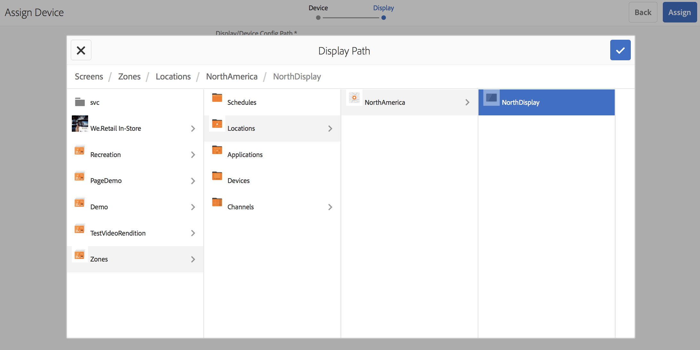

# Registrazione dispositivo {#device-registration}

La pagina seguente descrive il processo di registrazione del dispositivo in un progetto AEM Screens.

## Registrazione di un dispositivo {#registering-a-device}

Il processo di registrazione del dispositivo viene eseguito su 2 macchine separate:

* Il dispositivo da registrare, ad esempio il display del segnale
* Server AEM utilizzato per registrare il dispositivo

>[!NOTE]
>
>Dopo aver scaricato l&#39;ultimo Windows Player (*.exe*) dalla pagina [AEM 6.4 Player Downloads](https://download.macromedia.com/screens/), segui i passaggi sul lettore per completare l&#39;installazione ad-hoc:
>
>1. Premi a lungo nell’angolo in alto a sinistra per aprire il pannello di amministrazione.
>1. Passa a **Configurazione** dal menu di azione a sinistra e inserisci l&#39;indirizzo della posizione dell&#39;istanza AEM in **Server**, quindi fai clic su **Salva**.
>1. Fai clic sul collegamento **Registrazione** dal menu di azione a sinistra e sui passaggi seguenti per completare il processo di registrazione del dispositivo.

>


1. Sul tuo dispositivo, avvia AEM Screens Player. Viene visualizzata l’interfaccia utente di registrazione.

   

1. In AEM, accedi alla cartella **Dispositivi** del progetto.

   >[!NOTE]
   >
   >Per ulteriori informazioni sulla creazione di un nuovo progetto per Screens nel dashboard di AEM, consulta [Creare e gestire progetti Screens](creating-a-screens-project.md).

1. Tocca o fai clic sul pulsante **Gestione dispositivi** nella barra delle azioni.

   

1. Tocca o fai clic sul pulsante **Registrazione dispositivo** in alto a destra.

   

1. Seleziona il dispositivo richiesto (come al passaggio 1) e tocca o fai clic su **Registra dispositivo**.

   

1. In AEM, attendi che il dispositivo invii il suo codice di registrazione.

   

1. Nel tuo dispositivo, controlla il **Codice di registrazione**.

   

1. Se il **Codice di registrazione** è lo stesso su entrambi i computer, toccare/fare clic sul pulsante **Convalida** in AEM, come mostrato nel passaggio (6).
1. Imposta il nome desiderato per il dispositivo e fai clic su **Registra**.

   

1. Tocca o fai clic su **Fine** per completare il processo di registrazione.

   

   >[!NOTE]
   >
   >Il **Registra nuovo** consente di registrare un nuovo dispositivo.
   >
   >Il **Assegna visualizzazione** consente di aggiungere direttamente il dispositivo a una visualizzazione.

   Se si fa clic su **Fine**, sarà necessario assegnare il dispositivo a una visualizzazione.

   

   >[!NOTE]
   >
   >Per ulteriori informazioni sulla creazione e la gestione di una visualizzazione per il progetto Screens, consulta [Creazione e gestione di visualizzazioni](managing-displays.md).

### Assegnazione del dispositivo a una visualizzazione {#assigning-device-to-a-display}

Se non hai assegnato il dispositivo a una visualizzazione, segui i passaggi seguenti per assegnare il dispositivo a una visualizzazione nel progetto AEM Screens:

1. Seleziona il dispositivo e fai clic su **Assegna dispositivo** nella barra delle azioni.

   

1. Seleziona il percorso della visualizzazione in **Percorso di configurazione visualizzazione/dispositivo**.

   

1. Fai clic su **Assegna** quando selezioni il percorso.

   

1. Fare clic su **Fine** una volta che il dispositivo è stato assegnato correttamente, come illustrato nella figura riportata di seguito.

   

   Inoltre, è possibile visualizzare il dashboard di visualizzazione facendo clic su **Fine**.

   

## Ricerca di un dispositivo da Gestione dispositivi {#search-device}

Una volta registrati i dispositivi sul lettore, puoi visualizzarli dall&#39;interfaccia utente di Gestione dispositivi.

1. Passa all’interfaccia utente di Gestione dispositivi dal progetto AEM Screens, ad esempio **DemoScreens** —> **Dispositivi**.

1. Seleziona la cartella **Dispositivi** e fai clic su **Gestione dispositivi** nella barra delle azioni.

   

1. Viene visualizzato l’elenco dei dispositivi registrati.

1. Se disponi di un lungo elenco di dispositivi registrati, ora puoi eseguire la ricerca utilizzando l’icona di ricerca nella barra delle azioni

   

   Oppure,

   Fai clic su `/` (barra) per richiamare la funzionalità di ricerca.

   


### Limitazioni della funzionalità di ricerca {#limitations}

* L&#39;utente sarà in grado di cercare qualsiasi parola esistente in *ID dispositivo* o *Nome dispositivo*.

   >[!NOTE]
   >È consigliabile creare i nomi dei dispositivi in più parole, ad esempio *Boston Store Lobby* anziché in un singolo *BostonStoreLobby*.

* Se crei nomi dei dispositivi come *Boston Store Lobby*, ti consente di cercare qualsiasi parola *boston*, *store* o *lobby* ma se il nome del dispositivo è indicato come *BostonStoreLobby* ricerca *boston* non mostrerà i risultati.

* La ricerca è supportata da caratteri jolly `*`. Nel caso in cui si desideri trovare tutti i dispositivi con nomi che iniziano con *boston*, è possibile utilizzare *boston**.

* Se il nome del dispositivo è *BostonStoreLobby* e la ricerca di *boston* non restituirà il risultato, invece di utilizzare *boston** nei criteri di ricerca restituirà il risultato.

## Limitazioni della registrazione del dispositivo {#limitations-on-device-registration}

Le restrizioni relative alla password utente a livello di sistema potrebbero causare un errore nella registrazione del dispositivo. La registrazione del dispositivo utilizza una password generata in modo casuale per creare l’utente del dispositivo.

Se la password è limitata dalla configurazione *AuthorizableActionProvider*, la creazione dell&#39;utente del dispositivo potrebbe non riuscire.

>[!NOTE]
>
>La password casuale generata corrente è composta da 36 caratteri ASCII, che vanno da 33 a 122 (include quasi tutti i caratteri speciali).

```java
25.09.2016 16:54:03.140 *ERROR* [59.100.121.82 [1474844043109] POST /content/screens/svc/registration HTTP/1.1] com.adobe.cq.screens.device.registration.impl.RegistrationServlet Error during device registration
javax.jcr.nodetype.ConstraintViolationException: Password violates password constraint (^(?=.*\d).{7,9}$).
        at org.apache.jackrabbit.oak.spi.security.user.action.PasswordValidationAction.validatePassword(PasswordValidationAction.java:105)
        at org.apache.jackrabbit.oak.spi.security.user.action.PasswordValidationAction.onPasswordChange(PasswordValidationAction.java:76)
        at org.apache.jackrabbit.oak.security.user.UserManagerImpl.onPasswordChange(UserManagerImpl.java:308)
```

### Risorse aggiuntive {#additional-resources}

Per informazioni su AEM Screens Player, consulta [AEM Screens Player](working-with-screens-player.md).
