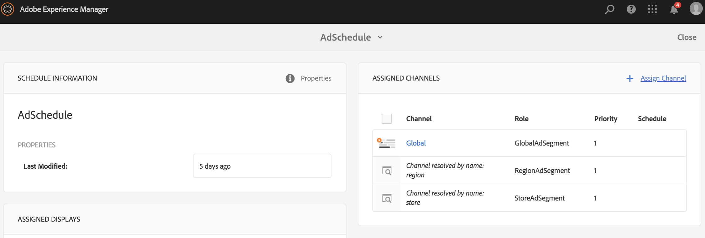
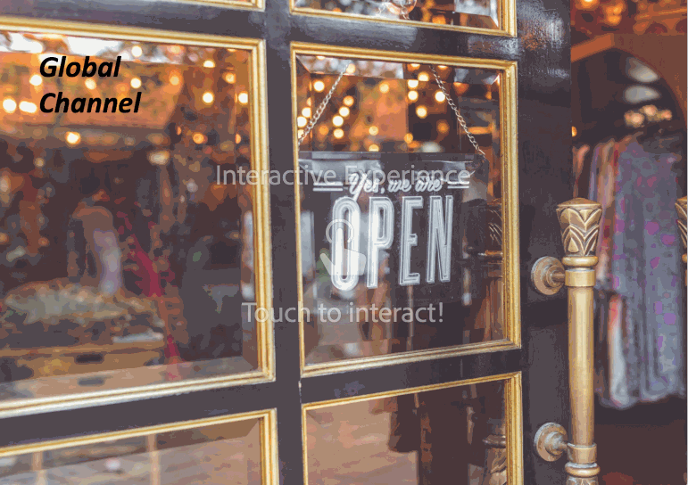
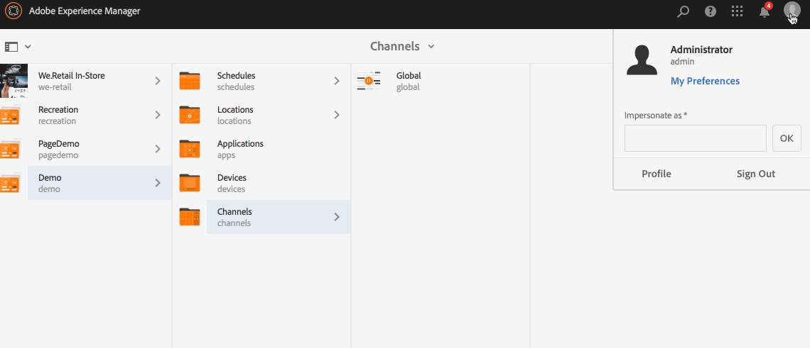

# Uso della Sequenza dinamica incorporata {#using-dynamic-embedded-sequence}

L’utilizzo delle sequenze incorporate dinamiche illustra i seguenti argomenti:

* **Panoramica**
* **Utilizzo dell’esperienza incorporata dinamica in AEM Screens**
* **Visualizzazione dei risultati**
* **Limitazione degli utenti e modifica delle ACL**

## Panoramica {#overview}

***Le*** Sequenze incorporate dinamiche vengono create per progetti di grandi dimensioni che seguono la gerarchia padre figlio, dove viene fatto riferimento all&#39;interno di una cartella di posizione e non di una cartella di canale. Consente all&#39;utente di incorporare una sequenza all&#39;interno di un canale da ***Ruolo canale***. Consente all&#39;utente di definire segnaposto specifici per posizione per uffici diversi utilizzando una sequenza incorporata all&#39;interno di un canale principale.

Quando si assegna un canale a una visualizzazione, è possibile specificare il percorso della visualizzazione o il ruolo del canale che verrà risolto in un canale effettivo in base al contesto.

Per utilizzare la Sequenza incorporata dinamica, assegni un canale per ***Ruolo canale***. Ruolo canale definisce il contesto della visualizzazione. Il ruolo è mirato da varie azioni ed è indipendente dal canale effettivo che svolge il ruolo. Questa sezione descrive un esempio di utilizzo che definisce i canali secondo il ruolo e il modo in cui puoi sfruttare tali contenuti per un canale globale. È inoltre possibile considerare il ruolo come un identificatore per l&#39;assegnazione o un alias per il canale nel contesto di .

### Vantaggi dell&#39;utilizzo di sequenze incorporate dinamiche {#benefits-of-using-dynamic-embedded-sequences}

Il vantaggio principale del posizionamento di un canale di sequenza all&#39;interno di una posizione invece che nella cartella dei canali è quello di consentire agli autori locali o regionali di modificare i contenuti pertinenti a loro, senza che sia necessario modificare i canali più in alto nella gerarchia.

Il riferimento a un *Canale per ruolo* consente di creare la versione locale di un canale, al fine di risolvere dinamicamente i contenuti specifici per la posizione e di creare un canale globale che sfrutti i contenuti per i canali specifici per la posizione.

>[!NOTE]
>
>**Sequenze incorporate e Sequenze incorporate dinamiche**
>
>Una Sequenza incorporata dinamica è simile a una sequenza incorporata, ma consente all’utente di seguire una gerarchia in cui le modifiche o gli aggiornamenti apportati a un canale vengono propagati a un altro canale collegato. Segue la gerarchia genitore-figlio, ma include anche risorse come immagini e video.
>
>***Le*** Sequenze incorporate dinamiche consentono di visualizzare contenuti specifici per posizione, mentre le  ***Sequenze*** incorporate visualizzano solo una presentazione generale del contenuto. Inoltre, durante la configurazione delle Sequenze incorporate dinamiche, devi configurare il canale utilizzando il ruolo e il nome del canale. Fai riferimento ai passaggi seguenti per l’implementazione pratica.
>
>Per ulteriori informazioni sull&#39;implementazione delle sequenze incorporate, consulta [Sequenze incorporate](embedded-sequences.md) in AEM Screens.

L&#39;esempio seguente fornisce una soluzione concentrandosi sui seguenti termini chiave:

* a ***canale sequenza principale*** per la sequenza globale
* ***componenti*** di sequenza incorporati dinamici per ogni parte della sequenza personalizzabile localmente
* ***singoli*** canali di sequenza nelle rispettive posizioni con un  ** ruolo nel display che corrisponde al  **ruolo *del componente di sequenza incorporata*dinamica.**

>[!NOTE]
>
>Per ulteriori informazioni sull&#39;assegnazione dei canali, consulta **[Assegnazione dei canali](channel-assignment.md)** nella sezione Authoring della documentazione di AEM Screens.

## Uso della Sequenza dinamica incorporata {#using-dynamic-embedded-sequence-2}

La sezione seguente spiega la creazione di una sequenza incorporata dinamica in un canale AEM Screens.

### Prerequisiti {#prerequisites}

Prima di iniziare a implementare questa funzionalità, assicurati di disporre dei seguenti prerequisiti per iniziare a implementare le sequenze dinamiche incorporate:

* Crea un progetto AEM Screens (in questo esempio, **Demo**)

* Crea un canale come **Global** nella cartella **Canali**

* Aggiungi contenuto al tuo canale **Globale** (*Controlla **Resources.zip**per le risorse pertinenti*)

L&#39;immagine seguente mostra il progetto **Demo** con il canale **Globale** nella cartella **Canali**.

### Riferimenti {#resources}

Puoi scaricare le seguenti risorse (immagini e aggiungerle alle risorse) e utilizzarle ulteriormente come contenuti di canale a scopo dimostrativo.

[Ottieni file](assets/resources.zip)

>[!NOTE]
>
>Per ulteriori informazioni su come creare un progetto e come creare un canale per sequenza, consulta le risorse seguenti:
>
>* **[Creazione e gestione di progetti](creating-a-screens-project.md)**
>* **[Gestione di un canale](managing-channels.md)**

>

L’implementazione della Sequenza incorporata dinamica in un progetto AEM Screens prevede tre attività principali:

1. **Impostazione della tassonomia del progetto, compresi canali, posizioni e visualizzazioni**
1. **Creare una pianificazione**
1. **Assegnazione di Schedule a ogni visualizzazione**

Per implementare la funzionalità , effettua le seguenti operazioni:

>[!CAUTION]
>
>Durante l&#39;implementazione delle Sequenze incorporate dinamiche, presta attenzione ai campi **Name** e **Title** durante la creazione di canali sotto ogni posizione. Seguire attentamente le istruzioni sulla nomenclatura.

1. **Crea due cartelle di posizioni.**

   Passa alla cartella **Posizioni** nel progetto AEM Screens e crea due cartelle di posizioni come **Regione A** e **Regione B**.

   >[!NOTE]
   >
   >Durante la creazione della cartella di posizione **Regione A** , accertati di inserire il campo **Titolo** come **Regione A** e di lasciare vuoto il campo **Nome** , in modo che venga automaticamente raccolto il nome **Regione-a**.
   >
   >Analogamente, si verifica per la creazione della cartella di posizione **Regione B**, come illustrato di seguito:

   

   >[!NOTE]
   >Per informazioni su come creare una posizione, consulta **[Creazione e gestione di posizioni](managing-locations.md)**.

1. **Crea due posizioni e un canale sotto ogni cartella di posizione.**

   1. Passa a **Demo** —> **Posizioni** —> **Regione A**.
   1. Seleziona **Regione A** e fai clic su **+ Crea** dalla barra delle azioni.
   1. Seleziona **Posizione** dalla procedura guidata con **Titolo** come **Memorizza 1**. Allo stesso modo, crea un&#39;altra posizione dalla procedura guidata denominata **Memorizza 2** con **Titolo** come **Archivia 2**. Puoi lasciare vuoto il campo **Nome** durante la creazione di **Store 1** e **Store 2**.
   1. Ripetere il passaggio (b) e ora selezionare **Canale sequenza** dalla procedura guidata. Immetti il **Titolo** come **Regione A** e **Nome** come **regione** per questo canale.

   >[!CAUTION]
   >
   >Assicurati che durante la creazione del canale **Regione A**, immetti il **Titolo** come **Regione A** e il **Nome** come **Regione**.

   

   Allo stesso modo, crea due posizioni sotto **Regione B** con titolo **Store 3** e **Store 4**. Inoltre, crea un **Canale per sequenza** con **Titolo** come **Regione B** e **Nome** come **regione**.

   >[!CAUTION]
   >
   >Assicurati di utilizzare lo stesso nome per i canali creati nella **Regione A** e nella **Regione B** come **regione**.

   

1. **Crea visualizzazione e canale sotto ogni posizione.**

   1. Passa a **Demo** —> **Posizioni** —> **Regione A** —> **Archivia 1**.
   1. Seleziona **Archivia 1** e fai clic su **+ Crea** dalla barra delle azioni.
   1. Seleziona **Display** dalla procedura guidata e crea **Store1Display.**
   1. Ripetere il passaggio (b) e questa volta selezionare **Canale sequenza** dalla procedura guidata. Inserisci il **Titolo** come **Store1Channel** e il **Nome** come **store**.

   >[!CAUTION]
   >
   >È importante quando crei un canale per sequenza, il **Titolo** del canale può essere come requisito, ma il **Nome** deve essere lo stesso in tutti i canali locali.
   >In questo esempio, i canali sotto **Regione A** e **Regione B** condividono lo stesso **Nome** come **regione** e i canali sotto **Store 1**, **Store 2**, **Memorizzare 3** e **Store 4** condividere lo stesso **Nome** di **store**.

   

   Allo stesso modo, crea una visualizzazione come **Store2Display** e un canale **Store2Channel** sotto **Store 2** (con il nome **store**).

   >[!NOTE]
   >Assicurati di utilizzare lo stesso nome per i canali creati in **Store 1** e **Store 2** come **store**.

   

   Segui i passaggi precedenti per creare un canale e visualizzarlo in **Store 3** e **Store 4** in **Regione B**. Di nuovo, assicurati di utilizzare lo stesso **Nome** come **store** durante la creazione del canale **Store3Channel** e **Store4Channel** rispettivamente.

   L&#39;immagine seguente mostra la visualizzazione e il canale in **Store 3**.

   

   L&#39;immagine seguente mostra la visualizzazione e il canale in **Store 4**.

   

1. **Aggiungi contenuto ai canali nelle rispettive posizioni.**

   Passa alla **Demo** -> **Posizioni** -> **Regione A** -> **Regione A** e fai clic su **Modifica** dalla barra delle azioni. Trascina e rilascia le risorse da aggiungere al canale.

   >[!NOTE]
   >Puoi usare il file ***Resources.zip*** dalla sezione **Risorse** di cui sopra per utilizzare le immagini come risorse per il contenuto del canale.

   

   Allo stesso modo, passa alla **Demo** -> **Posizioni** -> **Regione B** -> **Regione B** e fai clic su **Modifica** dalla barra delle azioni per trascinare e rilasciare le risorse sul tuo canale, come mostrato di seguito:

   

   Segui i passaggi precedenti e le risorse per aggiungere contenuti ai seguenti canali:

   * **Store1 Channel**
   * **Store2Channel**
   * **Store3Channel**
   * **Store4Channel**

1. **Creare una pianificazione**

   Passa alla cartella **Pianificazioni** del progetto AEM Screens e fai clic su **Crea** nella barra delle azioni per creare una nuova pianificazione.

   L&#39;immagine seguente mostra l&#39;elemento **AdSchedule** creato nel progetto **Demo**.

   

1. **Assegnare canali a una pianificazione**

   1. Passa a **Demo** —> **Pianificazioni** —> **AdSchedule** e fai clic su **Dashboard** dalla barra delle azioni.
   1. Fai clic su **+ Assegna canale** dal pannello **CANALI ASSEGNATI** per aprire la finestra di dialogo **Assegnazione canale**.
   1. Seleziona **Canale di riferimento**.. per percorso.
   1. Seleziona il **Percorso del canale** come **Demo** —> ***Canali*** —> ***Globale***.
   1. Inserisci il **Ruolo canale** come **GlobalAdSegment**.
   1. Seleziona **Eventi supportati** come **Caricamento iniziale**, **Schermo inattivo** e **Interazione utente**.
   1. Fai clic su **Salva**.

   **Assegna canale per ruolo per regione:**

   1. Fai clic su **+ Assegna canale** dal pannello **CANALI ASSEGNATI** per aprire la finestra di dialogo **Assegnazione canale**.
   1. Seleziona **Canale di riferimento**. per nome.
   1. Inserisci il **Nome canale** come **regione***.
   1. Inserisci il **Ruolo canale** come **RegionAdSegment**.
   1. Fai clic su **Salva**.

   **Assegna canale per ruolo per archivio:**

   1. Fai clic su **+ Assegna canale** dal pannello **CANALI ASSEGNATI** per aprire la finestra di dialogo **Assegnazione canale**.
   1. Seleziona **Canale di riferimento**. per nome.
   1. Inserisci il **Nome canale** come **store**.
   1. Inserisci il **Ruolo canale** come **StoreAdSegment**.
   1. Fai clic su **Salva**.

   L’immagine seguente mostra i canali assegnati per percorso e ruolo.

   

1. **Configurazione della sequenza incorporata dinamica sul canale globale.**

   Passa al **Canale globale** creato inizialmente nel progetto **Demo** .

   Fai clic su **Modifica** dall&#39;azione per aprire l&#39;editor.

   

   Trascina due componenti **Sequenza incorporata dinamica** nell’editor canali.

   Apri le proprietà di uno dei componenti e immetti il **Ruolo assegnazione canale** come **RegionAdSegment**.

   Allo stesso modo, seleziona l’altro componente e apri le proprietà per accedere al **Ruolo assegnazione canale** come **StoreAdSegment**.

   

1. **Assegnazione della pianificazione a ogni visualizzazione**

   1. Passa a ogni visualizzazione, ad esempio **Demo** —> **Posizioni** —> **Regione A** —>**Archivia 1** —>**Store1Display**.
   1. Fai clic su **Dashboard** dall&#39;azione per aprire il dashboard di visualizzazione.
   1. Fare clic su **..** dal pannello **CANALI ASSEGNATI E PIANIFICAZIONI**, quindi fai clic su **+Assegna pianificazione**.
   1. Seleziona il percorso della pianificazione (ad esempio, qui, **Demo** —> **Pianificazioni** —>**AdSchedule**).
   1. Fai clic su **Salva**.

## Visualizzazione dei risultati {#viewing-the-results}

Una volta completata la configurazione dei canali e la visualizzazione, avvia il lettore AEM Screens per visualizzare il contenuto.

>[!NOTE]
>
>Per informazioni su AEM Screen Player, consulta le seguenti risorse:
>
>* [Download del lettore AEM Screens](https://download.macromedia.com/screens/)
>* [Utilizzo di AEM Screens Player](working-with-screens-player.md)

L&#39;output seguente conferma il contenuto del canale in AEM Screens Player, a seconda del percorso di visualizzazione.

**Scenario 1**:

Se assegni il percorso di visualizzazione come **Demo** —> **Posizioni** —> **Regione A** —> **Store 1** —> **Store1Display**, sul lettore AEM Screens verrà visualizzato il seguente contenuto.

**Scenario 1**:

Se assegni il percorso di visualizzazione come **Demo** —> **Posizioni** —> **Regione B** —> **Store 3** —> **Store3Display**, sul lettore AEM Screens verrà visualizzato il seguente contenuto.

## Limitazione degli utenti e modifica delle ACL {#restricting-users-and-modifying-the-acls}

È possibile creare autori globali, regionali o locali per modificare i contenuti pertinenti, ma con restrizioni per la modifica dei canali verso l’alto nella gerarchia.

È necessario modificare le ACL per limitare l&#39;accesso degli utenti al contenuto in base alla loro posizione.

### Esempio di caso d&#39;uso {#example-use-case}

L’esempio seguente consente di creare tre utenti per il progetto Demo di cui sopra.

I privilegi sono assegnati a ciascun gruppo come segue:

**Gruppi**:

* **Autore** globale: È costituito da utenti che hanno accesso a tutte le posizioni e i canali in  **** Demoproject e dispongono di tutte le autorizzazioni di lettura, scrittura e modifica.

* **Autore** regionale: È costituito da utenti che dispongono di autorizzazioni di lettura, scrittura e modifica per  **Area** geografica e  **Area B**.

* **Autore** store: È costituito da utenti che dispongono di autorizzazioni di lettura, scrittura e modifica solo per  **Store 1**,  **Store 2**,  **Store 3** e  **Store 4**.

#### Passaggi per creare gruppi di utenti, utenti e impostare ACL {#steps-for-creating-user-groups-users-and-setting-up-acls}

>[!NOTE]
>
>Per informazioni dettagliate su come separare i progetti utilizzando ACL in modo che ogni singolo utente o team gestisca il proprio progetto, consulta **Impostazione delle ACL**.

Segui i passaggi seguenti per creare gruppi, utenti e modificare le ACL in base alle autorizzazioni:

1. **Creare gruppi**

   1. Passa a **Adobe Experience Manager**.
   1. Fare clic su **Strumenti** —> **Sicurezza** —> **Gruppi**.
   1. Fai clic su **Crea gruppo** e immetti **Autore globale** in **ID**.
   1. Fai clic su **Salva e chiudi**.

   Allo stesso modo, crea altri due gruppi come **Region-Author** e **Store-Author**.

   

1. **Creare utenti e aggiungere utenti ai gruppi**

   1. Passa a **Adobe Experience Manager**.
   1. Fare clic su **Strumenti** —> **Sicurezza** —> **Utenti**.
   1. Fai clic su **Crea utente** e immetti **Global-User** in **ID**.
   1. Immetti **Password** e conferma la password per questo utente.
   1. Fai clic sulla scheda **Gruppi** e immetti il nome del gruppo in **Seleziona gruppo**, ad esempio, immetti **Global-Author** per aggiungere **Global-User** a quel gruppo specifico.
   1. Fai clic su **Salva e chiudi**.

   Allo stesso modo, crea altri due utenti come **Region-User** e **Store-User** e aggiungili rispettivamente a **Region-Author** e **Store-Author**.

   >[!NOTE]
   >È consigliabile aggiungere utenti in un gruppo e quindi assegnare autorizzazioni a ciascun gruppo specifico di utenti.

   

1. **Aggiungi tutti i gruppi ai collaboratori**

   1. Passa a **Adobe Experience Manager**.
   1. Fare clic su **Strumenti** —> **Sicurezza** —> **Gruppi**.
   1. Seleziona **Collaboratori** dall’elenco e seleziona la scheda **Membri** .
   1. Seleziona i collaboratori **Gruppo**, ad esempio **Autore globale**, **Autore regione,** e **Autore store**.
   1. Fai clic su **Salva e chiudi**.

1. **Accesso alle autorizzazioni per ogni gruppo**

   1. Passa a *Amministratore utente* e utilizza questa interfaccia utente per modificare le autorizzazioni per gruppi diversi.
   1. Cerca **Autore globale** e fai clic sulla scheda **Autorizzazioni** , come illustrato nella figura seguente.
   1. Allo stesso modo, puoi accedere alle autorizzazioni per **Region-Author** e **Store-Author**.

   

1. **Modifica delle autorizzazioni per ogni gruppo**

   **Per Global-Author:**

   1. Passa alla scheda **Autorizzazioni**
   1. Passa a ***/content/screens/demo*** e controlla tutte le autorizzazioni
   1. Passa a ***/content/screens/demo/locations*** e controlla tutte le autorizzazioni
   1. Passa a ***/content/screens/demo/locations/region-a*** e controlla tutte le autorizzazioni. Allo stesso modo, controlla le autorizzazioni per **region-b**.

   Fai riferimento alla figura seguente per comprendere i passaggi:
   

   L&#39;immagine seguente mostra che ora l&#39; **Utente globale** ha accesso al **Canale globale** e sia alla **Regione A** che alla **Regione B** con tutti e quattro i negozi, ovvero **Store 1**, **Store 2**, **Store 3** e **Store 4**.

   

   **Per l&#39;autore della regione:**

   1. Passa alla scheda **Autorizzazioni** .
   1. Passa a ***/content/screens/demo*** e controlla solo le autorizzazioni **Read** .
   1. Passa a ***/content/screens/demo/locations*** e controlla solo le autorizzazioni **Read** .
   1. Passa a ***/content/screens/demo/channels*** e deseleziona le autorizzazioni per il canale **Global** .
   1. Passa a ***/content/screens/demo/locations***/***region-a*** e controlla tutte le autorizzazioni. Allo stesso modo, controlla le autorizzazioni per **region-b**.

   Fai riferimento alla figura seguente per comprendere i passaggi:

   

   L&#39;immagine seguente mostra che ora l&#39;utente della Regione ha accesso sia alla **Regione A** che alla **Regione B** con tutti e quattro i negozi, ovvero **Store 1**, **Store 2**, **Store 3** e **Store 4&lt;a1 1/> ma non accede al canale** Global **.**

   

   **Per Store-Author:**

   1. Passa alla scheda **Autorizzazioni** .
   1. Passa a ***/content/screens/demo*** e controlla solo le autorizzazioni **Read** .
   1. Passa a ***/content/screens/demo/locations*** e controlla solo le autorizzazioni **Read** .
   1. Passa a ***/content/screens/demo/channels*** e deseleziona le autorizzazioni per il canale **Global** .
   1. Passa a ***/content/screens/demo/locations/region-a*** e controlla solo le autorizzazioni **Read** . Allo stesso modo, controlla solo le autorizzazioni **Read** per **region-b**.
   1. Passa a ***/content/screens/demo/locations***/***region-a /store-1*** e controlla tutte le autorizzazioni. Allo stesso modo, controlla le autorizzazioni per **store-2, store-3,** e **store-4**.

   Fai riferimento alla figura seguente per comprendere i passaggi:

   

   L&#39;immagine seguente mostra che ora il **Store-User** ha accesso solo ai quattro store, ovvero **Store 1**, **Store 2**, **Store 3** e **Store 4** ma non dispone delle autorizzazioni per accedere al **Global&lt;a 11/> o i canali della regione (** Regione A **e** Regione B **).**

   

>[!NOTE]
>
>Per informazioni dettagliate sull&#39;impostazione delle autorizzazioni, fare riferimento a [Impostazione delle ACL](setting-up-acls.md).

