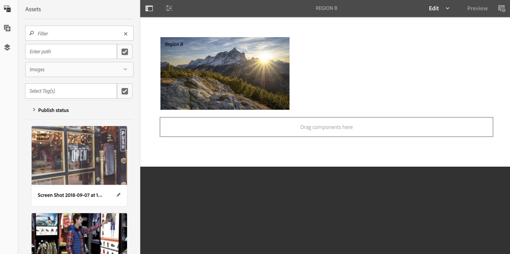

# Utilizzo della sequenza dinamica incorporata {#using-dynamic-embedded-sequence}

L’utilizzo delle sequenze dinamiche incorporate tratta i seguenti argomenti:

* **Panoramica**
* **Utilizzo dell’esperienza dinamica incorporata in AEM Screens**
* **Visualizzazione dei risultati**
* **Limitazione degli utenti e modifica degli ACL**

## Panoramica {#overview}

***Sequenze incorporate dinamiche*** vengono create per progetti di grandi dimensioni che seguono una gerarchia padre-figlio, in cui al figlio viene fatto riferimento all’interno di una cartella posizione e non di una cartella canali. Consente all&#39;utente di incorporare una sequenza all&#39;interno di un canale ***Ruolo canale***. Consente all&#39;utente di definire segnaposto specifici per la posizione per uffici diversi utilizzando una sequenza incorporata all&#39;interno di un canale principale.

Quando si assegna un canale a una visualizzazione, è possibile specificare il percorso della visualizzazione o il ruolo del canale che si risolve in un canale effettivo in base al contesto.

Per utilizzare la sequenza dinamica incorporata, è necessario assegnare un canale ***Ruolo canale***. Ruolo canale definisce il contesto della visualizzazione. Il ruolo è oggetto di varie azioni ed è indipendente dal canale effettivo che lo svolge. Questa sezione descrive un caso d’uso che definisce i canali in base al ruolo e come applicarli a un canale globale. Puoi anche considerare il ruolo come un identificatore per l’assegnazione o un alias per il canale nel contesto di.

### Vantaggi dell’utilizzo di sequenze dinamiche incorporate {#benefits-of-using-dynamic-embedded-sequences}

Il vantaggio principale del posizionamento di un canale di sequenza all&#39;interno di una posizione invece che nella cartella dei canali è quello di consentire agli autori locali o regionali di modificare i contenuti di loro interesse. Tutto questo, mentre non è possibile modificare i canali nella parte superiore della gerarchia.

Con riferimento a *Canale per ruolo*, consente di creare una versione locale di un canale, per risolvere dinamicamente il contenuto specifico della posizione e consente inoltre di creare un canale globale che utilizza il contenuto per i canali specifici della posizione.

>[!NOTE]
>
>**Sequenze incorporate e sequenze incorporate dinamiche**
>
>Una sequenza incorporata dinamica è simile a una sequenza incorporata, ma consente all’utente di seguire una gerarchia in cui le modifiche o gli aggiornamenti apportati a un canale vengono propagati a un altro in relazione. Segue la gerarchia genitore-figlio, ma include anche risorse come immagini e video.
>
>***Sequenze incorporate dinamiche*** consente di visualizzare contenuto specifico per la posizione, mentre ***Sequenze incorporate*** visualizza solo la presentazione generale del contenuto. Inoltre, durante l’impostazione delle sequenze dinamiche incorporate, configura il canale utilizzando il ruolo e il nome del canale. Per informazioni sull’implementazione pratica, consulta i passaggi seguenti.
>
>Per ulteriori informazioni sull&#39;implementazione di sequenze incorporate, vedere [Sequenze incorporate](embedded-sequences.md) in AEM Screens.

L’esempio seguente fornisce una soluzione concentrandosi sui seguenti termini chiave:

* a ***canale sequenza principale*** per la sequenza globale.
* ***sequenza incorporata dinamica*** componenti per ogni parte della sequenza personalizzabile localmente.
* ***singoli canali di sequenza*** nelle rispettive posizioni con un *ruolo* nella visualizzazione che corrisponde al **del componente sequenza incorporata dinamica *ruolo***.

>[!NOTE]
>
>Per ulteriori informazioni sull&#39;assegnazione dei canali, consulta **[Assegnazione canale](channel-assignment.md)** nella sezione Authoring della documentazione di AEM Screens.

## Utilizzo della sequenza dinamica incorporata {#using-dynamic-embedded-sequence-2}

La sezione seguente spiega la creazione di una sequenza dinamica incorporata in un canale AEM Screens.

### Prerequisiti {#prerequisites}

Prima di iniziare a implementare questa funzionalità, accertati di disporre dei seguenti prerequisiti per iniziare a implementare sequenze integrate dinamiche:

* Crea un progetto AEM Screens (in questo esempio, **Demo**).
* Crea un canale come **Globale** in **Canali** cartella.
* Aggiungi contenuto al tuo **Globale** Canale (*Verifica **Resources.zip**per le attività rilevanti*).

L&#39;immagine seguente mostra **Demo** progetto con **Globale** channel in **Canali** cartella.

### Riferimenti {#resources}

Puoi scaricare le seguenti risorse (immagini e aggiungerle alle risorse) e utilizzarle ulteriormente come contenuto di canale a scopo dimostrativo.

[Ottieni file](assets/resources.zip)

>[!NOTE]
>
>Per ulteriori informazioni su come creare un progetto e un canale di sequenza, consulta le risorse seguenti:
>
>* **[Creazione e gestione di progetti](creating-a-screens-project.md)**
>* **[Gestione di un canale](managing-channels.md)**
>

L’implementazione di Dynamic Embedded Sequence in un progetto AEM Screens comporta tre attività principali:

1. **Impostazione della tassonomia del progetto, inclusi canali, posizioni e visualizzazioni**
1. **Creazione di una pianificazione**
1. **Assegnazione della pianificazione a ogni visualizzazione**

Per implementare la funzionalità, segui i passaggi seguenti:

>[!CAUTION]
>
>Quando implementi sequenze dinamiche incorporate, presta attenzione alla **Nome** e **Titolo** durante la creazione di canali sotto ogni posizione. Seguire attentamente le istruzioni relative alla nomenclatura.

1. **Crea una cartella di due posizioni.**

   Accedi al tuo **Posizioni** nel progetto AEM Screens e creare due cartelle di posizioni come **Regione A** e **Regione B**.

   >[!NOTE]
   >
   >Durante la creazione di **Regione A** cartella di percorso, assicurati di immettere il **Titolo** as **Regione A** e puoi lasciare il **Nome** campo vuoto, quindi automaticamente **region-a** il nome viene selezionato.
   >
   >Lo stesso vale per la creazione di una cartella di percorso **Regione B**, come illustrato di seguito:

   

   >[!NOTE]
   >Per informazioni su come creare una posizione, consulta **[Creazione e gestione delle posizioni](managing-locations.md)**.

1. **Crea due posizioni e un canale sotto ogni cartella di posizione.**

   1. Accedi a **Demo** > **Posizioni** > **Regione A**.
   1. Clic **Regione A** e fai clic su **+ Crea** dalla barra delle azioni.
   1. Clic **Posizione** dalla procedura guidata con **Titolo** as **Store 1**. Analogamente, creare un&#39;altra posizione dalla procedura guidata con il titolo **Store 2** con **Titolo** as **Store 2**. È possibile lasciare **Nome** campo vuoto durante la creazione **Store 1** e **Store 2**.
   1. Ripeti il passaggio b) e fai clic su **Canale sequenza** dalla procedura guidata. Inserisci il **Titolo** as **Regione A** e **Nome** as **area geografica** per questo canale.

   >[!CAUTION]
   >
   >Assicurati che durante la creazione del canale **Regione A**, immetti il **Titolo** as **Regione A** e **Nome** as **area geografica**.

   

   Allo stesso modo, crea due posizioni in **Regione B** con titolo **Store 3** e **Store 4**. Inoltre, crea un’ **Canale sequenza** con **Titolo** as **Regione B** e **Nome** as **area geografica**.

   >[!CAUTION]
   >
   >Assicurati di poter utilizzare lo stesso nome per i canali creati in **Regione A** e **Regione B** as **area geografica**.

   

1. **Crea display e canale sotto ogni posizione.**

   1. Accedi a **Demo** > **Posizioni** > **Regione A** > **Store 1**.
   1. Clic **Store 1** e fai clic su **+ Crea** dalla barra delle azioni.
   1. Clic **Visualizzazione** dalla procedura guidata e crea **`Store1Display`**.
   1. Ripetere il passaggio b) e fare clic su **Canale sequenza** dalla procedura guidata. Inserisci il **Titolo** as **`Store1Channel`** e **Nome** as **archiviare**.

   >[!CAUTION]
   >
   >È importante quando si crea un canale di sequenza, il **Titolo** del canale può essere come requisito, ma il **Nome** deve essere lo stesso in tutti i canali locali.
   >In questo esempio, i canali in **Regione A** e **Regione B** condividere **Nome** as **area geografica** e canali in **`Store 1`**, **`Store 2`**, **`Store 3`**, e **`Store 4`** condividere **Nome** as **archiviare**.

   

   Analogamente, create una visualizzazione con **`Store2Display`** e un canale **`Store2Channel`** in **`Store `2** (con nome come **archiviare**).

   >[!NOTE]
   >Assicurati di poter utilizzare lo stesso nome per i canali creati in **`Store 1`** e **`Store 2`** as **archiviare**.

   

   Segui i passaggi precedenti per creare un canale e visualizzarlo in **`Store 3`** e **`Store 4`** in **Regione B**. Di nuovo, assicurati di usare lo stesso **Nome** as **archiviare** durante la creazione del canale **`Store3Channel`** e **`Store4Channel`** rispettivamente.

   L’immagine seguente mostra la visualizzazione e il canale in **`Store 3`**.

   

   L’immagine seguente mostra la visualizzazione e il canale in **`Store 4`**.

   

1. **Aggiungere contenuto ai canali nelle rispettive posizioni.**

   Accedi a **Demo** > **Posizioni** > **Regione A** > **Regione A** e fai clic su **Modifica** dalla barra delle azioni. Trascina e rilascia le risorse da aggiungere al canale.

   >[!NOTE]
   >È possibile utilizzare ***Resources.zip*** file da **Risorse** per utilizzare le immagini come risorse per il contenuto del canale.

   

   Allo stesso modo, passa a **Demo** > **Posizioni** > **Regione B** > **Regione B** e fai clic su **Modifica** dalla barra delle azioni per trascinare e rilasciare le risorse sul canale, come illustrato di seguito:

   

   Segui i passaggi precedenti e le risorse per aggiungere contenuti ai seguenti canali:

   * **`Store1Channel`**
   * **`Store2Channel`**
   * **`Store3Channel`**
   * **`Store4Channel`**

1. **Creare una pianificazione**

   Naviga e fai clic su **Schedules** nel progetto AEM Screens. Quindi fai clic su **Crea** dalla barra delle azioni.

   L&#39;immagine seguente mostra **AdSchedule** creato in **Demo** progetto.

   

1. **Assegna canali a una pianificazione**

   1. Accedi a **Demo** > **Schedules** > **AdSchedule** e fai clic su **Dashboard** dalla barra delle azioni.
   1. Clic **+ Assegna canale** da **CANALI ASSEGNATI** per aprire il **Assegnazione canale** .
   1. Clic **Canale di riferimento** in base al percorso.
   1. Fai clic su **Percorso canale** as **Demo** > ***Canali*** > ***Globale***.
   1. Inserisci il **Ruolo canale** as **GlobalAdSegment**.
   1. Fai clic su **Eventi supportati** as **Caricamento iniziale**, **Schermata di inattività**, e **Interazione utente**.
   1. Fai clic su **Salva**.

   **Assegna canale per ruolo per regione:**

   1. Clic **+ Assegna canale** da **CANALI ASSEGNATI** pannello.
   1. Nella finestra di dialogo Assegnazione canale, fai clic su **Canale di riferimento** per nome.
   1. Inserisci il **Nome canale** as **area geografica***.
   1. Inserisci il **Ruolo canale** as **RegionAdSegment**.
   1. Fai clic su **Salva**.

   **Assegna canale per ruolo per store:**

   1. Clic **+ Assegna canale** da **CANALI ASSEGNATI** pannello.
   1. Nella finestra di dialogo Assegnazione canale, fai clic su **Canale di riferimento** per nome.
   1. Inserisci il **Nome canale** as **archiviare**.
   1. Inserisci il **Ruolo canale** as **StoreAdSegment**.
   1. Fai clic su **Salva**.

   L’immagine seguente mostra i canali assegnati in base al percorso e al ruolo.

   

1. **Configurazione della sequenza dinamica incorporata nel canale globale.**

   Accedi a **Globale** Canale creato inizialmente in **Demo** progetto.

   Clic **Modifica** dalla barra delle azioni.

   

   Nell’editor, trascina due **Sequenza incorporata dinamica** componenti nell’editor canali.

   Apri le proprietà di uno dei componenti e immetti **Ruolo assegnazione canale** as **RegionAdSegment**.

   Analogamente, fate clic sugli altri componenti e aprite le proprietà per immettere **Ruolo assegnazione canale** as **StoreAdSegment**.

   

1. **Assegnazione della pianificazione a ogni visualizzazione**

   1. Passa a ogni visualizzazione, ad esempio **Demo** > **Posizioni** > **Regione A** >**Store 1** >**`Store1Display`**.
   1. Clic **Dashboard** dalla barra delle azioni.
   1. Nel dashboard, fai clic su **...** dal **CANALI E PIANIFICAZIONI ASSEGNATI** e quindi fare clic su **+Assegna pianificazione**.
   1. Fai clic sul percorso della Pianificazione (ad esempio, qui, **Demo** > **Schedules** > **AdSchedule**).
   1. Fai clic su **Salva**.

## Visualizzazione dei risultati {#viewing-the-results}

Una volta completata la configurazione dei canali e della visualizzazione, avvia il lettore AEM Screens per visualizzare il contenuto.

>[!NOTE]
>
>Per informazioni su AEM Screens Player, consulta le risorse seguenti:
>
>* [Scarica il lettore AEM Screens](https://download.macromedia.com/screens/)
>* [Utilizzo di AEM Screens Player](working-with-screens-player.md)

L’output seguente conferma il contenuto del canale in AEM Screens player, a seconda del percorso di visualizzazione.

**Scenario 1**:

Se si assegna il percorso di visualizzazione come **Demo** > **Posizioni** > **Regione A** > **Store 1** > **`Store1Display`**, il seguente contenuto viene visualizzato sul lettore AEM Screens.

**Scenario 1**:

Se si assegna il percorso di visualizzazione come **Demo** > **Posizioni** > **Regione B** > **Store 3** > **`Store3Display`**, il seguente contenuto viene visualizzato sul lettore AEM Screens.

## Limitazione degli utenti e modifica degli ACL {#restricting-users-and-modifying-the-acls}

Puoi creare autori globali, regionali o locali per modificare contenuti di loro interesse mentre è loro impedito di modificare i canali più in alto nella gerarchia.

Modifica gli ACL in modo da poter limitare l’accesso dell’utente al contenuto in base alla sua posizione.

### Caso d’uso di esempio {#example-use-case}

L’esempio seguente consente di creare tre utenti per il progetto demo indicato sopra.

I privilegi sono assegnati a ciascun gruppo come segue:

**Gruppi**:

* **Global-Author**: è costituito da utenti che hanno accesso a tutte le posizioni e i canali in **Demo** e disporre di tutte le autorizzazioni di lettura, scrittura e modifica.

* **Region-Author**: è costituito da utenti che dispongono di autorizzazioni di lettura, scrittura e modifica per **Regione A** e **Regione B**.

* **Store-Author**: è costituito da utenti che dispongono di autorizzazioni di lettura, scrittura e modifica solo per **Store 1**, **Store 2**, **Store 3**, e **Store 4**.

#### Passaggi per creare gruppi di utenti, utenti e configurare ACL {#steps-for-creating-user-groups-users-and-setting-up-acls}

>[!NOTE]
>
>Per informazioni dettagliate su come separare i progetti utilizzando gli ACL in modo che ogni singolo utente o team gestisca il proprio progetto, consulta **Impostazione di ACL**.

Segui i passaggi seguenti per creare gruppi, utenti e modificare gli ACL in base alle autorizzazioni:

1. **Crea gruppi**

   1. Accedi a **Adobe Experience Manager**.
   1. Clic **Strumenti** > **Sicurezza** > **Gruppi**.
   1. Clic **Crea gruppo** e immetti **Global-Author** in **ID**.
   1. Fai clic su **Salva e chiudi**.

   Allo stesso modo, crea altri due gruppi, ad esempio **Region-Author** e **Store-Author**.

   

1. **Creare utenti e aggiungere utenti ai gruppi**

   1. Accedi a **Adobe Experience Manager**.
   1. Fai clic su **Strumenti** > **Protezione** > **Utenti**.
   1. Clic **Crea utente** e immetti **Utente globale** in **ID**.
   1. Invio **Password** e conferma la password per questo utente.
   1. Fai clic su **Gruppi** e immettere il nome del gruppo in **Fai clic su Gruppo**, ad esempio, immetti **Global-Author** da aggiungere **Utente globale** a tale gruppo specifico.
   1. Fai clic su **Salva e chiudi**.

   Allo stesso modo, crea altri due utenti, ad esempio **Regione-Utente** e **Store-User** e aggiungili a **Region-Author** e **Store-Author** rispettivamente.

   >[!NOTE]
   >È consigliabile aggiungere utenti in un gruppo e quindi assegnare le autorizzazioni a ciascun gruppo di utenti specifico.

   

1. **Aggiungere tutti i gruppi ai collaboratori**

   1. Accedi a **Adobe Experience Manager**.
   1. Clic **Strumenti** > **Sicurezza** > **Gruppi**.
   1. Clic **Collaboratori** dall’elenco e fai clic su **Membri** scheda.
   1. Fai clic su **Gruppo** come **Global-Author**, **Region-Author,** e **Store-Author** ai collaboratori.
   1. Fai clic su **Salva e chiudi**.

1. **Accesso alle autorizzazioni per ogni gruppo**

   1. Accedi a *Useradmin* e utilizza questa interfaccia utente per modificare le autorizzazioni per diversi gruppi.
   1. Cerca **Global-Author** e fai clic su **Autorizzazioni** come illustrato nella figura riportata di seguito.
   1. Allo stesso modo, puoi accedere alle autorizzazioni per **Region-Author** e **Store-Author**.

   

1. **Modifica delle autorizzazioni per ogni gruppo**

   **Per Global-Author:**

   1. Accedi a **Autorizzazioni** scheda
   1. Accedi a ***/content/screens/demo*** e controlla tutte le autorizzazioni
   1. Accedi a ***/content/screens/demo/locations*** e controlla tutte le autorizzazioni
   1. Accedi a ***/content/screens/demo/locations/region-a*** e controlla tutte le autorizzazioni. Analogamente, verifica le autorizzazioni per **`region-b`**.

   Per comprendere i passaggi, vedere la figura riportata di seguito.
   

   Di seguito viene illustrato come **Utente globale** ha accesso al **Canale globale**, ed entrambi **Regione A** e **Regione B** con tutti e quattro i negozi **Store 1**, **Store 2**, **Store 3**, e **Store 4**.

   

   **Per Autore-Regione:**

   1. Accedi a **Autorizzazioni** scheda.
   1. Accedi a ***/content/screens/demo*** e controlla solo **Letto** autorizzazioni.
   1. Accedi a ***/content/screens/demo/locations*** e controlla solo **Letto** autorizzazioni.
   1. Accedi a ***/content/screens/demo/channels*** e deseleziona le autorizzazioni per **Globale** canale.
   1. Accedi a ***/content/screens/demo/locations***/***region-a*** e controlla tutte le autorizzazioni. Analogamente, verifica le autorizzazioni per **`region-b`**.

   Consulta l’immagine seguente per comprendere i passaggi:

   

   Di seguito viene illustrato come l&#39;utente dell&#39;area geografica abbia accesso a entrambi **Regione A** e **Regione B**, con tutti e quattro i negozi, ovvero **Store 1**, **Store 2**, **Store 3**, e **Store 4**, ma non accede al **Globale** Canale.

   

   **Per Store-Author:**

   1. Accedi a **Autorizzazioni** scheda.
   1. Accedi a ***/content/screens/demo*** e controlla solo **Letto** autorizzazioni.
   1. Accedi a ***/content/screens/demo/locations*** e controlla solo **Letto** autorizzazioni.
   1. Accedi a ***/content/screens/demo/channels*** e deseleziona le autorizzazioni per **Globale** canale.
   1. Accedi a ***/content/screens/demo/locations/region-a*** e controlla solo **Letto** autorizzazioni. Analogamente, seleziona solo il **Letto** autorizzazioni per **`region-b`**.
   1. Accedi a ***/content/screens/demo/locations***/***region-a /store-1*** e controlla tutte le autorizzazioni. Analogamente, verifica le autorizzazioni per **store-2, store-3,** e **store-4**.

   Consulta l’immagine seguente per comprendere i passaggi:

   

   Di seguito viene illustrato come **Store-User** ha accesso solo a **Store 1**, **Store 2**, **Store 3**, e **Store 4**, ma non dispone delle autorizzazioni necessarie per accedere al **Globale** o area (**Regione A** e **Regione B**).

   

>[!NOTE]
>
>Per informazioni dettagliate sulla configurazione delle autorizzazioni, consulta [Impostazione di ACL](setting-up-acls.md).
