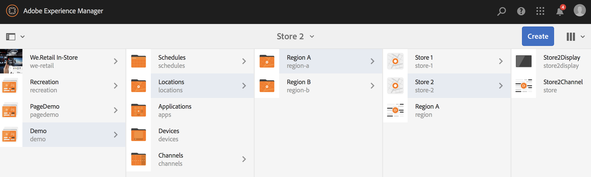
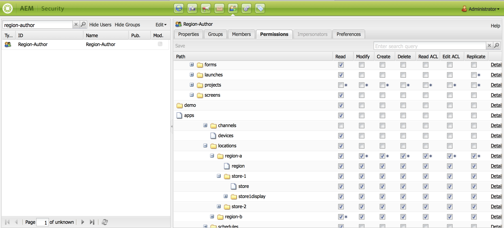

# Uso della Sequenza dinamica incorporata {#using-dynamic-embedded-sequence}

L'utilizzo di sequenze incorporate dinamiche illustra i seguenti argomenti:

* **Panoramica**
* **Utilizzo dell’esperienza integrata dinamica in AEM Screens**
* **Visualizzazione dei risultati**
* **Limitazione degli utenti e modifica degli ACL**

## Panoramica {#overview}

***Le sequenze*** incorporate dinamiche vengono create per progetti di grandi dimensioni che seguono la gerarchia figlio principale, in cui viene fatto riferimento all'elemento secondario in una cartella di posizione e non in una cartella di canale. It allows the user to embed a sequence inside a channel by ***Channel Role***. Consente all'utente di definire segnaposto specifici per la posizione per uffici diversi utilizzando una sequenza incorporata all'interno di un canale principale.

Quando si assegna un canale a uno schermo, è possibile specificare il percorso del display o il ruolo del canale che verrà risolto su un canale effettivo in base al contesto.

Per utilizzare la sequenza incorporata dinamica, potete assegnare un canale per ruolo ****** canale. Ruolo canale definisce il contesto della visualizzazione. Il ruolo è mirato da diverse azioni ed è indipendente dal canale effettivo che svolge il ruolo. Questa sezione descrive un esempio di utilizzo che definisce i canali secondo il ruolo e il modo in cui puoi sfruttare tali contenuti per un canale globale. Potete anche considerare il ruolo come un identificatore per l'assegnazione, o un alias per il canale nel contesto di.

### Vantaggi dell'utilizzo di sequenze incorporate dinamiche {#benefits-of-using-dynamic-embedded-sequences}

Il vantaggio principale di inserire un canale di sequenza all’interno di una posizione invece che nella cartella dei canali è quello di consentire agli autori locali o regionali di modificare i contenuti ad essi pertinenti, limitando al contempo la possibilità di modificare i canali in alto nella gerarchia.

Referencing a *Channel By Role*, allows you to create local version of a channel, in order to dynamically resolve location-specific content and also allows you to create a global channel that leverages the content for the location-specific channels.

>[!NOTE]
>
>**Sequenze incorporate e sequenze incorporate dinamiche**
>
>Una sequenza incorporata dinamica è simile a una sequenza incorporata, ma consente all’utente di seguire una gerarchia in cui le modifiche o gli aggiornamenti effettuati su un canale vengono propagati a un altro in relazione. Segue la gerarchia padre-figlio e include anche risorse come immagini o video.
>
>***Le sequenze*** incorporate dinamiche consentono di visualizzare contenuto specifico per la posizione, mentre le sequenze ****** incorporate visualizzano solo una presentazione generale del contenuto. Inoltre, durante l'impostazione di sequenze incorporate dinamiche, è necessario configurare il canale utilizzando il ruolo e il nome del canale. Fare riferimento ai passaggi indicati di seguito per l'implementazione pratica.
>
>Per ulteriori informazioni sull'implementazione delle sequenze incorporate, consultate Sequenze [incorporate](embedded-sequences.md) in AEM Screens.

L'esempio seguente fornisce una soluzione concentrandosi sui seguenti termini chiave:

* un canale ***di sequenza*** principale per la sequenza globale
* ***componenti di sequenze*** incorporate dinamiche per ciascuna parte della sequenza personalizzabile localmente
* ***singoli canali*** di sequenza nelle rispettive posizioni con un *ruolo* nella visualizzazione che corrisponde al **ruolo *del componente della sequenza incorporata*dinamica.**

>[!NOTE]
>
>To learn more about channel assignment, see **[Channel Assignment](channel-assignment.md)** under Authoring section in AEM Screens documentation.

## Uso della Sequenza dinamica incorporata {#using-dynamic-embedded-sequence-2}

La sezione seguente illustra la creazione di una sequenza incorporata dinamica in un canale AEM Screens.

### Prerequisiti {#prerequisites}

Prima di iniziare ad implementare questa funzionalità, accertatevi di disporre dei seguenti prerequisiti per iniziare a implementare le sequenze incorporate dinamiche:

* Creare un progetto AEM Screens (in questo esempio, **Demo**)

* Crea un canale come **globale** nella cartella **Canali**

* Aggiungete contenuto al canale **globale** (*controllate **Resources.zip**per le risorse* rilevanti)

L'immagine seguente mostra il progetto **Demo** con il canale **globale** nella cartella **Canali** .

### Risorse {#resources}

Potete scaricare le risorse seguenti (immagini e aggiungerle alle risorse) e utilizzarle ulteriormente come contenuti per canali a scopo dimostrativo.

[Ottieni file](assets/resources.zip)

>[!NOTE]
>
>Per ulteriori informazioni su come creare un progetto e come creare un canale di sequenza, consulta le risorse seguenti:
>
>* **[Creazione e gestione di progetti](creating-a-screens-project.md)**
>* **[Gestione di un canale](managing-channels.md)**
>

L’implementazione di sequenze incorporate dinamiche in un progetto AEM Screens implica tre attività principali:

1. **Impostazione della tassonomia del progetto, inclusi canali, posizioni e display**
1. **Creare una pianificazione**
1. **Assegnazione di Schedule a ogni visualizzazione**

Per implementare la funzionalità, effettuate le operazioni seguenti:

>[!CAUTION]
>
>Durante l'implementazione di sequenze incorporate dinamiche, prestate attenzione ai campi **Nome** e **Titolo** durante la creazione di canali in ogni posizione. Seguire attentamente le istruzioni sulla nomenclatura.

1. **Create due cartelle di posizioni.**

   Andate alla cartella **Locations (Posizioni** ) nel progetto AEM Screens e create due cartelle di posizioni come **Regione A** e **Regione B**.

   >[!NOTE]
   >
   >Durante la creazione della cartella di posizione **Regione A** , accertatevi di immettere il **Titolo** come **Regione A** e di lasciare vuoto il campo **Nome** , in modo che venga prelevato automaticamente il nome **regione-a** .
   >
   >Analogamente, è il caso per la creazione della cartella del percorso **Regione B**, come illustrato di seguito:

   

   >[!NOTE]
   >
   >Per informazioni su come creare un percorso, consultate **[Creazione e gestione di posizioni](managing-locations.md)**.

1. **Create due posizioni e un canale sotto ogni cartella di posizione.**

   1. Passare a **Demo** —&gt; **Locations** —&gt; **Region A**.
   1. Selezionate **Regione A** e fate clic su **+ Crea** dalla barra delle azioni.
   1. Selezionate **Posizione** dalla procedura guidata con **Titolo** come **Store 1**. Analogamente, create un'altra posizione dalla procedura guidata denominata **Store 2** con **Titolo** come **Store 2**. Potete lasciare vuoto il campo **Nome** durante la creazione di **Store 1** e **Store 2**.
   1. Ripetere il passaggio (b) e ora selezionare Canale **** sequenza dalla procedura guidata. Immettere il **Titolo** come **Regione A** e il **Nome** come **region **per questo canale.
   >[!CAUTION]
   >
   >Durante la creazione della **Regione** canale, inserire il **Titolo** come **Regione A **e il **Nome** come **regione**.

   

   Analogamente, create due posizioni in **Regione B** con titolo **Store 3** e **Store 4**. Inoltre, create un canale **** sequenza con **Titolo** come **Regione B** e **Nome** come **regione**.

   >[!CAUTION]
   >
   >Accertatevi di utilizzare lo stesso nome per i canali creati nelle **aree A** e **Regione B** come **regione**.

   

1. **Crea display e canale sotto ogni posizione.**

   1. Passare a **Demo** —&gt; **Locations** —&gt; **Region A** —&gt; **Store 1**.
   1. Selezionate **Store 1** e fate clic su **+ Crea** dalla barra delle azioni.
   1. Selezionate **Visualizza** dalla procedura guidata e create **Store1Display.**
   1. Ripetere il passaggio b) e selezionare Canale **** sequenza dalla procedura guidata. Immettete il **Titolo** come **Store1 Channel** e il **Nome** come **store**.
   >[!CAUTION]
   >
   >È importante quando si crea un canale di sequenza, il **Titolo** del canale può essere come requisito, ma il **Nome** deve essere lo stesso in tutti i canali locali.
   >
   >In questo esempio, i canali sotto **Regione A** e **Regione B** condividono lo stesso **Nome** della **regione** e i canali sotto **Store 1************** **** ****, Store 2, Store 2, Store 3, Store 3, e Store 4 condividono lo stesso Nomecome Store.

   

   Allo stesso modo, create uno schermo come **Store2Display** e un canale **Store2Channel** sotto** Store 2** (con nome come **store**).

   >[!NOTE]
   >
   >Accertatevi di utilizzare lo stesso nome per i canali creati in **Store 1** e **Store 2** come **store**.

   

   Seguire i passaggi precedenti per creare un canale e visualizzarlo in **Store 3** e **Store 4** in **Regione B**. Di nuovo, accertatevi di utilizzare lo stesso **Nome** dello **store** durante la creazione di canali **Store3Channel** e **Store4Channel** rispettivamente.

   L'immagine seguente mostra la visualizzazione e il canale in **Store 3**.

   

   L'immagine seguente mostra la visualizzazione e il canale in **Store 4**.

   

1. **Aggiungere contenuti ai canali nelle rispettive posizioni.**

   Andate alla **Demo** -&gt; **Locations** -&gt; **Region A** -&gt; **Region A** e fate clic su **Edit** (Modifica) dalla barra delle azioni. Trascinate e rilasciate le risorse da aggiungere al canale.

   >[!NOTE]
   >
   >Potete usare il file ***Resources.zip*** dalla sezione **Risorse** , qui sopra, per usare le immagini come risorse per il contenuto del canale.

   

   Allo stesso modo, andate alla **Demo** -&gt; **Locations** -&gt; **Region B** -&gt; **Region B** e fate clic su **Edit** (Modifica) dalla barra delle azioni per trascinare e rilasciare le risorse sul canale, come illustrato di seguito:

   

   Seguite i passaggi precedenti e le risorse per aggiungere contenuti ai seguenti canali:

   * **Store1Channel**
   * **Store2Channel**
   * **Store3Channel**
   * **Store4Channel**

1. **Creare una pianificazione**

   Andate a selezionare la cartella **Pianificazioni** nel progetto AEM Screens e fate clic su **Crea** dalla barra delle azioni per creare una nuova pianificazione.

   L'immagine seguente mostra la **AdSchedule** creata nel progetto **Demo** .

   

1. **Assegnazione di canali a una pianificazione**

   1. Andate a **Demo** —&gt; **Pianificazioni** —&gt; **AdSchedule** e fate clic su **Dashboard** dalla barra delle azioni.
   1. Fate clic su **+ Assegna canale** dal pannello CANALI **** ASSEGNATI per aprire la finestra di dialogo Assegnazione **** canale.
   1. Select **Reference Channel**.. by path.
   1. Selezionate Percorso **** canale come **Demo*** —&gt; ***Canali*** —&gt; ***Globale***.
   1. Enter the **Channel Role** as **GlobalAdSegment**.
   1. Selezionate gli eventi **** supportati come caricamento **** iniziale, **schermata** inattiva e interazione **** utente.
   1. Fai clic su **Salva**.
   **Assegna canale per ruolo per regione:**

   1. Fate clic su **+ Assegna canale** dal pannello CANALI **** ASSEGNATI per aprire la finestra di dialogo Assegnazione **** canale.
   1. Selezionate Canale **di** riferimento. per nome.
   1. Immettere il Nome **** canale come **regione***.*
   1. Enter the **Channel Role** as **RegionAdSegment**.
   1. Fai clic su **Salva**.
   **Assegna canale per ruolo per store:**

   1. Fate clic su **+ Assegna canale** dal pannello CANALI **** ASSEGNATI per aprire la finestra di dialogo Assegnazione **** canale.
   1. Selezionate Canale **di** riferimento. per nome.
   1. Immettete il Nome **** canale come **store**.
   1. Enter the **Channel Role** as **StoreAdSegment**.
   1. Fai clic su **Salva**.
   L'immagine seguente mostra i canali assegnati per percorso e per ruolo.

   

1. **Configurazione della sequenza incorporata dinamica nel canale globale.**

   Andate al canale **globale** creato inizialmente nel progetto **Demo** .

   Click **Edit** from the action to open the editor.

   

   Trascina nell’editor canale due componenti **Dynamic Embedded Sequence** .

   Apri le proprietà di uno dei componenti e immetti il ruolo **Assegnazione** canale come **RegioneAdSegment**.

   Analogamente, selezionare l'altro componente e aprire le proprietà per inserire il ruolo **Assegnazione** canale come **StoreAdSegment**.

   

1. **Assegnazione di Schedule a ogni display**

   1. Passare a ciascun display, ad esempio **Demo** —&gt; **Locations** —&gt; **Region A** —&gt;**Store 1** —&gt;**Store1Display**.
   1. Click **Dashboard** from the action to open the display dashboard.
   1. **Fate clic**... dal pannello CANALI **ASSEGNATI e PIANIFICAZIONI** , fate clic su **+Assegna pianificazione**.
   1. Selezionare il percorso della pianificazione (ad esempio, qui, **Demo** —&gt; **Pianificazioni** —&gt;**AdSchedule**).
   1. Fai clic su **Salva**.

## Visualizzazione dei risultati {#viewing-the-results}

Una volta impostata la visualizzazione dei canali, avvia il lettore AEM Screens per visualizzare il contenuto.

>[!NOTE]
>
>Per informazioni su AEM Screen Player, consulta le risorse seguenti:
>
>* [Download del lettore AEM Screens](https://download.macromedia.com/screens/)
>* [Utilizzo di AEM Screens Player](working-with-screens-player.md)

Il seguente output conferma il contenuto del canale nel lettore AEM Screens, a seconda del percorso di visualizzazione.

**Scenario 1**:

Se assegnate il percorso di visualizzazione come **Demo** —&gt; **Locations** —&gt; **Region A** —&gt;** Store 1** —&gt; **Store1Display**, sul lettore AEM Screens verrà visualizzato il contenuto seguente.

**Scenario 1**:

Se assegnate il percorso di visualizzazione come **Demo** —&gt; **Locations** —&gt; **Region B** —&gt;** Store 3** —&gt; **Store3Display**, sul lettore AEM Screens verrà visualizzato il contenuto seguente.

## Limitazione degli utenti e modifica degli ACL {#restricting-users-and-modifying-the-acls}

Potete creare autori globali, regionali o locali per modificare i contenuti ad essi pertinenti e allo stesso tempo limitare l’accesso ai canali di modifica superiori nella gerarchia.

È necessario modificare gli ACL per limitare l'accesso degli utenti al contenuto in base alla loro posizione.

### Esempio di caso di utilizzo {#example-use-case}

L'esempio seguente consente di creare tre utenti per il progetto Demo sopra.

I privilegi sono assegnati a ciascun gruppo nel modo seguente:

**Gruppi**:

* **Global-Author**: È costituito da utenti che hanno accesso a tutte le posizioni e i canali nel progetto **Demo** e dispongono di tutte le autorizzazioni di lettura, scrittura e modifica.

* **Autore** regione: È costituito da utenti che dispongono di autorizzazioni di lettura, scrittura e modifica per la **regione A** e la **regione B**.

* **Store-Author**: È costituito da utenti che dispongono di autorizzazioni di lettura, scrittura e modifica solo per **Store 1**, **Store 2**, **Store 3** e **Store 4**.

#### Passaggi per la creazione di gruppi di utenti, utenti e la configurazione di ACL {#steps-for-creating-user-groups-users-and-setting-up-acls}

>[!NOTE]
>
>Per informazioni dettagliate su come separare i progetti utilizzando ACL in modo che ogni singolo o team gestisca il proprio progetto, fare riferimento a **Impostazione di ACL**.

Per creare gruppi, utenti e modificare gli ACL in base alle autorizzazioni, effettuate le operazioni seguenti:

1. **Crea gruppi**

   1. Passa ad **Adobe Experience Manager**.
   1. Fate clic su **Strumenti** —&gt; **Protezione** —&gt; **Gruppi**.
   1. Fate clic su **Crea gruppo** e immettete **Global-Author** in **ID**.
   1. Fate clic su **Salva e chiudi**.
   Allo stesso modo, create altri due gruppi come **Regione-autore** e **Store-Author**.

   

1. **Creazione di utenti e aggiunta di utenti ai gruppi**

   1. Passa ad **Adobe Experience Manager**.
   1. Fate clic su **Strumenti** —&gt; **Protezione** —&gt; **Utenti**.
   1. Fate clic su **Crea utente** e immettete **Global-User** in **ID**.
   1. Immettere **la password** e confermare la password per l'utente.
   1. Fate clic sulla scheda **Gruppi** e immettete il nome del gruppo in **Seleziona gruppo**, ad esempio, immettete **Global-Author** per aggiungere **Global-User** a tale gruppo specifico.
   1. Fate clic su **Salva e chiudi**.
   Allo stesso modo, create altri due utenti come **Region-User** e **Store-User** e aggiungeteli rispettivamente a **Region-Author** e **Store-Author** .

   >[!NOTE]
   >
   >È consigliabile aggiungere utenti in un gruppo e quindi assegnare le autorizzazioni a ciascun gruppo specifico di utenti.

   

1. **Aggiungi tutti i gruppi ai collaboratori**

   1. Passa ad **Adobe Experience Manager**.
   1. Fate clic su **Strumenti** —&gt; **Protezione** —&gt; **Gruppi**.
   1. Selezionate **Collaboratori** dall’elenco e selezionate la scheda **Membri** .
   1. Selezionate il **gruppo** come **Global-Author**, **** Region-Author e **Store-Author** per i collaboratori.
   1. Fate clic su **Salva e chiudi**.

1. **Accesso alle autorizzazioni per ogni gruppo**

   1. Passate all’ *amministratore* utente e utilizzate questa interfaccia per modificare le autorizzazioni per diversi gruppi.
   1. Cercate **Global-Author** e fate clic sulla scheda **Autorizzazioni** , come illustrato nella figura seguente.
   1. Allo stesso modo, potete accedere alle autorizzazioni per **Region-Author** e **Store-Author**.
   

1. **Modifica delle autorizzazioni per ogni gruppo**

   **Per Global-Author:**

   1. Navigate to the **Permissions** tab
   1. Andate a ***/content/screens/demo*** e verificate tutte le autorizzazioni
   1. Andate a ***/content/screens/demo/locations*** e verificate tutte le autorizzazioni
   1. Andate a ***/content/screens/demo/locations***/***region-a*** e controllate tutte le autorizzazioni. Allo stesso modo, verificate le autorizzazioni per **regione-b**.
   Fare riferimento alla figura seguente per comprendere i passaggi:
   

   L'immagine seguente mostra che ora l' **Utente** globale ha accesso al Canale **** Globale e sia alla **Regione A** che alla **Regione B** con tutti e quattro i negozi, vale a dire **Store 1**************, Store 2, Store2, Store 3e Store 4.

   

   **Per l’autore di un’area geografica:**

   1. Navigate to the **Permissions** tab.
   1. Accedete a ***/content/screens/demo*** e controllate solo le autorizzazioni di lettura***.
   1. Passate a ***/content/screens/demo/locations*** e verificate solo le autorizzazioni di **lettura** .
   1. Andate a ***/content/screens/demo/channel ***e deselezionate le autorizzazioni per il canale**globale **.***
   1. Andate a ***/content/screens/demo/locations***/***region-a*** e controllate tutte le autorizzazioni. Allo stesso modo, verificate le autorizzazioni per **regione-b**.
   Fare riferimento alla figura seguente per comprendere i passaggi:

   

   L'immagine seguente mostra che ora l'utente regionale ha accesso sia alla **regione A** che alla **regione B** con tutti e quattro i negozi: **Store 1**, **Store 2**, **Store 3****** **** , e Store 4, ma non ha accesso al canale globale del canale.

   

   **Per Store-Author:**

   1. Navigate to the **Permissions** tab.
   1. Passate a ***/content/screens/demo*** e verificate solo le autorizzazioni di **lettura** .
   1. Passate a ***/content/screens/demo/locations*** e verificate solo le autorizzazioni di **lettura** .
   1. Andate a ***/content/screens/demo/channel*** e deselezionate le autorizzazioni per il canale **globale** .
   1. Accedete a ***/content/screens/demo/locations/region-a*** e verificate solo le autorizzazioni di **lettura** . Allo stesso modo, controllate solo le autorizzazioni di **lettura** per **regione-b**.
   1. Andate a ***/content/screens/demo/locations***/***region-a /store-1*** e controllate tutte le autorizzazioni. Allo stesso modo, controllate le autorizzazioni per **store-2,** store-3 e **store-4**.
   Fare riferimento alla figura seguente per comprendere i passaggi:

   

   L'immagine seguente mostra che ora **Store-User** ha accesso solo ai quattro store: **Store 1**, **Store 2**, **Store 3** e **Store 4** **** ****, ma non dispone delle autorizzazioni per accedere ai Globalo ai canali della regione (**Region A **e RegionB).

   

>[!NOTE]
>
>Per informazioni dettagliate sulla configurazione delle autorizzazioni, vedere [Impostazione degli ACL](setting-up-acls.md).

