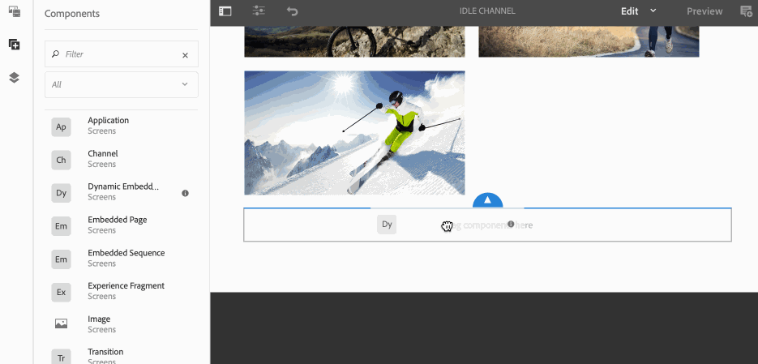

# Sequenze incorporate {#embedded-sequences}

L&#39;utilizzo di ***Sequenze incorporate*** per i canali consente all&#39;utente di aggiungere componenti nel canale principale e anche di riutilizzare il contenuto di un canale diverso e di incorporarlo nel canale principale.

## Aggiunta di sequenze incorporate {#adding-embedded-sequences}

Puoi aggiungere i seguenti componenti al canale per sequenza:

* Sequenza incorporata
* Sequenza incorporata dinamica

>[!NOTE]
>
>Per informazioni sull&#39;uso di altri componenti nel progetto Screens, consulta [Aggiunta di componenti a un canale](adding-components-to-a-channel.md).

### Aggiunta di una sequenza incorporata {#adding-an-embedded-sequence}

È possibile aggiungere una sequenza incorporata al canale. Una sequenza incorporata è un altro canale che include risorse come immagini o video. L&#39;aggiunta di una sequenza incorporata consente all&#39;utente di aggiungere la sequenza a un canale in base al ***Percorso del canale***.

>[!NOTE]
>***Percorso canale*** definisce un riferimento esplicito al canale.
>Per ulteriori informazioni sul *Percorso del canale*, consulta [Assegnazione canale](channel-assignment.md) in Screens di authoring.

Segui i passaggi sottostanti per aggiungere una sequenza incorporata al canale:

1. Seleziona il canale in cui incorporare una pagina. Ad esempio, **We.Retail In Store** —> **Canali** —> **Canale inattivo**.

1. Fai clic su **Modifica** nella barra delle azioni per aprire il canale in modalità editor.
1. Fai clic sull&#39;icona dei componenti nella barra laterale sinistra per aggiungere la pagina incorporata. Trascina **Sequenza incorporata** nell&#39;editor.
1. Fai doppio clic sul componente **Sequenza incorporata** per aggiungere il canale al canale della sequenza originale.
1. Seleziona il **Percorso canale** del canale.
1. Seleziona la **Durata (ms)** per il canale incorporato nella scheda **Sequenza** . Per impostazione predefinita, la durata è impostata su **-1**, il che significa che il canale incorporato è completamente eseguito. Se l&#39;utente specifica una durata, la sottosequenza verrà interrotta all&#39;ora specificata.

1. Impostare la **Strategia di riproduzione misurata** su **normale**.

Per impostazione predefinita, è impostato su **normale**. Impostando il valore su **Normal** (Riproduci tutti gli elementi), la sottosequenza verrà eseguita completamente su ogni ciclo della sequenza padre. L&#39;altro valore possibile è **Riproduci un singolo elemento** (Riproduci un singolo elemento) e mostrerebbe solo un elemento della sottosequenza su ogni esecuzione (ad esempio, il primo elemento sul primo ciclo, il secondo elemento sul secondo ciclo e così via).

>[!IMPORTANT]
>
>È necessario assegnare il canale (utilizzato nella sequenza incorporata) alla stessa visualizzazione.
>
>Segui i passaggi seguenti dopo aver aggiunto una sequenza incorporata al tuo canale dai passaggi precedenti:
>
>1. Passa alla visualizzazione e seleziona la visualizzazione dalla cartella **Posizioni** .
>1. Fai clic su **Dashboard** dalla barra delle azioni per passare al dashboard di visualizzazione.
>1. Seleziona **+ Assegna canali** da **CANALI ASSEGNATI &amp; PANNELLI PIANIFICATI** per aprire la finestra di dialogo **Assegnazione canale**.

   >
   >
1. Seleziona il percorso del canale utilizzato (in sequenza incorporata) in **Percorso del canale**.
>1. Assicurati che la **Priorità** sia inferiore al canale principale.

   >
   >
1. Non selezionare **Eventi supportati**.
>1. Fai clic su **Salva** una volta fatto.

>

L&#39;esempio seguente mostra l&#39;aggiunta di una sequenza incorporata (**Canale inattivo - notte**) a un canale già esistente (**Canale inattivo**).

### Aggiunta di una sequenza incorporata dinamica {#adding-a-dynamic-embedded-sequence}

È possibile aggiungere una sequenza incorporata dinamica al canale. Una sequenza incorporata dinamica è simile ad una sequenza incorporata, ma permette all&#39;utente di seguire una gerarchia in cui le modifiche o aggiornamenti apportati ad un canale vengono propagati ad un altro ad esso relazionato. Segue la gerarchia genitore-figlio, ma include anche risorse come immagini e video. L&#39;aggiunta di una sequenza dinamica consente all&#39;utente di aggiungere un canale per ruolo.

>[!NOTE]
>
>Il ***Ruolo canale*** definisce il ruolo dei canali nel contesto della visualizzazione.
>
>Per ulteriori informazioni sul *Ruolo canale*, consulta [Assegnazione canale](channel-assignment.md) in Screens di authoring.

Segui i passaggi sottostanti per aggiungere una sequenza incorporata al canale:

1. Seleziona il canale in cui incorporare una sequenza dinamica. Ad esempio, **We.Retail In Store** —> **Canali** —> **Canale inattivo**.

1. Fai clic su **Modifica** nella barra delle azioni per aprire il canale in modalità editor.
1. Fai clic sull&#39;icona dei componenti nella barra laterale sinistra per aggiungere la sequenza incorporata dinamica. Trascina **Dinamico** **Sequenza incorporata** nell’editor.

1. Fai doppio clic sul componente **Dinamico** **Sequenza incorporata** per aggiungere la pagina al canale della sequenza.

1. Inserisci il **Ruolo assegnazione canale**.
1. Impostare la **Strategia di riproduzione misurata** su **normale**. Per impostazione predefinita, è impostato su **normale**. Impostando il valore su **Normal** (Riproduci tutti gli elementi), la sottosequenza verrà eseguita completamente su ogni ciclo della sequenza padre. L&#39;altro valore possibile è **Riproduci un singolo elemento** (Riproduci un singolo elemento) e mostrerebbe solo un elemento della sottosequenza su ogni esecuzione (ad esempio, il primo elemento sul primo ciclo, il secondo elemento sul secondo ciclo e così via).

1. Seleziona la scheda **Durata (ms)** in **Sequenza** per il canale incorporato nella sequenza.

