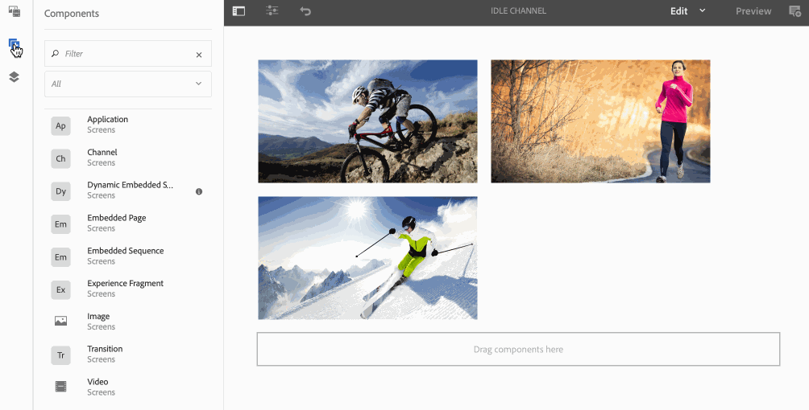

# Sequenze incorporate {#embedded-sequences}

Utilizzando ***Sequenze incorporate***, per i canali, consente a un utente di aggiungere componenti nel canale principale e anche di riutilizzare il contenuto da un canale diverso e di incorporarlo nel canale principale.

## Aggiunta di sequenze incorporate {#adding-embedded-sequences}

È possibile aggiungere i seguenti componenti al canale della sequenza:

* Sequenza incorporata
* Sequenza incorporata dinamica

>[!NOTE]
>
>Per informazioni sull&#39;utilizzo di altri componenti nel progetto Screens, vedere [Aggiunta di componenti a un canale](adding-components-to-a-channel.md).

### Aggiunta di una sequenza incorporata {#adding-an-embedded-sequence}

Puoi aggiungere una sequenza incorporata al tuo canale. Una sequenza incorporata è un altro canale che include risorse come immagini o video. L&#39;aggiunta di una sequenza incorporata consente all&#39;utente di aggiungere la sequenza a un canale da ***Percorso canale***.

>[!NOTE]
>***Percorso canale*** definisce un riferimento esplicito al canale.
>Per ulteriori informazioni su *Percorso canale*, consulta [Assegnazione canale](channel-assignment.md) in Authoring Screens.

Per aggiungere una sequenza incorporata al canale, effettua le seguenti operazioni:

1. Fai clic sul canale in cui desideri incorporare una pagina. Ad esempio, **`We.Retail`In-Store** > **Canali** > **Canale Inattivo**.

1. Fai clic su **Modifica** nella barra delle azioni.
1. In modalità editor, fai clic sull’icona dei componenti nella barra laterale a sinistra per aggiungere la pagina incorporata. Trascina e rilascia la **sequenza incorporata** nell&#39;editor.
1. Fai doppio clic sul componente **Sequenza incorporata** per aggiungere il canale al canale della sequenza originale.
1. Fai clic sul **Percorso canale** del canale.
1. Fai clic su **Durata (millisecondi)** per il canale incorporato nella scheda **Sequenza**. Per impostazione predefinita, la durata è impostata su **-1**, il che significa che il canale incorporato è completamente eseguito. Se l’utente specifica una durata, la sottosequenza viene interrotta (ovvero si interrompe) all’ora specificata.

1. Imposta la **strategia di riproduzione controllata** su **normale**.

Per impostazione predefinita è impostato su **normal**. Se si imposta il valore su **normal** (Riproduci tutti gli elementi), la sequenza verrà eseguita completamente in ogni ciclo della sequenza principale. L&#39;altro valore possibile è **Riprodurre un singolo elemento**. Tale valore mostra solo un elemento della sottosequenza a ogni esecuzione. Ad esempio, il primo elemento del primo ciclo e il secondo elemento del secondo ciclo.

>[!IMPORTANT]
>
>Assegnate alla stessa visualizzazione il canale utilizzato nella sequenza incorporata.
>
>Dopo aver aggiunto al canale una sequenza incorporata tra quelle precedenti, effettua le seguenti operazioni:
>
>1. Passa alla visualizzazione e fai clic su di essa nella cartella **Percorsi**.
>1. Fai clic su **Dashboard** nella barra delle azioni.
>1. Nel dashboard di visualizzazione, fare clic su **+ Assegna canali** da **CANALI ASSEGNATI e PANNELLI PIANIFICATI** per aprire la **finestra di dialogo Assegnazione canali**.
>
>1. Fare clic sul percorso del canale utilizzato nella sequenza incorporata, in **Percorso canale**.
>1. Assicurati che la **Priorità** sia inferiore al canale principale.
>
>1. Non fare clic su alcun **evento supportato**.
>1. Al termine, fai clic su **Salva**.
>

L&#39;esempio seguente mostra l&#39;aggiunta di una sequenza incorporata (**Canale inattivo - Notte**) a un canale esistente (**Canale inattivo**).

### Aggiunta di una sequenza dinamica incorporata {#adding-a-dynamic-embedded-sequence}

Puoi aggiungere una sequenza dinamica incorporata al canale. Una sequenza incorporata dinamica è simile a una sequenza incorporata, ma consente all’utente di seguire una gerarchia in cui le modifiche o gli aggiornamenti apportati a un canale vengono propagati a un altro in relazione. Segue una gerarchia genitore-figlio e include anche risorse come immagini o video. L’aggiunta di una sequenza dinamica consente all’utente di aggiungere un canale in base al Ruolo canale.

>[!NOTE]
>
>***Ruolo canale*** definisce il contesto della visualizzazione.
>
>Per ulteriori informazioni su *Ruolo canale*, consulta [Assegnazione canale](channel-assignment.md) in Authoring Screens.

Per aggiungere una sequenza incorporata al canale, effettua le seguenti operazioni:

1. Fate clic sul canale in cui desiderate incorporare una sequenza dinamica. Ad esempio, **`We.Retail`In-Store** > **Canali** > **Canale Inattivo**.

1. Fai clic su **Modifica** nella barra delle azioni.
1. In modalità editor, fai clic sull’icona dei componenti nella barra laterale sinistra per aggiungere la sequenza dinamica incorporata. Trascina e rilascia **Dynamic** **Embedded Sequence** nell&#39;editor.

1. Fai doppio clic sul componente **Dynamic** **Sequenza incorporata** per aggiungere la pagina al canale della sequenza.

1. Immetti il **Ruolo assegnazione canale**.
1. Imposta la **strategia di riproduzione controllata** su **normale**. Per impostazione predefinita è impostato su **normal**. Se si imposta il valore su **normal** (Riproduci tutti gli elementi), la sequenza verrà eseguita completamente in ogni ciclo della sequenza principale. L&#39;altro valore possibile è **Riprodurre un singolo elemento**. Tale valore mostra solo un elemento della sottosequenza a ogni esecuzione. Ad esempio, il primo elemento del primo ciclo e il secondo elemento del secondo ciclo.

1. Fai clic su **Durata (millisecondi)** nella scheda **Sequenza** per il canale incorporato nella sequenza.

