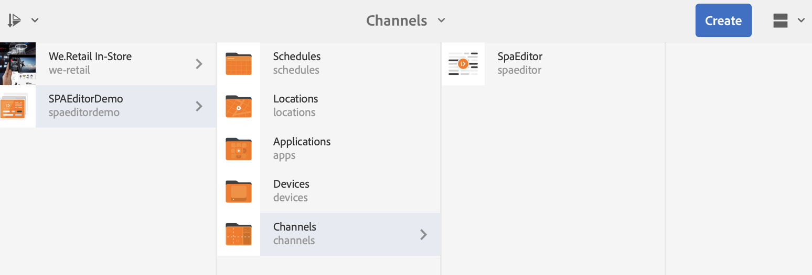

# Incorporazione di un&#39;applicazione REACT utilizzando l&#39;editor di SPA AEM e Integrazione con AEM Screens Analytics {#embedding-a-react-application-using-the-aem-spa-editor-and-integrating-with-aem-screens-analytics}

Questa sezione descrive come incorporare un’applicazione interattiva a pagina singola utilizzando REACT (o Angular) utilizzando l’editor SPA AEM che può essere configurato dai professionisti aziendali in AEM e come integrare l’applicazione interattiva con Adobe Analytics offline.

## Utilizzo dell&#39;editor SPA AEM {#using-the-aem-spa-editor}

Segui i passaggi riportati di seguito per utilizzare l’editor di SPA di AEM:

1. Clona il repository dell&#39;editor SPA AEM in [https://github.com/adobe/aem-spa-project-archetype.](https://github.com/adobe/aem-spa-project-archetype)

   >[!NOTE]
   >
   >Questo archetipo crea un progetto Adobe Experience Manager minimo come punto di partenza per i tuoi progetti SPA. Le proprietà che devono essere fornite quando si utilizza questo archetipo consentono di denominare come desiderato tutte le parti del progetto.

1. Segui le istruzioni per creare un progetto dell’archetipo di un editor di AEM SPA:

   ```
   mvn clean install archetype:update-local-catalog
   mvn archetype:crawl
   
   mvn archetype:generate \
   -DarchetypeCatalog=internal \
   -DarchetypeGroupId=com.adobe.cq.spa.archetypes \
   -DarchetypeArtifactId=aem-spa-project-archetype \
   -DarchetypeVersion=1.0.3-SNAPSHOT \
   ```

   >[!NOTE]
   >
   >Utilizziamo il **GroupId** come ***com.adobe.aem.screens*** e il **ObjectId** come ***My Sample SPA*** (che sono i valori predefiniti). Puoi scegliere il tuo secondo necessità.

1. Una volta creato il progetto, utilizza un IDE o un editor di tua scelta e importa il progetto Maven generato.
1. Distribuisci nell&#39;istanza AEM locale utilizzando il comando ***mvn clean install -PautoInstallPackage***.

### Modifica del contenuto nell’app REACT {#editing-content-in-the-react-app}

Per modificare il contenuto dell’app REACT:

1. Passa a `https://localhost:4502/editor.html/content/mysamplespa/en/home.html` (sostituisci il nome host, la porta e il nome del progetto come applicabile).
1. Dovrebbe essere possibile modificare il testo visualizzato nell&#39;applicazione Hello world.

### Aggiunta dell&#39;app REACT interattiva ad AEM Screens {#adding-the-interactive-react-app-to-aem-screens}

Per aggiungere l’app REACT interattiva ad AEM Screens, effettua le seguenti operazioni:

1. Crea un nuovo progetto AEM Screens. Per ulteriori informazioni, consulta [Creazione e gestione di progetti](creating-a-screens-project.md) .

   >[!NOTE]
   >
   >Crea un **Canale per sequenza** durante la creazione di un canale nella cartella **Canali** del progetto Screens.
   >
   >
   >Per ulteriori informazioni, consulta [Creazione e gestione di canali](managing-channels.md) .

   

1. Modifica qualsiasi canale di sequenza e trascina e rilascia un componente di pagina incorporato.

   Per ulteriori informazioni, consulta [Aggiunta di componenti a un canale](adding-components-to-a-channel.md) .

   >[!NOTE]
   >
   >Assicurati di aggiungere l’evento di interazione dell’utente quando assegni il canale alla visualizzazione.

1. Fai clic su **Modifica** nella barra delle azioni per modificare le proprietà del canale della sequenza.

   

1. Trascina e rilascia il componente **Pagina incorporata** e seleziona la home page sotto l&#39;applicazione mysamplespa, ad esempio ***/content/mysamplespa/en/home***.

   

1. Registra un lettore rispetto a questo progetto e dovresti essere in grado di visualizzare la tua applicazione interattiva in esecuzione su AEM Screens.

   Per informazioni dettagliate sulla registrazione di un dispositivo, consulta [Registrazione dispositivo](device-registration.md) .

## Integrazione del SPA con Adobe Analytics con funzionalità offline tramite AEM Screens {#integrating-the-spa-with-adobe-analytics-with-offline-capability-through-aem-screens}

Segui i passaggi seguenti per integrare l’SPA con Adobe Analytics con funzionalità offline tramite AEM Screens:

1. Configura Adobe Analytics in AEM Screens.

   Per informazioni su come eseguire la sequenza in Adobe Analytics con AEM Screens e inviare eventi personalizzati utilizzando Adobe Analytics offline, consulta [Configurazione di Adobe Analytics con AEM Screens](configuring-adobe-analytics-aem-screens.md) .

1. Modifica l’app react nell’IDE/editor desiderato (in particolare il componente di testo o un altro componente che desideri iniziare a emettere eventi).
1. Nell’evento clic o in un altro evento che desideri acquisire per il componente, aggiungi le informazioni di analisi utilizzando il modello dati standard.

   Per ulteriori informazioni, consulta Configurazione di Adobe Analytics con AEM Screens](configuring-adobe-analytics-aem-screens.md)s .[

1. Chiama l’API di AEM Screens Analytics per salvare l’evento offline e inviarlo in Burst ad Adobe Analytics.

   Esempio,

   ```
   handleClick() {
       if ((window.parent) && (window.parent.CQ) && (window.parent.CQ.screens) && (window.parent.CQ.screens.analytics))
       {
           var analyticsEvent = {};
           analyticsEvent['event.type'] = 'play'; // Type of event
    analyticsEvent['event.coll_dts'] = new Date().toISOString(); // Start of collecting the event
    analyticsEvent['event.dts_start'] = new Date().toISOString(); // Event start
    analyticsEvent['content.type'] = 'Washing machine'; // Mime Type or product category
    analyticsEvent['content.action'] = 'Path to the washing machine asset in AEM'; // Path in AEM to relevant asset
    analyticsEvent['trn.product'] = 'Washing machine Model number'; // Product being explored
    analyticsEvent['trn.amount'] = 1000; // Product pricing or other numeric value or weight
    analyticsEvent['event.dts_end'] = new Date().toISOString(); // Event end
    analyticsEvent['event.count'] = 100; // Numeric value that may count a number of clicks or keystrokes or wait time in seconds for example
    analyticsEvent['event.value'] = 'My favorite analytics event';
           analyticsEvent['trn.quantity'] = 10; // Quantity of product selection
    analyticsEvent['event.subtype'] = 'end'; // Event subtype if applicable
    window.parent.CQ.screens.analytics.sendTrackingEvent(analyticsEvent);
       }
   }
   ```

   >[!NOTE]
   >
   >Il firmware del lettore aggiunge automaticamente ulteriori dettagli sul lettore e sul suo ambiente di runtime ai dati di analisi personalizzati inviati. Pertanto potrebbe non essere necessario acquisire i dettagli del sistema operativo/dispositivo di basso livello, a meno che non sia assolutamente necessario. Devi solo concentrarti sui dati di analisi aziendale.

