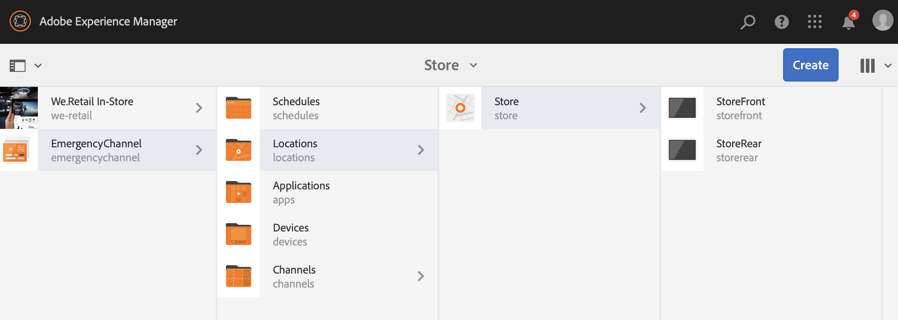
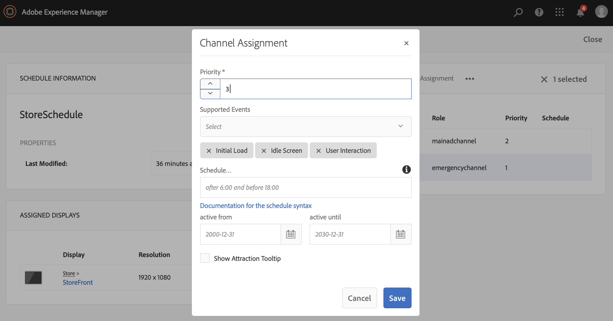

# Canale di emergenza {#emergency-channel}

## Descrizione di un caso d’uso {#use-case-description}

Questa sezione descrive un esempio di caso d’uso che sottolinea la creazione e la gestione di un canale di emergenza e che l’autore del contenuto può passare da un canale di sequenza in caso di condizione preliminare.

### Precondizioni {#preconditions}

Prima di iniziare questo caso d’uso, assicurati di comprendere come:

* **[Creare e gestire i canali](managing-channels.md)**
* **[Creare e gestire posizioni](managing-locations.md)**
* **[Creare e gestire le pianificazioni](managing-schedules.md)**
* **[Registrazione dispositivo](device-registration.md)**

### Attori principali {#primary-actors}

Autori di contenuti

## Flusso di base: Configurazione del progetto {#basic-flow-setting-up-the-project}

Per impostare un canale di emergenza, effettua le seguenti operazioni:

1. Crea un progetto AEM Screens denominato **EmergencyChannel**, come mostrato di seguito.

   >[!NOTE]
   >Per ulteriori informazioni sulla creazione e la gestione di progetti in AEM Screens, consulta Creazione di un progetto .

   

1. **Creazione di un canale per sequenza**

   1. Seleziona la cartella **Canali** e fai clic su **Crea** per aprire la procedura guidata per creare un canale.

   1. Seleziona **Canale sequenza** dalla procedura guidata e crea il canale denominato **MainAdChannel**.

   

1. **Aggiunta di contenuto al canale della sequenza**

   1. Seleziona il canale (**MainAdChannel**).
   1. Fai clic su **Modifica** nella barra delle azioni per aprire l&#39;editor. Trascina alcune risorse sul tuo canale.

   

1. **Creazione di un canale di emergenza**

   1. Seleziona la cartella **Canali** .
   1. Fai clic su **Crea** per aprire la procedura guidata per creare un canale.
   1. Seleziona **Canale sequenza** dalla procedura guidata e crea il canale denominato **EmergencyChannel**.

   >[!NOTE]
   >
   >Normalmente, il canale di emergenza viene aggiunto al progetto di produzione preesistente.

   

1. **Aggiunta di contenuto al canale di emergenza**

   1. Selezionare il canale (**Canale di emergenza)**.
   1. Fai clic su **Modifica** nella barra delle azioni per aprire l&#39;editor. Trascina sul canale la risorsa da eseguire durante un’emergenza.

   

1. **Creazione di una posizione** 

   1. Passa alla cartella **Posizioni** .
   1. Fai clic su **Crea** nella barra delle azioni e crea una posizione denominata **Archivia** dalla procedura guidata.

   

1. **Creazione di visualizzazioni nella posizione**

   Passa alla posizione (**Archivia**) e fai clic su **Crea** dalla barra delle azioni. Segui la procedura guidata per creare due **Display** con titolo **StoreFront** e **StoreRear**.

   

1. **Creare una pianificazione**

   1. Passa alla cartella **Pianificazioni** .
   1. Fai clic su **Crea** nella barra delle azioni. Segui la procedura guidata per creare una pianificazione denominata **StoreSchedule**.

   

1. Assegna le visualizzazioni alla pianificazione e imposta le priorità

   1. Seleziona la pianificazione **(StoreSchedule)** e fai clic su **Dashboard** nella barra delle azioni.

   1. Fai clic su **+ Assegna canale** dal pannello **CANALI ASSEGNATI**.

   1. Dalla finestra di dialogo **Assegnazione canale**:

      1. Seleziona il percorso del **MainAdChannel**
      1. Imposta **Priorità** come 2
      1. Imposta gli eventi supportati come **Caricamento iniziale** e **Schermo di inattività**.
      1. Fai clic su **Salva**

      Allo stesso modo, dovrai seguire di nuovo gli stessi passaggi per assegnare il **canale di emergenza** e impostarne la **Priorità**.
   >[!NOTE]
   >
   >La priorità viene usata per ordinare le assegnazioni nel caso in cui più utenti corrispondano ai criteri di riproduzione. Quella con il valore più alto avrà sempre la precedenza su quella con i valori più bassi.

   

1. Fai clic su **+ Assegna canale** dal pannello **CANALI ASSEGNATI**.

1. Dalla finestra di dialogo **Assegnazione canale**:

   1. Selezionare il percorso del **canale di emergenza**
   1. Imposta **Priorità** come 1

   1. Imposta gli eventi supportati come **Caricamento iniziale**, **Schermo di inattività** e **Interazione utente**

   1. Fai clic su **Salva**

   

   Puoi visualizzare i canali assegnati dal dashboard **StoreSchedule**.

   

1. **Assegnazione della pianificazione a ogni visualizzazione**

   1. Passa a ogni visualizzazione, ad esempio **EmergencyChannel** —> **Posizioni** —> **Store** —>**StoreFront**.

   1. Fai clic su **Dashboard** dall&#39;azione per aprire il dashboard di visualizzazione.
   1. Fare clic su **..** dal pannello **CANALI ASSEGNATI E PIANIFICAZIONI**, quindi fai clic su **+Assegna pianificazione**.

   1. Seleziona il percorso della pianificazione (ad esempio, qui, **EmergencyChannel** —> **Pianificazioni** —>**StoreSchedule**).

   1. Fai clic su **Salva**.

   Puoi visualizzare la pianificazione assegnata alla visualizzazione dal dashboard **StoreSchedule**.
   

1. **Registrazione dispositivo**

   Completa il processo di registrazione del dispositivo e una volta registrata, visualizzerai il seguente output sul tuo lettore AEM Screens.

   

## Passaggio al canale di emergenza {#switching-to-emergency-channel}

In caso di emergenza, effettua le seguenti operazioni:

1. Passa a **EmergencyChannel** —> **Pianificazioni** —> **StoreSchedule** e seleziona **Dashboard** dalla barra delle azioni.

   

1. Seleziona il **EmergencyChannel** dal dashboard **StoreSchedule** e fai clic su **Modifica assegnazione**.

   

1. Aggiorna **Priorità** del **canale di emergenza** a **3** dalla finestra di dialogo **Assegnazione canale** e fai clic su **Salva**.

   

1. Non appena la priorità del canale viene aggiornata, tutti i lettori AEM Screens visualizzeranno il contenuto **EmergencyChannel** , come mostrato di seguito.

   

### Conclusione {#conclusion}

Il **EmergencyChannel** continuerà a visualizzare il contenuto fino a quando l’autore del contenuto non reimposta il valore di priorità su 1.

Una volta che l&#39;autore del contenuto riceve le istruzioni che l&#39;emergenza è stata cancellata, deve aggiornare la priorità del **MainAdChannel**, che causerà la ripresa della riproduzione normale.
