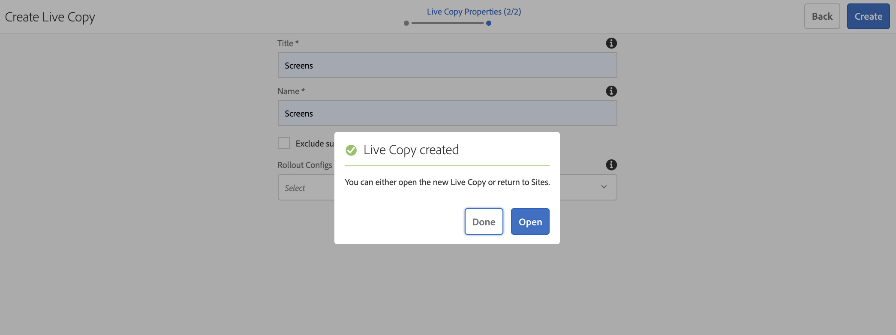

# Utilizzo di Frammenti esperienza {#using-experience-fragments}

Questa pagina tratta i seguenti argomenti:

* **Panoramica**
* **Utilizzo dei frammenti esperienza in AEM Screens**
* **Propagazione delle modifiche alla pagina**

## Panoramica {#overview}

Un ***Frammento esperienza*** è un gruppo di uno o più componenti, che include contenuto e layout, a cui è possibile fare riferimento tra le pagine. I frammenti esperienza possono includere qualsiasi componente singolo o multiplo, che contenga elementi all&#39;interno di un sistema di paragrafi e a cui si fa riferimento nell&#39;esperienza completa o che viene richiesto da un punto finale terzo.

## Utilizzo dei frammenti esperienza in AEM Screens {#using-experience-fragments-in-aem-screens}

>[!NOTE]
>Nell&#39;esempio seguente viene utilizzato **We.Retail** come progetto demo da cui viene sfruttato il frammento esperienza da una pagina **Sites** a un progetto AEM Screens.

Ad esempio, il flusso di lavoro seguente illustra l’utilizzo di frammenti di esperienza da We.Retail in Sites. Puoi scegliere una pagina web e sfruttarne il contenuto nel canale AEM Screens in uno dei tuoi progetti.

### Prerequisiti {#pre-requisites}

**Creazione di un progetto demo con un canale**

***Creazione di un progetto***

1. Fai clic su **Crea progetto Screens** per creare un nuovo progetto.
1. Inserisci come titolo **DemoProject**.
1. Fai clic su **Salva**.

Al tuo AEM Screens verrà aggiunto un **DemoProject** .

***Creazione di un canale***

1. Passa alla cartella **DemoProject** creata e seleziona la cartella **Canali** .

1. Fai clic su **Crea** nella barra delle azioni per aprire la procedura guidata.
1. Scegli il modello **Canale sequenza** dalla procedura guidata e fai clic su **Avanti**.

1. Inserisci il **Titolo** come **TestChannel** e fai clic su **Crea**.

Al tuo **DemoProject** verrà aggiunto un **TestChannel**.\

### Creazione di un frammento esperienza {#creating-an-experience-fragment}

Segui i passaggi riportati di seguito per sfruttare il contenuto da **We.Retail** al **TestChannel** in **DemoProject**.

1. **Passa a una pagina Sites in We.Retail**

   1. Passa a Sites e seleziona **We.Retail** -> **Stati Uniti** -> **Inglese** -> **Attrezzatura** e seleziona questa pagina per utilizzare questo frammento di esperienza per il canale Screens.

   1. Fai clic su **Modifica** nella barra delle azioni per aprire la pagina da utilizzare come frammento di esperienza per il canale Screens.

1. **Riutilizzo del contenuto**

   1. Selezionare il frammento da includere nel canale.
   1. Fai clic sull&#39;ultima icona da destra per aprire la finestra di dialogo **Converti in frammento esperienza** .

   

1. **Creazione di un frammento esperienza**

   1. Scegli **Azione** come **Crea un nuovo frammento esperienza**.

   1. Selezionare il **Percorso padre**.
   1. Seleziona il **Modello**. Scegli qui il modello **Frammento esperienza - Variazione schermi** (valore nel campo `/libs/settings/screens/experience-fragments/templates/experience-fragment-template-screens`).

   1. Inserisci il **Titolo frammento** come **ScreensFragment**.

   1. Fai clic sul segno di spunta per completare la creazione di un nuovo frammento esperienza.

   

   Nota: Per selezionare più facilmente un’opzione, fai clic sul segno di spunta a destra dei campi per aprire la finestra di dialogo di selezione.

1. **Creazione di una Live Copy di un frammento esperienza**

   1. Passa alla home page di AEM.
   1. Seleziona **Frammenti esperienza** ed evidenzia **ScreensFragment** e fai clic su **Variazione come Live-Copy**, come illustrato nella figura seguente:

   

   c. Seleziona la procedura guidata **ScreensFragment** da **Crea Live Copy** e fai clic su **Avanti**.

   d. Inserisci i valori **Titolo** e **Nome** come **Schermi**.

   e. Fai clic su **Crea** per creare la Live Copy.

   f. Fai clic su **Fine** per tornare alla pagina **ScreensFragment**.

   

   >[!NOTE]
   >
   >Dopo aver creato il frammento Screens, è possibile modificare le proprietà del frammento. Seleziona il frammento e fai clic su **Proprietà** nella barra delle azioni.

   **Modifica delle proprietà di un frammento Screens**

   1. Passa al **ScreensFragment** (creato nei passaggi precedenti) e fai clic su **Proprietà** dalla barra delle azioni.

   1. Seleziona la scheda **Configurazione offline** , come illustrato nella figura riportata di seguito.

   Puoi aggiungere le **Librerie lato client** (java e css) e **File statici** al frammento esperienza.

   L’esempio seguente mostra l’aggiunta di librerie lato client e dei font come parte di file statici al frammento di esperienza.  

1. **Utilizzo di Frammento esperienza come componente nel canale Screens**

   1. Passa al canale Screens in cui desideri utilizzare il frammento **Screens** .
   1. Seleziona il **TestChannel** e fai clic su **Modifica** nella barra delle azioni.

   1. Fai clic sull’icona dei componenti nella scheda laterale.
   1. Trascina il **Frammento esperienza** sul tuo canale.

   

   e. Seleziona il componente **Frammento esperienza** e fai clic sull’icona in alto a sinistra (chiave inglese) per aprire la finestra di dialogo **Frammento esperienza** .

   f. Seleziona la **Live Copy Screens** del frammento creato in *Passaggio 3* in **Percorso**.

   

   f. Seleziona la **Live Copy Screens** del frammento creato in *Passaggio 3* in **Frammento esperienza**.

   

   h. Immettere i millisecondi in **Durata**.

   i. Seleziona la **Configurazione offline** dalla finestra di dialogo **Frammenti esperienza** per definire le librerie lato client e i file statici.

   >[!NOTE]
   >
   >Se desideri aggiungere librerie lato client o file statici oltre a quello configurato nel passaggio (4), puoi aggiungere dalla scheda **Configurazione offline** nella finestra di dialogo **Frammento esperienza** .

   

   j. Fai clic sul segno di spunta per completare il processo.

### Convalida del risultato {#validating-the-result}

Dopo aver completato i passaggi precedenti, puoi convalidare il frammento esperienza in **ChannelOne** tramite:

1. Navigazione al **TestChannel**.
1. Seleziona **Anteprima** dalla barra delle azioni.

Puoi visualizzare il contenuto dalla pagina **Sites** (Live Copy del frammento di esperienza) nel tuo canale, come illustrato nella figura seguente:\

## Propagazione delle modifiche apportate alla pagina {#propagating-changes-from-the-master-page}

***Live*** Copy fa riferimento alla copia (dell’origine), gestita dalle azioni di sincronizzazione definite dalle configurazioni di rollout.

A partire dal frammento esperienza, è stata creata una Live Copy dalle pagine **Sites**. Pertanto, se apporti modifiche a quel particolare frammento dalla pagina master, visualizzerai le modifiche nel canale o nella destinazione in cui hai utilizzato il frammento esperienza.

>[!NOTE]
>
>Per ulteriori informazioni su Live Copy, consulta Riutilizzo del contenuto: Multi Site Manager e Live Copy.

Segui i passaggi riportati di seguito per propagare le modifiche dal canale principale al canale di destinazione:

1. Seleziona il frammento esperienza dalla pagina **Sites** (master) e fai clic sull’icona a forma di matita per modificare gli elementi nel frammento esperienza.

   

1. Seleziona il frammento esperienza e fai clic sull’icona a forma di chiave inglese per aprire la finestra di dialogo per modificare le immagini.

   

1. Viene visualizzata la finestra di dialogo **Griglia prodotto**.

   

1. È possibile modificare una qualsiasi delle immagini. Ad esempio, qui la prima immagine viene sostituita in questo frammento.

   

1. Seleziona il frammento esperienza e fai clic sull’icona Rollout per propagare le modifiche al frammento utilizzato nel canale.

   

1. Fai clic su Rollout per confermare le modifiche.

   Le modifiche vengono implementate.

   

### Convalida delle modifiche {#validating-the-changes}

Per confermare le modifiche apportate al canale, effettua le seguenti operazioni:

1. Passa a **Schermi** -> **Canali** -> **TestChannel**.

1. Fai clic su **Anteprima** nella barra delle azioni per confermare le modifiche.

L&#39;immagine seguente illustra le modifiche apportate a **TestChannel**:\

