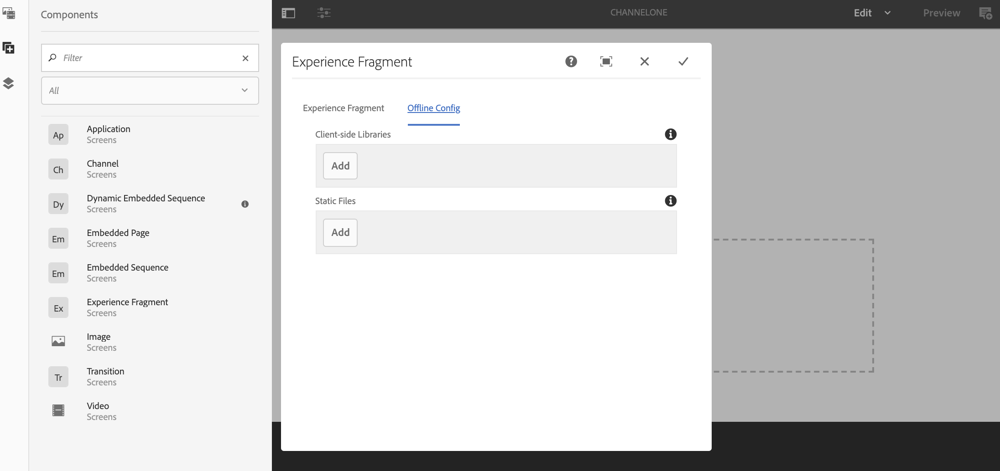

# Utilizzo di Frammenti esperienza {#using-experience-fragments}

Questa pagina illustra i seguenti argomenti:

* **Panoramica**
* **Utilizzo dei frammenti esperienza in AEM Screens**
* **Propagazione delle modifiche dalla pagina master**

## Panoramica {#overview}

Un ***Frammento esperienza*** è un gruppo di uno o più componenti, che include contenuto e layout, a cui è possibile fare riferimento tra le pagine. I frammenti esperienza possono includere qualsiasi componente singolo o multiplo, che contenga elementi all&#39;interno di un sistema di paragrafi e a cui si fa riferimento nell&#39;esperienza completa o che viene richiesto da un punto finale terzo.

## Utilizzo dei frammenti esperienza in AEM Screens {#using-experience-fragments-in-aem-screens}

>[!NOTE]
>
>Nell&#39;esempio seguente viene utilizzato **We.Retail** come progetto dimostrativo da cui il frammento esperienza viene sfruttato da una pagina **Siti** a un progetto AEM Screens.

Ad esempio, il seguente flusso di lavoro illustra l&#39;utilizzo di frammenti esperienza di We.Retail in Sites. Potete scegliere una pagina Web e sfruttare tale contenuto nel canale AEM Screens in uno dei vostri progetti.

### Prerequisiti {#pre-requisites}

**Creazione di un progetto dimostrativo con un canale**

***Creazione di un progetto***

1. Fate clic su **Crea progetto** schermate per creare un nuovo progetto.
1. Inserisci come titolo **DemoProject**.
1. Fai clic su **Salva**.

Un **DemoProject** verrà aggiunto alle schermate AEM.

***Creazione di un canale***

1. Navigate to the **DemoProject** you created and select the **Channels** folder.

1. Click **Create** from the action bar to open the wizard.
1. Scegliete il modello Canale **** sequenza dalla procedura guidata e fate clic su **Avanti**.

1. Enter the **Title** as **TestChannel** and click **Create**.

Verrà aggiunto un **TestChannel** al **DemoProject**.\

### Creazione di un frammento esperienza {#creating-an-experience-fragment}

Seguite i passaggi riportati di seguito per sfruttare il contenuto da **We.Retail** al **TestChannel** in **DemoProject**.

1. **Passare a una pagina Siti in We.Retail**

   1. Andate a Siti e selezionate **We.Retail In-Store** -> **United States** ->**English** , quindi selezionate la pagina **Equipment** per utilizzare questo frammento di esperienza per il canale Screens.

   1. Fai clic su **Modifica** nella barra delle azioni per aprire la pagina da utilizzare come frammento esperienza per il canale Screens.

      

1. **Riutilizzo del contenuto**

   1. Selezionare il frammento da includere nel canale.
   1. Fate clic sull&#39;ultima icona da destra per aprire la finestra di dialogo **Converti in frammento** esperienza.
   

1. **Creazione di un frammento esperienza**

   1. Scegliete l&#39; **azione** come **Crea un nuovo frammento** esperienza.

   1. Selezionare il percorso **** padre.
   1. Select the **Template**. Scegli qui il modello **Frammento esperienza - Variazione** schermo.

   1. Enter the **Fragment Title** as **ScreensFragment**.

   1. Fate clic sul segno di spunta per completare la creazione di un nuovo frammento esperienza.
   

1. **Creazione di Live Copy di frammenti esperienza**

   1. Andate alla home page di AEM.
   1. Selezionate Frammenti **** esperienza ed evidenziate il frammento **Screens** e fate clic su **Variazione come Live Copy**, come illustrato nella figura seguente:
   

   c. Seleziona il** ScreensFragment** dalla procedura guidata **Crea Live Copy** e fai clic su **Avanti**.

   d. Immettete il **titolo** e il **nome** come **schermate**.

   e. Fate clic su **Crea** per creare la Live Copy.

   f. Fare clic su **Fine** per tornare alla pagina **ScreensFragment** .

   

   >[!NOTE]
   >
   >Dopo aver creato il frammento Screens, è possibile modificare le proprietà del frammento. Selezionare il frammento e fare clic su **Proprietà** dalla barra delle azioni.

   **Modifica delle proprietà di un frammento di schermata**

   1. Passare a **ScreensFragment** (creato nei passaggi precedenti) e fare clic su **Properties (Proprietà** ) dalla barra delle azioni.

   1. Selezionate la scheda Configurazione **** offline, come illustrato nella figura riportata di seguito.
   Potete aggiungere le librerie **lato** client (Java e css) e i file **** statici al frammento esperienza.

   L&#39;esempio seguente mostra l&#39;aggiunta di librerie lato client e dei font come parte di file statici al frammento esperienza.  

1. **Utilizzo di un frammento esperienza come componente nel canale dello schermo**

   1. Passare al canale Screens in cui si desidera utilizzare il frammento **Screens** .
   1. Selezionate **TestChannel** e fate clic su **Modifica** nella barra delle azioni.

   1. Fate clic sull’icona dei componenti dalla scheda laterale.
   1. Trascina e rilascia il frammento **** esperienza sul canale.
   

   e. Selezionate il componente Frammento **** esperienza e fate clic sull’icona in alto a sinistra (chiave inglese) per aprire la finestra di dialogo Frammento **** esperienza.

   f. Selezionare la Live Copy **Screens** del frammento creato al *passaggio 3* del **percorso**.

   

   f. Selezionate la Live Copy **Screens** del frammento creato al *Passaggio 3* nel frammento **esperienza**.

   

   h. Immettete i millisecondi in **Durata**.

   i. Selezionate il file di configurazione **** offline dalla finestra di dialogo Frammenti **** esperienza per definire le librerie lato client e i file statici.

   >[!NOTE]
   >
   >Se desiderate aggiungere librerie lato client o file statici oltre a quanto configurato nel passaggio (4), potete aggiungerli dalla scheda Configurazione **** offline nella finestra di dialogo Frammento **** esperienza.

   

   j. Fare clic sul segno di spunta per completare il processo.

### Convalida del risultato {#validating-the-result}

Dopo aver completato i passaggi precedenti, puoi convalidare il frammento esperienza in **ChannelOne** tramite:

1. Passaggio al **TestChannel**.
1. Selezione dell&#39; **anteprima** dalla barra delle azioni.

Il contenuto verrà visualizzato dalla pagina **Siti** (Live Copy del frammento esperienza) del canale, come illustrato nella figura seguente:\

## Propagazione delle modifiche dalla pagina master {#propagating-changes-from-the-master-page}

***Live Copy*** si riferisce alla copia (dell&#39;origine), gestita mediante azioni di sincronizzazione come definito dalle configurazioni di rollout.

Poiché il frammento esperienza è una live copy creata dalle pagine **Siti** , se apporti modifiche a quel particolare frammento dalla pagina master, potrai visualizzare le modifiche nel canale o nella destinazione in cui hai utilizzato il frammento esperienza.

>[!NOTE]
>
>Per ulteriori informazioni su Live Copy, consultate Riutilizzo dei contenuti: Multi Site Manager e Live Copy.

Per estendere le modifiche dal canale principale al canale di destinazione, effettuate le seguenti operazioni:

1. Selezionate il frammento esperienza dalla pagina **Siti** (master) e fate clic sull&#39;icona a forma di matita per modificare gli elementi nel frammento esperienza.

   

1. Selezionate il frammento esperienza e fate clic sull’icona chiave inglese per aprire la finestra di dialogo per modificare le immagini.

   

1. Viene visualizzata la finestra di dialogo Griglia **** prodotto.

   

1. Potete modificare qualsiasi immagine. Ad esempio, in questo frammento viene sostituita la prima immagine.

   

1. Selezionate il frammento esperienza e fate clic sull&#39;icona Rollout per estendere le modifiche al frammento utilizzato nel canale.

   

1. Fate clic su Rollout per confermare le modifiche.

   Le modifiche verranno implementate.

   

### Convalida delle modifiche {#validating-the-changes}

Per confermare le modifiche apportate al canale, effettuate le seguenti operazioni:

1. Passare a **Screens** -> **Channels** -> **TestChannel**.

1. Fate clic su **Anteprima** dalla barra delle azioni per confermare le modifiche.

L’immagine seguente illustra le modifiche apportate a **TestChannel**:\

