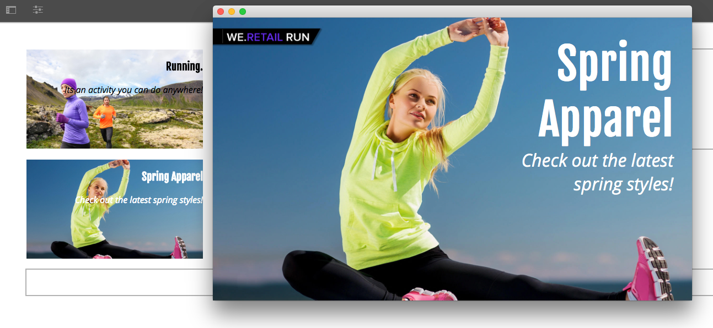
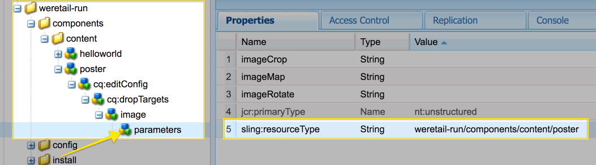
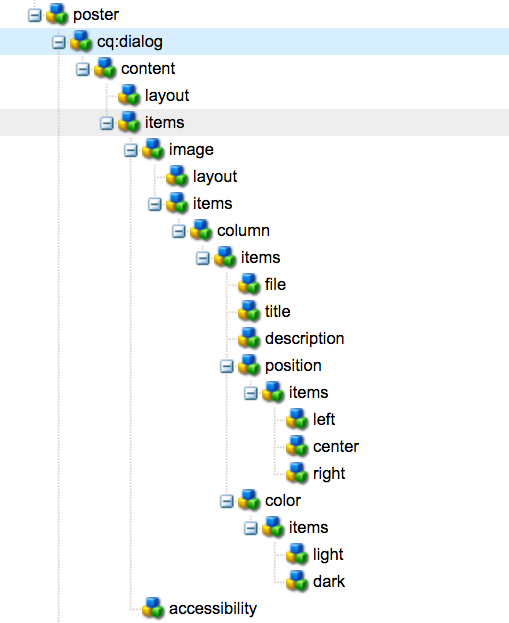

# Estensione di un componente AEM Screens {#extending-an-aem-screens-component}

L’esercitazione seguente illustra i passaggi e le procedure ottimali per l’estensione dei componenti AEM Screens integrati. Il componente Immagine viene esteso per aggiungere una sovrapposizione di testo modificabile.

## Panoramica {#overview}

Questa esercitazione è destinata agli sviluppatori che hanno familiarità con AEM Screens. In questa esercitazione, il componente Immagine schermate viene esteso per creare un componente Poster. Titolo, descrizione e logo sono sovrapposti a un’immagine per creare un’esperienza coinvolgente in un canale sequenza.

>[!NOTE]
>
>Prima di avviare questa esercitazione, è consigliabile completare l&#39;esercitazione: [Sviluppo di un componente personalizzato per AEM Screens](developing-custom-component-tutorial-develop.md).



Il componente Poster personalizzato viene creato estendendo il componente Immagine.

## Prerequisiti {#prerequisites}

Per completare questa esercitazione, è necessario effettuare le seguenti operazioni:

1. [AEM 6.4](https://docs.adobe.com/content/help/en/experience-manager-64/release-notes/release-notes.html) o [AEM 6.3](https://helpx.adobe.com/experience-manager/6-3/release-notes.html) + Feature Pack per schermi più recenti
1. [Lettore AEM Screens](/help/user-guide/aem-screens-introduction.md)
1. Ambiente di sviluppo locale

I passaggi dell&#39;esercitazione e le schermate vengono eseguiti utilizzando CRXDE-Lite. [Per completare l’esercitazione è inoltre possibile utilizzare IDE Eclipse](https://docs.adobe.com/content/help/en/experience-manager-64/developing/devtools/aem-eclipse.html) o [IntelliJ](https://docs.adobe.com/content/help/en/experience-manager-64/developing/devtools/ht-intellij.html) . Ulteriori informazioni sull’utilizzo di un IDE per [lo sviluppo con AEM sono disponibili qui](https://docs.adobe.com/content/help/en/experience-manager-learn/getting-started-wknd-tutorial-develop/project-setup.html#eclipse-ide).

## Configurazione progetto {#project-setup}

Il codice sorgente di un progetto Screens viene generalmente gestito come progetto Maven multimodulo. Per accelerare l’esercitazione, un progetto è stato pre-generato con l’archivio di progetto [AEM 13](https://github.com/adobe/aem-project-archetype). Maggiori dettagli sulla [creazione di un progetto con Maven AEM Project Archetype sono disponibili qui](https://docs.adobe.com/content/help/en/experience-manager-learn/getting-started-wknd-tutorial-develop/project-setup.html#maven-multimodule).

1. Scaricate e installate i pacchetti seguenti utilizzando la gestione **pacchetto** CRX `http://localhost:4502/crx/packmgr/index.jsp)r:`

   [Ottieni file](assets/start-poster-screens-weretail-runuiapps-001-snapshot.zip)

   [Ottieni file](assets/start-poster-screens-weretail-runuicontent-001-snapshot.zip)
   **Facoltativamente,** se lavorate con Eclipse o un altro IDE, scaricate il pacchetto sorgente riportato di seguito. Distribuisci il progetto in un’istanza AEM locale utilizzando il comando Paradiso:

   **`mvn -PautoInstallPackage clean install`**

   SRC Start Screens We.Retail Run Project

   [Ottieni file](assets/start-poster-screens-weretail-run.zip)

1. In **CRX Package Manager** `http://localhost:4502/crx/packmgr/index.jsp` sono installati i due pacchetti seguenti:

   1. **screens-weretail-run.ui.co-0.0.1-SNAPSHOT.zip**
   1. **screens-weretail-run.ui.apps-0.0.1-SNAPSHOT.zip**
   

   Schermi I.Retail Run I pacchetti Ui.Apps e Ui.Content installati tramite CRX Package Manager

## Creare il componente Poster {#poster-cmp}

Il componente Poster estende il componente Immagine fuori dalla casella. Per ereditare le funzionalità principali del componente Immagine, `sling:resourceSuperType`viene utilizzato un meccanismo di Sling, senza dover copiare e incollare. Maggiori informazioni sulle basi di [Sling Request Processing sono disponibili qui.](https://helpx.adobe.com/experience-manager/6-5/sites/developing/using/the-basics.html#SlingRequestProcessing)

Il componente Poster viene rappresentato a schermo intero in modalità di anteprima/produzione. In modalità di modifica, è importante eseguire il rendering del componente in modo diverso per facilitare l’authoring del canale della sequenza.

1. In **CRXDE-Lite** `http://localhost:4502/crx/de/index.jsp` (o IDE di scelta) sotto per `/apps/weretail-run/components/content`creare un nuovo `cq:Component` nome `poster`.

   Aggiungete le seguenti proprietà al `poster` componente:

   ```xml
   <?xml version="1.0" encoding="UTF-8"?>
   <jcr:root xmlns:sling="https://sling.apache.org/jcr/sling/1.0" xmlns:cq="https://www.day.com/jcr/cq/1.0" xmlns:jcr="https://www.jcp.org/jcr/1.0"
       jcr:primaryType="cq:Component"
       jcr:title="Poster"
       sling:resourceSuperType="screens/core/components/content/image"
       componentGroup="We.Retail Run - Content"/>
   ```

   

   Proprietà per /apps/weretail-run/components/content/poster

   Impostando la `sling:resourceSuperType`proprietà su uguale per `screens/core/components/content/image` il componente Poster vengono ereditate tutte le funzionalità del componente Immagine. I nodi e i file equivalenti trovati sotto `screens/core/components/content/image` possono essere aggiunti sotto il `poster` componente per sovrascrivere ed estendere la funzionalità.

1. Copiare il `cq:editConfig` nodo sotto `/libs/screens/core/components/content/image.`Incolla il `cq:editConfig` `/apps/weretail-run/components/content/poster` componente sotto di esso.

   Sul `cq:editConfig/cq:dropTargets/image/parameters` nodo aggiornare la `sling:resourceType` proprietà su uguale `weretail-run/components/content/poster`.

   

   Rappresentazione XML di cq:editConfig rappresentata di seguito:

   ```xml
   <?xml version="1.0" encoding="UTF-8"?>
   <jcr:root xmlns:sling="https://sling.apache.org/jcr/sling/1.0" xmlns:cq="https://www.day.com/jcr/cq/1.0" xmlns:jcr="https://www.jcp.org/jcr/1.0" xmlns:nt="https://www.jcp.org/jcr/nt/1.0"
       jcr:primaryType="cq:EditConfig">
       <cq:dropTargets jcr:primaryType="nt:unstructured">
           <image
               jcr:primaryType="cq:DropTargetConfig"
               accept="[image/.*]"
               groups="[media]"
               propertyName="./fileReference">
               <parameters
                   jcr:primaryType="nt:unstructured"
                   sling:resourceType="weretail-run/components/content/poster"
                   imageCrop=""
                   imageMap=""
                   imageRotate=""/>
           </image>
       </cq:dropTargets>
   </jcr:root>
   ```

1. Copia finestra di dialogo WCM Foundation `image` da utilizzare per il `poster` componente.

   È più semplice iniziare da una finestra di dialogo esistente e apportare quindi modifiche.

   1. Copiate la finestra di dialogo da: `/libs/wcm/foundation/components/image/cq:dialog`
   1. Incolla la finestra di dialogo sottostante `/apps/weretail-run/components/content/poster`
   

   Finestra di dialogo copiata da /libs/wcm/foundation/components/image/cq:dialog a /apps/weretail-run/components/content/poster

   Il `image` componente Screens viene sovrapposto al componente WCM Foundation `image` . Pertanto, il `poster` componente eredita le funzionalità da entrambi. La finestra di dialogo per il componente poster è composta da una combinazione di finestre di dialogo e fondazioni. Le funzioni di **Sling Resource Merger** vengono utilizzate per nascondere i campi e le schede di dialogo irrilevanti ereditati dai componenti superati.

1. Aggiornate la finestra di dialogo cq: `/apps/weretail-run/components/content/poster` in basso con le seguenti modifiche rappresentate in XML:

   ```xml
   <?xml version="1.0" encoding="UTF-8"?>
   <jcr:root xmlns:sling="https://sling.apache.org/jcr/sling/1.0" xmlns:cq="https://www.day.com/jcr/cq/1.0" xmlns:jcr="https://www.jcp.org/jcr/1.0" xmlns:nt="https://www.jcp.org/jcr/nt/1.0"
       jcr:primaryType="nt:unstructured"
       jcr:title="Poster"
       sling:resourceType="cq/gui/components/authoring/dialog">
       <content
           jcr:primaryType="nt:unstructured"
           sling:resourceType="granite/ui/components/foundation/container">
           <layout
               jcr:primaryType="nt:unstructured"
               sling:resourceType="granite/ui/components/foundation/layouts/tabs"
               type="nav"/>
           <items jcr:primaryType="nt:unstructured">
               <image
                   jcr:primaryType="nt:unstructured"
                   jcr:title="Elements"
                   sling:resourceType="granite/ui/components/foundation/section">
                   <layout
                       jcr:primaryType="nt:unstructured"
                       sling:resourceType="granite/ui/components/foundation/layouts/fixedcolumns"
                       margin="{Boolean}false"/>
                   <items jcr:primaryType="nt:unstructured">
                       <column
                           jcr:primaryType="nt:unstructured"
                           sling:resourceType="granite/ui/components/foundation/container">
                           <items
                               jcr:primaryType="nt:unstructured"
                               sling:hideChildren="[linkURL,size]">
                               <file
                                   jcr:primaryType="nt:unstructured"
                                   sling:resourceType="cq/gui/components/authoring/dialog/fileupload"
                                   autoStart="{Boolean}false"
                                   class="cq-droptarget"
                                   fieldLabel="Image asset"
                                   fileNameParameter="./fileName"
                                   fileReferenceParameter="./fileReference"
                                   mimeTypes="[image]"
                                   multiple="{Boolean}false"
                                   name="./file"
                                   title="Upload Image Asset"
                                   uploadUrl="${suffix.path}"
                                   useHTML5="{Boolean}true"/>
                               <title
                                   jcr:primaryType="nt:unstructured"
                                   sling:resourceType="granite/ui/components/foundation/form/textfield"
                                   fieldLabel="Title"
                                   name="./jcr:title"/>
                               <description
                                   jcr:primaryType="nt:unstructured"
                                   sling:resourceType="granite/ui/components/foundation/form/textarea"
                                   fieldLabel="Description"
                                   name="./jcr:description"/>
                               <position
                                   jcr:primaryType="nt:unstructured"
                                   sling:resourceType="granite/ui/components/coral/foundation/form/select"
                                   fieldLabel="Text Position"
                                   name="./textPosition">
                                   <items jcr:primaryType="nt:unstructured">
                                       <left
                                           jcr:primaryType="nt:unstructured"
                                           text="Left"
                                           value="left"/>
                                       <center
                                           jcr:primaryType="nt:unstructured"
                                           text="Center"
                                           value="center"/>
                                       <right
                                           jcr:primaryType="nt:unstructured"
                                           text="Right"
                                           value="right"/>
                                   </items>
                               </position>
                               <color
                                   jcr:primaryType="nt:unstructured"
                                   sling:resourceType="granite/ui/components/coral/foundation/form/select"
                                   fieldLabel="Text Color"
                                   name="./textColor">
                                   <items jcr:primaryType="nt:unstructured">
                                       <light
                                           jcr:primaryType="nt:unstructured"
                                           text="Light"
                                           value="light"/>
                                       <dark
                                           jcr:primaryType="nt:unstructured"
                                           text="Dark"
                                           value="dark"/>
                                   </items>
                               </color>
                           </items>
                       </column>
                   </items>
               </image>
               <accessibility
                   jcr:primaryType="nt:unstructured"
                   sling:hideResource="{Boolean}true"/>
           </items>
       </content>
   </jcr:root>
   ```

   La proprietà `sling:hideChildren`= `"[linkURL,size]`&quot; viene utilizzata sul `items` nodo per garantire che i campi **linkURL** e **size** siano nascosti dalla finestra di dialogo. La rimozione di questi nodi dalla finestra di dialogo poster non è sufficiente. La proprietà `sling:hideResource="{Boolean}true"` nella scheda Accessibilità viene utilizzata per nascondere l&#39;intera scheda.

   Due campi selezionati vengono aggiunti alla finestra di dialogo per consentire agli autori di controllare la posizione del testo e il colore del titolo e della descrizione.

   

   Poster - Struttura finestra di dialogo finale

   A questo punto è possibile aggiungere un’istanza del `poster` componente alla pagina Canale **** inattivo nel progetto Esecuzione We.Retail: `http://localhost:4502/editor.html/content/screens/we-retail-run/channels/idle-channel.edit.html`.

   

   Campi finestra di dialogo miniatura

1. Creare un file sotto `/apps/weretail-run/components/content/poster` nome `production.html.`

   Compilate il file con le seguenti opzioni:

   ```xml
   <!--/*
   
       /apps/weretail-run/components/content/poster/production.html
   
   */-->
   <div data-sly-use.image="image.js"
        data-duration="${properties.duration}"
        class="cmp-poster"
        style="background-image: url(${request.contextPath @ context='uri'}${image.src @ context='uri'});">
       <div class="cmp-poster__text
                   cmp-poster__text--${properties.textPosition @ context='attribute'}
                   cmp-poster__text--${properties.textColor @ context='attribute'}">
           <h1 class="cmp-poster__title">${properties.jcr:title}</h1>
            <h2 class="cmp-poster__description">${properties.jcr:description}</h2>
       </div>
    
   </div>
   ```

   Sopra è riportata la marcatura di produzione per il componente Poster. Lo script HTL ha la priorità `screens/core/components/content/image/production.html`. Si `image.js` tratta di uno script sul lato server che crea un oggetto Immagine simile a POJO. L&#39;oggetto Image può quindi essere chiamato per rappresentare l&#39;immagine di sfondo `src` come stile in linea.

   `The h1` e i tag h2 aggiunti visualizzano il Titolo e la Descrizione in base alle proprietà del componente: `${properties.jcr:title}` e `${properties.jcr:description}`.

   La posizione `h1` e `h2` i tag è un wrapper div con tre classi CSS con varianti di &quot; `cmp-poster__text`&quot;. Il valore per le proprietà `textPosition` e `textColor` viene utilizzato per modificare la classe CSS rappresentata in base alla selezione di dialogo dell&#39;autore. Nella sezione successiva vengono scritti CSS dalle librerie client per attivare la visualizzazione di tali modifiche.

   Un logo è incluso anche come sovrapposizione nel componente. In questo esempio, il percorso del logo We.Retail è codificato in DAM. A seconda del caso d’uso potrebbe essere più utile creare un nuovo campo di dialogo per rendere il percorso del logo un valore popolato in modo dinamico.

   Inoltre, con il componente viene utilizzata la notazione BEM (Modificatore elemento blocco). BEM è una convenzione di codifica CSS che semplifica la creazione di componenti riutilizzabili. BEM è la notazione utilizzata dai componenti [core di](https://github.com/Adobe-Marketing-Cloud/aem-core-wcm-components/wiki/CSS-coding-conventions)AEM. Maggiori informazioni sono disponibili all&#39;indirizzo: [https://getbem.com/](https://getbem.com/)

1. Creare un file sotto `/apps/weretail-run/components/content/poster` nome `edit.html.`

   Compilate il file con le seguenti opzioni:

   ```xml
   <!--/*
   
       /apps/weretail-run/components/content/poster/edit.html
   
   */-->
   
   <div class="aem-Screens-editWrapper ${image.cssClass} cmp-poster" data-sly-use.image="image.js" data-emptytext="${'Poster' @ i18n, locale=request.locale}">
       
       <div class="cmp-poster__text
              cmp-poster__text--${properties.textPosition @ context='attribute'}
          cmp-poster__text--${properties.textColor @ context='attribute'}">
         <p class="cmp-poster__title">${properties.jcr:title}</p>
         <p class="cmp-poster__description">${properties.jcr:description}</p>
       </div>
   </div>
   ```

   Sopra è riportata la marcatura di **modifica** per il componente Poster. Lo script HTL ha la priorità `/libs/screens/core/components/content/image/edit.html`. La marcatura è simile alla `production.html` marcatura e visualizza il titolo e la descrizione sopra l&#39;immagine.

   Il componente `aem-Screens-editWrapper`viene aggiunto in modo che non venga eseguito il rendering a schermo intero nell’editor. L&#39; `data-emptytext` attributo assicura che venga visualizzato un segnaposto quando non sono state popolate immagini o contenuti.

## Creare librerie lato client {#clientlibs}

Le librerie lato client forniscono un meccanismo per organizzare e gestire i file CSS e JavaScript necessari per un&#39;implementazione AEM. Ulteriori informazioni sull&#39;utilizzo delle librerie lato [client sono disponibili qui.](https://helpx.adobe.com/experience-manager/6-5/sites/developing/using/clientlibs.html)

Il rendering dei componenti AEM Screens varia in modalità Modifica rispetto alla modalità Anteprima/Produzione. Vengono creati due set di librerie client, uno per la modalità di modifica e uno per l’anteprima/produzione.

1. Creare una cartella per le librerie lato client per il componente Poster.

   Sotto `/apps/weretail-run/components/content/poster,`create una nuova cartella denominata `clientlibs`.

   

1. Sotto la `clientlibs` cartella create un nuovo nodo denominato `shared` di tipo `cq:ClientLibraryFolder.`

   

1. Aggiungete le seguenti proprietà alla libreria client condivisa:

   * `allowProxy` | Booleano | `true`
   * `categories` | Stringa[] | `cq.screens.components`
   

   Proprietà per /apps/weretail-run/components/content/poster/clientlibs/shared

   La `categories` proprietà è una stringa che identifica la libreria client. La `cq.screens.components` categoria viene utilizzata nelle modalità Modifica e Anteprima/Produzione. Pertanto, qualsiasi CSS/JS definito nella `shared` clientlib viene caricato in tutte le modalità.

   È consigliabile non esporre mai alcun percorso direttamente alle /app in un ambiente di produzione. La `allowProxy` proprietà assicura che alla libreria client venga fatto riferimento CSS e JS tramite un prefisso di `/etc.clientlibs`. Ulteriori informazioni sulla proprietà [allowProxy sono disponibili qui.](https://helpx.adobe.com/experience-manager/6-5/sites/developing/using/clientlibs.html#main-pars_title_8ced)

1. Create un file denominato `css.txt` sotto la cartella condivisa.

   Compilate il file con le seguenti opzioni:

   ```
   #base=css
   
   styles.less
   ```

1. Create una cartella denominata `css` sotto la `shared` cartella. Aggiungete un file denominato `style.less` sotto la `css` cartella. La struttura delle librerie client deve ora essere simile alla seguente:

   

   Invece di scrivere CSS direttamente, questa esercitazione utilizza LESS. [LESS](https://lesscss.org/) è un popolare precompilatore CSS che supporta variabili, mixin e funzioni CSS. Le librerie client AEM supportano in modo nativo la compilazione LESS. Sass o altri pre-compilatori possono essere utilizzati ma devono essere compilati al di fuori di AEM.

1. Compilate `/apps/weretail-run/components/content/poster/clientlibs/shared/css/styles.less` con le seguenti opzioni:

   ```css
   /*
    /apps/weretail-run/components/content/poster/clientlibs/shared/css/styles.less
    Poster Component - Shared Style
   */
   
   @import url('https://fonts.googleapis.com/css?family=Fjalla+One|Open+Sans:400i');
   
   @text-light-color: #fff;
   @text-dark-color: #000;
   @title-font-family: 'Fjalla One', sans-serif;
   @description-font-family: 'Open Sans', sans-serif;
   
   .cmp-poster {
   
         &__text {
         position: absolute;
         color: @text-light-color;
         top: 0;
         text-align:center;
         width: 100%;
   
         &--left {
          text-align: left;
                margin-left: 1em;
         }
   
         &--right {
          text-align: right;
                margin-right: 1em;
         }
   
         &--dark {
          color: @text-dark-color;
         }
       }
   
       &__title {
         font-weight: bold;
            font-family: @title-font-family;
            font-size: 1.2em;
       }
   
       &__description {
     font-style: italic;
           font-family: @description-font-family;
    }
   
   }
   ```

   >[!NOTE]
   >
   >I font Web Google vengono utilizzati per le famiglie di font. I font Web richiedono la connettività Internet e non tutte le implementazioni delle schermate avranno una connessione affidabile. La pianificazione della modalità offline è un aspetto importante per le distribuzioni di schermi.

1. Copiate la cartella della libreria `shared` client. Incolla come elemento di pari livello e rinominalo in `production`.

   

1. Aggiornare la `categories` proprietà della clientlibrary di produzione affinché sia `cq.screens.components.production.`

   La `cq.screens.components.production` categoria garantisce che gli stili vengano caricati solo in modalità Anteprima/Produzione.

   

   Proprietà per /apps/weretail-run/components/content/poster/clientlibs/production

1. Compilate `/apps/weretail-run/components/content/poster/clientlibs/production/css/styles.less` con le seguenti opzioni:

   ```css
   /*
    /apps/weretail-run/components/content/poster/clientlibs/production/css/styles.less
    Poster Component - Production Style
   */
   
   .cmp-poster {
   
       background-size: cover;
    height: 100%;
    width: 100%;
    position:absolute;
   
        &__text {
   
           top: 2em;
   
           &--left {
               width: 40%;
               top: 5em;
           }
   
           &--right {
               width: 40%;
               right: 1em;
           }
       }
   
       &__title {
     font-size: 5rem;
     font-weight: 900;
     margin: 0.1rem;
    }
   
    &__description {
     font-size: 2rem;
     margin: 0.1rem;
     font-weight: 400;
   
    }
   
       &__logo {
     position: absolute;
     max-width: 200px;
     top: 1em;
     left: 0;
    }
   
   }
   ```

   Gli stili di cui sopra mostrano il Titolo e la Descrizione in posizione assoluta sullo schermo. Il titolo verrà visualizzato in modo molto più grande della descrizione. La notazione BEM del componente semplifica notevolmente l’ambito degli stili all’interno della classe cmp-poster.

Una terza categoria di clientlibrary: può `cq.screens.components.edit` essere utilizzato per aggiungere al componente solo stili specifici di Modifica.

| Categoria Clientlib | Utilizzo |
|---|---|
| `cq.screens.components` | Stili e script condivisi tra modalità di modifica e produzione |
| `cq.screens.components.edit` | Stili e script utilizzati solo in modalità di modifica |
| `cq.screens.components.production` | Stili e script utilizzati solo in modalità di produzione |

## Aggiungere un componente Poster a un canale di sequenza {#add-sequence-channel}

Il componente Poster deve essere utilizzato su un canale sequenza. Il pacchetto di avvio per questa esercitazione includeva un canale inattivo. Canale inattivo è preconfigurato per consentire ai componenti del gruppo **We.Retail Run - Content**. Il gruppo del componente Poster è impostato su `We.Retail Run - Content` e può essere aggiunto al canale.

1. Aprite il canale inattivo dal progetto We.Retail Run: **`http://localhost:4502/editor.html/content/screens/we-retail-run/channels/idle-channel.edit.html`**
1. Trascinare + rilasciare una nuova istanza del componente **Poster** dalla barra laterale alla pagina.

   

1. Modificate la finestra di dialogo del componente Poster per aggiungere un’immagine, un titolo e una descrizione. Usate le opzioni Posizione testo e Colore testo per garantire che Titolo/Descrizione sia leggibile sull’immagine.

   

1. Ripetete i passaggi indicati sopra per aggiungere alcuni componenti Poster. Aggiungere transizioni tra i componenti.

   

## Mettere tutto insieme {#putting-it-all-together}

Il video seguente mostra il componente finito e come può essere aggiunto a un canale Sequenza. Il canale viene quindi aggiunto alla visualizzazione Posizione e, in ultima istanza, assegnato a un lettore Screens.

>[!VIDEO](https://video.tv.adobe.com/v/22414?quaity=9)

## Codice finito {#finished-code}

Di seguito è riportato il codice finale dell&#39;esercitazione. I **screens-weretail-run.ui.apps-0.0.1-SNAPSHOT.zip** e **screens-weretail-run.ui.content-0.0.1-SNAPSHOT.zip** sono i pacchetti AEM compilati. Il **SRC-screens-weretail-run-0.0.1.zip **è il codice sorgente non compilato che può essere distribuito con Maven.

[Ottieni file](assets/final-poster-screens-weretail-runuiapps-001-snapshot.zip)

[Ottieni file](assets/final-poster-screens-weretail-runuicontent-001-snapshot.zip)

SRC Final Screens We.Retail Run Project

[Ottieni file](assets/src-screens-weretail-run-001.zip)
