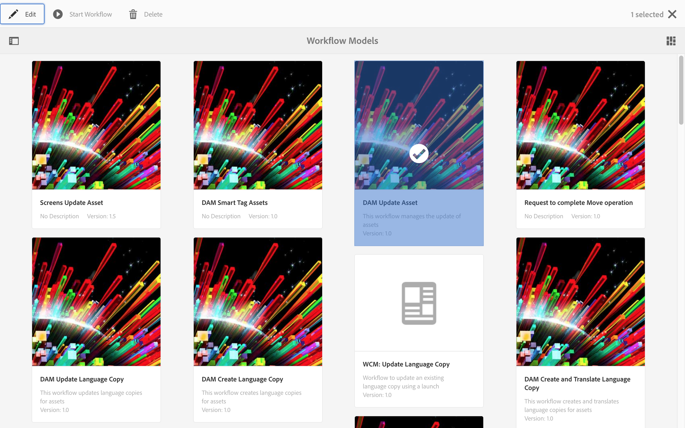
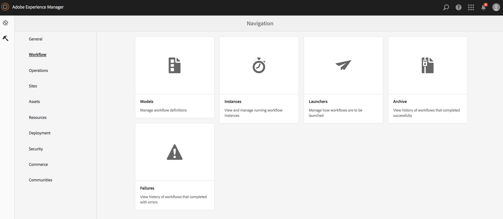
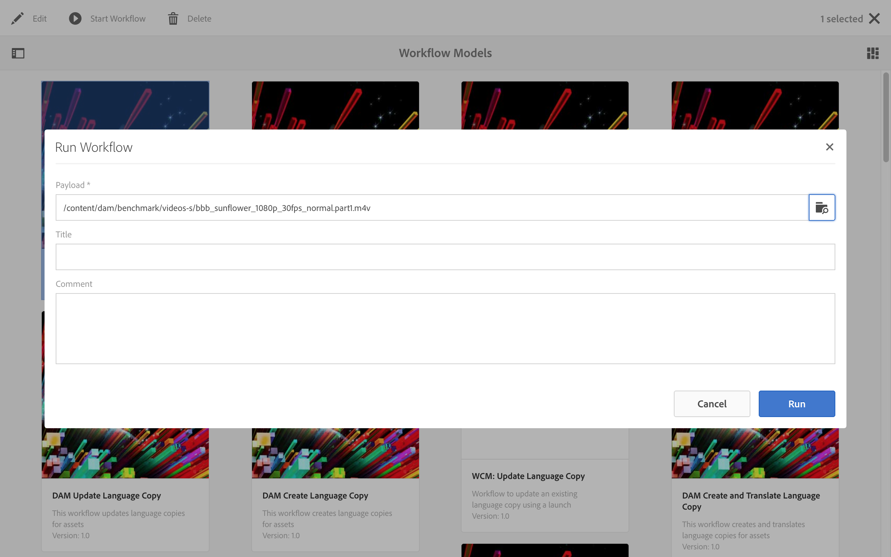

# Rappresentazioni video {#video-renditions}

È possibile generare copie trasformate Full HD manuali e automatiche. La sezione seguente descrive il flusso di lavoro per aggiungere rappresentazioni alle risorse.

## Generazione automatica di rappresentazioni Full HD {#automatically-generating-full-hd-renditions}

>[!NOTE]
>
>Se le rappresentazioni video di AEM Screens non vengono riprodotte in modo ottimale sul dispositivo, contatta il fornitore dell’hardware per le specifiche del video. In questo modo è possibile ottenere le migliori prestazioni sul dispositivo. Consente di creare un profilo video personalizzato con i parametri appropriati affinché FFMPEG possa generare la rappresentazione. Quindi, utilizza i passaggi seguenti per aggiungere il tuo profilo video personalizzato all’elenco dei profili.
>
>Consulta anche [Risoluzione dei problemi relativi ai video](troubleshoot-videos.md) per eseguire il debug e risolvere i problemi relativi alla riproduzione di video nel tuo canale.

Per generare automaticamente le rappresentazioni Full HD, effettua le seguenti operazioni:

1. Fai clic sul collegamento Adobe Experience Manager (in alto a sinistra) e sull&#39;icona del martello in modo da poter fare clic su **Flusso di lavoro**.

   Fare clic su **Modelli**.

   

1. Nella gestione del modello del flusso di lavoro, fai clic sul modello **Risorsa di aggiornamento DAM** e fai clic su **Modifica** nella barra delle azioni.

   

1. Nella finestra **Risorsa di aggiornamento DAM**, fai doppio clic sul passaggio **Trascodifica FFmpeg**.

   

1. Fare clic sulla scheda **Processo**.
1. Immetti i profili Full HD nell&#39;elenco in **Argomenti** come segue:
   ***`,profile:fullhd-bp,profile:fullhd-hp`***
1. Fai clic su **OK**.

   

1. Fai clic su **Salva** in alto a sinistra nella schermata **Aggiorna risorsa DAM**.

   

1. Passa a **Assets** e carica un nuovo video. Fai clic sul video e apri la barra laterale Rappresentazioni. Osservate i due video Full HD.

   

1. Apri **Rappresentazioni** dalla barra laterale.

   

1. Notate due nuove rappresentazioni Full HD.

   

## Generazione manuale di rappresentazioni Full HD {#manually-generating-full-hd-renditions}

Per generare manualmente le rappresentazioni Full HD, effettua le seguenti operazioni:

1. Fai clic sul collegamento Adobe Experience Manager (in alto a sinistra) e sull&#39;icona del martello in modo da poter fare clic su Strumenti e poi su **Flusso di lavoro**.

   Fare clic su **Modelli**.

   

1. Nella gestione del modello di flusso di lavoro, fai clic sul modello **Risorsa di aggiornamento Screens** e poi sul **Avvia flusso di lavoro** per aprire la finestra di dialogo **Esegui flusso di lavoro**.

   

1. Fai clic sul video desiderato nel **Payload** e fai clic su **Esegui**.

   

1. Passa a **Assets**, approfondisci la risorsa e fai clic su di essa.

   

1. Apri la barra laterale **Rendering**. Osservate le nuove rappresentazioni Full HD.

   
