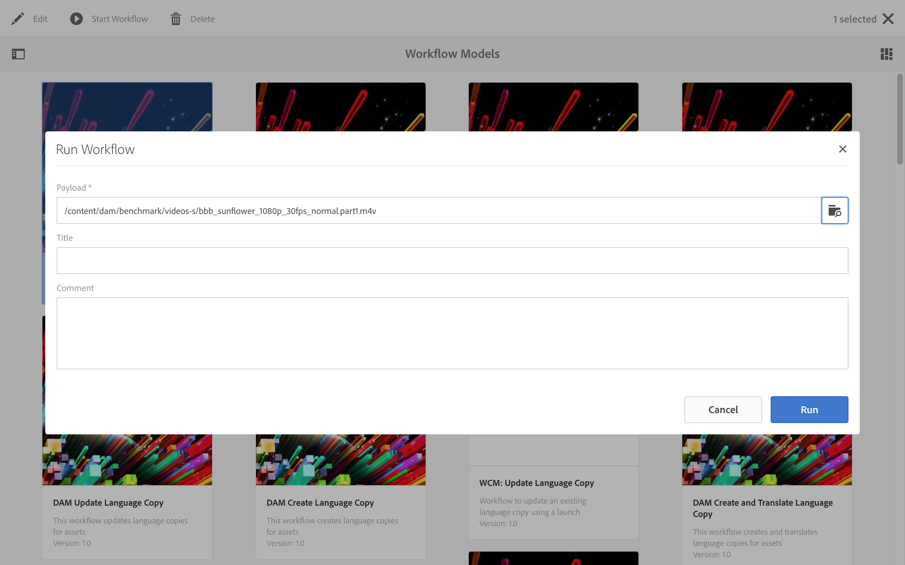

# Rappresentazioni video {#video-renditions}

Puoi generare elementi video in Full HD manuali e automatici. La sezione seguente descrive il flusso di lavoro che consente di aggiungere elementi video alle tue risorse.

## Generazione automatica di rappresentazioni in Full HD  {#automatically-generating-full-hd-renditions}

>[!NOTE]
>
>Nel caso in cui i rendering video di AEM Screens non vengano riprodotti in modo ottimale sul tuo dispositivo, contatta il fornitore dell'hardware per avere le specifiche del video. Questo ti consentirà di ottenere le migliori prestazioni sul dispositivo, e creare il tuo profilo video personalizzato in cui immettere i parametri che consentano a FFMPEG di creare rappresentazioni. Poi segui i passaggi descritti di seguito per aggiungere il tuo profilo video personalizzato all'elenco dei profili.
>
>Inoltre, consulta [Risoluzione problemi video](troubleshoot-videos.md) per il debug e la risoluzione dei problemi nella riproduzione video sul canale.

Segui i passaggi riportati di seguito per generare automaticamente rappresentazioni in Full HD:

1. Seleziona il collegamento ad Adobe Experience Manager (in alto a sinistra) e fai clic sull'icona a martello per accedere agli strumenti e poi a **Flusso di lavoro**.

   Click **Models** to enter the workflow models management.

   

1. Selezionate il modello **DAM Update Asset **e fate clic su Edit (Modifica) dalla barra delle azioni per aprire la finestra **DAM Update Asset*.

   

1. Fai doppio clic su **Transcodifica FFmpeg**.

   

1. Seleziona la scheda **Processo** per modificare gli argomenti del processo. Enter the full HD profiles to the list in **Arguments** as: ***,profile:fullhd-bp,profile:fullhd-hp*** and click **OK**.

   

1. Fare clic su **Save **in alto a sinistra nella schermata **DAM Update Asset **o.

   

1. Accedi a **Risorse** e carica un nuovo video. Fate clic sul video e aprite la barra laterale Rappresentazioni per visualizzare i due video HD completi.

   

1. Open **Renditions** from the side rail.

   

1. Noterai due nuove rappresentazioni in Full HD.

   

## Generazione manuale di rappresentazioni in Full HD {#manually-generating-full-hd-renditions}

Segui i passaggi riportati di seguito per generare manualmente le rappresentazioni in Full HD:

1. Seleziona il collegamento ad Adobe Experience Manager (in alto a sinistra) e fai clic sull'icona a martello per accedere agli strumenti e poi a **Flusso di lavoro**.

   Click **Models** to enter the workflow models management.

   

1. Select the **Screens Update Asset **model, and click the **Start Workflow** to open the **Run Workflow** dialog box.

   

1. Select the desired video in the **Payload** and click the **Run**.

   

1. Accedi a **Risorse**, trova e fai click sulla tua risorsa.

   

1. Apri la barra laterale **Rappresentazioni** e potrai vedere le nuove rappresentazioni in Full HD.

   

