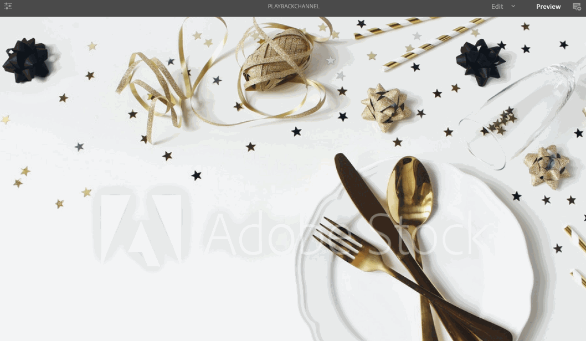

# Durata riproduzione immagine {#image-playback-duration}

## Panoramica {#overview}

Dopo aver creato un canale di sequenza e avervi aggiunto le immagini, per impostazione predefinita, tutte le immagini assumono la durata di riproduzione definita nella configurazione a livello di canale. Qualsiasi singola immagine può comunque ignorare l’impostazione predefinita e avere una durata di riproduzione diversa. Questa funzionalità viene eseguita modificando la durata di riproduzione del componente immagine specifico.

### Prerequisiti {#prerequisites}

Prima di implementare questa funzionalità, accertati di aver impostato un progetto come prerequisito per iniziare a implementarla. Ad esempio:

1. Crea un progetto AEM Screens (in questo esempio, **ChannelLevelPlayback**)
1. Crea un canale di sequenza come **PlaybackChannel** sotto **Canali** cartella
1. Aggiungi contenuto a **PlaybackChannel**

## Modifica dell&#39;assegnazione della durata di riproduzione immagine a livello di canale {#editing-channel-level-image-playback-duration-assignment}

La sezione seguente spiega come modificare la durata di riproduzione dei contenuti in un canale AEM Screens.

### Aggiornamento della durata di riproduzione per le immagini in un canale {#updating-the-playback-duration-for-images-in-a-channel}

Segui i passaggi seguenti per scoprire come aggiornare l’assegnazione della durata di riproduzione dell’immagine a livello di canale:

1. Passa al canale della sequenza **PlaybackChannel**.

   

1. Clic **Modifica** dalla barra delle azioni.

   

1. Aggiungi due o più immagini nell’editor canali, come illustrato nella figura riportata di seguito.

   

1. Fare clic su tutte le immagini nel canale e fare clic sull&#39;icona chiave inglese in alto a sinistra (come illustrato nella figura riportata di seguito). Viene visualizzata la finestra di dialogo Configura a livello di canale.

   

1. Il **Pagina** viene visualizzata.

   >[!NOTE]
   >
   >Per impostazione predefinita, le immagini in un canale sono impostate su una durata di riproduzione di 8 secondi.

   

   Modifica il **Durata** da 8000 (millisecondi) a 3000 (millisecondi), ovvero 3 secondi. Fai clic sul segno di spunta in alto a destra del **Pagina** in modo da poter salvare le modifiche.

   

### Visualizzazione del risultato {#viewing-the-result}

Dopo aver aggiornato la durata della riproduzione del canale (in questo esempio, tutte e tre le immagini), le immagini vengono ora riprodotte per 3 secondi anziché 8 secondi (valore predefinito).

