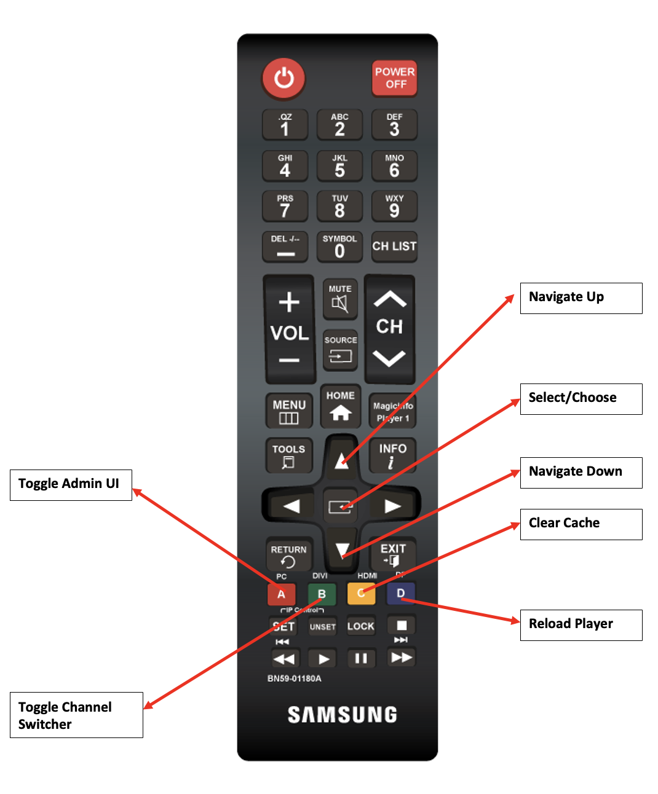

# Utilizzo del telecomando Screens {#implementing-remote-control}

La funzione di controllo remoto semplifica l’accesso all’interfaccia utente di amministrazione, al commutatore di canale o a funzioni quali Cancella cache e ricarica. Inoltre, fornisce un metodo per visualizzare la versione locale del firmware e le informazioni di sistema sul lettore. Questa funzionalità è particolarmente utile in quanto può essere difficile collegare un mouse. Oppure, utilizzare dispositivi di produzione fuori dalla portata e ancora di più se il lettore ha perso la connessione con l&#39;AEM. È utile anche quando si utilizza Samsung RMS perché la differenza di risoluzione può rendere difficile individuare e aprire l’interfaccia utente di amministrazione utilizzando un mouse.

## Combinazioni di tasti comuni del telecomando {#using-common-remote-control}

Su tutti i lettori è possibile utilizzare le seguenti combinazioni di tasti nel telecomando Screens:

1. Attiva/disattiva interfaccia utente amministratore - CTRL + 1
1. Attiva/disattiva cambio canale - CTRL + 2
1. Cancella cache - CTRL + ALT + 3
1. Ricarica lettore - CTRL + 4

## Combinazioni di tasti telecomando specifiche per il cittadino {#using-tizen-remote-control}

Specificamente per il lettore Tizen, è possibile utilizzare il telecomando hardware o il telecomando software disponibile in Samsung RMS per accedere a queste funzioni:

1. A - Attiva/Disattiva interfaccia utente amministratore
1. B - Attiva/disattiva switcher di canale
1. C - Cancella cache
1. D - Ricarica lettore

## Altre note sull’utilizzo {#using-additional-remote-control}

1. Con l’interfaccia utente di amministrazione aperta, puoi utilizzare le frecce su e giù per navigare tra le schede e visualizzare le informazioni nelle schede.
1. Con il commutatore di canale aperto, è possibile utilizzare i tasti freccia su e giù per navigare tra i canali. È inoltre possibile premere il tasto `Enter` (o il pulsante al centro delle frecce sul telecomando) per cambiare canale.

Il diagramma seguente illustra l’utilizzo chiave su un telecomando Samsung:


>[!NOTE]
>Se si impostano su false i valori di configurazione del dispositivo enableAdminUI e/o enableOSD, il telecomando non attiva l&#39;interfaccia utente di amministrazione e il commutatore di canale. Non è possibile utilizzare i tasti di direzione per navigare nell’interfaccia utente o nei canali di amministrazione. Tuttavia, puoi comunque cancellare la cache e ricaricare il lettore. È possibile disattivare la funzione di controllo remoto se una qualsiasi delle combinazioni di tastiera è in conflitto con il contenuto interattivo utilizzando questo codice:

```
require(['util/ScreensDisplay'], function() {window.ScreensDisplay.ignoreRemoteControl = true;}); 
```
