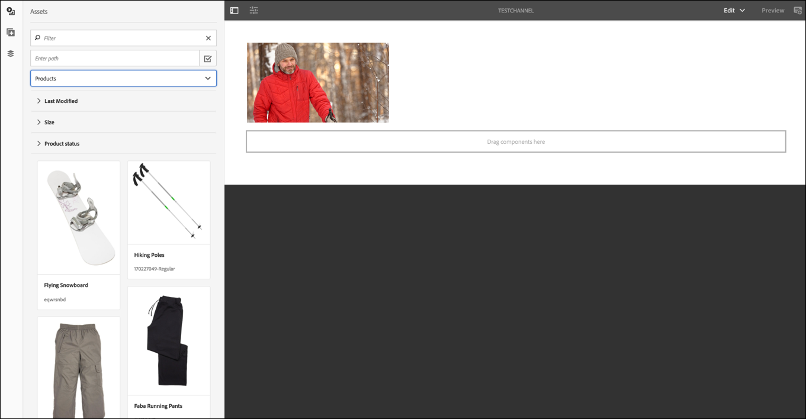

# Guida di Kickstart {#kickstart-guide}

Questa sezione è un esempio pratico per AEM Screens e illustra come eseguire azioni di base. Questa sezione descrive come impostare un'esperienza di digital signage di base con contenuti e risorse e pubblicare contenuti su un lettore Screens. Per una conoscenza approfondita di tutti i componenti per lo sviluppo di Screens, consultate le risorse alla fine della pagina.

## Creazione di un'esperienza di digital signage in 5 minuti {#creating-a-digital-signage-experience-in-minutes}

La procedura seguente consente di creare un progetto di esempio per Screens e pubblicare contenuti per il lettore Screens.

1. Per scaricare **AEM Screens Player**, fai clic [qui](https://download.macromedia.com/screens/).

   AEM Screens è disponibile anche in **Google Play**.

   Per l'implementazione di Chrome OS Player, consulta [Chrome Management Console](implementing-chrome-os-player.md) per ulteriori informazioni.

   Per ulteriori informazioni, vedere [Installazione e configurazione delle schermate](configuring-screens-introduction.md) .

   >[!NOTE]
   >
   >**Impostazioni OSGI**
   >
   >
   >È necessario abilitare il referente vuoto per consentire al dispositivo di inviare dati al server. Ad esempio, se la proprietà del referente vuoto è disabilitata, il dispositivo non può inviare una schermata indietro. Attualmente alcune di queste funzioni sono disponibili solo se il filtro Apache Sling Referrer Consenti nullo è abilitato nel configurazione OSGI. Il dashboard potrebbe visualizzare un avviso che segnala che le impostazioni di protezione potrebbero impedire il funzionamento di alcune di queste funzioni.
   >
   >
   >Per attivare il filtro ***Apache Sling Referrer Filter Allow Empty***, effettuate le seguenti operazioni:
   >
   >
   >
   >    1. Passa alla configurazione **della console Web di** Adobe Experience Manager, ovvero `https://localhost:4502/system/console/configMgr/org.apache.sling.security.impl.ReferrerFilter`.
   >    1. Selezionare l'opzione **allow.empty** .
   >    1. Fai clic su **Salva**.

1. **Creazione di un nuovo progetto**

   1. Seleziona il collegamento all’Adobe Experience Manager (in alto a sinistra) e quindi **Schermi**. In alternativa, potete navigare direttamente su `https://localhost:4502/screens.html/content/screens](https://localhost:4502/screens.html/content/screens`.

   1. Fai clic su **Crea** per creare un nuovo progetto Screens (vedi la figura qui sotto).
   1. Select **Screens** from the **Create Screens Project** wizard and click **Next**.

   1. Enter the title as *Test_Project*  and click **Create**.
   

   Una volta creato il progetto, tornerete alla console Progetto schermate. Ora puoi selezionare il progetto. In un progetto, ci sono cinque tipi di cartelle: **Applicazioni**, **Canali**, **Dispositivi**, **Posizioni** e **Pianificazioni**, come mostrato nella figura seguente.

   >[!NOTE]
   >
   >Le pianificazioni sono disponibili solo se hai installato AEM 6.3 Sites Feature Pack 1. Per accedere a questo Feature Pack, è necessario contattare Adobe Support e richiedere l'accesso. Una volta ottenute le autorizzazioni, è possibile scaricare il Feature Pack da Condivisione pacchetti.

   

   Per ulteriori informazioni, consulta [Creare e gestire il progetto](creating-a-screens-project.md) Schermi.

1. **Creazione di un nuovo canale**

   Una volta installato il progetto, è necessario creare un nuovo canale in cui gestire il contenuto.

   Per creare un nuovo canale per il progetto, effettuate le seguenti operazioni:

   1. Navigate to the *Test_Project* you created and select the **Channels** folder.

   1. Click **Create** from the action bar (see the figure below). Si apre una procedura guidata.
   1. Choose the **Sequence Channel** and click **Next**.

   1. Enter the **Name** and **Title** as *TestChannel* and click **Create**.
   

   Il *TestChannel* viene creato e aggiunto alla cartella dei canali, come illustrato nella figura riportata di seguito.

   

   Per ulteriori informazioni sulla creazione e la gestione dei canali, consulta [Gestione](managing-channels.md) dei canali.

1. **Aggiunta di contenuto a un canale**

   Una volta installato il canale, è necessario aggiungere al canale il contenuto che verrà visualizzato dal lettore Screens.

   Per aggiungere contenuti al canale (*TestChannel*) del progetto, effettuate le seguenti operazioni:

   1. Navigate to the *Test_Project* you created and select the **Channels** folder.

   1. Click **Edit** from the action bar (see the figure below). The editor for the *TestChannel* opens.

   1. Fai clic sull’icona che apre o chiude il pannello laterale sinistro della barra delle azioni per aprire le risorse e i componenti.
   1. Trascina i componenti da aggiungere al canale.
   

   In questo esempio, l’editor mostra un’immagine aggiunta al canale.

   

1. **Crea una nuova posizione**

   Una volta installato il canale, è necessario creare la posizione.

   ***Le posizioni*** consentono di compartimentare le diverse esperienze di digital signage e contengono le configurazioni dei display in base a dove si trovano i vari schermi.

   Per creare una nuova posizione per il progetto, effettuate le seguenti operazioni:

   1. Navigate to the *Test_Project* you created and select the **Locations** folder.

   1. Fate clic su **Crea** accanto all'icona più nella barra delle azioni (vedere la figura sotto). Si apre una procedura guidata.
   1. Select **Location** from the wizard and click **Next**.

   1. Enter the **Name** and **Title** for your location (enter the title as *TestLocation*) and click **Create**.
   

   Il *TestLocation* viene creato e aggiunto alla cartella **Locations** .

   

1. **Creazione di una nuova visualizzazione per *TestLocation***

   Dopo aver creato un percorso, è necessario creare una nuova visualizzazione per il percorso.

   ***I display*** rappresentano l'esperienza digitale che viene eseguita su uno o più schermi.

   1. Andate alla posizione in cui desiderate creare la visualizzazione (*Test_* Project —&gt; **Locations** —&gt; *TestLocation)* come illustrato nella figura precedente e selezionate *TestLocation*.

   1. Fai clic su **Crea** nella barra delle azioni.
   1. Select **Display** from the **Create** wizard and click **Next**.

   1. Immettete **Nome** e **Titolo** per la posizione di visualizzazione (immettete il titolo come *TestDisplay*).

   1. Under the **Display** tab, choose the details of the Layout.

      1. Choose the **Resolution** as **Full HD**.

      1. Choose the **Number of Devices Horizontally** as 1.
      1. Choose the **Number of Devices Vertically** as 1.
   1. Fai clic su **Crea**. 
   Nella posizione in cui si trova, viene aggiunto un nuovo display (*TestDisplay*) **, come illustrato nella figura riportata di seguito.

   

1. **Aggiunta di una pianificazione**

   Le *Pianificazioni*, negli AEM Screens, consentono di organizzare i canali in gruppi riutilizzabili, in modo da non dover ripetere la loro assegnazione singolarmente per ogni visualizzazione.

   >[!NOTE]
   >
   >Questa funzionalità Screens è disponibile solo se è stato installato AEM 6.3 Sites Feature Pack 1. Per accedere a questo Feature Pack, è necessario contattare Adobe Support e richiedere l'accesso. Una volta ottenute le autorizzazioni, è possibile scaricare il Feature Pack da Condivisione pacchetti.

   1. Andate alla cartella **Pianificazioni** da Test_Project &gt; **Pianificazioni**.

   1. Fai clic su **Crea** nella barra delle azioni. Si apre una procedura guidata.
   1. Selezionare **Pianificazione** dalla pagina **Creazione** guidata.

   1. Immettete **Nome** e **Titolo** come *MorningSchedule* nella pagina delle proprietà.

   1. Fate clic su **Crea** e la pianificazione verrà aggiunta alla cartella **Pianificazioni** , come illustrato nella figura seguente.
   

   Inoltre, seleziona la pianificazione (*MorningSchedule*) e fai clic su **Dashboard** nella barra delle azioni per visualizzare il dashboard delle pianificazioni. È possibile visualizzare/modificare le proprietà della pianificazione, assegnare canali e visualizzare gli schermi assegnati tramite il dashboard.

   

   Consultate [Creare e gestire le pianificazioni](managing-schedules.md) per ottenere informazioni dettagliate sulle pianificazioni.

1. **Assegnazione di un canale**

   1. Navigate to the display from *Test_Project* --&gt; **Locations** --&gt; *TestLocation* --&gt; *TestDisplay*.

   1. Select *TestDisplay* and tap/click **Assign Channel **from the action bar, *Or*,

   1. Click **Dashboard** and select **+Assign Channel** at the top right from **ASSIGNED CHANNELS &amp; SCHEDULES** panel, as shown in the figure below. **Viene visualizzata la finestra di dialogo Assegnazione** canale.

   1. Select **Reference Channel** by **path**

   1. Enter the **Channel Role** as *LiveStream*.

   1. Selezionate il percorso **del** canale (*Test_Project* —&gt; *Channels* —&gt; *TestChannel* ) nel **canale**.

   1. Select the **Priority** for this channel as *1*.

   1. Choose the **Supported Events** as **Initial Load** and **Idle Screen**.

   1. Immettere **Schedule** e selezionare le date in **attivo da** e **attivo fino**.

   1. Fai clic su **Salva**.
   Il canale viene creato e aggiunto al pannello.

   

   Per ulteriori informazioni sulla finestra di dialogo Assegnazione **** canale e sulle proprietà ad essa associate, vedere [Assegnazione canali](channel-assignment.md).

1. **Aggiunta di una pianificazione a un canale**

   1. Navigate to the display from *Test_Project* --&gt; **Locations** --&gt; *TestLocation* --&gt; *TestDisplay*.

   1. Click **Dashboard** and select **+Assign Schedule** at the top right from **ASSIGNED CHANNELS &amp; SCHEDULES** panel, as shown in the figure above. **Viene visualizzata la finestra di dialogo Assegnazione** pianificazione.

   1. Scegliete il percorso in cui avete creato la pianificazione (qui, *Test_Project* —&gt; **Pianificazioni** —&gt; *MorningSchedule*).

   1. Fai clic su **Salva** per aggiungere la pianificazione al canale.
   

1. **Registrazione di un dispositivo**

   È necessario registrare il dispositivo mediante il dashboard di AEM.

   >[!NOTE]
   >
   >Potete aprire il lettore Screens utilizzando l'app AEM Screens che avete scaricato o il browser Web.

   Per visualizzare il dispositivo in sospeso:

   1. Avvia una finestra separata del browser.
   1. Go to Screens player using the *web browser* `https://localhost:4502/content/mobileapps/cq-screens-player/firmware.html` or launch the AEM Screens app. Una volta aperto il dispositivo, vedrai che lo stato del dispositivo è non registrato.
   1. From the AEM dashboard, navigate to *Test_Project* --&gt; **Devices**

   1. Click **Device Manager** from the action bar.
   1. Fai clic su Registrazione **** dispositivo per visualizzare i dispositivi in sospeso, come illustrato nella figura riportata di seguito.
   

   Select the device you want to register and click **Register Device**.

   

   Dovrai convalidare il codice di verifica dal browser web o da AEM Screens Player.

   Click **Validate** to navigate to **Device Registration** screen.

   

   Enter **Title** and click **Register** and the device will be registered.

   Fate clic su **Fine** per completare il passaggio di registrazione del dispositivo.

   

   Facendo clic su **Fine** si torna alla pagina del dispositivo in cui sono visualizzati i dispositivi non assegnati e assegnati.

   

   >[!NOTE]
   >
   >Il dispositivo aggiunto viene visualizzato come **Non assegnato** con lo stato **Assegnato** .

1. **Assegnazione del dispositivo da visualizzare**

   Dopo aver registrato il dispositivo, è necessario assegnarlo a un display.

   Per assegnare un dispositivo, effettuate le operazioni seguenti:

   1. Selezionare il dispositivo da assegnare.
   1. Click **Assign Device** from the action bar.
   1. Seleziona il percorso di visualizzazione del canale come `/content/screens/Test_Project/***Locations***/TestLocation/TestDisplay.`

   1. Click **Assign**.
   1. Click **Finish** to complete the process, and now the device is assigned.
   

   Si apre il dashboard di visualizzazione e vengono visualizzate tutte le informazioni relative ai canali e alle pianificazioni assegnati insieme ai dettagli di configurazione del dispositivo.

   

### Viewing the content in Screens Player {#viewing-the-content-in-screens-player}

Dopo aver aggiunto le configurazioni di cui sopra, il lettore deve mostrare automaticamente il canale predefinito per la visualizzazione sul dispositivo, ad esempio un'immagine (in questo caso, un canale di sequenza e il contenuto è visibile in Screens Player per il browser Web).

Per informazioni dettagliate sul lettore AEM Screens, consultate Lettore [di](working-with-screens-player.md) AEM Screens.
