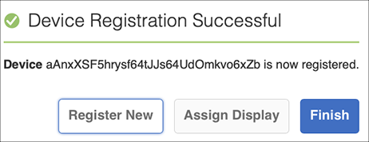

# Guida di Kickstart {#kickstart-guide}

Il kickstart per AEM Screens illustra come impostare ed eseguire un progetto AEM Screens. Illustra l’impostazione di un’esperienza di digital signage di base e l’aggiunta di contenuti quali risorse e/o video a ciascun canale, infine pubblica ulteriormente il contenuto in un lettore AEM Screens.

>[!NOTE]
>Prima di iniziare a lavorare sui dettagli del progetto, assicurati di aver installato l’ultimo Feature Pack per AEM Screens. Scarica l&#39;ultimo pacchetto di funzioni dal [portale di distribuzione software](https://experience.adobe.com/#/downloads/content/software-distribution/en/aem.html) utilizzando il tuo Adobe ID.

## Prerequisiti {#prerequisites}

Segui i passaggi riportati di seguito per creare un progetto di esempio per AEM Screens e pubblicare ulteriormente i contenuti in Screens Player.

>[!NOTE]
>L’esercitazione seguente mostra come riprodurre i contenuti del canale in Chrome OS Player.

>[!IMPORTANT]
>**Impostazioni di configurazione OSGi**
>È necessario abilitare il referente vuoto per consentire al dispositivo di inviare dati al server. Ad esempio, se la proprietà referrer vuota è disabilitata, il dispositivo non può inviare nuovamente una schermata. Attualmente alcune di queste funzioni sono disponibili solo se l’opzione Consenti vuoto del filtro di riferimento Apache Sling è abilitata nella configurazione OSGi. È possibile che nel dashboard venga visualizzato un avviso che segnala che le impostazioni di protezione potrebbero impedire il funzionamento di alcune di queste funzioni.
>Segui i passaggi riportati di seguito per abilitare il ***filtro di riferimento Apache Sling Allow Empty***:

## Consenti richieste referente vuote {#allow-empty-referrer-requests}

1. Passa a **Configurazione della console Web Adobe Experience Manager** tramite AEM istanza —> icona a forma di martello —> **Operazioni** —> **Console web**.

   

1. **Viene** aperta la configurazione della console Web Adobe Experience Manager. Cerca il referrer sling.

   Per cercare la proprietà del referente sling, premere **Comando+F** per **Mac** e **Control+F** per **Windows**.

1. Selezionare l&#39;opzione **Consenti valori vuoti**, come illustrato nella figura riportata di seguito.

   

1. Fai clic su **Salva** per abilitare il filtro di riferimento Apache Sling Allow Empty.

## Creazione di un’esperienza di digital signage in 5 minuti {#creating-a-digital-signage-experience-in-minutes}

### Creazione di un progetto AEM Screens {#creating-project}

Il primo passaggio consiste nel creare un progetto AEM Screens.

1. Passa all&#39;istanza Adobe Experience Manager (AEM) e fai clic su **Screens**. In alternativa, puoi navigare direttamente da `https://localhost:4502/screens.html/content/screens](https://localhost:4502/screens.html/content/screens`.

1. Fai clic su **Crea progetto Screens** per creare un nuovo progetto Screens. Inserisci il titolo come **DemoScreens** e fai clic su **Salva**.

   

   >[!NOTE]
   >Una volta creato il progetto, torna alla home page del progetto Screens. Ora puoi selezionare il progetto. In un progetto, sono presenti cinque cartelle diverse intitolate **Applicazioni**, **Canali**, **Dispositivi**, **Posizioni** e **Pianificazioni**.

### Creazione di un canale {#creating-channel}

Dopo aver creato il progetto AEM Screens, devi creare un nuovo canale in cui gestire il contenuto.

Per creare un nuovo canale per il progetto, effettua le seguenti operazioni:

1. Dopo aver creato un progetto, seleziona il progetto **DemoScreens** e seleziona la cartella **Canali** , come illustrato nella figura riportata di seguito. Fai clic su **+ Crea** dalla barra delle azioni.

   

1. Scegli il **Canale sequenza** dalla procedura guidata e fai clic su **Avanti**.
   

1. Inserisci il **Titolo** come **TestChannel** e fai clic su **Crea**.

   

   Il **TestChannel** viene ora aggiunto alla cartella dei canali, come illustrato nella figura riportata di seguito.

   

### Aggiunta di contenuto a un canale {#adding-content}

Una volta installato il canale, devi aggiungere al canale il contenuto che verrà visualizzato da AEM Screens Player.

Per aggiungere contenuti al canale (**TestChannel**) nel progetto, effettua le seguenti operazioni:

1. Passa al **ProgettoDemo** creato e seleziona il **CanaleTest** dalla cartella **Canali**.

1. Fai clic su **Modifica** nella barra delle azioni (vedi la figura seguente). Viene aperto l&#39;editor per **TestChannel**.

   

1. Fai clic sull’icona che apre o chiude il pannello laterale sinistro della barra delle azioni per aprire le risorse e i componenti.

1. Trascina i componenti da aggiungere al canale.

   

### Creazione di una posizione{#creating-location} 

Una volta installato il canale, devi creare una posizione.

>[!NOTE]
>***Posizioni*** separano le varie esperienze di digital signage e contiene le configurazioni dei display in base a dove si trovano i vari schermi.

Per creare una nuova posizione per il progetto, effettua le seguenti operazioni:

1. Passa alla cartella **DemoProject** creata e seleziona la cartella **Posizioni** .

1. Fai clic su **+ Crea** dalla barra delle azioni.

1. Seleziona **Posizione** dalla procedura guidata e fai clic su **Avanti**.

1. Inserisci il **Nome** per la posizione (inserisci il titolo come **TestLocation**) e fai clic su **Crea**.

La cartella **TestLocation** viene creata e aggiunta alla cartella **Locations**.

### Creazione di una visualizzazione per la posizione {#creating-display}

Una volta creata una posizione, è necessario creare una nuova visualizzazione per la posizione.

>[!NOTE]
>***Display*** rappresenta l&#39;esperienza digitale eseguita su uno o più schermi.

1. Passa a **TestLocation** e selezionalo.

1. Fai clic su **Crea** nella barra delle azioni.

   

1. Seleziona **Display** dalla procedura guidata **Crea** e fai clic su **Avanti**.

   

1. Inserisci il **Titolo** come **LobbyDisplay** e fai clic su **Crea**.

   

   Una nuova visualizzazione denominata **TestDisplay** viene ora aggiunta alla posizione **TestLocation**, come illustrato nella figura riportata di seguito.

   

### Assegnazione di un canale {#assigning-channel}

Una volta completata la configurazione del progetto, devi assegnare il canale a una visualizzazione per visualizzare il contenuto.

1. Passa alla visualizzazione richiesta da **DemoScreens** —> **Posizioni** —> **TestLocation** —> **LobbyDisplay**.

1. Tocca o fai clic su **Assegna canale** dalla barra delle azioni.

   

   Oppure,

   Tocca/fai clic su **Dashboard** dalla barra delle azioni e fai clic su **+Assegna canale** dal pannello **CANALI ASSEGNATI e PIANIFICAZIONI** .

   

1. Viene visualizzata la finestra di dialogo **Assegnazione canale**.

1. Dall&#39;opzione **Impostazioni**, scegli il canale **per percorso** e **Eventi supportati** come **Caricamento iniziale** e **Schermo di inattività**.

   >[!NOTE]
   >
   >I **Ruolo canale**, **Priorità** e **Metodi di interruzione** sono tutti popolati per impostazione predefinita. Per ulteriori informazioni sulle proprietà di assegnazione dei canali, consulta la sezione [Proprietà dei canali](/help/user-guide/channel-assignment-latest-fp.md#channel-properties) .

   

   Inoltre, puoi anche selezionare la **Finestra di attivazione** e la **Pianificazione ricorrenza**.

   >[!NOTE]
   >La *Pianificazione ricorrenza* consente di impostare una pianificazione ricorrente per il canale. Puoi impostare più pianificazioni di ricorrenza per un canale.
   >Per ulteriori informazioni, consulta [Pianificazione ricorrenza](/help/user-guide/channel-assignment-latest-fp.md#recurrence-schedule) .

1. Una volta configurate le preferenze, fai clic su **Salva**.

### Registrazione di un dispositivo e assegnazione di un dispositivo a una visualizzazione {#registering-device}

È necessario registrare il dispositivo utilizzando il dashboard AEM.

>[!IMPORTANT]
>Chrome OS Player può essere installato come plugin browser Chrome in modalità sviluppatore senza richiedere l&#39;effettivo dispositivo di chrome player. Per l&#39;installazione, segui i passaggi seguenti:
>
>1. Fai clic [qui](https://download.macromedia.com/screens/) per scaricare il lettore Chrome più recente.
>1. Decomprimere e salvarlo sul disco.
>1. Apri il browser Chrome e seleziona **Estensioni** dal menu o passa direttamente a ***chrome://extensions***.
>1. Accendi la **modalità Sviluppatore** dall&#39;angolo in alto a destra.
>1. Fai clic su **Carica deimballato** dall&#39;angolo in alto a sinistra e carica il lettore Chrome decompresso.
>1. Controlla il plug-in **AEM Screens Chrome Player** se disponibile nell&#39;elenco delle estensioni.
>1. Apri una nuova scheda e fai clic sull&#39;icona **App** dall&#39;angolo in alto a sinistra oppure passa direttamente a ***chrome://apps***.
>1. Fai clic su **AEM Screens** Plugin per avviare Chrome Player. Per impostazione predefinita, il lettore viene avviato in modalità a schermo intero. Premere **esc** per uscire dalla modalità a schermo intero.

Una volta attivato il lettore Chrome OS, segui i passaggi seguenti per registrare un dispositivo Chrome.

1. Passa alla cartella **Dispositivi** del progetto dall&#39;istanza AEM.

1. Tocca o fai clic su **Gestione dispositivi** nella barra delle azioni.

   

1. Tocca o fai clic su **Registrazione dispositivo** in alto a destra.

1. Seleziona il dispositivo richiesto e tocca o fai clic su **Registra dispositivo**.

   

1. Attendi che il dispositivo invii il suo codice di registrazione e controlla contemporaneamente il **Codice di registrazione** dal tuo dispositivo Chrome.
   

1. Se il **Codice di registrazione** è lo stesso su entrambi i computer, tocca/fai clic su **Convalida** in AEM.

1. Imposta il nome desiderato come **ChromeDevice forDemo** per il dispositivo, quindi fai clic su **Registra**.

   

1. Fare clic su **Assegna visualizzazione** nella finestra di dialogo **Registrazione dispositivo riuscita**.

   

1. Seleziona il percorso del tuo display come **DemoScreens** —> **Posizioni** —> **TestLocation** —> **LobbyDisplay** e fai clic su **Assegna**.

   

1. Una volta che il dispositivo è stato assegnato correttamente, verrà visualizzata la seguente conferma.

   

1. Tocca o fai clic su **Fine** per completare il processo di registrazione. Dovresti essere in grado di visualizzare il dispositivo registrato dal dashboard di visualizzazione.

   

### Visualizzazione del contenuto in Chrome Player {#viewing-content-output}

Tutte le risorse nel tuo canale ora stanno riproducendo sul tuo lettore Chrome OS.

Congratulazioni, stai riproducendo contenuti in un canale AEM Screens!

