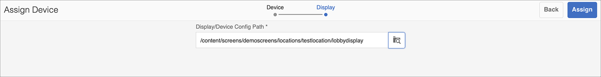

# Guida di Kickstart {#kickstart-guide}

Kick-Start per AEM Screens illustra come impostare ed eseguire un progetto AEM Screens. Illustra i passaggi necessari per configurare un’esperienza di digital signage di base, aggiungere contenuti quali risorse e/o video a ciascun canale e successivamente pubblicarli su un lettore AEM Screens.

>[!NOTE]
>Prima di iniziare a lavorare sui dettagli del progetto, assicurati di aver installato il Feature Pack più recente per AEM Screens. Puoi scaricare il feature pack più recente dalla sezione [Portale di distribuzione software](https://experience.adobe.com/#/downloads/content/software-distribution/it/aem.html) utilizzando il tuo Adobe ID.

## Prerequisiti {#prerequisites}

Segui i passaggi seguenti per creare un progetto di esempio per AEM Screens e pubblicare ulteriormente i contenuti su Screens player.

>[!NOTE]
>Il seguente tutorial mostra come riprodurre il contenuto del canale in Chrome OS Player.

>[!IMPORTANT]
>**Impostazioni configurazione OSGi**
>È necessario abilitare il referente vuoto per consentire al dispositivo di pubblicare dati sul server. Ad esempio, se la proprietà del referente vuoto è disabilitata, il dispositivo non può pubblicare uno screenshot. Attualmente alcune di queste funzioni sono disponibili solo se nella configurazione OSGi è abilitato Apache Sling Referrer Filter Allow Empty. È possibile che nel dashboard venga visualizzato un avviso che segnala che le impostazioni di protezione potrebbero impedire il funzionamento di alcune di queste funzionalità.
>Per attivare la funzionalità ***Il Filtro Di Riferimento Apache Sling Consenti Vuoto***:

## Consenti richieste referrer vuote {#allow-empty-referrer-requests}

1. Accedi a **Configurazione della console web Adobe Experience Manager** tramite istanza AEM —> icona martello —> **Operazioni** —> **Console web**.

   

1. **Configurazione della console web Adobe Experience Manager** viene aperto. Cerca il referente sling.

   Per cercare la proprietà del referente sling, premi **Comando+F** per **Mac** e **Ctrl+F** per **Windows**.

1. Controlla la **Consenti vuoto** come illustrato nella figura riportata di seguito.

   

1. Clic **Salva** per abilitare Apache Sling Referrer Filter Allow Empty (Consenti vuoto).

## Creazione di un&#39;esperienza di digital signage in 5 minuti {#creating-a-digital-signage-experience-in-minutes}

### Creazione di un progetto AEM Screens {#creating-project}

Il primo passaggio consiste nel creare un progetto AEM Screens.

1. Passa all’istanza di Adobe Experience Manager (AEM) e fai clic su **Schermi**. In alternativa, puoi navigare direttamente da `https://localhost:4502/screens.html/content/screens](https://localhost:4502/screens.html/content/screens`.

1. Clic **Crea progetto Screens** per creare un nuovo progetto Screens. Inserisci il titolo come **DemoScreens** e fai clic su **Salva**.

   

   >[!NOTE]
   >Una volta creato il progetto, si torna alla home page del progetto Schermi. Ora puoi selezionare il progetto. In un progetto, ci sono cinque cartelle diverse denominate **Applicazioni**, **Canali**, **Dispositivi**, **Posizioni**, e **Schedules**.

### Creazione di un canale {#creating-channel}

Dopo aver creato il progetto AEM Screens, devi creare un nuovo canale in cui gestire il contenuto.

Per creare un nuovo canale per il progetto, segui i passaggi seguenti:

1. Dopo aver creato un progetto, seleziona **DemoScreens** e seleziona la **Canali** come illustrato nella figura seguente. Clic **+ Crea** dalla barra delle azioni.

   

1. Scegli la **Canale sequenza** dalla procedura guidata e fai clic su **Successivo**.
   

1. Inserisci il **Titolo** as **TestChannel** e fai clic su **Crea**.

   

   Il **TestChannel** viene ora aggiunto alla cartella dei canali, come illustrato nella figura riportata di seguito.

   

### Aggiunta di contenuto a un canale {#adding-content}

Una volta impostato il canale, devi aggiungere al canale il contenuto che verrà visualizzato dal lettore AEM Screens.

Per aggiungere contenuti al canale, segui la procedura riportata di seguito (**TestChannel**) nel progetto:

1. Accedi a **DemoProject** hai creato e seleziona la **TestChannel** dal **Canali** cartella.

1. Clic **Modifica** dalla barra delle azioni (vedere la figura seguente). Editor per **TestChannel** viene aperto.

   

1. Fai clic sull’icona che attiva il pannello laterale a sinistra della barra delle azioni per aprire le risorse e i componenti.

1. Trascina i componenti da aggiungere al canale.

   

### Creazione di una posizione {#creating-location}

Una volta che hai impostato il canale, devi creare una posizione.

>[!NOTE]
>***Posizioni*** suddividere le varie esperienze di digital signage e contiene le configurazioni dei display in base alla posizione dei vari schermi.

Per creare una nuova posizione per il progetto, segui i passaggi seguenti:

1. Accedi a **DemoProject** hai creato e seleziona la **Posizioni** cartella.

1. Clic **+ Crea** dalla barra delle azioni.

1. Seleziona **Posizione** dalla procedura guidata e fai clic su **Successivo**.

1. Inserisci il **Nome** per la tua posizione (inserisci il titolo come **TestLocation**) e fai clic su **Crea**.

Il **TestLocation** viene creato e aggiunto al tuo **Posizioni** cartella.

### Creazione di una visualizzazione per la posizione {#creating-display}

Dopo aver creato una posizione, è necessario crearne una nuova.

>[!NOTE]
>***Visualizzazione*** rappresenta l’esperienza digitale che viene eseguita su uno o più schermi.

1. Accedi a **TestLocation** e selezionala.

1. Clic **Crea** dalla barra delle azioni.

   

1. Seleziona **Visualizzazione** dal **Crea** e fai clic su **Successivo**.

   

1. Inserisci il **Titolo** as **LobbyDisplay** e fai clic su **Crea**.

   

   Una nuova visualizzazione con titolo **TestDisplay** è ora aggiunto alla tua posizione **TestLocation**, come illustrato nella figura seguente.

   

### Assegnazione di un canale {#assigning-channel}

Una volta completata la configurazione del progetto, devi assegnare il canale a una visualizzazione per visualizzare il contenuto.

1. Passa alla visualizzazione desiderata da **DemoScreens** —> **Posizioni** —> **TestLocation** —> **LobbyDisplay**.

1. Tocca o fai clic **Assegna canale** dalla barra delle azioni.

   

   Oppure,

   Tocca o fai clic **Dashboard** dalla barra delle azioni e fai clic su **+Assegna canale** dal **CANALI E PIANIFICAZIONI ASSEGNATI** pannello.

   

1. Il **Assegnazione canale** viene visualizzata.

1. Dalla sezione **Impostazioni** , scegli il canale **per percorso**  e **Eventi supportati** as **Caricamento iniziale** e **Schermata di inattività**.

   >[!NOTE]
   >
   >Il **Ruolo canale**, **Priorità**, e **Metodi di interruzione** sono tutti compilati per impostazione predefinita. Consulta [Proprietà canale](/help/user-guide/channel-assignment-latest-fp.md#channel-properties) per ulteriori informazioni sulle proprietà di assegnazione dei canali.

   

   Inoltre, puoi anche selezionare **Finestra di attivazione** e **Pianificazione ricorrenza**.

   >[!NOTE]
   >Il *Pianificazione ricorrenza* consente di impostare una pianificazione ricorrente per il canale. Puoi impostare più pianificazioni di ricorrenza per un canale.
   >Consulta [Pianificazione ricorrenza](/help/user-guide/channel-assignment-latest-fp.md#recurrence-schedule) per ulteriori dettagli.

1. Clic **Salva** dopo aver configurato le preferenze.

### Registrazione di un dispositivo e assegnazione del dispositivo a una visualizzazione {#registering-device}

È necessario registrare il dispositivo utilizzando il dashboard AEM.

>[!IMPORTANT]
>Chrome OS Player può essere installato come plugin del browser Chrome in modalità sviluppatore senza richiedere il dispositivo effettivo del lettore chrome. Per l&#39;installazione, procedere come segue:
>
>1. Clic [qui](https://download.macromedia.com/screens/) per scaricare il lettore Chrome più recente.
>1. Decomprimi e salva su disco.
>1. Apri il browser Chrome e seleziona **Estensioni** dal menu o passa direttamente a ***chrome://extensions***.
>1. Accendere il **Modalità sviluppatore** dall&#39;angolo superiore destro.
>1. Fai clic su **Carica decompresso** dall’angolo in alto a sinistra e carica Chrome Player decompresso.
>1. Verifica **AEM Screens Chrome Player** plugin se disponibile nell’elenco delle estensioni.
>1. Apri una nuova scheda e fai clic su **App** dall&#39;angolo in alto a sinistra, oppure naviga direttamente in ***chrome://apps***.
>1. Fai clic su **AEM Screens** Plug-in per avviare Chrome Player. Per impostazione predefinita, il lettore viene avviato in modalità a schermo intero. Premi **esc** per uscire dalla modalità a tutto schermo.

Una volta che il lettore Chrome OS è acceso, segui i passaggi seguenti per registrare un dispositivo Chrome.

1. Accedi a **Dispositivi** del progetto dall’istanza AEM.

1. Tocca o fai clic sul pulsante **Gestione dispositivi** dalla barra delle azioni.

   

1. Tocca o fai clic sul pulsante **Registrazione dispositivo** in alto a destra.

1. Seleziona il dispositivo richiesto e tocca o fai clic **Registra dispositivo**.

   

1. Attendere che il dispositivo invii il suo codice di registrazione e contemporaneamente controllare **Codice di registrazione** dal dispositivo Chrome.
   

1. Se il **Codice di registrazione** è lo stesso in entrambi i computer, tocca o fai clic su **Convalida** nell&#39;AEM.

1. Imposta il nome desiderato come **ChromeDeviceForDemo** per il dispositivo e fare clic su **Registrati**.

   

1. Clic **Assegna visualizzazione** dal **Registrazione dispositivo completata** .

   

1. Seleziona il percorso per la visualizzazione come **DemoScreens** —> **Posizioni** —> **TestLocation** —> **LobbyDisplay** e fai clic su **Assegna**.

   

1. Una volta che il dispositivo è stato assegnato correttamente, verrà visualizzata la seguente conferma.

   

1. Tocca o fai clic **Fine** per completare il processo di registrazione. Dovresti essere in grado di visualizzare il dispositivo registrato dal dashboard di visualizzazione.

   

### Visualizzazione del contenuto in Chrome Player {#viewing-content-output}

Tutte le risorse nel canale vengono ora riprodotte sul lettore Chrome OS.

Congratulazioni per aver iniziato a riprodurre contenuti in un canale AEM Screens.

