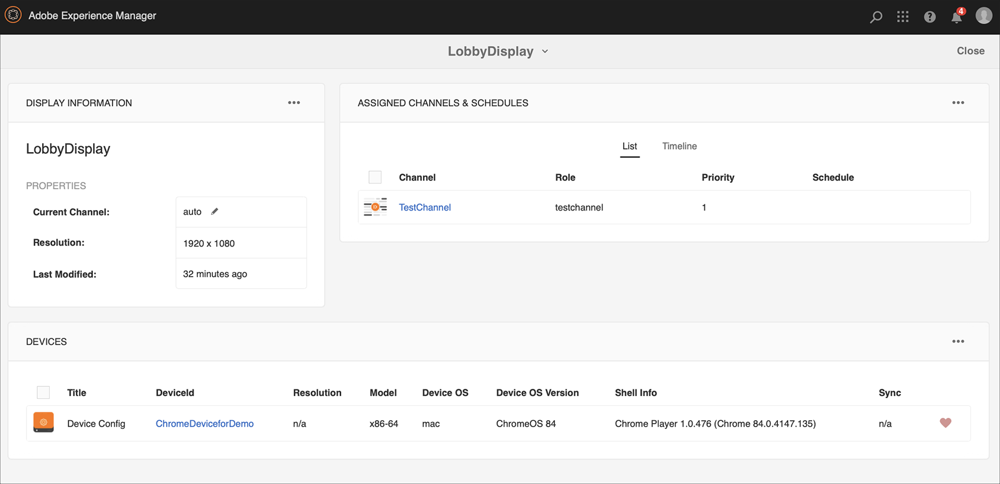

# Guida di Kickstart {#kickstart-guide}

Kick-Start per AEM Screens illustra come impostare ed eseguire un progetto AEM Screens. Illustra i passaggi necessari per configurare un’esperienza di digital signage di base, aggiungere contenuti quali risorse e/o video a ciascun canale e successivamente pubblicarli in un lettore AEM Screens.

>[!NOTE]
>Prima di lavorare sui dettagli del progetto, assicurati di aver installato il Feature Pack più recente per AEM Screens. Puoi scaricare il Feature Pack più recente dal [portale di distribuzione software](https://experience.adobe.com/#/downloads/content/software-distribution/it/aem.html) tramite il tuo Adobe ID.

## Prerequisiti {#prerequisites}

Segui i passaggi seguenti per creare un progetto di esempio per AEM Screens e pubblicare ulteriormente i contenuti sul lettore Screens.

>[!NOTE]
>Il seguente tutorial mostra come riprodurre il contenuto del canale in un lettore Chrome OS.

>[!IMPORTANT]
>**Impostazioni configurazione OSGi**
>&#x200B;>È necessario abilitare il referente vuoto per consentire al dispositivo di pubblicare dati sul server. Ad esempio, se la proprietà del referente vuoto è disabilitata, il dispositivo non può pubblicare uno screenshot. Attualmente alcune di queste funzioni sono disponibili solo se il filtro Referrer `Apache Sling` Consenti vuoto è abilitato nella configurazione OSGi. È possibile che nel dashboard venga visualizzato un avviso che segnala che le impostazioni di protezione potrebbero impedire il funzionamento di alcune di queste funzionalità.
>&#x200B;>Segui i passaggi seguenti per abilitare il filtro di riferimento Sling ***Apache Consenti vuoto***:

## Consenti richieste referrer vuote {#allow-empty-referrer-requests}

1. Passa a **Configurazione console Web Adobe Experience Manager** tramite l&#39;istanza AEM > icona martello > **Operazioni** > **Console Web**.

   

1. **Configurazione console Web Adobe Experience Manager** aperta. Cerca il referente sling.

   Per eseguire ricerche nella proprietà del referente sling, premere **Comando+F** per **Mac** e **Controllo+F** per **Windows**.

1. Selezionare l&#39;opzione **Consenti vuoto**, come illustrato nella figura seguente.

   

1. Fai clic su **Salva** per abilitare il filtro di riferimento Apache Sling Consenti vuoto.

## Creazione di un&#39;esperienza di digital signage in 5 minuti {#creating-a-digital-signage-experience-in-minutes}

### Creazione di un progetto AEM Screens {#creating-project}

Il primo passaggio consiste nel creare un progetto AEM Screens.

1. Passa all&#39;istanza di Adobe Experience Manager (AEM) e fai clic su **Screens**. In alternativa, è possibile spostarsi direttamente da `https://localhost:4502/screens.html/content/screens](https://localhost:4502/screens.html/content/screens`.

1. Fare clic su **Crea progetto Screens** per creare un progetto Screens.
1. Immetti il titolo come **DemoScreens**, quindi fai clic su **Salva**.

   

   >[!NOTE]
   >Dopo aver creato il progetto, si torna alla home page del progetto AEM Screens. Ora puoi fare clic sul progetto. In un progetto sono presenti cinque cartelle diverse con titolo **Applicazioni**, **Canali**, **Dispositivi**, **Percorsi** e **Pianificazioni**.

### Creazione di un canale {#creating-channel}

Dopo aver creato il progetto AEM Screens, crea un canale in cui gestire il contenuto.

Per creare un canale per il progetto, segui i passaggi seguenti:

1. Dopo aver creato un progetto, fai clic sul progetto **DemoScreens** e quindi sulla cartella **Channels**, come illustrato nella figura seguente. Fare clic su **+ Crea** dalla barra delle azioni.

   

1. Scegli il **canale sequenza** dalla procedura guidata e fai clic su **Avanti**.
   

1. Immetti il **Titolo** come **TestChannel** e fai clic su **Crea**.

   

   **TestChannel** è stato aggiunto alla cartella dei canali, come illustrato nella figura seguente.

   

### Aggiunta di contenuto a un canale {#adding-content}

Una volta impostato il canale, aggiungi al canale contenuto che AEM Screens Player può visualizzare.

Segui i passaggi seguenti per aggiungere contenuti al canale (**TestChannel**) nel progetto:

1. Passa al **DemoProject** creato e fai clic su **TestChannel** dalla cartella **Channels**.

1. Fai clic su **Modifica** nella barra delle azioni (vedi la figura seguente). Verrà aperto l&#39;editor per **TestChannel**.

   

1. Fai clic sull’icona che attiva il pannello laterale a sinistra della barra delle azioni per aprire le risorse e i componenti.

1. Trascina i componenti da aggiungere al canale.

   

### Creazione di una posizione {#creating-location}

Una volta impostato il canale, crea una posizione.

>[!NOTE]
>***Posizioni*** suddividono in compartimenti le varie esperienze di segnaletica digitale e contengono le configurazioni dei display in base alla posizione dei vari schermi.

Per creare una posizione per il progetto, segui i passaggi seguenti:

1. Passa al **Progetto demo** creato e fai clic sulla cartella **Percorsi**.
1. Fare clic su **+ Crea** dalla barra delle azioni.
1. Fai clic su **Posizione** nella procedura guidata e fai clic su **Avanti**.
1. Immetti il **Nome** per la tua posizione (immetti il titolo come **PosizioneTest**) e fai clic su **Crea**.

La **PosizioneTest** è stata creata e aggiunta alla cartella **Posizioni**.

### Creazione di una visualizzazione per la posizione {#creating-display}

Dopo aver creato una posizione, creane una corrispondente.

>[!NOTE]
>***Visualizzazione*** rappresenta l&#39;esperienza digitale eseguita su uno o più schermi.

1. Passare a **TestLocation** e fare clic su di esso.
1. Fai clic su **Crea** nella barra delle azioni.

   

1. Fare clic su **Visualizza** dalla procedura guidata **Crea** e fare clic su **Avanti**.

   

1. Immetti il **Titolo** come **LobbyDisplay** e fai clic su **Crea**.

   

   Una nuova visualizzazione con titolo **TestDisplay** è ora aggiunta alla tua posizione **TestLocation**, come illustrato nella figura seguente.

   

### Assegnazione di un canale {#assigning-channel}

Al termine della configurazione del progetto, assegna il canale a una visualizzazione per visualizzare il contenuto.

1. Passa alla visualizzazione richiesta da **DemoScreens** > **Posizioni** > **TestLocation** > **LobbyDisplay**.

1. Fare clic su **Assegna canale** nella barra delle azioni.

   

   Oppure

   Fai clic su **Dashboard** nella barra delle azioni, quindi fai clic su **+Assegna canale** nel pannello **CANALI E PIANIFICAZIONI ASSEGNATI**.

   

1. Viene visualizzata la finestra di dialogo **Assegnazione canale**.

1. Dall&#39;opzione **Impostazioni**, scegliere il canale **per percorso** e **Eventi supportati**, ad esempio **Caricamento iniziale** e **Schermata di inattività**.

   >[!NOTE]
   >
   >I **metodi di interruzione**, **Priorità** e **Ruolo canale** sono tutti compilati per impostazione predefinita. Consulta la sezione [Proprietà canale](/help/user-guide/channel-assignment-latest-fp.md#channel-properties) per ulteriori informazioni sulle proprietà di assegnazione canale.

   

   È inoltre possibile fare clic su **Finestra di attivazione** e **Pianificazione ricorrenza**.

   >[!NOTE]
   >La *pianificazione ricorrenza* ti consente di impostare una pianificazione ricorrente per il tuo canale. È possibile impostare più pianificazioni di ricorrenza per un canale.
   >Per ulteriori dettagli, vedi [Pianificazione ricorrenza](/help/user-guide/channel-assignment-latest-fp.md#recurrence-schedule).

1. Dopo aver configurato le preferenze, fai clic su **Salva**.

### Registrazione di un dispositivo e assegnazione del dispositivo a una visualizzazione {#registering-device}

Registra il dispositivo utilizzando la dashboard di AEM.

>[!IMPORTANT]
>Chrome OS Player può essere installato come plug-in del browser Chrome in modalità sviluppatore senza richiedere un dispositivo Chrome Player effettivo. Per l&#39;installazione, procedere come segue:
>
>1. Fai clic [qui](https://download.macromedia.com/screens/) per scaricare il lettore Chrome più recente.
>1. Decomprimi e salva su disco.
>1. Apri il browser Chrome e fai clic su **Estensioni** dal menu o passa direttamente a ***chrome://extensions***.
>1. Attiva la **modalità sviluppatore** dall&#39;angolo superiore destro.
>1. Fai clic su **Carica decompresso** dall&#39;angolo in alto a sinistra e carica Chrome Player decompresso.
>1. Controllare il plug-in **AEM Screens Chrome Player** se è disponibile nell&#39;elenco delle estensioni.
>1. Apri una nuova scheda e fai clic sull&#39;icona **App** in alto a sinistra oppure passa direttamente a ***chrome://apps***.
>1. Fare clic sul plug-in **AEM Screens** per avviare Chrome Player. Per impostazione predefinita, il lettore viene avviato in modalità a schermo intero. Premere **Esc** per uscire dalla modalità a schermo intero.

Dopo aver acceso il lettore Chrome OS, attenersi alla procedura seguente per registrare un dispositivo Chrome.

1. Passa alla cartella **Dispositivi** del progetto dalla tua istanza di AEM.

1. Fare clic su **Gestione dispositivi** nella barra delle azioni.

   

1. Fai clic su **Registrazione dispositivo** in alto a destra.

1. Fare clic sul dispositivo richiesto e fare clic su **Registra dispositivo**.

   

1. Attendi che il dispositivo invii il suo codice di registrazione e controlla contemporaneamente il **codice di registrazione** dal tuo dispositivo Chrome.
   

1. Se il **Codice di registrazione** è lo stesso in entrambi i computer, fare clic su **Convalida** in AEM.

1. Imposta il nome desiderato come **ChromeDeviceforDemo** per il dispositivo e fai clic su **Registra**.

   

1. Fare clic su **Assegna visualizzazione** nella finestra di dialogo **Registrazione dispositivo completata**.

   

1. Fai clic sul percorso della tua visualizzazione come **DemoScreens** > **Posizioni** > **TestLocation** > **LobbyDisplay** e fai clic su **Assegna**.

   

1. Quando il dispositivo è stato assegnato correttamente, viene visualizzata la seguente conferma.

   

1. Fai clic su **Fine** per completare il processo di registrazione. È ora possibile visualizzare il dispositivo registrato dal dashboard di visualizzazione.

   

### Visualizzazione del contenuto in Chrome Player {#viewing-content-output}

Tutte le risorse nel canale vengono ora riprodotte sul lettore Chrome OS.

Congratulazioni per aver iniziato a riprodurre contenuti in un canale AEM Screens.

