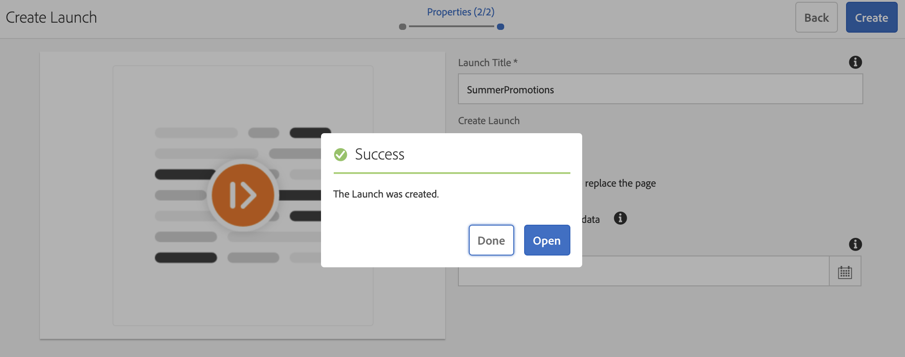

# Aggiornamenti dei contenuti con Screens Launch {#launches}

Gli autori dei contenuti possono creare una versione futura dei canali e impostare ulteriormente la data di pubblicazione di questo lancio. Questa funzionalità consente di riprodurre il contenuto in tempo reale su dispositivi o lettori alla data di pubblicazione specificata.

Con l&#39;aiuto di ***Screens Launch***, gli autori possono visualizzare in anteprima ogni canale nel lancio e dovrebbero essere in grado di avviare una richiesta di revisione. Il gruppo di approvatori riceve una notifica e può approvare o rifiutare la richiesta. Una volta raggiunta la data di attivazione, il contenuto viene riprodotto nei dispositivi.

Ad esempio, se l’autore desidera creare versioni future di c1, c2 (canali), viene creato un lancio e viene impostata una data di attivazione (ad esempio, 10 novembre alle 8.00). Eventuali altri aggiornamenti nel contenuto vengono inviati per la revisione.

Dopo l’approvazione e nella data di attivazione (10 novembre, 8:00), questo lancio riproduce il contenuto sui dispositivi o sui lettori.

## Requisiti {#requirements}

Prima di iniziare a utilizzare *Screens Launch* in un progetto AEM Screens, accertati di comprendere il concetto di periodo di tolleranza e la sua rilevanza.

L&#39;esecuzione di un&#39;esperienza nella data di attivazione impostata sul lettore comporta:

* La promozione del lancio (in genere richiede alcuni secondi).

* La pubblicazione delle risorse nelle istanze di pubblicazione (in genere richiede alcuni minuti, a seconda delle dimensioni dei canali o delle risorse da pubblicare).

* Tempo impiegato per il completamento dell’aggiornamento del contenuto offline (in genere richiede qualche minuto).

* Tempo impiegato dai lettori per scaricare il contenuto dall’istanza di pubblicazione (in genere richiede minuti a seconda della larghezza di banda e delle dimensioni delle risorse da scaricare).

* Differenze in qualsiasi momento tra server e lettore.

### Informazioni sul periodo di tolleranza {#understanding-grace-period}

Affinché il lettore possa iniziare a riprodurre il contenuto nella data di pubblicazione impostata, avvia le attività precedenti prima della data di pubblicazione.

Se la data di attivazione è *24 novembre, 09:00* e *24 ore* è il periodo di tolleranza, la sequenza di azioni sopra indicata inizia in (data di attivazione - periodo di tolleranza), ovvero 23 novembre, 00:00 ora del server. Questa impostazione offre 24 ore per completare tutte le azioni sopra menzionate affinché il contenuto raggiunga i lettori. I giocatori capiscono che questo periodo è un contenuto di lancio. Di conseguenza, il contenuto non viene riprodotto immediatamente, ma i lettori possono memorizzarlo come versione futura e farne iniziare la riproduzione esattamente alla data di trasmissione impostata sul fuso orario del lettore.

Ad esempio, il server è in PST e i dispositivi sono in EST. La differenza massima è di tre ore. Si presuppone che la promozione richieda 1 minuto e che la pubblicazione dall’autore alla pubblicazione richieda 10 minuti e che il lettore possa scaricare le risorse in genere in 10-15 minuti. Quindi il periodo di tolleranza = differenza di tempo (tre ore):

* Più tempo per promuovere il lancio (1 minuto)
* Più tempo per pubblicare il lancio (10 minuti)
* Più tempo per scaricare sul lettore (10-15 minuti)
* Più buffer (30 minuti)

Pertanto, 3 ore e 56 minuti (14160 secondi).

Pertanto, ogni volta che pianifichi un lancio in diretta, la promozione inizia presto tenendo conto di questo offset. Nell&#39;equazione precedente, la maggior parte degli elementi non richiede molto tempo. È possibile utilizzare una stima corretta per questo offset quando si conosce la differenza di tempo massima tra il server e qualsiasi lettore.

>[!NOTE]
>
>Il periodo di tolleranza predefinito per Screens Launch è impostato su 24 ore. Ciò significa che quando imposti una data di attivazione per qualsiasi lancio per le risorse in */content/screens*, la promozione inizia con questo offset.

### Aggiornamento del periodo di tolleranza predefinito {#updating-out-of-the-box-grace-period}

Questa sezione spiega come aggiornare a 10 minuti un periodo di tolleranza predefinito.

1. Passare a CRXDE Lite e quindi a `/libs/system/config.author/com.adobe.cq.wcm.launches.impl.LaunchesEventHandler.config`.
1. Fare clic con il pulsante destro del mouse e copiare il file.
1. Passare a `/apps/system/config` e fare clic con il pulsante destro del mouse e incollare.
1. Fare doppio clic su `/apps/system/config/com.adobe.cq.wcm.launches.impl.LaunchesEventHandler.config` per aprire il file nell&#39;editor in CRXDE Lite. Deve mostrare il periodo di tolleranza per il percorso */content/screens/* come **86400**. Cambia il valore in **600**.

Il contenuto del file di testo dovrebbe ora essere simile al seguente:

```java
launches.eventhandler.launch.promotion.graceperiod=[ \
   "/content/screens(/.*):600", \
   ]
```

Nell’esempio precedente, il periodo di tolleranza viene impostato su 10 minuti. Pertanto, quando imposti una data di attivazione per qualsiasi lancio per le risorse in */content/screens*, la promozione inizia con questo offset.

Ad esempio, se la data di attivazione è impostata sul 24 novembre alle 9 e il periodo di tolleranza è di 600 secondi, il processo di promozione inizierà il 24 novembre alle 8.50.

## Utilizzo di Screens Launch {#using-launches}

Questa sezione illustra come implementare Screens Launch nel progetto AEM Screens.

### Creazione di un lancio Screens {#creating-a-launch}

Per implementare la funzionalità Screens Launch nel progetto AEM Screens, segui i passaggi seguenti:

1. Crea un canale di sequenza nel progetto AEM Screens, ad esempio **LaunchesDemo** > **Canali** > **FutureLaunch**, come illustrato di seguito.

   >[!CAUTION]
   >
   >Crea un lancio da un canale preesistente nel progetto AEM Screens.

   

1. Fai clic sul canale **FutureLaunch** e fai clic su **Crea lancio** nella barra delle azioni.

   

1. Verrà aperta la procedura guidata **Crea lancio**. È possibile fare clic sul canale già visibile nella procedura guidata oppure fare clic su **+ Aggiungi canali** per aggiungere il canale per il quale si desidera creare il lancio.

1. Fare clic su **Avanti** dalla procedura guidata **Crea lancio**. L&#39;opzione **Includi pagine secondarie** è selezionata per impostazione predefinita.

   

   >[!NOTE]
   >È possibile utilizzare l&#39;opzione **+ Aggiungi canali** per aggiungere un altro canale per il quale si desidera creare il lancio.

   Per utilizzare l&#39;opzione **Aggiungi canali**, passa al canale per il quale vuoi creare il lancio e fai clic su **Seleziona**.

   L&#39;opzione **Seleziona** è disabilitata se si tenta di fare clic su più canali o su una cartella per l&#39;aggiunta del lancio.

   

   Dopo aver fatto clic sul/sui canale/i, fare clic su **Avanti**.


1. Immetti il **Titolo lancio** come **Promozioni estive** e non devi impostare la **Data lancio**, come illustrato nella figura seguente. Fai clic su **Crea**.

   >[!NOTE]
   >
   >*Abilitando o selezionando* l&#39;opzione **Eredita dati live della pagina di origine** consente di creare i canali come Live Copy nel lancio. Se vengono apportate modifiche al canale originale, queste vengono applicate automaticamente ai canali di avvio.
   >
   >
   >*Disabilitazione o deselezione* **Eredita i dati live della pagina di origine** consente di copiare i canali senza alcuna relazione live nel lancio. Pertanto, se vengono apportate modifiche al canale originale, tali modifiche non vengono applicate ai canali di lancio.

   

   >[!NOTE]
   >
   >Puoi impostare la data di lancio live in questo passaggio o in un secondo momento durante la modifica delle proprietà del lancio, una volta creato.

   **Informazioni sull&#39;ambito della promozione lancio**

   * **Promuovi lancio completo** - Tutti i canali del lancio vengono promossi alla data impostata per la pubblicazione.
   * **Promuovi pagine modificate** - Vengono promosse solo le risorse di avvio modificate. Utilizza questa opzione quando non è richiesta la revisione del lancio.
   * **Promuovi pagine approvate** - Questa opzione richiede che il flusso di lavoro di approvazione del lancio venga eseguito sui canali di lancio. Solo le pagine approvate vengono promosse alla data di attivazione impostata.

     >[!CAUTION]
     >
     >La data di lancio live rispetta il fuso orario del lettore/dispositivo anziché i server.

1. Tieni presente che il lancio viene creato. Puoi fare clic su **Apri** per visualizzare le pagine nell&#39;editor oppure fare clic su **Fine** per tornare al progetto.

   

   Selezionando **Fine** potrai tornare al tuo canale **FutureLaunch**.

   


### Modifica delle proprietà di Launch per impostare la data e l&#39;ambito di attivazione {#editing-the-launch-properties-to-set-the-live-date-and-scope}

Dopo la creazione del lancio, puoi aggiornare le proprietà quali data di attivazione, titolo del lancio e ambito della promozione utilizzando **Proprietà lancio**.

* **Data lancio** - La data di attivazione, ovvero la data o l&#39;ora in cui il contenuto viene riprodotto nel lettore Screens in base al fuso orario del lettore.
* **Production Ready** - Dopo la promozione, consente la pubblicazione dei canali e l&#39;impostazione predefinita è abilitata, quindi non è necessario modificarla.
* **Ambito** - Decide quali canali promuovere durante la promozione del lancio.

Per modificare le proprietà del lancio, segui i passaggi seguenti:

1. Passa al canale **FutureLaunch** *(il lancio in sospeso)*, quindi fai clic sul canale come mostrato nella figura seguente.

   

1. Fai clic su **Dashboard** nella barra delle azioni per visualizzare il pannello **LANCI IN SOSPESO** dal dashboard dei canali.

   

1. Fai clic sul lancio e fai clic su **Proprietà lancio** dal pannello **LANCI IN SOSPESO**.

   

### Modifica di Screens Launch per aggiungere o rimuovere canali {#editing-the-screens-launch-to-add-or-remove-channels}

Dopo aver creato il lancio, puoi aggiungere o rimuovere canali al lancio esistente utilizzando l&#39;opzione **Modifica lancio**.

Al termine, fai clic su **Salva** per tornare al canale **FutureLaunch**.

### Promozione manuale di Screens Launch{#promote-the-screens-launch-manually}

Puoi promuovere il lancio manualmente utilizzando l&#39;opzione **`Promote Launch`** dal pannello **LANCI IN SOSPESO**.

È possibile scegliere le risorse che si desidera promuovere nell&#39;ambito della promozione manuale in **Avvia promozione guidata**.


1. Puoi abilitare o disabilitare l’opzione per eliminare il lancio dopo la produzione.
1. Puoi impostare l&#39;**Ambito** del lancio con le seguenti opzioni:
   * **Promuovi lancio completo** - Tutti i canali del lancio vengono promossi alla data impostata per la pubblicazione.
   * **Promuovi pagine modificate** - Vengono promosse solo le risorse di avvio modificate. Utilizza questa opzione quando non è richiesta la revisione del lancio.
   * **Promuovi pagine approvate** - Questa opzione richiede che il flusso di lavoro di approvazione del lancio venga eseguito sui canali di lancio. Solo le pagine approvate vengono promosse alla data di attivazione impostata.
   * **Promuovi la pagina corrente** - Questa opzione richiede che il flusso di lavoro di approvazione del lancio venga eseguito solo per la pagina corrente.
1. Fare clic su **Avanti** nella procedura guidata **Promuovi lancio**.
1. Fai clic su **Promuovi** per promuovere il lancio.

### Eliminazione di Screens Launch

Puoi eliminare il lancio utilizzando l&#39;opzione **Elimina lancio** dal pannello **LANCI IN SOSPESO**.

>[!CAUTION]
>
>Questa azione elimina anche tutti i discendenti (lanci nidificati).
