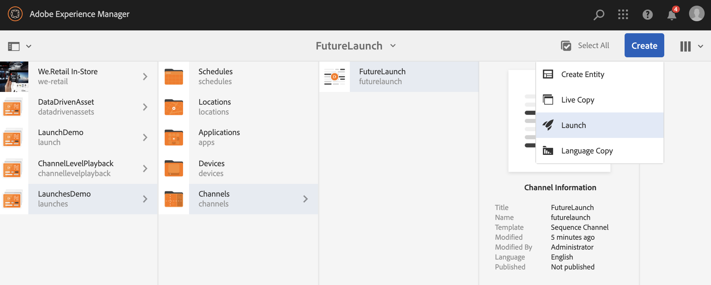
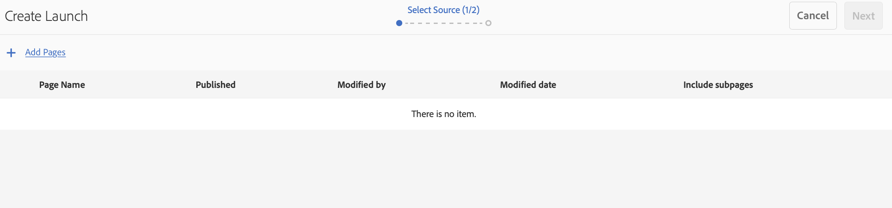

# Lanci {#launches}

Gli autori dei contenuti possono creare una versione futura dei canali, nota come **Launch** (Lancio), e impostare ulteriormente la data di inizio per il lancio per consentire al contenuto di essere live nei dispositivi o lettori.

Con l’aiuto dei lanci, gli autori possono visualizzare l’anteprima di ogni canale nel lancio e devono essere in grado di avviare una richiesta di revisione. Il gruppo di approvatori riceve la notifica e può approvare o rifiutare la richiesta. Quando viene raggiunta la data di inizio, il contenuto viene riprodotto nei dispositivi.

Ad esempio, se l’autore desidera creare versioni future di c1, c2 (canali), viene creato un lancio e viene impostata una data dal vivo (ad esempio, 10 novembre 8:00 AM). Eventuali ulteriori aggiornamenti nel contenuto vengono inviati per la revisione. Una volta approvato e in data dal vivo (10 novembre, 8:00 AM), questo lancio riproduce il contenuto sui dispositivi o lettori.

## Requisiti {#requirements}

Prima di avviare l&#39;implementazione dei lanci in un progetto AEM Screens, verifica di comprendere il concetto di periodo di tolleranza e la sua rilevanza.

Nella sezione seguente viene illustrato il periodo di tolleranza e come configurarlo come out-of-the-box. Potete anche scaricare una configurazione di prova di esempio per comprenderne l’utilizzo.

### Periodo di tolleranza {#understanding-grace-period}

La seguente configurazione consente all&#39;amministratore di configurare il periodo ***di ***tolleranza, richiesto negli avvii.

**Periodo** di tolleranza, include:

* promozione del lancio
* pubblicazione delle risorse per pubblicare le istanze
* tempo impiegato dai dispositivi per scaricare il contenuto dall’istanza di pubblicazione e le eventuali differenze di ora del server e del lettore

Ad esempio, supponiamo che il server sia in PST e che i dispositivi siano in EST, la differenza di tempo massima è di 3 ore in questo caso e che la promozione richieda 1 minuto e che la pubblicazione dall&#39;autore richieda 10 minuti e che il lettore possa scaricare le risorse in genere tra 10-15 minuti. Quindi periodo di tolleranza = differenza di tempo (3 ore) + tempo per promuovere il lancio (1 min) + tempo per pubblicare il lancio (10 min) + tempo per scaricare al lettore (10-15 min) + buffer (per essere sicuro, diciamo 30 min) = 3 ore 56 min = 14160 secondi. Per cui, quando programmeremo un lancio live, la promozione inizierà presto con questo offset. Nell&#39;equazione di cui sopra, la maggior parte degli elementi non richiede molto tempo, possiamo utilizzare una stima decente per questo offset una volta che conosciamo la differenza di tempo max b/w il server e qualsiasi giocatore.

### Configurazione del periodo di tolleranza out-of-the-box {#configuring-out-of-the-box-grace-period}

In dotazione, il periodo di tolleranza per un lancio è impostato su 24 ore, il che significa che quando si imposta la data dal vivo per qualsiasi avvio per le risorse in */content/screens*, la promozione inizierà con questo offset. Ad esempio, se liveDate è impostato su nov 24, 9:00 AM e il periodo di tolleranza è di 24 ore, il processo di promozione inizierà a novembre 23, 09:00 AM.

### Download delle configurazioni {#downloading-configurations}

Scaricate le seguenti configurazioni di prova:

[Ottieni file](assets/launches_event_handlerconfig-10.zip)

>[!NOTE]
>
>La configurazione di cui sopra ha 600 secondi come periodo di tolleranza in questa configurazione di test.

#### Aggiornamento delle configurazioni {#updating-the-configurations}

Se desiderate modificare la configurazione precedente, seguite le istruzioni riportate di seguito:

* create il file ***sling:OsgiConfig/ nt:file in /apps/system/config ***con nome**com.adobe.cq.wcm.launches.impl.LaunchesEventHandler.config **e contenuto

   *launches.eventhandler.updatelastmodified=B&quot;false&quot;launches.eventhandler.launch.Promotion.graceperiod=[&quot;/content/screens(/.*):600&quot;]launches.eventhandler.threadpool.maxsize=I&quot;5&quot;launches.eventhandler.threadpool.priority=&quot;MIN&quot;*

* `launches.eventhandler.launch.promotion.graceperiod=["/content/screens(/.&#42;):600"`, consente di impostare un periodo di tolleranza di 600 secondi nel percorso */contenuto/schermi*.

Questo significa che quando imposti una data di inizio per qualsiasi lancio per le risorse sotto */content/screens*, la promozione inizierà con questo offset. Ad esempio, se la data di inizio è impostata su 24 novembre, 9:00 AM e il periodo di tolleranza è di 600 secondi, il processo di promozione inizierà il 24 novembre, 8:50 AM.

## Utilizzo dei lanci {#using-launches}

Segui la sezione seguente per implementare i lanci nel progetto AEM Screens. Questa sezione illustra i seguenti argomenti:

1. **Creazione di un lancio**
1. **Modifica di un lancio per impostare data e ambito live**

### Creazione di un lancio {#creating-a-launch}

Per implementare future funzionalità di pubblicazione nel progetto AEM Screens, procedi come segue:

1. Andate al canale nel progetto AEM Screens, ad esempio **LaunchesDemo** —> **Channels** —> **FutureLaunch**, come mostrato di seguito.

   >[!CAUTION]
   >
   >È necessario creare un lancio da un canale preesistente nel progetto AEM Screens.

   

1. Selezionate il canale **FutureLaunch** e fate clic su **Crea**. Selezionate **Avvia** dal menu a discesa.

   

1. Viene aperta la procedura guidata **Crea lancio** . Fate clic su **+ Aggiungi pagine** per selezionare i canali AEM Screens per i quali desiderate creare il lancio.

   

1. Individuate il canale e fate clic su **Seleziona**.

   

1. Dopo aver selezionato la pagina, fai clic su **Avanti** per spostarti ulteriormente nella procedura guidata **Crea lancio** .

   

1. Inserisci il Titolo **del** lancio come **EstatePromozioni** e non è necessario impostare la Data **del** lancio, come illustrato nella figura seguente. Fai clic su **Crea**. 

   >[!NOTE]
   >
   >*Abilitando o selezionando* l’opzione **Eredita dati** live della pagina di origine, i canali possono essere creati come Live Copy nel lancio. Se vengono apportate modifiche al canale originale, tali modifiche vengono applicate automaticamente ai canali di avvio.
   >
   >
   >*Disattivando o deselezionando* Eredita dati **dal vivo della pagina di origine** I canali possono essere copiati senza alcuna relazione dal vivo all&#39;avvio. Pertanto, se vengono apportate modifiche al canale originale, tali modifiche non vengono applicate ai canali di lancio.

   

   >[!NOTE]
   >
   >In questo passaggio potete impostare la data del lancio live o impostarla in seguito mentre modificate le proprietà del lancio una volta che è già stato creato.

1. Il lancio verrà creato. Potete fare clic su **Apri** per visualizzare le pagine nell’editor oppure su **Fine** per tornare al progetto.

   

   Facendo clic su **Fine** puoi tornare al progetto **LaunchesDemo** .

   

### Modifica delle proprietà del lancio per impostare la data e l&#39;ambito di attività {#editing-the-launch-properties-to-set-the-live-date-and-scope}

Dopo aver creato il lancio, è necessario modificare le proprietà del lancio per impostare la data in diretta con l’ambito del lancio.

Per modificare le proprietà del lancio, effettuate le seguenti operazioni:

1. Andate al canale (**FutureLaunch**) e selezionate il canale, come mostrato nella figura seguente. Aprite la barra **Riferimenti** dalla barra laterale sinistra.

   >[!NOTE]
   >
   >Selezionate l’opzione Struttura **** contenuto dalla barra a sinistra per aprire il lancio creato.

   

1. Andate a **Lanci** e selezionate il lancio (**EstatePromozioni**) creato. Fate clic su **Modifica proprietà**.

   

1. Viene visualizzata la finestra di dialogo di avvio **SummerPromotions** . Compilare i campi seguenti:

   * Seleziona la data di **avvio**
   * Verifica **produzione pronta**
   * Seleziona pagine **approvate** Promote da **ambito**
   >[!NOTE]
   >
   >Informazioni sulle voci Lanci in **Promozione** automatica:

   >    * **Data** lancio, si riferisce alla data in cui il contenuto viene riprodotto nel lettore Screens, ovvero alla data/ora in base al fuso orario del lettore.
   >    * **Production Ready** consente di promuovere i canali e di utilizzare il lancio.
   >    * **Ambito**, si riferisce ai canali che possono essere promossi durante un lancio.

   Sono disponibili le tre opzioni seguenti per impostare l&#39;ambito:
   1. **Promuovi lancio** completo: Tutti i canali del lancio vengono promossi alla data impostata.
   1. **Promuovi pagine** modificate: Verranno promosse solo le risorse di lancio modificate. È consigliabile utilizzare questa opzione quando la revisione del lancio non è obbligatoria. Consente di promuovere le modifiche nei canali di lancio.
   1. **Promuovi pagine** approvate: Solo le pagine approvate vengono promosse alla data di disponibilità impostata.
   

   >[!CAUTION]
   >
   >La promozione di avvio rispetta il fuso orario del lettore/dispositivo anziché quello del server.

1. Fai clic su **Salva e chiudi** per tornare al canale **FutureLaunch** .

   

