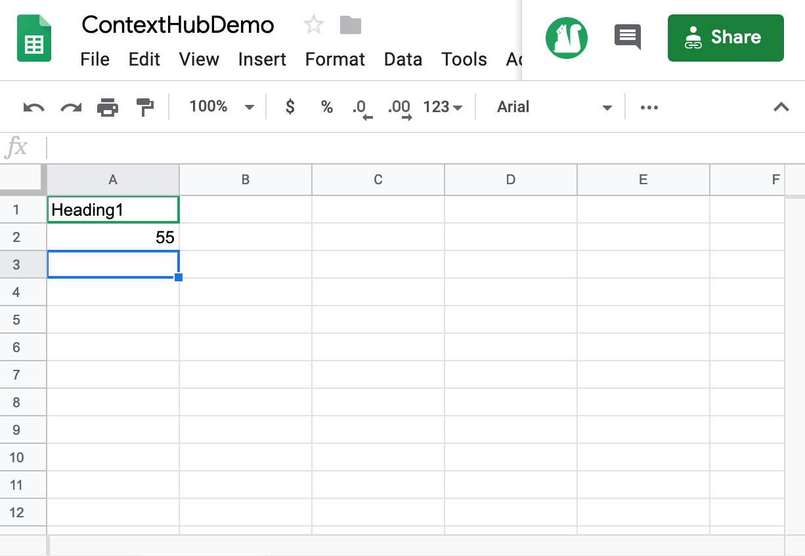

# Attivazione temperatura centro di viaggio {#travel-center-temperature-activation}

>[!IMPORTANT]
>Questo contenuto è valido per AEM on-premise/AMS (AEM 6.5LTS e AEM 6.5). Per i contenuti di AEM as a Cloud Service Screens, consulta la [guida di AEM as a Cloud Service](https://experienceleague.adobe.com/en/docs/experience-manager-cloud-service/content/screens-as-cloud-service/overview/introduction).

Il seguente caso d’uso illustra l’utilizzo dell’attivazione della temperatura locale del centro di viaggio in base ai valori inseriti nei fogli di Google.

## Descrizione {#description}

Per questo caso d’uso, se il valore in Google Sheets è inferiore a 50, viene visualizzata un’immagine con bevande calde. Se il valore è maggiore o uguale a 50, viene visualizzata un’immagine con bevande fredde. Se è presente un altro valore o non è presente alcun valore, il lettore visualizza un’immagine predefinita.

## Precondizioni {#preconditions}

Prima di iniziare a implementare l&#39;attivazione della temperatura locale del centro viaggi, scopri come impostare ***Archivio dati***, ***Segmentazione del pubblico*** e ***Abilita targeting per canali*** in un progetto AEM Screens.

Per informazioni dettagliate, vedere [Configurazione di ContextHub in AEM Screens](configuring-context-hub.md).

## Flusso di base {#basic-flow}

Per implementare il caso d’uso di attivazione della temperatura locale del Travel Center, segui i passaggi seguenti:

1. **Compilazione dei fogli di Google**

   1. Passa al foglio Google ContextHubDemo.
   1. Aggiungi una colonna con **`Heading1`** con il valore di temperatura corrispondente.

   

1. **Configurazione dei segmenti in Audiences in base ai requisiti**

   1. Passa ai segmenti del pubblico (consulta ***Passaggio 2: impostazione della segmentazione del pubblico*** in **[configurazione di ContextHub nella pagina AEM Screens](configuring-context-hub.md)** per ulteriori dettagli).

   1. Fare clic sui **fogli A1 1** e fare clic su **Modifica**.

   1. Fai clic sulla proprietà di confronto e fai clic sull&#39;icona di configurazione.
   1. Fai clic su **googlesheets/value/1/0** dal menu a discesa in **Nome proprietà**

   1. Fai clic su **Operatore** come **maggiore o uguale** dal menu a discesa

   1. Immetti **Valore** come **50**

   1. Analogamente, selezionare i **fogli A1 2** e fare clic su **Modifica**.

   1. Fare clic su **Proprietà confronto - Valore** e selezionare l&#39;icona di configurazione.
   1. Fai clic su **googlesheets/value/1/0** dal menu a discesa in **Nome proprietà**

   1. Fai clic su **Operatore** come **minore di** dal menu a discesa

   1. Immetti **Valore** come **50**

1. Naviga e seleziona il tuo canale () e fai clic su **Modifica** nella barra delle azioni. Nell&#39;esempio seguente, **DataDrivenWeather**, viene utilizzato un canale sequenziale per mostrare la funzionalità.

   >[!NOTE]
   >
   >Il tuo canale deve già avere un&#39;immagine predefinita e i tipi di pubblico devono essere preconfigurati come descritto in [Configurazione di ContextHub in AEM Screens](configuring-context-hub.md).

   

   >[!CAUTION]
   >
   >**ContextHub** **Configurazioni** tramite la scheda **Proprietà** > **Personalization** del canale devono essere già configurate.

   

1. Fai clic su **Targeting** dall&#39;editor, quindi fai clic su **Brand** e **Activity** dal menu a discesa, quindi fai clic su **Start Targeting**.

   

1. **Controllo dell&#39;anteprima**

   1. Fare clic su **Anteprima.** Inoltre, aprire Google Sheet e aggiornarne il valore.
   1. Modifica il valore in meno di 50. Si può vedere l&#39;immagine di una bevanda fredda. Se il valore in Google Sheets è uguale o superiore a 50, dovrebbe essere visualizzata l&#39;immagine di una bevanda calda.

   

