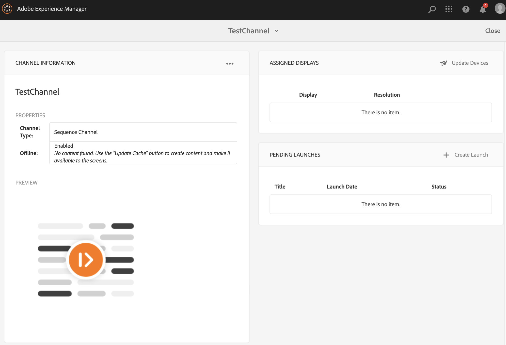
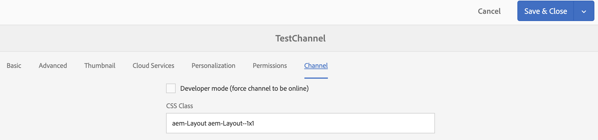

# Creazione e gestione dei canali {#creating-and-managing-channels}

Un canale visualizza una sequenza di contenuti (immagini e video) e mostra anche un sito web o un’applicazione a pagina singola.

Questa pagina mostra come creare e gestire i canali per AEM Screens.

**Prerequisiti**:

* [Configurazione e distribuzione di Screens](configuring-screens-introduction.md)
* [Creare e gestire un progetto Screens](creating-a-screens-project.md)

## Creazione di un nuovo canale {#creating-a-new-channel}

Dopo aver creato il progetto per AEM Screens, segui i passaggi seguenti per creare un nuovo canale per il progetto:

1. Seleziona il collegamento Adobe Experience Manager (in alto a sinistra), quindi Screens. In alternativa, puoi passare direttamente a `https://localhost:4502/screens.html/content/screens`.

1. Passa al progetto Schermi e seleziona **Canali** cartella.

1. Clic **Crea** dalla barra delle azioni.

   

1. Seleziona la **Canale sequenza** modello da **Crea** e fai clic su **Successivo**.

   

1. Inserisci il titolo come **ScreensChannel** e fai clic su **Crea**.

   

1. Ora è stato aggiunto un canale Sequenza al tuo **Canali** cartella.

### Tipi di canale {#channel-types}

Durante l’utilizzo della procedura guidata sono disponibili le seguenti opzioni di modello, ad esempio:

| **Opzione modello** | **Descrizione** |
|---|---|
| Cartella canali | Consente di creare una cartella per archiviare la raccolta di canali. |
| Canale per sequenza | Consente di creare un canale che riproduce i componenti in sequenza (uno per uno in una presentazione). |
| Canale di applicazione | Consente di mostrare l’applicazione web personalizzata in Screens player. |
| Canale schermo diviso 1x1 | Consente di visualizzare il componente in una singola zona. |
| Canale schermo diviso 1x2 | Consente di visualizzare le risorse in due aree (suddivise orizzontalmente). |
| Canale schermo diviso 2X1 | Consente di visualizzare le risorse in due aree (divise verticalmente). |
| Canale schermo diviso 2x2 | Consente di visualizzare le risorse in quattro aree (suddivise orizzontalmente e verticalmente in una matrice). |
| Canale schermo diviso da 2 a 3 | Consente di visualizzare le risorse in due zone (suddivise orizzontalmente) in cui una è più grande dell’altra. |
| Canale schermo diviso barra a L sinistra o destra | Consente agli autori di contenuto di visualizzare diversi tipi di risorse in aree di dimensioni appropriate. |

>[!NOTE]
>
>I canali a schermo diviso dividono la visualizzazione in più zone e consentono di riprodurre più esperienze contemporaneamente una accanto all’altra. Le esperienze possono essere risorse/testo statico o sequenze incorporate.

>[!IMPORTANT]
>
> Dopo aver creato e aggiunto il contenuto al canale, il passaggio successivo consiste nel creare una posizione seguita dalla creazione di una visualizzazione. Inoltre, devi assegnare quel canale a un display. Per ulteriori informazioni, consulta le risorse riportate di seguito alla fine della sezione.

## Utilizzo dei canali {#working-with-channels}

Puoi modificare, visualizzare proprietà e dashboard, copiare, visualizzare in anteprima ed eliminare un canale.

### Aggiunta/modifica di contenuti a un canale {#adding-editing-content-to-a-channel}

Per aggiungere o modificare il contenuto di un canale, effettua le seguenti operazioni:

1. Selezionate il canale da modificare (come illustrato nella figura precedente).
1. Clic **Modifica** dall’angolo in alto a sinistra della barra delle azioni per modificare le proprietà del canale. Viene aperto l’editor che consente di aggiungere risorse/componenti al canale da pubblicare.

>[!NOTE]
>Puoi aggiungere componenti al tuo canale. Fai riferimento a **[Aggiunta di componenti a un canale](adding-components-to-a-channel.md)** per ulteriori dettagli.

**Caricamento di video sul canale**

Per caricare i video sul tuo canale, segui la procedura riportata di seguito:

1. Seleziona il canale in cui desideri caricare il video.
1. Clic **Modifica** dalla barra delle azioni per aprire l’editor.
1. Seleziona **Video** in Risorse e trascina i video richiesti.

>[!NOTE]
>In caso di problemi durante il caricamento di video nel canale, consulta [Video sulla risoluzione dei problemi](troubleshoot-videos.md).

### Visualizzazione delle proprietà {#viewing-properties}

Per visualizzare o modificare le proprietà di un canale, effettua le seguenti operazioni:

1. Fai clic sul canale da modificare.
1. Clic **Proprietà** dalla barra delle azioni per visualizzare/modificare le proprietà del canale. Le seguenti schede consentono di modificare le opzioni.

### Visualizzazione del dashboard {#viewing-dashboard}

Per visualizzare il dashboard di un canale, effettua le seguenti operazioni:

1. Seleziona il canale da modificare.
1. Clic **Dashboard** dalla barra delle azioni per visualizzare il dashboard. Il **INFORMAZIONI SUL CANALE**,**VISUALIZZAZIONI ASSEGNATE**, e **LANCI IN SOSPESO** viene aperto il pannello, come illustrato nella figura riportata di seguito:

### Informazioni canale {#channel-information}

Il pannello Informazioni canale descrive le proprietà del canale, insieme all’anteprima sul canale. Inoltre, fornisce informazioni su se il canale è offline o online.

Fai clic sul pulsante (**...**) dalla **INFORMAZIONI SUL CANALE** barra delle azioni per visualizzare le proprietà, modificare il contenuto o aggiornare la cache (contenuto offline) per il canale.

#### Visualizzazione del manifesto {#view-manifest}

Puoi visualizzare il manifesto dal dashboard del canale.

>[!IMPORTANT]
>Questa opzione è disponibile solo con il Feature Pack 8 di AEM 6.4 o il Feature Pack 4 di AEM 6.5.

Per abilitare questa opzione dal dashboard dei canali, segui la procedura riportata di seguito:

1. **Imposta il canale su Non in linea**
   1. Seleziona il canale e seleziona **Proprietà** dalla barra delle azioni
   1. Accedi a **Canale** e assicurati di deselezionare **Modalità sviluppatore (forza canale online)** opzione
   1. Fai clic su **Salva e chiudi**
1. **Aggiorna contenuto offline**
   1. Seleziona il canale e seleziona **Dashboard** dalla barra delle azioni
   1. Accedi a **INFORMAZIONI SUL CANALE** e fai clic su *...*
   1. Clic **Aggiorna contenuto offline**

Dovresti visualizzare **Visualizza manifesto** opzione dalla **INFORMAZIONI SUL CANALE** nel dashboard Canale.

### Canali online e offline {#online-and-offline-channels}

>[!NOTE]
>Per impostazione predefinita, quando si crea un canale, questo è offline.

Quando crei un canale, questo può essere definito come canale online o offline.

Un ***Canale online***, mostrerà il contenuto aggiornato nell&#39;ambiente in tempo reale, mentre un ***Canale offline***, mostra il contenuto della cache.

Segui i passaggi seguenti per rendere il canale online:

1. Passa al canale come **TestProject** —> **Canali** —> **TestChannel**.

   Seleziona il canale.

   

   Clic **Dashboard** dalla barra delle azioni per visualizzare lo stato del lettore. Il **INFORMAZIONI SUL CANALE** Il pannello fornisce informazioni sul fatto che il canale sia online o offline.

   

1. Clic **Proprietà** dalla barra delle azioni e passare alla **Canale** come mostrato di seguito:

   

1. Controlla la **Sviluppatore** **modalità (forza canale online)** per impostare il canale come online.

   Clic **Salva e chiudi** per salvare l’opzione.

   

   Torna alla dashboard dei canali e ora fai clic su **INFORMAZIONI SUL CANALE** Il pannello mostra lo stato in linea del lettore.

   

>[!NOTE]
>Se desideri configurare nuovamente il canale come offline, deseleziona l’opzione Modalità sviluppatore da **Proprietà** (come mostrato al punto (3)) e quindi dalla scheda **INFORMAZIONI SUL CANALE** clic del pannello **Aggiorna contenuto offline**, come illustrato nella figura seguente.

#### Aggiornamenti automatici e manuali dal dashboard dei dispositivi {#automatic-versus-manual-updates-from-the-device-dashboard}

Nella tabella seguente sono riepilogati gli eventi associati agli aggiornamenti automatici e manuali dal dashboard del dispositivo.

<table>
 <tbody>
  <tr>
   <td><strong>Evento</strong></td>
   <td><strong>Aggiornamento automatico del dispositivo</strong></td>
   <td><strong>Aggiornamento manuale del dispositivo</strong></td>
  </tr>
  <tr>
   <td>Modifica nel canale online</td>
   <td>Contenuto aggiornato automaticamente</td>
   <td>
Contenuto aggiornato in "Device: Push Config"
 
Oppure,
 
Contenuto aggiornato il <strong><i>Dispositivo: Riavvia</i></strong>
 </td>
  </tr>
  <tr>
   <td>Modifica nel canale offline ma IL CANALE "Contenuto push" NON viene attivato (non verrà ricreato alcun pacchetto offline)</td>
   <td>Nessun aggiornamento del contenuto</td>
   <td>Nessun aggiornamento del contenuto</td>
  </tr>
  <tr>
   <td>Modifica in "Contenuto push" per canale e canale offline attivata (nuovo pacchetto offline)</td>
   <td>Contenuto aggiornato automaticamente</td>
   <td>
Contenuto aggiornato il <strong><i>Device: Push Config</i></strong>
 
Oppure,
 
Contenuto aggiornato il <strong><i>Dispositivo: Riavvia</i></strong>
 </td>
  </tr>
  <tr>
   <td>
Modifica nella configurazione

    <ul>
     <li>Visualizzazione (canale forzato)</li>
     <li>Dispositivo</li>
     <li>Assegnazioni canale (nuovo canale, canale rimosso)</li>
     <li>Assegnazione canale (ruolo, evento, pianificazione)</li>
    </ul> </td>
   <td>Configurazione aggiornata automaticamente</td>
   <td>
Configurazione aggiornata il <strong><i>Device: Push Config</i></strong>
 
Oppure,
 
Configurazione aggiornata il <strong><i>Dispositivo: Riavvia</i></strong>
 </td>
  </tr>
 </tbody>
</table>

### Visualizzazioni assegnate {#assigned-displays}

Il pannello visualizzazioni assegnate mostra la visualizzazione associata al canale. Fornisce un&#39;istantanea della visualizzazione assegnata insieme alla risoluzione.

Le visualizzazioni associate saranno elencate nel **Visualizzazioni assegnate** come mostrato di seguito:

>[!NOTE]
>Per informazioni sulla creazione di una visualizzazione in una posizione, consulta:
>
>* [Creare e gestire le posizioni](managing-locations.md)
>* [Creare e gestire le visualizzazioni](managing-displays.md)
>

Inoltre, fai clic sul display nella sezione **VISUALIZZAZIONI ASSEGNATE** per visualizzare le informazioni sul display, come illustrato di seguito:

### Passaggi successivi {#the-next-steps}

Il passaggio successivo dopo aver creato un canale e aver aggiunto/modificato contenuti nel canale consiste nell’apprendere come creare una posizione e una visualizzazione. Inoltre, assegna un canale a tale visualizzazione.

Per i passaggi successivi, consulta le risorse seguenti:

* [Creare e gestire i canali](managing-channels.md)
* [Creare e gestire le posizioni](managing-locations.md)
* [Creare e gestire le visualizzazioni](managing-displays.md)
