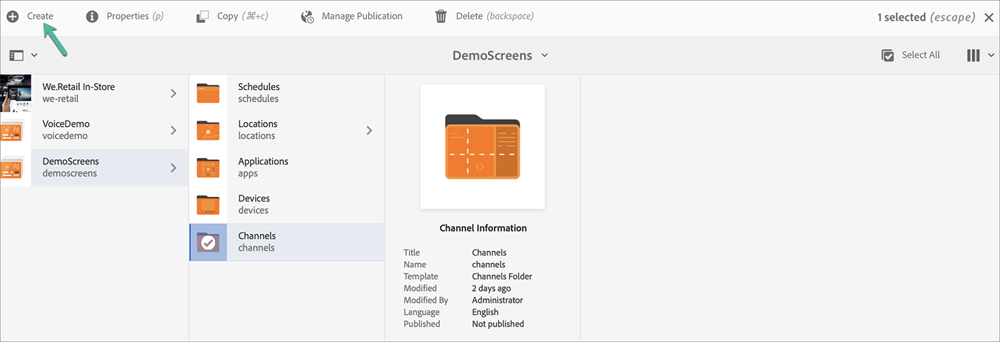

# Creazione e gestione dei canali {#creating-and-managing-channels}

Un canale visualizza una sequenza di contenuti (immagini e video) e visualizza anche un sito web o un’applicazione a pagina singola.

Questa pagina mostra la creazione e la gestione dei canali per AEM Screens.

**Prerequisiti**:

* [Configurazione e distribuzione di Screens](configuring-screens-introduction.md)
* [Creare e gestire un progetto Screens](creating-a-screens-project.md)

## Creazione di un nuovo canale {#creating-a-new-channel}

Dopo aver creato il progetto per AEM Screens, segui i passaggi seguenti per creare un nuovo canale per il progetto:

1. Seleziona il collegamento ad Adobe Experience Manager (in alto a sinistra) e quindi Screens. In alternativa, puoi passare direttamente a `https://localhost:4502/screens.html/content/screens`.

1. Passa al progetto Screens e seleziona la cartella **Canali** .

1. Fai clic su **Crea** nella barra delle azioni.

   

1. Seleziona il modello **Canale sequenza** dalla procedura guidata **Crea** e fai clic su **Avanti**.

   

1. Inserisci il Titolo come **ScreensChannel** e fai clic su **Crea**.

   

1. Ora viene aggiunto un canale per sequenza alla cartella **Canali** .

### Tipi di canale {#channel-types}

Le seguenti opzioni di modello sono disponibili durante l&#39;uso della procedura guidata:

| **Opzione modello**  | **Descrizione** |
|---|---|
| Cartella canali | Consente di creare una cartella per memorizzare la raccolta dei canali. |
| Canale per sequenza | Consente di creare un canale che riproduce i componenti in sequenza (uno per uno in una presentazione). |
| Canale di applicazione | Consente di mostrare la tua applicazione web personalizzata in Screens Player. |
| Canale schermo diviso 1x1 | Consente di visualizzare il componente in una singola zona. |
| Canale schermo diviso 1x2 | Consente di visualizzare le risorse in due aree (divise orizzontalmente). |
| Canale schermo diviso 2X1 | Consente di visualizzare le risorse in due aree (divise verticalmente). |
| Canale schermo diviso 2x2 | Consente di visualizzare le risorse in quattro aree (divise orizzontalmente e verticalmente in una matrice). |
| Canale schermo diviso da 2 a 3 | Consente di visualizzare le risorse in due aree (divise orizzontalmente) con una delle aree più grandi dell’altra. |
| Canale schermo diviso a barre L a sinistra o a destra | Consente agli autori di contenuti di visualizzare diversi tipi di risorse in aree di dimensioni appropriate. |

>[!NOTE]
>
>I canali Schermo diviso dividono la visualizzazione in più aree in modo da poter riprodurre più esperienze contemporaneamente, una accanto all’altra. Le esperienze possono essere risorse statiche/testo o sequenze incorporate.

>[!IMPORTANT]
>
> Dopo aver creato e aggiunto contenuto al canale, il passaggio successivo consiste nel creare una posizione seguita dalla creazione di una visualizzazione. Inoltre, è necessario assegnare quel canale a una visualizzazione. Per ulteriori informazioni, vedi le risorse riportate di seguito alla fine della sezione.

## Utilizzo dei canali {#working-with-channels}

Puoi modificare, visualizzare le proprietà e il dashboard, copiare, visualizzare in anteprima e eliminare un canale.

### Aggiunta/Modifica di contenuti a un Canale {#adding-editing-content-to-a-channel}

Per aggiungere o modificare il contenuto di un canale, segui i passaggi riportati di seguito:

1. Seleziona il canale da modificare (come mostrato nella figura precedente).
1. Fai clic su **Modifica** dall&#39;angolo in alto a sinistra della barra delle azioni per modificare le proprietà del canale. Si apre l&#39;editor che consente di aggiungere risorse/componenti al canale che desideri pubblicare.

>[!NOTE]
>Puoi aggiungere componenti al tuo canale. Per ulteriori informazioni, consulta **[Aggiunta di componenti a un canale](adding-components-to-a-channel.md)** .

**Caricamento di video sul canale**

Segui i passaggi descritti di seguito per caricare i video sul tuo canale:

1. Seleziona il canale in cui desideri caricare il video.
1. Fai clic su **Modifica** nella barra delle azioni per aprire l&#39;editor.
1. Seleziona **Video** sotto Risorse, poi trascina e rilascia i video richiesti.

>[!NOTE]
>In caso di problemi durante il caricamento dei video sul canale, consulta [Risoluzione dei problemi relativi ai video](troubleshoot-videos.md).

### Visualizzazione delle proprietà {#viewing-properties}

Per visualizzare o modificare le proprietà di un canale, segui i passaggi riportati di seguito:

1. Fai clic sul canale da modificare.
1. Fai clic su **Proprietà** nella barra delle azioni per visualizzare/modificare le proprietà del canale. Le seguenti schede consentono di modificare le opzioni.

### Visualizzazione del dashboard {#viewing-dashboard}

Per visualizzare il dashboard di un canale, segui i passaggi riportati di seguito:

1. Seleziona il canale da modificare.
1. Fai clic su **Dashboard** nella barra delle azioni per visualizzare il dashboard. Viene visualizzato il pannello **INFORMAZIONI CANALE**,**VISUALIZZAZIONI ASSEGNATE** e **LANCI IN ATTESA**, come illustrato nella figura seguente:

### Informazioni canale {#channel-information}

Il pannello Informazioni canale descrive le proprietà del canale, insieme all’anteprima sul canale. Inoltre, il pannello offre informazioni che notificano se il canale è offline o online.

Fai clic su (**...**) dalla barra delle azioni **INFORMAZIONI CANALE** per visualizzare le proprietà, modificare il contenuto o aggiornare la cache (contenuto offline) per il canale.

#### Visualizzazione del manifesto {#view-manifest}

Puoi visualizzare il manifesto dal dashboard del canale.

>[!IMPORTANT]
>Questa opzione è disponibile solo con AEM 6.4 Feature Pack 8 o AEM 6.5 Feature Pack 4.

Segui questi passaggi per abilitare questa opzione dal dashboard del canale:

1. **Imposta il canale su Offline**
   1. Seleziona il canale e seleziona **Proprietà** dalla barra delle azioni
   1. Passa alla scheda **Canale** e assicurati di deselezionare l’opzione **Modalità sviluppatore (forza che il canale sia online)**
   1. Fai clic su **Salva e chiudi**
1. **Aggiorna contenuto offline**
   1. Seleziona il canale e seleziona **Dashboard** dalla barra delle azioni
   1. Passa al pannello **INFORMAZIONI CANALE** e fai clic su *...*
   1. Fai clic su **Aggiorna contenuto offline**

Dovresti visualizzare l&#39;opzione **Visualizza manifesto** dal pannello **INFORMAZIONI CANALE** nel dashboard Canale.

### Canali online e offline {#online-and-offline-channels}

>[!NOTE]
>Per impostazione predefinita, quando crei un canale, è Offline.

Quando crei un canale, puoi definirlo un canale online o offline.

Un ***Canale online*** mostra il contenuto aggiornato in ambiente in tempo reale, mentre in ***Canale offline*** mostra il contenuto della cache.

Segui i passaggi riportati di seguito per rendere online il canale:

1. Accedi al canale da **TestProject** --> **Canali** --> **TestChannel**.

   Seleziona il canale.

   

   Fai clic su **Dashboard** nella barra delle azioni per visualizzare lo stato del lettore. Il pannello **Informazioni canale** fornisce informazioni che notificano se il canale è online o offline.

   

1. Fai clic su **Proprietà** nella barra delle azioni e accedi alla scheda **Canali** come illustrato di seguito:

   

1. Per rendere il canale online, controlla la modalità **Sviluppatore** **(forzare il canale ad essere online)** .

   Fai clic su **Salva e chiudi** per salvare la tua opzione.

   

   Torna al dashboard del canale e ora il pannello **INFORMAZIONI CANALE** mostra lo stato online del lettore.

   

>[!NOTE]
>Se desideri configurare nuovamente il canale come offline, deseleziona l’opzione Modalità Sviluppatore dalla scheda **Proprietà** (come mostrato nel passaggio (3))), quindi dal pannello **INFORMAZIONI CANALE** fai clic su **Aggiorna contenuto offline**, come illustrato nella figura seguente.

#### Aggiornamenti automatici e manuali dal dashboard del dispositivo {#automatic-versus-manual-updates-from-the-device-dashboard}

La tabella seguente riassume gli eventi associati agli aggiornamenti automatici e manuali dal dashboard del dispositivo.

<table>
 <tbody>
  <tr>
   <td><strong>Evento</strong></td>
   <td><strong>Aggiornamento automatico del dispositivo</strong></td>
   <td><strong>Aggiornamento manuale del dispositivo</strong></td>
  </tr>
  <tr>
   <td>Modifica nel canale online</td>
   <td>Contenuto aggiornato automaticamente</td>
   <td>
Contenuto aggiornato su "Dispositivo: Configurazione push"
 
Oppure,
 
Contenuto aggiornato su <strong><i>Dispositivo: Restart</i></strong>
 </td>
  </tr>
  <tr>
   <td>Modifica nel canale offline ma il canale "Contenuto push" NON viene attivato (nessuna ricreazione del pacchetto offline)</td>
   <td>Nessun aggiornamento del contenuto</td>
   <td>Nessun aggiornamento del contenuto</td>
  </tr>
  <tr>
   <td>La modifica in Canale offline e Canale "Push Content" viene attivata (nuovo pacchetto offline)</td>
   <td>Contenuto aggiornato automaticamente</td>
   <td>
Contenuto aggiornato su <strong><i>Dispositivo: Configurazione push</i></strong>
 
Oppure,
 
Contenuto aggiornato su <strong><i>Dispositivo: Restart</i></strong>
 </td>
  </tr>
  <tr>
   <td>
Modifica nella configurazione

    <ul>
     <li>Visualizzazione (canale forzato)</li>
     <li>Dispositivo</li>
     <li>Assegnazioni dei canali (nuovo canale, canale rimosso)</li>
     <li>Assegnazione del canale (ruolo, evento, pianificazione)</li>
    </ul> </td>
   <td>Configurazione aggiornata automaticamente</td>
   <td>
Configurazione aggiornata su <strong><i>Dispositivo: Configurazione push</i></strong>
 
Oppure,
 
Configurazione aggiornata su <strong><i>Dispositivo: Restart</i></strong>
 </td>
  </tr>
 </tbody>
</table>

### Visualizzazioni assegnate {#assigned-displays}

Il pannello visualizzazioni assegnate mostra la visualizzazione associata al canale. Fornisce un&#39;istantanea della visualizzazione assegnata insieme alla risoluzione.

Le visualizzazioni collegate sono elencate nel pannello **Visualizzazioni assegnate**, come illustrato di seguito:

>[!NOTE]
>Per informazioni sulla creazione di una visualizzazione in una posizione, consulta:
>
>* [Creare e gestire posizioni](managing-locations.md)
>* [Creare e gestire le visualizzazioni](managing-displays.md)

>

Inoltre, fai clic sulla visualizzazione nel pannello **Visualizzazioni assegnate**, per visualizzare le informazioni sulla visualizzazione, come illustrato di seguito:

### Passaggi successivi {#the-next-steps}

Dopo aver creato un canale, e aver aggiunto o modificato il contenuto, il passo successivo è imparare a creare un percorso e una visualizzazione. Inoltre, assegnare un canale a tale visualizzazione.

Per i passaggi successivi, consulta le risorse seguenti:

* [Creare e gestire i canali](managing-channels.md)
* [Creare e gestire posizioni](managing-locations.md)
* [Creare e gestire le visualizzazioni](managing-displays.md)

