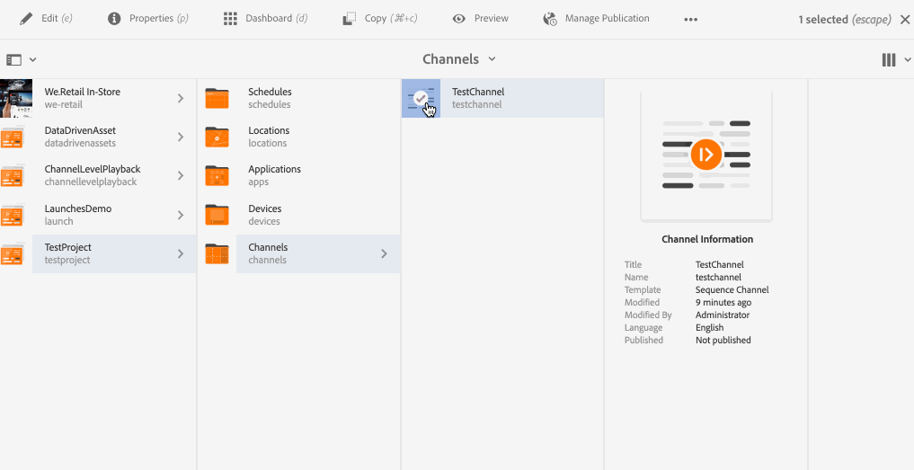

# Creazione e gestione dei canali {#creating-and-managing-channels}

Un canale visualizza una sequenza di contenuti e visualizza immagini e video, ma può anche visualizzare un sito Web o un’applicazione a pagina singola.

In questa pagina viene mostrata la creazione e la gestione dei canali per Screens.

**Prerequisiti**:

* [Configurazione e distribuzione di Screens](configuring-screens-introduction.md)
* [Creare e gestire il progetto Screens](creating-a-screens-project.md)

## Creazione di un nuovo canale {#creating-a-new-channel}

Una volta creato il progetto per Screens, segui i passaggi descritti di seguito per creare un nuovo Canale per un progetto Screens:

1. Seleziona il collegamento ad Adobe Experience Manager (in alto a sinistra) e quindi Screens. Alternatively, you can go directly to: `https://localhost:4502/screens.html/content/screens`.
1. Accedi al progetto Screens e fai clic su **Canali**.
1. Click **Create** next to the plus icon in the action bar. Si aprirà una procedura guidata (*Per ulteriori informazioni vedi Tipi di Canali*).

1. Select the template from the wizard and click **Next**.
1. Enter the properties for **Title and Tags**, **More Titles and Description**, **On/Off Time**, and **Vanity URL**.

1. Fai clic su **Crea** e il canale verrà creato e aggiunto alla cartella dei canali.

### Tipi di canale {#channel-types}

Le seguenti opzioni di modello sono disponibili durante l&#39;uso della procedura guidata:

| **Opzione modello**  | **Descrizione** |
|---|---|
| Cartella canali | Consente di creare una cartella per memorizzare la raccolta dei canali. |
| Canale per sequenza | Consente di creare un canale che riproduce i componenti in sequenza (uno per uno in una presentazione). |
| Canale di applicazione | Consente di mostrare la tua applicazione web personalizzata in Screens Player. |
| Canale schermo diviso 1x1 | Consente di visualizzare il componente in una singola area. |
| Canale schermo diviso 1x2 | Consente di visualizzare le risorse in due aree (suddivise in orizzontale). |
| Canale schermo diviso 2X1 | Consente di visualizzare le risorse in due aree (suddivise in verticale). |
| Canale schermo diviso 2x2 | Consente di visualizzare le risorse in quattro aree (suddivise orizzontalmente e verticalmente in una matrice). |
| Canale schermo diviso da 2 a 3 | Consente di visualizzare le risorse in due aree (suddivise in orizzontale) con una delle aree più grandi dell’altra. |
| Canale di divisione schermo con barra L a sinistra o destra | Consente agli autori di contenuti di visualizzare diversi tipi di risorse nelle aree di dimensioni appropriate. |

>[!NOTE]
>
>I canali Dividi schermo suddividono la visualizzazione in più zone in modo da poter riprodurre più esperienze contemporaneamente, affiancate. Le esperienze possono essere risorse statiche/testo o sequenze incorporate.

The following example shows the creation of a Sequence Channel (*ChannelOne*) for a Screens project (*DemoProject*).

>[!NOTE]
>
>Puoi creare zone diverse utilizzando le opzioni modello, come gli schermi divisi 2x2, 1x2 o da 2 a 3 citati sopra.

>[!IMPORTANT]
>
> Dopo aver creato e aggiunto contenuto al canale, il passaggio successivo consiste nel creare una posizione seguita dalla creazione di una visualizzazione. Inoltre, è necessario assegnare quel canale a una visualizzazione. Per ulteriori informazioni, vedi le risorse riportate di seguito alla fine della sezione.

## Utilizzo dei canali {#working-with-channels}

Puoi modificare, visualizzare le proprietà e il dashboard, copiare, visualizzare in anteprima e eliminare un canale.

>[!NOTE]
>
>Selezionare il canale, come mostrato nella figura seguente.

### Aggiunta/Modifica di contenuti a un Canale {#adding-editing-content-to-a-channel}

Per aggiungere o modificare il contenuto di un canale, segui i passaggi riportati di seguito:

1. Selezionate il canale da modificare (come illustrato nella figura precedente).
1. Click **Edit** from the top left corner of the action bar to edit the channel properties. Si apre l&#39;editor che consente di aggiungere risorse/componenti al canale che desideri pubblicare.

>[!NOTE]
>
>Puoi aggiungere componenti al tuo canale. Per ulteriori informazioni, consulta **[Aggiunta di componenti a un canale](adding-components-to-a-channel.md)** .

**Caricamento di video sul canale**

Segui i passaggi descritti di seguito per caricare i video sul tuo canale:

1. Seleziona il canale in cui desideri caricare il video.
1. Fai clic su **Modifica** nella barra delle azioni per aprire l&#39;editor.
1. Seleziona **Video** sotto Risorse, poi trascina e rilascia i video richiesti.

>[!NOTE]
>
>If you encounter issues uploading videos in your channel, see [Troubleshooting Videos](troubleshoot-videos.md).

### Visualizzazione delle proprietà {#viewing-properties}

Per visualizzare o modificare le proprietà di un canale, segui i passaggi riportati di seguito:

1. Fate clic sul canale da modificare.
1. Click **Properties** from the action bar to view/edit the channel properties. Le seguenti schede consentono di modificare le opzioni.

### Visualizzazione del dashboard {#viewing-dashboard}

Per visualizzare il dashboard di un canale, segui i passaggi riportati di seguito:

1. Selezionate il canale da modificare.
1. Click **Dashboard** from the action bar to view the dashboard. The **CHANNEL INFORMATION**,**ASSIGNED DISPLAYS**, and **PENDING LAUNCHES** panel opens, as shown in the figure below:

### Informazioni canale {#channel-information}

Il pannello Informazioni canale descrive le proprietà Canale e l’anteprima sul canale. Inoltre, il pannello offre informazioni che notificano se il canale è offline o online.

Click on the (**...**) from the **CHANNEL INFORMATION** action bar to view properties, edit the content, or to update cache (offline content) for the channel.

#### Visualizzazione del manifesto {#view-manifest}

Puoi visualizzare il manifesto dal dashboard del canale.

>[!IMPORTANT]
>
>Questa opzione è disponibile solo con il Feature Pack 8 AEM 6.4 o con il Feature Pack 4 AEM 6.5.

Per attivare questa opzione dal dashboard dei canali, effettuate le seguenti operazioni:
1. **Impostate il canale su Offline**
   1. Seleziona il canale e seleziona **Proprietà** dalla barra delle azioni
   1. Passate alla scheda **Canale** e accertatevi di deselezionare l&#39;opzione Modalità **Sviluppatore (forza che il canale sia online)**
   1. Fai clic su **Salva e chiudi**
1. **Aggiorna contenuto offline**
   1. Selezionate il canale e selezionate **Dashboard** dalla barra delle azioni
   1. Andate al pannello **INFORMAZIONI** CANALE e fate clic su *...*
   1. Fate clic su **Aggiorna contenuto offline**

A questo punto dovreste essere in grado di visualizzare l’opzione **Visualizza manifesto** dal pannello **INFORMAZIONI** CANALE nel pannello Canale.

### Canali online e offline {#online-and-offline-channels}

>[!NOTE]
>
>Per impostazione predefinita, quando create un canale, il canale è Offline.

Quando crei un canale, puoi definirlo un canale online o offline.

Un ***Canale online*** mostra il contenuto aggiornato in ambiente in tempo reale, mentre in ***Canale offline*** mostra il contenuto della cache.

Segui i passaggi riportati di seguito per rendere online il canale:

1. Accedi al canale da **TestProject** --> **Canali** --> **TestChannel**.

   Seleziona il canale.

   

   Click **Dashboard** from the action bar to view the status of the player. Il pannello **Informazioni canale** fornisce informazioni che notificano se il canale è online o offline.

   

1. Fai clic su **Proprietà** nella barra delle azioni e accedi alla scheda **Canali** come illustrato di seguito:

   

1. Controllare la **modalità** Sviluppatore **(obbligare il canale ad essere online)** per rendere il canale online.

   Fai clic su **Salva e chiudi** per salvare la tua opzione.

   

   Navigate back to the channel dashboard and now the **CHANNEL INFORMATION** panel shows the online status of the player.

   

>[!NOTE]
>
>Se desiderate configurare nuovamente il canale come offline, deselezionate l&#39;opzione Modalità Sviluppatore dalla scheda **Proprietà** (come mostrato al punto 3)), quindi dal pannello **INFORMAZIONI** CANALE fate clic su **Aggiorna contenuto** offline, come mostrato nella figura seguente.

#### Aggiornamenti automatici e manuali dal dashboard del dispositivo {#automatic-versus-manual-updates-from-the-device-dashboard}

La tabella seguente riassume gli eventi associati agli aggiornamenti automatici e manuali dal dashboard del dispositivo.

<table>
 <tbody>
  <tr>
   <td><strong>Evento</strong></td>
   <td><strong>Aggiornamento automatico dispositivo</strong></td>
   <td><strong>Aggiornamento manuale dispositivo</strong></td>
  </tr>
  <tr>
   <td>Modifica nel canale online</td>
   <td>Contenuto aggiornato automaticamente</td>
   <td>
Contenuto aggiornato su "Dispositivo: Configurazione push"
 
Oppure,
 
Contenuto aggiornato sul <strong><i>dispositivo: Riavvia</i></strong>
 </td>
  </tr>
  <tr>
   <td>Modifica nel canale offline ma il canale "Push Content" NON viene attivato (nessuna ricreazione del pacchetto offline)</td>
   <td>Nessun aggiornamento contenuto</td>
   <td>Nessun aggiornamento contenuto</td>
  </tr>
  <tr>
   <td>Viene attivata la modifica nel canale offline e nel canale "Push Content" (nuovo pacchetto offline)</td>
   <td>Contenuto aggiornato automaticamente</td>
   <td>
Contenuto aggiornato sul <strong><i>dispositivo: Configurazione push</i></strong>
 
Oppure,
 
Contenuto aggiornato sul <strong><i>dispositivo: Riavvia</i></strong>
 </td>
  </tr>
  <tr>
   <td>
Modifica nella configurazione

    <ul>
     <li>Display (canale forzato)</li>
     <li>Dispositivo</li>
     <li>Assegnazione canali (nuovo canale, canale rimosso)</li>
     <li>Assegnazione canale (ruolo, evento, pianificazione)</li>
    </ul> </td>
   <td>Configurazione aggiornata automaticamente</td>
   <td>
Configurazione aggiornata sul <strong><i>dispositivo: Configurazione push</i></strong>
 
Oppure,
 
Configurazione aggiornata sul <strong><i>dispositivo: Riavvia</i></strong>
 </td>
  </tr>
 </tbody>
</table>

### Visualizzazioni assegnate {#assigned-displays}

Il pannello visualizzazioni assegnate mostra la visualizzazione associata al canale. Fornisce un&#39;istantanea della visualizzazione assegnata insieme alla risoluzione.

Le visualizzazioni collegate sono elencate nel pannello **Visualizzazioni assegnate**, come illustrato di seguito:

>[!NOTE]
>
>Per informazioni sulla creazione di una visualizzazione in una posizione, fare riferimento a:
>
>* [Creare e gestire le posizioni](managing-locations.md)
>* [Creare e gestire le visualizzazioni](managing-displays.md)

>

Inoltre, fai clic sulla visualizzazione nel pannello **Visualizzazioni assegnate**, per visualizzare le informazioni sulla visualizzazione, come illustrato di seguito:

### Passaggi successivi {#the-next-steps}

Dopo aver creato un canale, e aver aggiunto o modificato il contenuto, il passo successivo è imparare a creare un percorso e una visualizzazione. Inoltre, assegnare un canale a tale visualizzazione.

Per i passaggi successivi, consulta le risorse seguenti:

* [Creazione e gestione di canali](managing-channels.md)
* [Creare e gestire le posizioni](managing-locations.md)
* [Creare e gestire le visualizzazioni](managing-displays.md)

