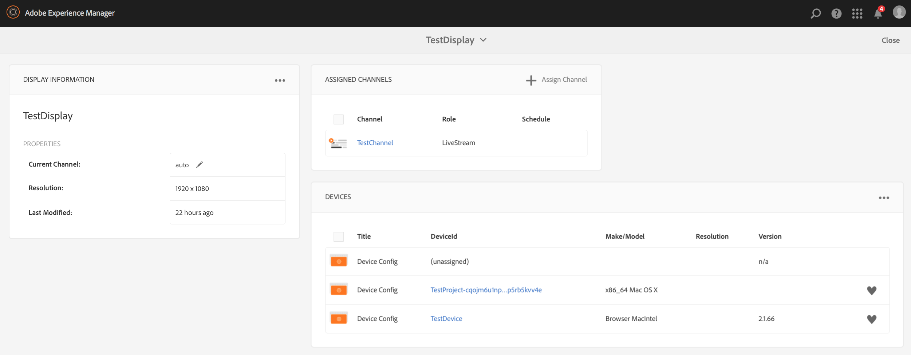

# Gestione dei dispositivi {#managing-devices}

Questa pagina descrive l&#39;assegnazione dei dispositivi.

La console Dispositivi consente di accedere al gestore di dispositivi per assegnare il dispositivo a uno schermo.

>[!CAUTION]
>
>Prima di assegnare il dispositivo, registrarlo. Consulta [Registrazione dispositivo](device-registration.md).

## Assegnazione dispositivo {#device-assignment}

Per assegnare un dispositivo a uno schermo, attenersi alla procedura descritta di seguito.

1. Vai alla cartella Dispositivi del progetto, ad esempio

   `http://localhost:4502/screens.html/content/screens/TestProject`

   

1. Fai clic su **Dispositivi** cartella e fai clic su **Gestione dispositivi** nella barra delle azioni. Vengono visualizzati i dispositivi assegnati e non assegnati.

   

1. Selezionare un dispositivo non assegnato dall&#39;elenco e fare clic sul pulsante **Assegna dispositivo** nella barra delle azioni.

   

1. Selezionare la visualizzazione a cui si desidera assegnare il dispositivo dall&#39;elenco e fare clic sul pulsante **Assegna**.

   

1. Fai clic su **Fine** per completare il processo di assegnazione.

   Il dashboard di visualizzazione mostra il dispositivo assegnato nel **DISPOSITIVI** pannello.

   

   Fai clic su (**...**) nell&#39;angolo in alto a destra del **DISPOSITIVI** per aggiungere la configurazione del dispositivo o aggiornare i dispositivi.

   

>[!NOTE]
>
>Ogni volta che il primo dispositivo viene aggiunto a un nuovo progetto Screens, viene creato un gruppo di utenti.
>Ad esempio, se il nome del nodo del progetto è *we-retail*, il nome del gruppo di utenti è *screens-we-retail-devices*.
>Questo gruppo viene aggiunto come membro del **Collaboratori** come illustrato nella figura seguente:

### Passaggi successivi {#the-next-steps}

Dopo aver acquisito familiarità con l&#39;assegnazione di un canale a una visualizzazione, vedere t[Monitoraggio e risoluzione dei problemi](monitoring-screens.md).
