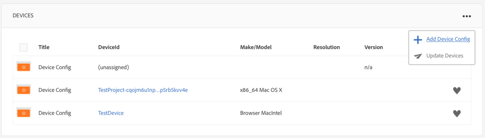

# Gestione dispositivi {#managing-devices}

>[!IMPORTANT]
>Questo contenuto è valido per AEM on-premise/AMS (AEM 6.5LTS e AEM 6.5). Per i contenuti di AEM as a Cloud Service Screens, consulta la [guida di AEM as a Cloud Service](https://experienceleague.adobe.com/en/docs/experience-manager-cloud-service/content/screens-as-cloud-service/overview/introduction).

Questa pagina descrive l&#39;assegnazione del dispositivo.

La console Dispositivi consente di accedere al gestore di dispositivi per assegnare il dispositivo a uno schermo.

>[!CAUTION]
>
>Prima di assegnare il dispositivo, registrarlo. Consulta [Registrazione dispositivo](device-registration.md).

## Assegnazione dispositivo {#device-assignment}

Per assegnare un dispositivo a uno schermo, attenersi alla procedura descritta di seguito.

1. Vai alla cartella Dispositivi del progetto, ad esempio

   `http://localhost:4502/screens.html/content/screens/TestProject`

   

1. Fai clic sulla cartella **Dispositivi** e fai clic su **Gestione dispositivi** nella barra delle azioni. Vengono visualizzati i dispositivi assegnati e non assegnati.

   

1. Fare clic su un dispositivo non assegnato dall&#39;elenco, quindi nella barra delle azioni fare clic su **Assegna dispositivo**.

   

1. Fare clic sulla visualizzazione a cui si desidera assegnare il dispositivo dall&#39;elenco e quindi fare clic su **Assegna**.

   

1. Fai clic su **Fine** per completare il processo di assegnazione.

   Il dashboard di visualizzazione visualizza il dispositivo assegnato nel pannello **DISPOSITIVI**.

   

   Fare clic su (**...**) nell&#39;angolo superiore destro del pannello **DISPOSITIVI** per aggiungere la configurazione del dispositivo o aggiornare i dispositivi.

   

>[!NOTE]
>
>Ogni volta che il primo dispositivo viene aggiunto a un nuovo progetto Screens, viene creato un gruppo di utenti.Ad esempio, se il nome del nodo del progetto è *we-retail*, il nome del gruppo di utenti è *screens-we-retail-devices*.Questo gruppo viene aggiunto come membro del gruppo **Collaboratori**, come illustrato nella figura seguente:

### Passaggi successivi {#the-next-steps}

Dopo aver acquisito familiarità con l&#39;assegnazione di un canale a una visualizzazione, vedere t[Monitorare e risolvere i problemi](monitoring-screens.md).

