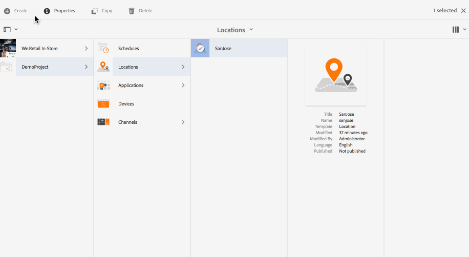
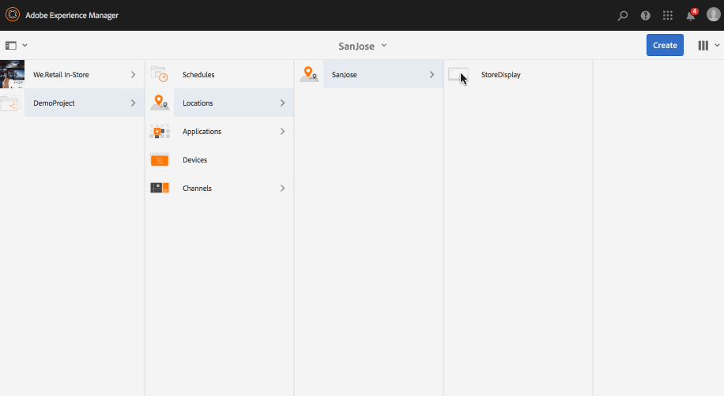
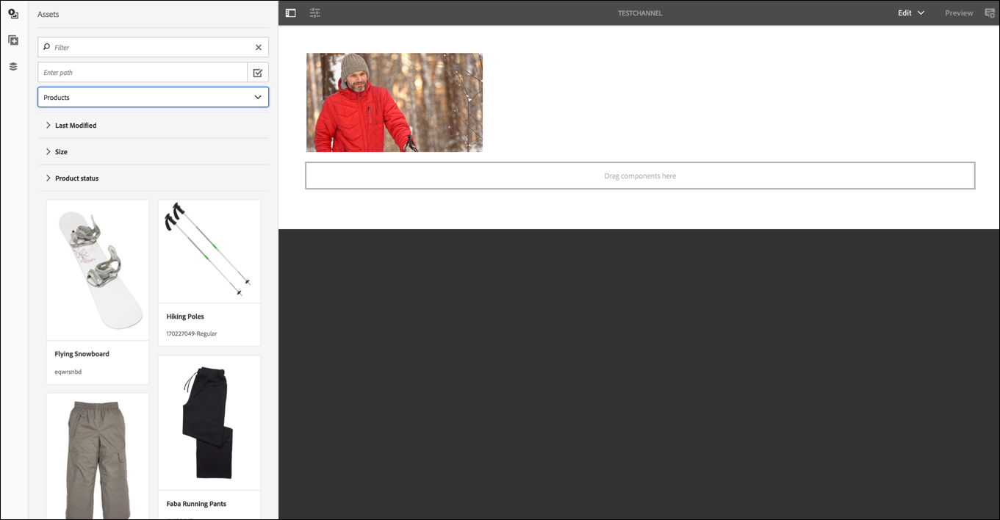

# Creazione e gestione delle visualizzazioni {#creating-and-managing-displays}

>[!IMPORTANT]
>Questo contenuto è valido per AEM on-premise/AMS (AEM 6.5LTS e AEM 6.5). Per i contenuti di AEM as a Cloud Service Screens, consulta la [guida di AEM as a Cloud Service](https://experienceleague.adobe.com/en/docs/experience-manager-cloud-service/content/screens-as-cloud-service/overview/introduction).

Un display è un raggruppamento virtuale di schermi posizionati uno accanto all’altro. Il display è fisso rispetto a un&#39;installazione. Si tratta degli autori di contenuti oggetto che lavorano con e a cui fanno sempre riferimento come visualizzazione logica piuttosto che come parti contatore fisiche.

Quando crei una posizione, devi crearne una visualizzazione specifica.

Questa pagina mostra come creare e gestire le visualizzazioni per Screens.

**Prerequisiti**:

* [Configurazione e distribuzione di Screens](configuring-screens-introduction.md)
* [Creazione e gestione di un progetto Screens](creating-a-screens-project.md)
* [Creare e gestire i canali](managing-channels.md)
* [Creare e gestire le posizioni](managing-locations.md)

## Creazione di una nuova visualizzazione {#creating-a-new-display}

>[!NOTE]
>
>Create una posizione prima di creare una visualizzazione. Per ulteriori informazioni, vedere [Crea e gestisci percorsi](managing-locations.md).

1. Passare alla posizione appropriata, ad esempio `http://localhost:4502/screens.html/content/screens/TestProject`.
1. Fai clic sulla cartella del percorso e fai clic su **Crea** accanto all&#39;icona più (+) nella barra delle azioni.
1. Fai clic su **Visualizzazione** nella procedura guidata **Crea**, quindi fai clic su **Avanti**.
1. Immetti **Name** e **Title** per la posizione di visualizzazione.
1. Nella scheda **Visualizzazione** scegliere i dettagli del layout. Scegli la **Risoluzione** desiderata, ad esempio **Full HD**. Scegli il numero di dispositivi in orizzontale e in verticale.
1. Fai clic su **Crea**.

La visualizzazione (*StoreDisplay*) è stata creata e aggiunta al percorso (*SanJose*).

Quando si dispone di una visualizzazione in posizione, il passaggio successivo consiste nel creare una configurazione di dispositivo per quella particolare visualizzazione.

>[!NOTE]
>
>**Passaggio successivo**:
>
>Quando crei una visualizzazione per la tua posizione, assegna un canale alla visualizzazione per utilizzare il contenuto.
>
>Consulta la sezione [Assegnare canali](channel-assignment.md) per scoprire come assegnare un canale alla visualizzazione.

## Creazione di una nuova configurazione dispositivo {#creating-a-new-device-config}

La configurazione di un dispositivo funge da segnaposto per un dispositivo di digital signage non ancora installato.

1. Passare alla visualizzazione appropriata, ad esempio `http://localhost:4502/screens.html/content/screens/TestProject/locations/newlocation`.
1. Fai clic sulla cartella di visualizzazione e fai clic su **Visualizza dashboard** nella barra delle azioni.
1. Fai clic su **+ Aggiungi configurazione dispositivo** in alto a destra nel pannello **Dispositivi**.

1. Fare clic su **Configurazione dispositivo** come modello richiesto e fare clic su **Avanti**.

1. Immetti le proprietà richieste e fai clic su **Crea**.

La configurazione dispositivo viene creata e aggiunta alla visualizzazione corrente (nella seguente dimostrazione, la nuova configurazione dispositivo è *DeviceConfig*).

>[!NOTE]
>
>Quando una configurazione dispositivo è impostata sulla visualizzazione nella posizione, il passaggio successivo consiste nell’assegnare un canale alla visualizzazione.
>
>Come mostrato nella figura seguente, se la configurazione del dispositivo viene visualizzata come non assegnata nel pannello **DEVICES**, nessun canale viene assegnato a quella particolare configurazione del dispositivo.
>
>Devi conoscere in anticipo i concetti relativi alla creazione e alla gestione dei canali. Per ulteriori dettagli, consulta [Creare e gestire i canali](managing-channels.md).

## Dashboard di visualizzazione {#display-dashboard}

Il dashboard di visualizzazione offre diversi pannelli per la gestione dei dispositivi di visualizzazione. Consente inoltre di configurare il dispositivo.

>[!NOTE]
>
>Puoi fare clic sugli elenchi del dashboard e attivare azioni in blocco sugli elementi, invece di esaminare ogni elemento singolarmente.
>
>Ad esempio, l&#39;immagine seguente mostra come fare clic su più canali dal dashboard di visualizzazione.

### Schermo pannello informazioni {#display-information-panel}

Il pannello **INFORMAZIONI DI VISUALIZZAZIONE** fornisce le proprietà di visualizzazione.

Fare clic su (**...**) nell&#39;angolo in alto a destra nel pannello **VISUALIZZA INFORMAZIONI** per visualizzare le proprietà e l&#39;anteprima della visualizzazione.

#### Visualizzazione delle proprietà {#viewing-properties}

Fai clic su **Proprietà** per visualizzare o modificare le proprietà della visualizzazione.

Inoltre, puoi regolare il valore del timer dell&#39;evento per il tuo canale interattivo nella scheda **Visualizzazione**. Il valore predefinito è *300 secondi*.

Utilizza **CRXDE Lite** per accedere alla proprietà **idleTimeout**, ovvero `http://localhost:4502/crx/de/index.jsp#/content/screens/we-retail/locations/demo/flagship/single/jcr%3Acontent/channels`.

### Pannello Canali assegnati {#assigned-channels-panel}

Nel pannello **CANALI ASSEGNATI** vengono visualizzati i canali assegnati a questo dispositivo.

### Pannello Dispositivi {#devices-panel}

Il pannello **DISPOSITIVI** fornisce informazioni sulle configurazioni dei dispositivi.

Fare clic su (**...**) nell&#39;angolo in alto a destra nel pannello **DISPOSITIVI**, in modo da poter aggiungere configurazioni di dispositivi e aggiornarli.

Inoltre, fai clic sulla configurazione del dispositivo per visualizzare le proprietà, assegnare un dispositivo o eliminarlo completamente.

#### Passaggi successivi {#the-next-steps}

Una volta completata la creazione di una visualizzazione per la posizione, assegnate un canale per la visualizzazione.

Vedi [Assegna canali](channel-assignment.md) per ulteriori dettagli.
