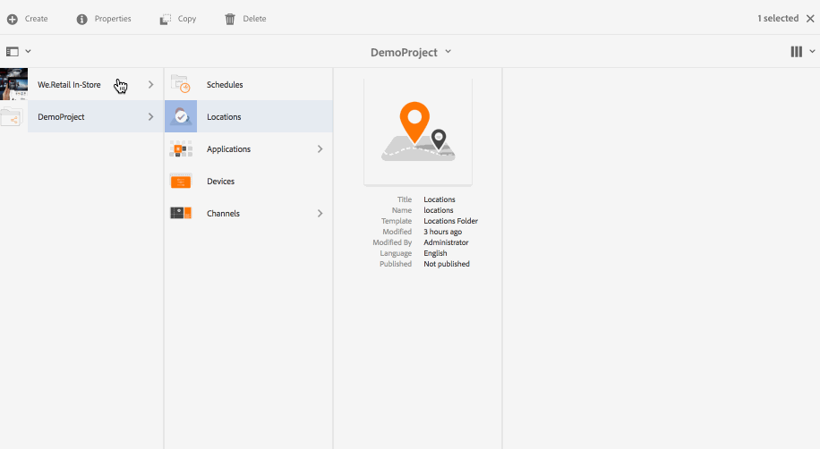
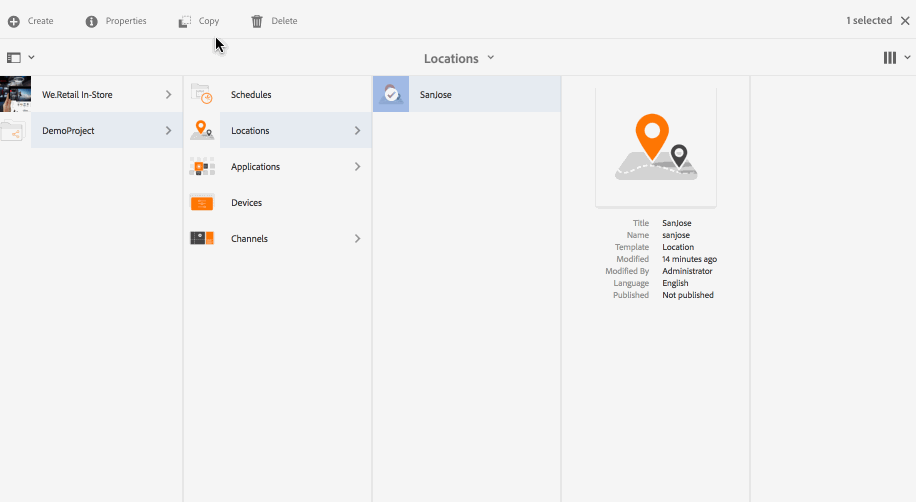

# Creazione e gestione delle posizioni {#creating-and-managing-locations}

>[!IMPORTANT]
>Questo contenuto è valido per AEM on-premise/AMS (AEM 6.5LTS e AEM 6.5). Per i contenuti di AEM as a Cloud Service Screens, consulta la [guida di AEM as a Cloud Service](https://experienceleague.adobe.com/en/docs/experience-manager-cloud-service/content/screens-as-cloud-service/overview/introduction).

I punti ospitano la configurazione dei display in base alla posizione delle varie schermate.

Questa pagina mostra come creare e gestire le posizioni per Screens.

**Prerequisiti**:

* [Configurazione e distribuzione di Screens](configuring-screens-introduction.md)
* [Creazione e gestione di un progetto Screens](creating-a-screens-project.md)
* [Creazione e gestione dei canali](managing-channels.md)

## Creazione di una nuova posizione {#creating-a-new-location}

Dopo aver creato il progetto per Screens, effettua le seguenti operazioni per creare una posizione per un progetto Screens:

1. Fai clic sul collegamento Adobe Experience Manager (in alto a sinistra) e quindi su Screens. In alternativa, è possibile passare direttamente a: `http://localhost:4502/screens.html/content/screens`.
1. Passa al progetto Screens e fai clic su **Percorsi**.
1. Fai clic su **Crea** accanto all&#39;icona più nella barra delle azioni.
1. Fare clic sul modello **Posizione** della procedura guidata e fare clic su **Avanti**.
1. Immetti le proprietà per **Titolo e tag**, **Altri titoli e descrizioni**, **Ora di attivazione/disattivazione** e **URL personalizzato**.
1. Fai clic su **Crea** e il percorso viene creato e aggiunto alla cartella dei percorsi.

Per informazioni sulla creazione di una posizione per un progetto AEM Screens, consulta i passaggi seguenti. A scopo dimostrativo, la nuova posizione (SanJose) viene creata in *DemoProject*.

Dopo aver creato una posizione, creane una per la tua.

### Modifica delle proprietà di una posizione {#editing-properties-for-a-location}

Per modificare o accedere alle proprietà di una posizione:

1. Fai clic sulla posizione.
1. Fare clic su **Proprietà** nella barra delle azioni.

#### Passaggi successivi {#the-next-steps}

Dopo aver creato una posizione, creane una per la tua.

Vedere [Creazione e gestione di visualizzazioni](managing-displays.md).

