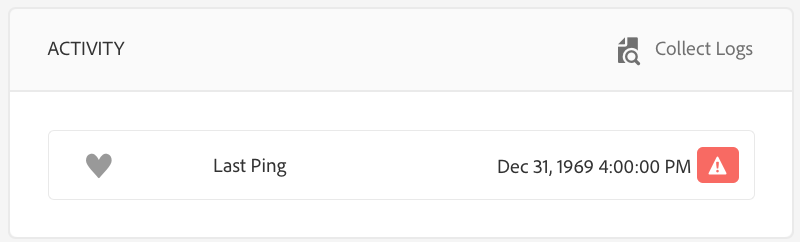

# Creare e gestire le pianificazioni {#creating-and-managing-schedules}

Le **Schedules** in AEM Screens consentono di organizzare i canali in gruppi riutilizzabili. In questo modo, non è necessario ripetere le singole assegnazioni per ogni visualizzazione in cui si desidera visualizzare il contenuto.

Le pianificazioni, se combinate con ***DayParting***, ti consentono di impostare una pianificazione globale con più canali in esecuzione in orari specifici del giorno e di riutilizzare tale configurazione per tutte le visualizzazioni contemporaneamente.

>[!NOTE]
>
>Questa funzionalità di AEM Screens è disponibile solo se è stato installato AEM 6.3 Sites Feature Pack 1. Per accedere a questo Feature Pack, contatta il supporto Adobe e richiedi l’accesso. Dopo aver ottenuto le autorizzazioni necessarie, puoi scaricarlo da Condivisione pacchetti.

## Creare una pianificazione {#creating-a-schedule}

Puoi creare una pianificazione per il progetto Screens in grado di gestire tutte le attività per il tuo caso d’uso.

Per creare una pianificazione per il tuo canale, segui la procedura riportata di seguito:

1. Fai clic sul collegamento Adobe Experience Manager (in alto a sinistra) e quindi su Screens. In alternativa, è possibile passare direttamente a: `http://localhost:4502/screens.html/content/screens`.
1. Passa al progetto Screens e fai clic su **Pianificazioni**.
1. Fai clic su **Crea** nella barra delle azioni.
1. Fai clic su **Pianifica** nella procedura guidata **Crea** e fai clic su **Avanti**.

1. Immetti **Nome** e **Titolo** e fai clic su **Crea**.

Puoi visualizzare una cartella di pianificazione con il nome e il titolo indicati nel progetto.

## Visualizza dashboard {#viewing-dashboard}

Dopo aver creato una cartella delle pianificazioni nel progetto, è possibile visualizzarne i dettagli dal dashboard delle pianificazioni.

Per visualizzare il dashboard della pianificazione, segui la procedura riportata di seguito. Nell&#39;esempio seguente viene illustrato il dashboard del progetto `We.Retail`:

1. Passa alla cartella **Schedules** del progetto Screens (ad esempio, `We.Retail`).

   

1. Fai clic su **Dashboard** nella barra delle azioni.

   Puoi visualizzare tre pannelli diversi, ad esempio **INFORMAZIONI SULLA PIANIFICAZIONE**, **CANALI ASSEGNATI** e **VISUALIZZAZIONI ASSEGNATE**.

   

   **Riquadro informazioni pianificazione** - Fare clic su Proprietà nell&#39;angolo superiore destro del riquadro INFORMAZIONI PIANIFICAZIONE per visualizzare/modificare le proprietà della pianificazione.

   **Pannello canali assegnati** - Fare clic su +Assegna canale dall&#39;angolo superiore destro del pannello CANALI ASSEGNATI per aprire la finestra di dialogo Assegnazione canale.

   **Pannello visualizzazioni assegnate** - Fare clic su una delle visualizzazioni nel pannello VISUALIZZAZIONI ASSEGNATE per aprire il dashboard di visualizzazione.
