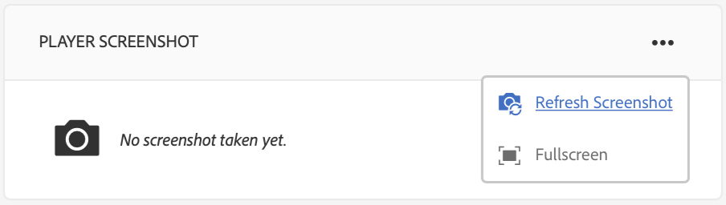

# Risoluzione dei problemi relativi al Centro di controllo dei dispositivi {#troubleshooting-device-control-center}

Puoi monitorare e risolvere i problemi relativi alle prestazioni dell’attività e del dispositivo di riproduzione Screens utilizzando il dashboard del dispositivo. Questa pagina fornisce informazioni su come monitorare e risolvere i problemi di prestazioni percepiti per Screens Player e i dispositivi assegnati.

## Monitoraggio e risoluzione dei problemi dal Centro controllo dispositivi {#monitor-and-troubleshoot-from-device-control-center}

Puoi monitorare l’attività e quindi risolvere i problemi del lettore Screens, utilizzando il dashboard del dispositivo.

### Dashboard del dispositivo {#device-dashboard}

Segui i passaggi seguenti per passare al dashboard del dispositivo:

1. Accedi al dashboard del dispositivo dal progetto, ad esempio ***Progetto di test*** —> ***Dispositivi***.

   Seleziona **Dispositivi** e **Gestione dispositivi** dalla barra delle azioni.

   

1. Nell’elenco vengono visualizzati i dispositivi assegnati e non assegnati, come illustrato nella figura riportata di seguito.

   

1. Seleziona il dispositivo (**NuovoTestDevice**) e fai clic su **Dashboard** dalla barra delle azioni.

   

1. La pagina mostra le informazioni sul dispositivo, l’attività e i dettagli del dispositivo che ti consentono di monitorare le attività e le funzioni del dispositivo.

   

### Monitorare l&#39;attività del dispositivo {#monitor-device-activity}

Il pannello **Attività** mostra l&#39;ultimo ping del lettore di schermate con il timestamp. L&#39;ultimo ping corrisponde all&#39;ultima volta che il dispositivo ha contattato il server.

Inoltre, fai clic su **Raccogli registri** dall’angolo in alto a destra del pannello **Attività** per visualizzare i registri del lettore.

### Aggiorna i dettagli del dispositivo {#update-device-details}

Controllare il pannello **Dettagli dispositivo** per visualizzare l&#39;IP del dispositivo, l&#39;utilizzo dello storage, la versione del firmware e il tempo di funzionamento del lettore.

Inoltre, fai clic su **Cancella cache** e **Aggiorna** per cancellare la cache del dispositivo e aggiornare la versione [firmware](screens-glossary.md) rispettivamente da questo pannello.

Inoltre, fai clic su **...** dall&#39;angolo in alto a destra del pannello **Dettagli dispositivo** per riavviare o aggiornare lo stato del lettore.

### Aggiornare le informazioni sul dispositivo {#update-device-information}

Controlla il pannello **INFORMAZIONI DISPOSITIVO** per visualizzare l&#39;aggiornamento della configurazione, il modello di dispositivo, il sistema operativo del dispositivo e le informazioni sulla shell.

Inoltre, fai clic su (**...**) dall&#39;angolo in alto a destra del pannello Informazioni dispositivo per visualizzare le proprietà o aggiornare il dispositivo.

Fare clic su **Proprietà** per visualizzare la finestra di dialogo **Proprietà dispositivo**. È possibile modificare il titolo del dispositivo o scegliere l&#39;opzione per gli aggiornamenti di configurazione come **Manuale** o **Automatico**.

>[!NOTE]
>
>Per ulteriori informazioni sugli eventi associati agli aggiornamenti automatici o manuali del dispositivo, consulta la sezione ***Aggiornamenti automatici e manuali dal dashboard del dispositivo*** in [Gestione dei canali](managing-channels.md).

### Visualizza schermata del lettore {#view-player-screenshot}

Puoi visualizzare la schermata del lettore dal dispositivo dal pannello **PLAYER SCREENSHOT** .

Fare clic su (**..**) nell&#39;angolo in alto a destra del pannello Screenshot del lettore e selezionare **Aggiorna schermata** per visualizzare l&#39;istantanea del lettore in esecuzione.

### Gestisci preferenze {#manage-preferences}

Il pannello **PREFERENZE** consente all&#39;utente di modificare le preferenze per **Interfaccia utente amministratore**, **Controllo canali** e **Eseguire il debug remoto** per il dispositivo.

>[!NOTE]
>Per ulteriori informazioni su queste opzioni, consulta [AEM Screens Player](working-with-screens-player.md).

Inoltre, fai clic su **Impostazioni** nell&#39;angolo in alto a destra per aggiornare le preferenze del dispositivo. Puoi aggiornare le seguenti preferenze:

* **URL del server**
* **Risoluzione**
* **Riavvia pianificazione**
* **N. max dei file di registro da mantenere**
* **Livello registro**

>[!NOTE]
>Puoi selezionare uno dei seguenti livelli di log:
>* **Disattiva**
>* **Debug**
>* **Info**
>* **Avvertenza**
>* **Errore**

## Risolvere i problemi relativi alle impostazioni OSGi {#troubleshoot-osgi-settings}

È necessario abilitare il referente vuoto per consentire al dispositivo di inviare dati al server. Ad esempio, se la proprietà referrer vuota è disabilitata, il dispositivo non può inviare nuovamente una schermata.

Attualmente alcune di queste funzioni sono disponibili solo se il *filtro di riferimento Apache Sling Allow Empty* è abilitato nella configurazione OSGi. È possibile che nel dashboard venga visualizzato un avviso che segnala che le impostazioni di protezione potrebbero impedire il funzionamento di alcune di queste funzioni.

Segui i passaggi riportati di seguito per abilitare il filtro di riferimento Apache Sling Consenti vuoto

1. Passa a **Configurazione console Web Adobe Experience Manager**, ovvero `https://localhost:4502/system/console/configMgr/org.apache.sling.security.impl.ReferrerFilter`.
1. Seleziona l&#39;opzione **allow.empty** .
1. Fai clic su **Salva**.

### Consigli {#recommendations}

La sezione seguente consiglia di monitorare i collegamenti di rete, il server e i lettori per comprendere lo stato di salute e reagire ai problemi.

AEM fornisce un monitoraggio integrato per:

* ** Heartbeat ogni 5 secondi per indicare che AEM Screens Player è in funzione.
* ** Screenshot dal lettore che mostra ciò che è attualmente visualizzato sul lettore.
* La versione *Firmware di AEM Screens Player* installata sul lettore.
* *Spazio di archiviazione gratuito* sul lettore.

Recommendations per il monitoraggio remoto con software di terze parti:

* Utilizzo della CPU sui lettori.
* Controlla se il processo di AEM Screens Player è in esecuzione.
* Riavvio/riavvio remoto del lettore.
* Notifiche in tempo reale.

Si consiglia di implementare l&#39;hardware e il sistema operativo di Windows Media Player in modo da consentire l&#39;accesso remoto per diagnosticare i problemi e riavviare il lettore.

#### Risorse aggiuntive {#additional-resources}

Per eseguire il debug e risolvere eventuali problemi relativi alla riproduzione di video nel canale, consulta [Configurazione e risoluzione dei problemi di riproduzione video](troubleshoot-videos.md) .
